# Apache Nifi 如何工作——在数据流中冲浪，不要淹没在其中

> 原文：<https://www.freecodecamp.org/news/nifi-surf-on-your-dataflow-4f3343c50aa2/>

弗朗索瓦·保皮尔

# Apache Nifi 如何工作——在数据流中冲浪，不要淹没在其中

Photo by [Michael Denning](https://unsplash.com/@coffeeguy88?utm_source=medium&utm_medium=referral) on [Unsplash](https://unsplash.com?utm_source=medium&utm_medium=referral)

### 介绍

那是疯狂的水流。就像您的应用程序处理疯狂的数据流一样。将数据从一个存储路由到另一个存储，应用验证规则并解决数据治理问题，如果您独自完成所有这些工作，大数据生态系统中的可靠性很难实现。

好消息是，您不必从头开始构建您的数据流解决方案——Apache NiFi 为您提供支持！

在本文结束时，您将成为 NiFi 专家——准备好构建您的数据管道。

#### 我将在本文中介绍的内容:

*   什么是 Apache NiFi，在什么情况下应该使用它，在 NiFi 中需要理解哪些关键概念。

#### 我不会涵盖的内容:

*   NiFi 集群的安装、部署、监控、安全和管理。

为了您的方便，这里是目录，您可以根据自己的好奇心直接进入。如果您是第一次接触 NiFi，建议您按照指定的顺序阅读本文。

#### 目录

*   我— [什么是阿帕奇尼菲？](#741e)
    - [定义 NiFi](#9421)
    - [为什么要用 NiFi？](#6cf2)
*   II — [Apache Nifi 显微镜下](#b75e)
    -[Flow file](#61bd)-[处理器](#d187)-
    -[进程组](#924a)-
    -[连接](#af10)
    - [流量控制器](#8ca0)
*   [结论和行动呼吁](#812c)

### 什么是阿帕奇尼菲？

在 Apache Nifi 项目的[网站](https://nifi.apache.org/index.html)上，可以找到以下定义:

> 一个易于使用、功能强大且可靠的系统，用于处理和分发数据。

我们来分析一下那里的关键词。

#### 定义 NiFi

**处理和分发数据**
这就是 Nifi 的要旨。它在系统间移动数据，并为您提供处理这些数据的工具。

Nifi 可以处理多种数据源和格式。您从一个数据源接收数据，对其进行转换，然后将其推送到不同的数据接收器。

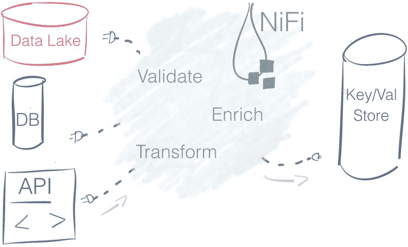

Ten thousand feet view of Apache Nifi — Nifi pulls data from multiple data sources, enrich it and transform it to populate a key-value store.

**易于使用**
处理器— *盒子—* 通过连接器连接— *箭头*创建流程*。N* iFi 提供[基于流程的编程](https://www.wikiwand.com/en/Flow-based_programming)体验。

Nifi 使我们一眼就能理解一组需要数百行源代码才能实现的数据流操作。

考虑下面的管道:

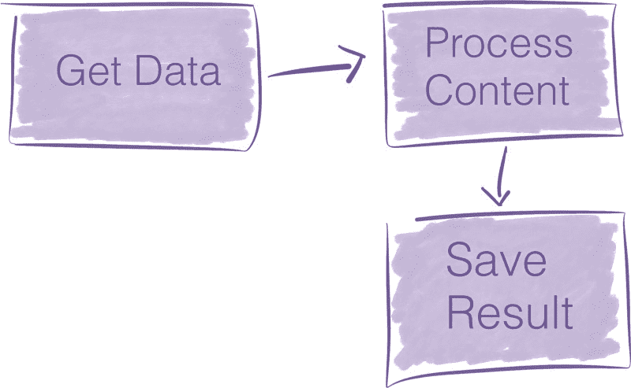

An overly minimalist data pipeline

要在 NiFi 中翻译上面的数据流，您可以进入 NiFi 图形用户界面，将三个组件拖放到画布中，然后
就完成了。构建需要两分钟。

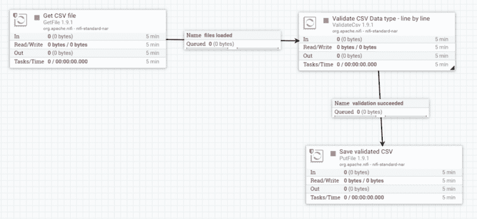

A simple validation data flow as seen through Nifi canvas

现在，如果您编写代码来做同样的事情，可能需要几百行代码才能达到类似的结果。

您不会像使用基于流程的方法那样，通过代码来捕捉管道的本质。Nifi 更有表现力的搭建数据管道；它是为做那件事而设计的。

**强大的**
NiFi 提供[多处理器](https://www.nifi.rocks/apache-nifi-processors/) 开箱即用(Nifi 1.9.2 中的 293)。你站在巨人的肩膀上。这些标准处理器可以处理您可能遇到的绝大多数用例。

NiFi 是高度并发的，但是它的内部封装了相关的复杂性。处理器为您提供了隐藏并行编程固有复杂性的高级抽象。处理器同时运行，您可以跨越一个处理器的多个线程来处理负载。

并发性是一个你不想打开的计算潘多拉盒子。NiFi 方便地屏蔽了管道构建者并发的复杂性。

**可靠**
这种理论支持倪飞并不新鲜；它有坚实的理论基础。类似于 [SEDA](http://sosp.org/2001/papers/welsh.pdf) 这样的车型。

对于数据流系统，要解决的主要问题之一是[可靠性](https://whatis.techtarget.com/definition/reliability)。您希望确保发送到某处的数据被有效地接收。

NiFi 通过多种机制实现了高水平的可靠性，这些机制可以随时跟踪系统的状态。这些机制是可配置的，因此您可以在应用程序所需的延迟和吞吐量之间做出适当的权衡。

NiFi 跟踪每个数据片段的历史及其血统和出处特征。它使得了解每条信息发生了什么转换成为可能。

Apache Nifi 提出的数据沿袭解决方案被证明是审计数据管道的优秀工具。在欧盟等跨国行为体提出[指导方针](https://ec.europa.eu/futurium/en/ai-alliance-consultation/guidelines/1#privacy)以支持精确数据处理的背景下，数据血统特征对于增强对大数据和人工智能系统的信心至关重要。

#### 为什么使用 Nifi？

首先，我想澄清一下，我不是来给 NiFi 布道的。我的目标是为您提供足够的要素，以便您能够就构建数据管道的最佳方式做出明智的决定。

在确定您的解决方案规模时，牢记大数据的 [four Vs](https://www.dummies.com/careers/find-a-job/the-4-vs-of-big-data/) 非常有用。

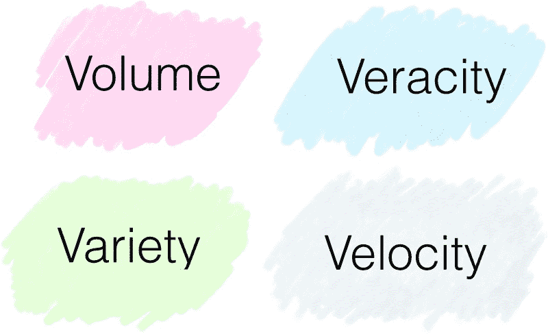

The four Vs of Big Data

*   **量** —您的经营规模是多少？在数量级上，你更接近几千兆字节还是几百千兆字节？
*   **多样性** —你有多少数据源？你的数据是结构化的吗？如果是，图式是否经常变化？
*   **速度** —你处理事件的频率是多少？是信用卡支付吗？是物联网设备发送的每日性能报告吗？
*   准确性 —你能相信这些数据吗？或者，在操作它之前，您是否需要应用多次清洗操作？

NiFi 无缝地吸收来自多个数据源的数据，并提供处理数据中不同模式的机制。因此，当数据中有高**变化**时，它会发光。

如果数据的准确性**较低**，那么 Nifi 尤其有价值。因为它提供了多个处理器来清理和格式化数据。

通过其配置选项，Nifi 可以处理各种流量/速度情况。

#### 数据路由解决方案的应用越来越多

新法规、物联网的兴起及其产生的数据流强调了 Apache NiFi 等工具的相关性。

*   微服务是新潮的。在那些松散耦合的服务中，[数据是服务之间的契约](https://auth0.com/blog/introduction-to-microservices-part-4-dependencies/)。Nifi 是在这些服务之间路由数据的健壮方法。
*   物联网将大量数据带到云端。从边缘到云的摄取和验证数据带来了许多新的挑战，niFi 可以有效地解决这些挑战(主要通过 [MiniFi](https://nifi.apache.org/minifi/index.html) ，NiFi 针对边缘设备的项目)
*   新的[指导方针](https://ec.europa.eu/futurium/en/ai-alliance-consultation/best-practices)和法规已经到位，以重新调整大数据经济。在监控力度不断加大的背景下，企业清楚地了解自己的数据管道至关重要。例如，NiFi 数据血统有助于遵循法规。

#### 弥合大数据专家与其他人之间的差距

正如您在用户界面上看到的，用 NiFi 表达的数据流非常适合用来交流您的数据管道。它可以帮助您的组织成员更加了解数据管道中正在发生的事情。

*   一位分析师想了解为什么这些数据会以这种方式到达这里？坐在一起，在流动中漫步。在五分钟内，你会让某人深刻理解提取、转换和加载 *-ETL-* 管道。
*   您希望同事对您创建的新的[错误处理流程](https://community.hortonworks.com/questions/77336/nifi-best-practices-for-error-handling.html)提供反馈？NiFi 将错误路径视为有效结果的可能性作为设计决策。期望流程评审比传统的代码评审更短。

#### 该不该用？是，不是，也许？

NiFi 标榜自己易于使用。然而，它是一个企业数据流平台。它提供了一整套功能，您可能只需要其中的一个精简子集。向堆栈中添加新工具不是好事。

如果您是从零开始，并且管理来自可信数据源的一些数据，那么您最好设置您的提取转换和加载— *ETL* 管道。也许您只需要从数据库中捕获[变更数据](https://martin.kleppmann.com/2015/06/02/change-capture-at-berlin-buzzwords.html)和一些数据准备脚本。

另一方面，如果您在一个使用现有大数据解决方案的环境中工作(无论是用于[存储](https://fr.hortonworks.com/apache/hdfs/)、[处理](https://spark.apache.org/)还是[消息传递](https://kafka.apache.org/))，NiFi 可以与它们很好地集成，更有可能快速取胜。您可以利用现成的连接器来连接其他大数据解决方案。

很容易被新方案炒作。列出您的需求并**选择尽可能简单地满足您需求的解决方案**。

既然我们已经看到了 Apache NiFi 的全貌，我们就来看看它的关键概念并剖析它的内部结构。

### 显微镜下的阿帕奇·尼菲

“NiFi 是框和箭头编程”可能可以传达大局。然而，如果您必须使用 NiFi，您可能需要更多地了解它是如何工作的。

在第二部分中，我将解释带有模式的 Apache NiFi 的关键概念。这个黑盒模型以后对你来说就不是黑盒了。

#### 取消装箱 Apache NiFi

当你启动 NiFi 时，你就进入了它的网络界面。web UI 是您设计和控制数据管道的蓝图。

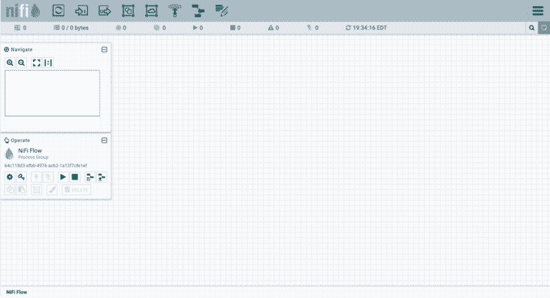

Apache NiFi user interface — build your pipeline by drag and dropping component on the interface

在 Nifi 中，你组装由*连接*链接在一起的*处理器*。在前面介绍的示例数据流中，有三个处理器。

Three processors linked together by two queues

NiFi canvas 用户界面是管道构建器发展的框架。

#### 理解 Nifi 术语

要用 Nifi 表达你的数据流，首先要掌握它的语言。不用担心，几个术语就足以抓住背后的概念。

黑盒被称为*处理器、*，它们通过名为*连接*的队列交换名为*流文件*的信息块。最后，*流文件控制器*负责管理这些组件之间的资源。

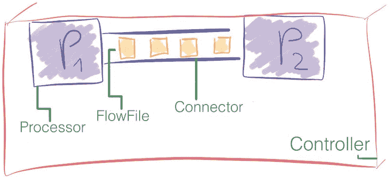

Processor, FlowFile, Connector, and the FlowFile Controller: four essential concepts in NiFi

让我们来看看这是如何工作的引擎盖下。

#### 流文件

在 NiFi 中，**流文件** 是通过流水线处理器的信息包。

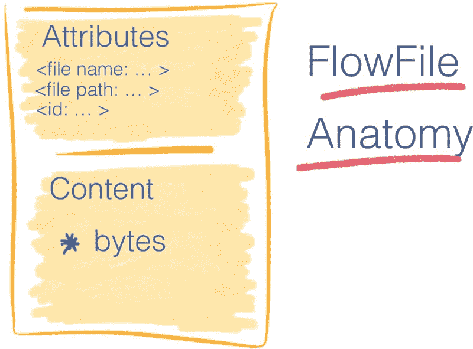

Anatomy of a FlowFile — It contains attributes of the data as well as a reference to the associated data

流文件由两部分组成:

*   **属性**，是键/值对。例如，文件名、文件路径和唯一标识符都是标准属性。
*   **内容**，对组成流文件内容的字节流的引用。

流文件不包含数据本身。这将严重限制管道的输送量。

相反，流文件包含一个指针，该指针引用存储在本地存储中某个位置的数据。这个地方叫做[内容仓库](https://nifi.apache.org/docs/nifi-docs/html/nifi-in-depth.html#content-repository) *。*

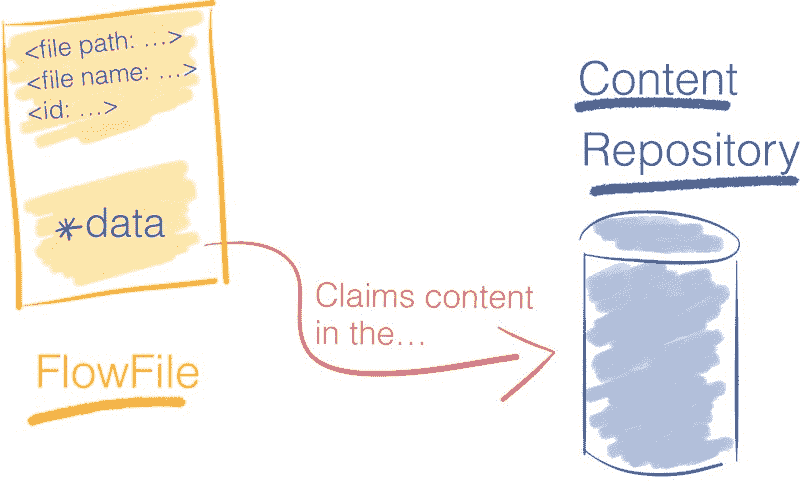

The Content Repository stores the content of the FlowFile

为了访问内容，流文件[要求](https://nifi.apache.org/docs/nifi-docs/html/nifi-in-depth.html#deeper-view-content-claim)来自内容存储库的资源。后者跟踪内容的确切磁盘偏移量，并将其流回流文件。

**并非所有处理器都需要访问流文件**的内容来执行操作，例如，聚合两个流文件的内容不需要将它们的内容加载到内存中。

当处理器修改流文件的内容时，会保留以前的数据。NiFi [写入时复制](https://nifi.apache.org/docs/nifi-docs/html/nifi-in-depth.html#copy-on-write)，它在将内容复制到新位置的同时修改内容。原始信息在内容存储库中保持不变。

**示例**
考虑一个压缩流文件内容的处理器。原始内容保留在内容存储库中，并为压缩内容创建一个新条目。

内容存储库最终返回对压缩内容的引用。更新流文件以指向压缩数据。

下图总结了使用处理器压缩流文件内容的示例。

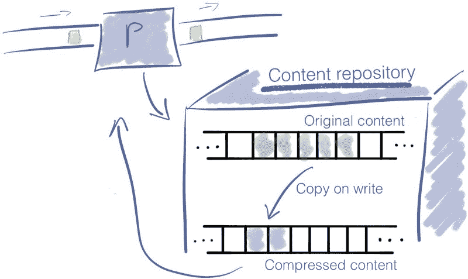

Copy-on-write in NiFi — The original content is still present in the repository after a FlowFile modification.

**可靠性**
NiFi 号称可靠，实际上如何？当前使用的所有流文件的属性以及对其内容的引用都存储在[流文件库中。](https://nifi.apache.org/docs/nifi-docs/html/nifi-in-depth.html#flowfile-repository)

在流水线的每一步，对流文件的修改在执行之前首先被记录在流文件存储库中的[预写日志](https://en.wikipedia.org/wiki/Write-ahead_logging)中。

对于系统中当前存在的每个流文件，流文件存储库存储:

*   流文件属性
*   指向位于流文件存储库中的流文件内容的指针
*   流文件的状态。例如:此时流文件属于哪个队列。

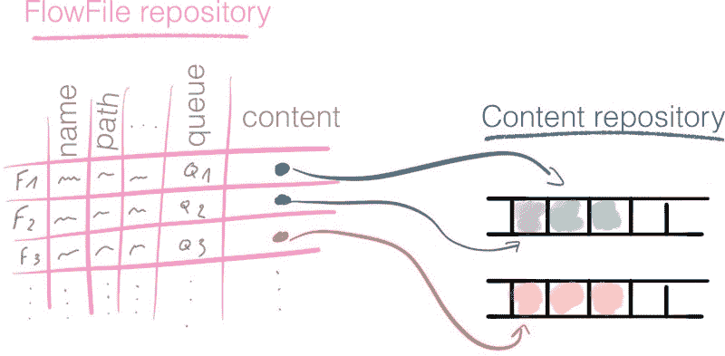

The FlowFile Repository contains metadata about the files currently in the flow.

流文件存储库为我们提供了流的最新状态；因此，它是从中断中恢复的强大工具。

NiFi 提供了另一个工具来跟踪流中所有流文件的完整历史:出处储存库。

**出处储存库**
每次修改流文件时，NiFi 都会在此时获取流文件及其上下文的快照。这个快照在 NiFi 中的名称是一个*起源事件*。[出处储存库](https://nifi.apache.org/docs/nifi-docs/html/nifi-in-depth.html#provenance-repository)记录出处事件。

来源使我们能够追溯数据的谱系，并为 NiFi 中处理的每条信息建立完整的监管链。

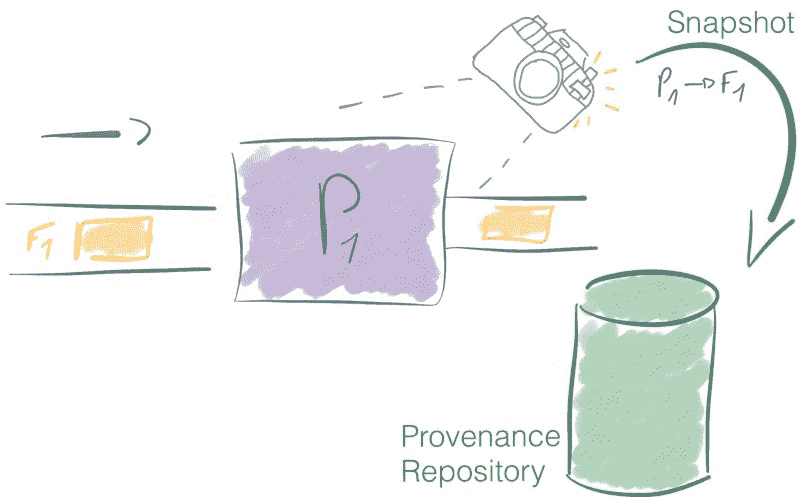

The Provenance Repository stores the metadata and context information of each FlowFile

除了提供完整的数据谱系之外，起源存储库还提供从任意时间点重放数据。

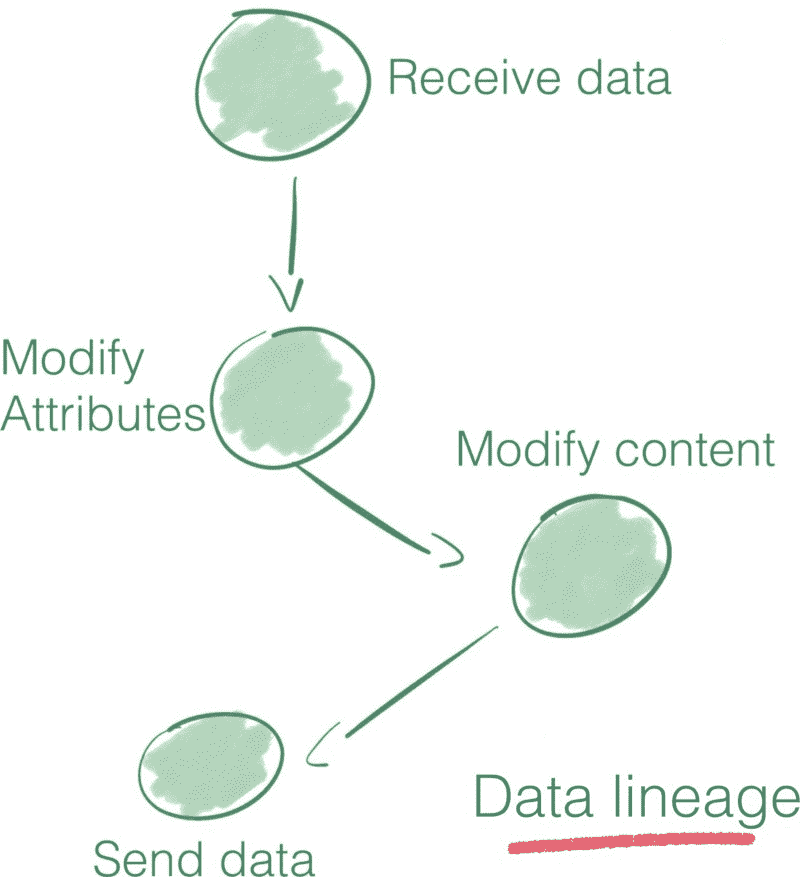

Trace back the history of your data thanks to the Provenance Repository

等等，流文件库和出处库有什么区别？

流文件存储库和出处存储库背后的思想非常相似，但是它们没有解决相同的问题。

*   流文件库是一个日志，仅包含系统中正在使用的流文件的最新状态。这是流量的最新情况，使得从中断中快速恢复成为可能。
*   另一方面，出处储存库更加详尽，因为它跟踪流中每个流文件的完整生命周期。

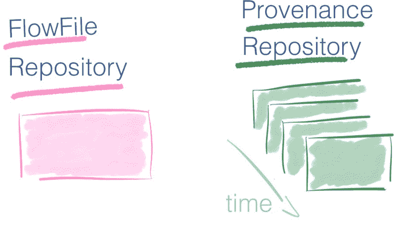

The Provenance Repository adds a time dimension where the FlowFile Repository is one snapshot

如果您只有带有流文件存储库的系统的最新图片，那么出处存储库会为您提供一组照片— *一个视频*。您可以倒回过去的任何时刻，调查数据，重放给定时间的操作。它提供了完整的数据谱系。

#### 流文件处理器

**处理器**是一个执行操作的黑盒。处理器可以访问流文件的属性和内容，以执行各种操作。它们使您能够在数据导入、标准数据转换/验证任务以及将数据保存到各种数据接收器中执行许多操作。

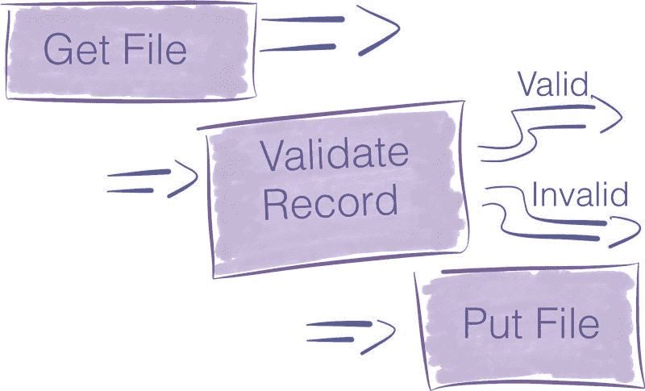

Three different kinds of processors

NiFi 在你安装的时候附带了很多处理器。如果您没有找到最适合您的用例的处理器，您仍然可以构建自己的处理器。编写定制处理器超出了这篇博文的范围。

处理器是完成一项任务的高级抽象。这种抽象非常方便，因为它为管道构建者屏蔽了并发编程和实现错误处理机制的固有困难。

处理器公开一个具有多个配置设置的接口，以微调它们的行为。

Zoom on a NiFi Processor for [record validation](https://nifi.apache.org/docs/nifi-docs/components/org.apache.nifi/nifi-standard-nar/1.5.0/org.apache.nifi.processors.standard.ValidateRecord/index.html) — pipeline builder specifies the high-level configuration options and the black box hides the implementation details.

这些处理器的属性是 NiFi 和您的应用程序需求的业务现实之间的最后一个环节。

细节是最大的问题，管道建造者花了大部分时间来微调这些属性，以符合预期的行为。

**缩放**
对于每个处理器，您可以指定想要同时运行的并发任务的数量。像这样，*流量控制器*给这个处理器分配更多的资源，增加了它的吞吐量。处理器共享线程。如果一个处理器请求更多的线程，其他处理器可执行的线程就会减少。关于流量控制器如何分配线程的详细信息可在[这里](https://community.hortonworks.com/articles/221808/understanding-nifi-max-thread-pools-and-processor.html)获得。

**水平缩放。**另一种扩展方式是增加 NiFi 集群中的节点数量。[集群](https://nifi.apache.org/docs/nifi-docs/html/administration-guide.html#clustering)服务器使得使用商用硬件提高处理能力成为可能。

#### 过程组

这个问题很简单，因为我们已经了解了什么是处理器。

一组处理器通过它们的连接放在一起可以形成一个进程组。您添加了一个输入端口和一个输出端口，以便它可以接收和发送数据。

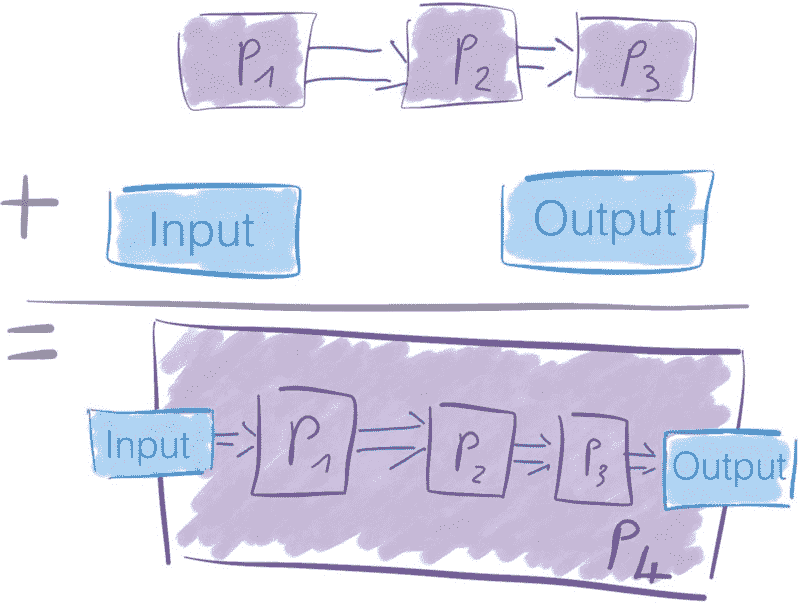

Building a new processor from three existing processors

处理器组是一种基于现有处理器创建新处理器的简单方法。

#### 连接

连接是处理器之间的队列。这些队列允许处理器以不同的速率进行交互。连接可以有不同的容量，就像存在不同尺寸的水管一样。

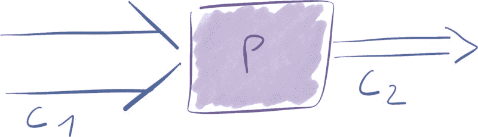

Various capacities for different connectors. Here we have capacity C1 > capacity C2

因为处理器根据它们执行的操作以不同的速率消耗和产生数据，所以连接充当流文件的缓冲区。

连接中可以有多少数据是有限制的。同样的，当你的水管满了，就不能再加水了，不然就溢出来了。

在 NiFi 中，您可以限制流文件的数量以及通过连接的聚合内容的大小。

当您发送的数据超过连接的处理能力时，会发生什么情况？

如果流文件的数量或数据量超过定义的阈值，则应用*背压*。在队列中有空间之前，流控制器不会调度前一个处理器再次运行。

假设您在两个处理器之间有 10 000 个流文件的限制。在某个时刻，连接中有 7 000 个元素。这是可以的，因为限额是 10 000。 *P1* 仍然可以通过连接向 *P2* 发送数据。

Two processors linked by a connector with its limit respected.

现在，假设处理器 1 向连接发送 4 000 个新的流文件。
7 0000 + 4 000 = 11 000 →我们超过了 10 000 个流文件的连接阈值。

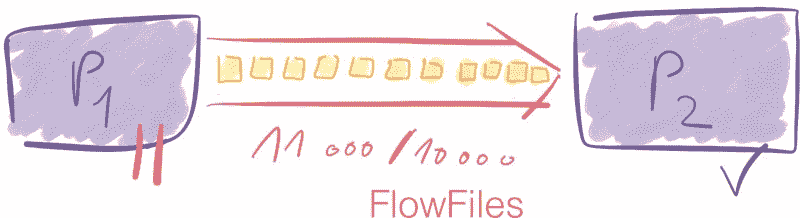

Processor P1 not scheduled until the connector goes back below its threshold.

这些限制是*软限制，*意味着它们可以被超过。然而，一旦它们被调度，先前的处理器 *P1* 将不会被调度，直到连接器回到低于其阈值——10000 个流文件。

Number of FlowFiles in the connector comes back below the threshold. The Flow Controller schedules the processor P1 for execution again.

这个简化的例子展示了[背压](https://en.wikipedia.org/wiki/Back_pressure)是如何工作的。

您希望设置适合要处理的数据量和速度的连接阈值。牢记四个 Vs 。

超过限制的想法听起来可能很奇怪。当流文件或相关数据的数量超过阈值时，触发[交换机制](https://community.hortonworks.com/articles/184990/dissecting-the-nifi-connection-heap-usage-and-perf.html)。

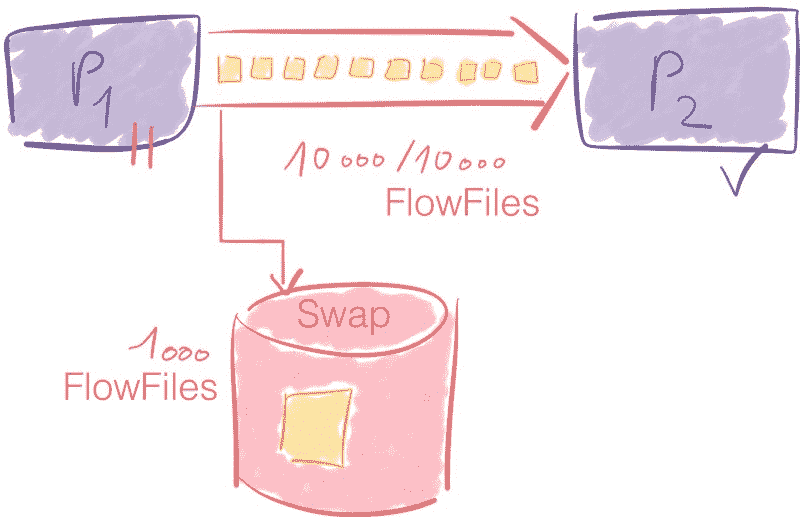

Active queue and Swap in Nifi connectors

关于背压的另一个例子，[这个邮件线程](http://mail-archives.apache.org/mod_mbox/nifi-users/201604.mbox/%3CBLU436-SMTP24995D5F6EDF5985AADFE23CE680@phx.gbl%3E)可以有所帮助。

**区分流文件的优先级**
NiFi 中的连接器是高度可配置的。您可以选择[如何排列队列中的](https://nifi.apache.org/docs/nifi-docs/html/user-guide.html#prioritization)流文件的优先级，以决定接下来处理哪个。

在可用的可能性中，例如，有先入先出顺序— *FIFO。然而，*您甚至可以使用您从流文件中选择的属性来区分传入数据包的优先级。

#### 流量控制器

流量控制器是将一切结合在一起的粘合剂。它为处理器分配和管理线程。它执行数据流。

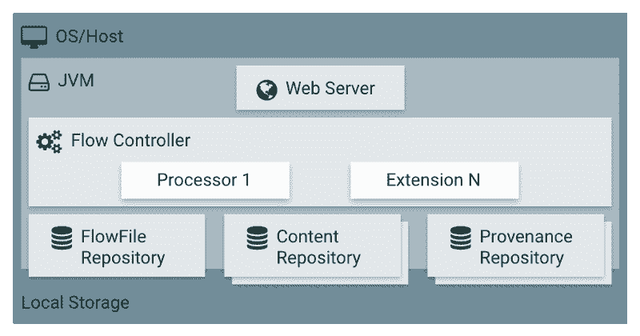

The Flow Controller coordinates the allocation of resources for processors.

此外，流控制器使得添加控制器服务成为可能。

这些服务促进了共享资源的管理，如数据库连接或云服务提供商凭证。控制器服务是[守护进程](http://www.linfo.org/daemon.html)。它们在后台运行，为处理器执行提供配置、资源和参数。

例如，您可以使用一个 [AWS 凭证提供者服务](https://nifi.apache.org/docs/nifi-docs/components/nifi-docs/components/org.apache.nifi/nifi-aws-nar/1.9.0/org.apache.nifi.processors.aws.credentials.provider.service.AWSCredentialsProviderControllerService/index.html)使您的服务能够与 S3 桶进行交互，而不必担心处理器级别的凭证。

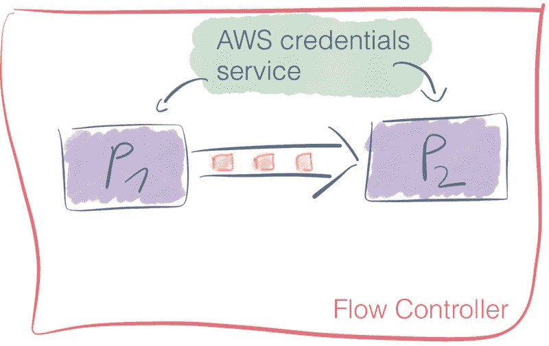

An AWS credentials service provide context to two processors

就像处理器一样，开箱即可获得大量控制器服务。

您可以查看本文中关于控制器服务的更多内容。

### 结论和行动呼吁

在本文中，我们讨论了 NiFi，一个企业数据流解决方案。现在，您已经很好地理解了 NiFi 是做什么的，以及如何在您的应用程序中利用它的数据路由特性。

如果你正在读这篇文章，恭喜你！你现在比世界上 99.99%的人都更了解 NiFi。

熟能生巧。您掌握了开始构建自己的管道所需的所有概念。**化繁为简；首先让它工作。**

下面是我根据自己的工作经验编写的一系列令人兴奋的资源。

#### 资源？

#### 大局

因为在复杂的生态系统中设计数据管道需要精通多个领域，所以我强烈推荐马丁·克莱曼的书 [*设计数据密集型应用*](https://dataintensive.net/) 。它涵盖了基本原理。

*   在马丁的 Github repo 上可以找到一本小抄，上面有他书中引用的所有参考资料。

如果你已经知道你想深入研究什么样的主题，并且你想找到高质量的材料，这份备忘单是一个很好的起点。

#### Apache Nifi 的替代产品

存在其他数据流解决方案。

开源:

*   [Streamsets](https://streamsets.com/) 类似于 NiFi 一个很好的比较可以在[这个博客](https://statsbot.co/blog/open-source-etl/)上找到

大多数现有的云提供商都提供数据流解决方案。这些解决方案可以与您使用的该云提供商的其他产品轻松集成。与此同时，它将你与某个特定的供应商紧密联系在一起。

*   微软解决方案 Azure 数据工厂
*   IBM 有自己的 [InfoSphere DataStage](https://www.ibm.com/us-en/marketplace/datastage)
*   亚马逊提出了一个名为[数据管道](https://docs.aws.amazon.com/en_us/datapipeline/latest/DeveloperGuide/what-is-datapipeline.html)的工具
*   谷歌提供其[数据流](https://cloud.google.com/dataflow/)
*   阿里云推出了具有类似功能的服务 [DataWorks](https://www.alibabacloud.com/help/doc-detail/30256.htm?spm=a2c63.p38356.b99.2.d115c242ZFQbSN)

#### NiFi 相关资源

*   官方 [Nifi 文档](https://nifi.apache.org/docs.html)特别是 [Nifi 深度](https://nifi.apache.org/docs/nifi-docs/html/nifi-in-depth.html)部分都是金矿。
*   注册 Nifi 用户邮件列表也是获得信息的一个很好的方式——例如，[这个对话](http://mail-archives.apache.org/mod_mbox/nifi-users/201604.mbox/%3CBLU436-SMTP24995D5F6EDF5985AADFE23CE680@phx.gbl%3E)解释了反压力。
*   大数据解决方案提供商 Hortonworks 有一个社区网站，上面满是吸引人的资源和针对 Apache Nifi 的 *how-to* 。
    — [这篇文章](https://community.hortonworks.com/articles/184990/dissecting-the-nifi-connection-heap-usage-and-perf.html)深入讨论了连接器、堆使用和背压。
    — [这一篇](https://community.hortonworks.com/articles/135337/nifi-sizing-guide-deployment-best-practices.html)分享了部署 NiFi 集群时的规模确定最佳实践。
*   NiFi 博客提炼了很多关于 NiFi 使用模式的见解以及如何构建管道的技巧。
*   [索赔检查模式](https://www.enterpriseintegrationpatterns.com/patterns/messaging/StoreInLibrary.html)解释
*   Apache Nifi 背后的理论并不新鲜，Nifi 文档中引用的 Seda 非常相关
    — Matt Welsh。伯克利。SEDA:一个条件良好、可扩展的互联网服务架构。检索时间:2019 年 4 月 21 日，发自[http://www.mdw.la/papers/seda-sosp01.pdf](http://www.mdw.la/papers/seda-sosp01.pdf)