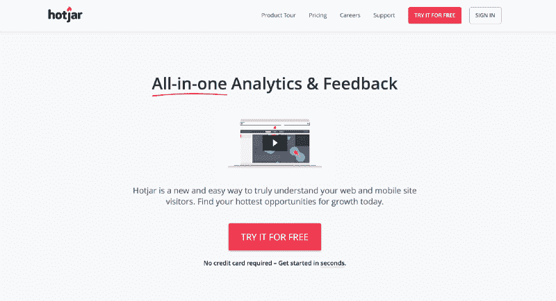
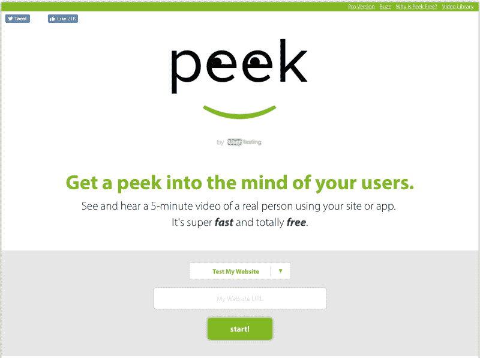
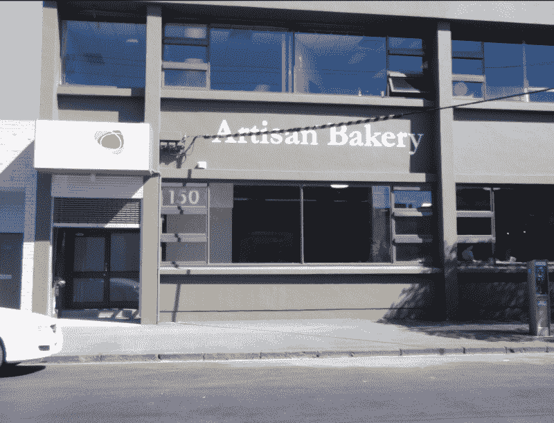

# 没有预算？没有借口。这里有一本便宜的 UX 实用指南。

> 原文：<https://www.freecodecamp.org/news/no-budget-no-excuse-heres-a-practical-guide-to-ux-on-the-cheap-9605c77ef55b/>

由文尼

# 没有预算？没有借口。这里有一本便宜的 UX 实用指南。

Let’s rub the magic lamp and see what we can do for free! (Thanks to [Nikita Kozin](https://thenounproject.com/kozinn) for the icon at Noun Project)

这是我在墨尔本代理公司做 UX 设计师的 5 年里反复遇到的一个问题:**没有预算**。

> “我们很想做用户测试，但是我们负担不起。”

推销用户体验设计可能很难。尤其是当你与一个网站预算有限的中小型企业合作时。每一美元都是一场战斗，将 25%的预算花在“仅仅是与人交谈”上可能是一种强行推销。

我们领域之外的人似乎经常认为与用户交谈是浪费金钱。好吧，让我们考虑这个前提。鉴于 UX 设计师的核心技能之一是换位思考，让我们努力从这些局外人的角度看问题。

看待这一挑战的方式是不要忽视用户测试(或者其他你没有预算的事情)。而是探索绕过这些限制的方法。

如果你通过零预算的工作向你的客户展示价值，那么，你已经为自己赢得了预算。

> “设计很容易。让人们在乎设计才是最难的。”——蒂姆·埃文斯，我的本地经纪人的 UX 负责人

因此，在这个系列中，我将分享一些我在这个过程中学到的技巧和诀窍，帮助你在几乎没有预算的情况下获得巨大的成功。我将使用一个流行的设计框架作为它的基础。我将带你经历获得一些深刻见解所需的步骤，同时不会花费你网站的太多预算。

### 设计过程

为了为此做好准备，必须有一个过程。疯狂背后的方法。就我个人而言，我更喜欢先拍明星，然后再脱光。画出你的理想过程，然后看看你每一步真正想要达到的目标。超越你正在做的“是什么”,超越你正在做的“为什么”——你会发现有很多方法可以实现同一个目标。

有很多伟大的过程，但是背景是非常重要的。选择一个接近您要求的流程。然后随意即兴创作，直到它适合你的项目需求。

出于本文的目的，我将把我的过程松散地建立在 IDEO 的循环设计方法论的基础上，你可以在这里阅读更多关于[的内容。](https://www.circulardesignguide.com)

Circular design method — read more on the [IDEO website](https://www.circulardesignguide.com/methods)

值得注意的是，当我提到这个设计过程时，我始终采用的一个关键方法是精益 UX。杰夫·高瑟夫和乔希·塞登的优秀著作很值得一读，以了解我真正的意思，但我在这种情况下对精益 UX 的解释是“*尽可能少地验证你的想法。”*

为什么？从长远来看，这会节省你的时间和金钱。

在这第一篇文章中，我将着眼于第一步:**理解**。

### **如何理解**

好吧，你有新客户了。你要创建一个新网站。生活是美好的。你需要做的第一件事是开始理解客户为什么来找你。通常这是从一个启动会议开始的。我在这里的建议是，尽可能让这个会议成为单向会议。感觉就像你在和你的新客户进行面谈。

给你一个警告:如果这是一个小企业，你在和一个主管打交道，可能会有一点偏离轨道的倾向。与你交谈的人通常习惯于推销他们的业务，你可能开始得到更多的推销而不是真正的洞察力。和其他用户面试一样，你需要运用你所有的技巧，努力让面试抓住重点，深入了解业务，这将使你的长期工作变得容易得多。

我也强烈建议把这次会议录下来，以后再来看。做会议记录总是有帮助的，但是回头再做记录会更好。

作为这次会面的一部分，甚至可能在此之前，这也是从客户那里获得尽可能多的细节的好时机。收集谷歌分析细节(金粉！)，获得他们现有 CMS 的登录，尝试获得 FTP 访问，任何真正与他们现有网站相关的内容。

OK — not all that easy. Image from quickmeme.com

好吧，这东西其实没那么简单。可能有旧的机构参与，关系不好，等等。准备好等待这些东西，但要确保你跟进。多次。这个过程并不有趣，但却至关重要，因为这是从零开始和从有形的东西开始的区别。

#### 分析模式

好了，现在你有了一些分析数据。这是一个开始。你可以看看那里，开始做你的分析——人们在网站上去哪里，我们在哪里失去他们，他们如何到达那里。画面开始在你的脑海中形成。虽然你会想花大量的时间来分析这些数据，但在早期改善网站的分析也是一个好主意。一旦你自己有了一些访问权限，试着给自己再买一个月的数据。

这是为什么呢？嗯，你可以再深入一点。虽然很多网站会安装分析工具，但它们不会都有事件跟踪或目标设置之类的功能。就我个人而言，我喜欢将所有事情作为一个事件来跟踪。页面上的每一个按钮点击，都应该是一个事件。这很容易实现，尤其是当你使用谷歌标签管理器的时候。这就引出了我的下一个观点…

#### 了解如何使用谷歌标签管理器。

这让你的生活更轻松。您可以在一个地方添加多个代码片段，并减少对开发人员的依赖。即使对于我们这些熟悉 FTP 的人来说，我们花在 FTP 上的时间越少，我们可以花更多的时间来分析和产生见解——这是我们的工作。

有了谷歌标签管理器，你可以非常容易地添加更多的跟踪代码到你的网站，为其他有用的工具。我最喜欢在这个阶段添加的工具是 Hotjar。Hotjar 确实有一个额外见解的付费层(如果你负担得起的话，这很棒)，但它是免费版本，你可以通过谷歌标签管理器安装在你的网站上，它会免费做很多事情。

如果您需要了解如何在标签管理器中做一些事情，这里有一些很好的资源:

[Simo Ahava 的博客](https://www.simoahava.com)(更高级的想法)
[谷歌标签管理学院](https://analyticsacademy.withgoogle.com/course/5)(入门)

网上有大量的资源，所以如果你对它感兴趣，一定要有一个谷歌！

为什么要使用 Hotjar？

*   你可以获得人们使用该网站的屏幕录像
*   你可以制作热门页面的热图(就像疯狂的彩蛋一样，但是免费)
*   你可以在网站上安装免费的简短调查

Hotjar 做的不止这些(例如漏斗)，但我发现这三个特性在每个 web 项目中都很有用。它仍然是分析，而且必须被视为分析(数字本身并不能告诉我们一切)，但它让我们比我们在谷歌分析中看到的纯数字更深入一些。我们正在理解 Hotjar 的行为。

一个特别有用的工具是民意测验。如果你有几个烦人的问题，民意测验真的可以帮你解决。它不会揭示任何真正深刻和有意义的见解，但可能会帮助你指出正确的方向。

这里有一个很好的问题:“什么对你更重要——更好的内容还是更多的获取内容的方式？”

你不能把这个答案当成真理，但是如果你看到一个答案有 100 个回答，而另一个答案没有——你就有了很好的洞察力，并且有了开始测试的地方。

Hotjar Home Page

#### **与真人交谈**

好的。谷歌分析是一个滴答。你已经有了一些热图，你已经看到人们浏览网站，你已经开始在投票中得到一些回应。在你拿出工具之前，你需要做的下一件事是和真实的人交谈。

这可能是最难的部分。如果我看看我过去做过的项目，我的理想工作流程中最缺失的是哪一步？这一步。那是因为这很难。但不一定非要这样。在一个理想的世界中，我们使用某种外包服务来招募用户，他们为我们做所有的工作，用户出现在我们的门口，我们与他们交谈。但是那要花很多钱。

然而，我们能做的是利用我们现有的资源。有几种方法可以做到这一点。

#### ***在线用户测试***

我已经习惯了在我参与的每个项目中使用[Peek](http://peek.usertesting.com)([usertesting.com](http://usertesting.com)的免费兄弟)。你一个月有三次免费测试。

有时候这些测试，嗯，是没用的。这是错误的人口统计，他们没有得到他们正在寻找的服务，坦率地说，这是浪费时间。但是它是免费的，只需要你 5 分钟的时间。

Try out [peek.usertesting.com](http://peek.usertesting.com)

在我运行这些测试的大部分时间里，我至少得出了一个有用的见解。可能是 CTA 不清楚——这可能解释了分析中点击率低的原因。或者可能是一个 Windows 操作系统的用户，我以前从未在上面看到过这个网站，我注意到一种字体没有正确加载。每次运行这些测试中的一个，您都很有可能获得至少一个有用的见解。他们是免费的，我说这是一个没有大脑。

接下来的选择当然是使用 usertesting.com。他们提供在线远程用户测试，每次测试 50 美元。您可以指定一些人口统计数据，这将有助于减少“无用”测试的数量，并且测试运行的时间比免费测试长得多。我在这些在线测试中一直都很成功，但是当有人在测试的时候，和他在一个房间里肯定是有好处的。

这是“真正的”用户测试的一个很好的廉价替代方案，并且特别有用，因为您的时间只需要在设置测试时使用，然后您可以在以后任何合适的时间观看它们(比如当您不必出席测试时)。

#### ***游击队用户测试***

那么，有什么比以 50 美元一次的价格让真人上网更好呢？在现实生活中，4 美元一张的真人怎么样？是的，有可能。

The scene of our last Guerrilla session — pro tip: pick somewhere with delicious baked goods to celebrate when you’re done!

游击式用户测试不是最容易做的事情。不是每个人都有信心在咖啡店(或面包店)接近随机的人。)并请他们坐 5 分钟。但是你可以绕过这一点，绝对没有比与真人面对面更好的测试网站的方法了。

如果你不喜欢自己接近别人，那就和更舒服的人合作。我们在实验中发现，当你为他们的咖啡付钱时，人们通常很乐意坐下来。事实上，很高兴他们经常对你很好，对你展示给他们的东西非常积极——这是你必须克服的另一个问题。

这种测试是一门艺术，但如果你想成为一名优秀的体验设计师，这是一门值得练习和提高的艺术。第一次尝试不会很完美(从经验上讲)，但是每次做都会变好。即使它并不完美，你也会挖掘出真知灼见。

关于这个主题有大量的文献可以阅读，尽管我认为可能缺少一本超级实用的指南。然而，你可以做我们已经做过的事情:边做边学。

首先阅读[史蒂夫·克鲁格的《火箭手术变得简单》](https://www.amazon.com/Rocket-Surgery-Made-Easy-Yourself/dp/0321657292)，然后阅读下面的文章:

*   UX 展台上的可用性测试艺术
*   在 Userbrain 上进行游击测试的 7 步指南

我一直在与我的一些同事合作，寻找一种收集这些见解并与我们更广泛的团队分享的好方法，因此，如果您有兴趣了解更多这方面的信息，请通过电子邮件联系我！:)

### **理解—完成**

一旦你做了一些测试——在线的或者“在现实生活中”(感谢我没有用缩写词)——你就准备好开始分析你得到的所有数据，并定义你试图解决的问题是什么。

在这个阶段，你应该有大量来自分析的硬数据，一些来自 Hotjar 的行为数据，你会通过你的用户测试对人们在使用网站或应用时的想法或感觉有一点感觉。

这意味着你已经准备好进入下一个阶段，筛选、组织你所有的数据并定义问题。这将在本系列的第 2 部分中出现！:)