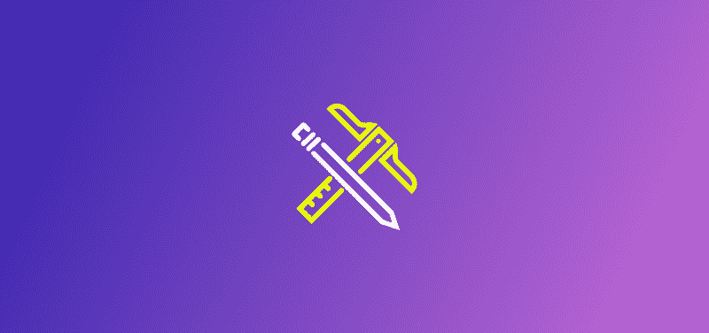
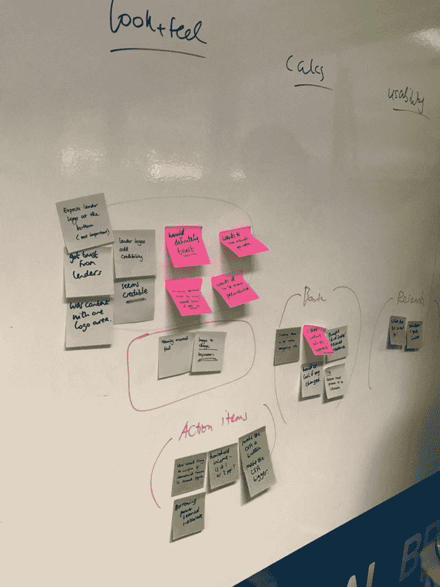
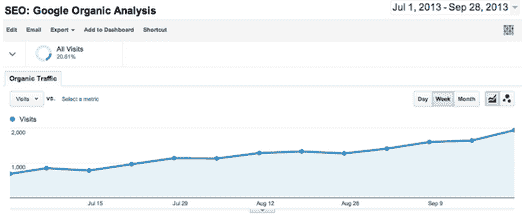
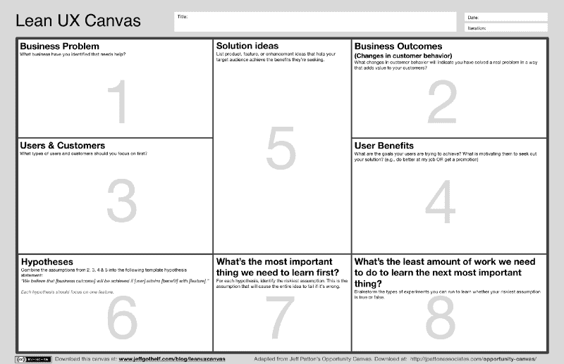
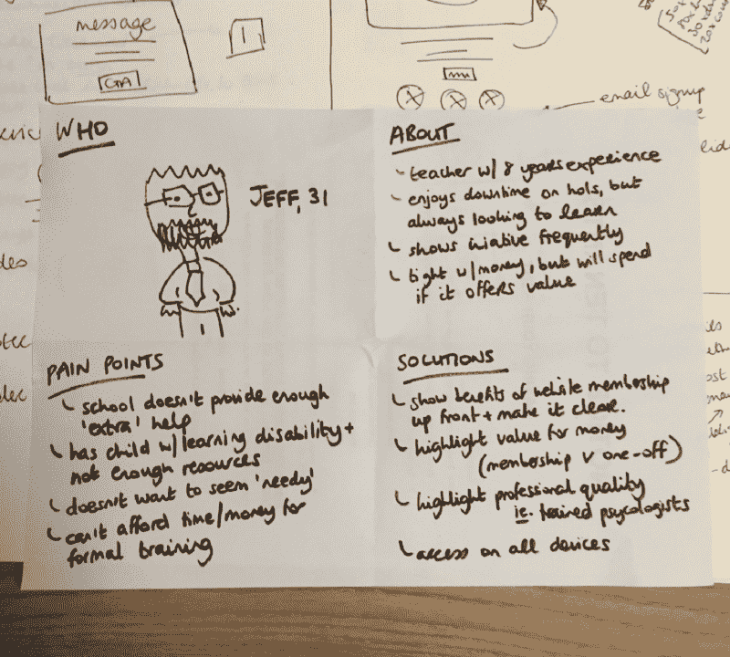
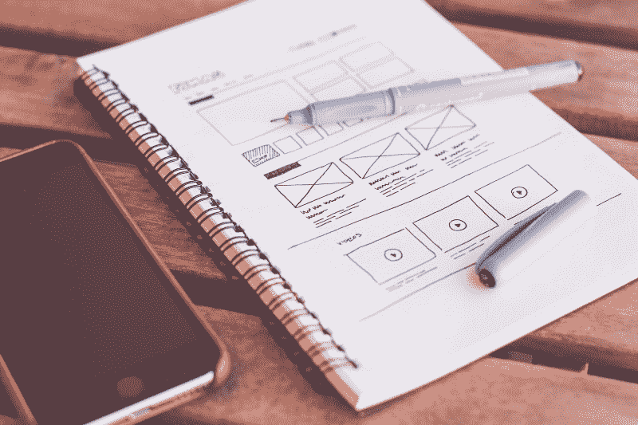

# 没有预算？没有借口。廉价的 UX 第二部分:让我们开始建设。

> 原文：<https://www.freecodecamp.org/news/no-budget-no-excuse-ux-on-the-cheap-part-2-lets-get-building-6ddbb23f46cc/>

由文尼

# 没有预算？没有借口。廉价的 UX 第二部分:让我们开始建设。

这是我关于预算有限的 UX 系列的续篇。如果您还没有阅读第一部分，我强烈建议您在阅读本文之前先阅读一下。你可以在下面找到。

[**没有预算？没有借口。这里有一本便宜的 UX 实用指南。**](https://medium.freecodecamp.com/no-budget-no-excuse-heres-a-practical-guide-to-ux-on-the-cheap-9605c77ef55b)
[*这是我在墨尔本代理公司做 UX 设计师的 5 年里反复遇到的一个问题:不…*medium.freecodecamp.com](https://medium.freecodecamp.com/no-budget-no-excuse-heres-a-practical-guide-to-ux-on-the-cheap-9605c77ef55b)

在第一部分，我讨论了 [IDEO](http://ideo.org) 的循环设计方法论的第一阶段，*理解*。在本文中，我将介绍接下来的两个阶段，“T4”定义“T5”，以及“T6”创建“T7”。

在第一部分，我讨论了 [IDEO](http://ideo.org) 的循环设计方法论的第一阶段，*理解*。在本文中，我将介绍接下来的两个阶段，“T4”定义“T5”，以及“T6”创建“T7”。

为了与本系列的主题保持一致，本文的想法是给你一些如何实现这种方法的实用技巧。我们坚持精益 UX 的核心(即，“尽可能少地验证你的想法”)，并保持低预算。在快速提醒注册完整电子书后，让我们开始吧:)

### 规定

现在你需要定义你试图解决的问题。在这里，您需要做的是建立一些可实现的目标，这些目标清晰、易于衡量，并且在核心上对业务有益。

#### 车间

UX 人喜欢便利贴。这是有原因的。人类天生擅长某些事情。其中之一是看到模式和将相似的东西组合在一起的愿望(参见苏珊·温申克的书《每个设计师都需要知道的关于人的 100 件事》)。

把便利贴贴在黑板上可以让我们把想法从脑子里拿出来，贴在墙上，从不同的角度看待一切。东西可以很容易地移动，想法可以组合在一起(更多关于相似性映射的信息，请点击这里),我们可以形成讨论点。

我强烈建议尝试将你从任何类型的用户研究中收集到的见解，或者甚至是你从分析中得出的见解组织起来。理想情况下，你可以从客户团队中挑选至少一两个人，从你自己的团队中挑选一个人。4 个人在一个房间里意味着你会从其他角度看到数据，而不仅仅是你自己的。这是至关重要的。

Nothing fancy here. But, it did the trick.

我完全理解这并不总是可能的，因此至少有一个人(你仍然可以和两个人一起工作！)还是很值得的锻炼。

有很多方法可以综合你的数据，我不会在这里详细介绍，但如果你想要一些研讨会的想法，我强烈推荐《游戏风暴》这本书——这本书将帮助你根据你的情况选择正确的活动。

***专业提示:*** 确保对发生的事情有一个清晰的总结，并有一个清晰的下一步计划。太多时候，这些精彩的对话被遗忘，或者不在房间里的人不了解背景。创建一个有关键见解的 [Trello](http://trello.com) 板——它是免费的，容易分享，比你不得不放大看不清别人笔迹的照片要好:)

#### 挖过表面

我最喜欢听人谈论人类行为的人之一是首席广告人罗里·萨瑟兰。如果你以前没有看过他的演讲，阅读这篇文章会让你发现这个家伙。看看他。罗里的一句话引起了我的共鸣:

> 一旦一个数字成为一种度量，它就失去了作为度量的所有相关性。

在项目开始时，承诺增加流量、降低跳出率或某种听起来很棒的分析指标是很常见的。问题是，虽然不总是无关紧要，但很多时候我们关注的是错误的目标。

如果你的目标是赚更多的钱，你的重点应该是转化率，而不是流量，而不是跳出率。专注于真正重要的事情，把你所有的时间和精力都花在这个目标上，而不是浪费在谷歌分析中那些美观的积极趋势线上。在报告上看起来很棒，但谁在乎它是否意味着银行里的钱。

Yes, this looks great. But what does it mean?!

当然这在每个项目中是不同的。有时更多的流量是目标，有时低跳出率更好。关键是，如果你承诺你将改善某件事——确定并思考你的选择和原因。确保你不是不切实际的。

#### 精益 UX 画布

我已经谈了很多关于精益 UX 的事情，这里有另一个来自[杰夫·高瑟夫](http://www.jeffgothelf.com)的便利工具——精益 UX 画布。

Source is [here](http://i2.wp.com/www.jeffgothelf.com/wp-content/uploads/2016/12/LeanUX_canvas_v4.png) (Jeff’s website)

这可以作为你项目的一个很好的参考点。你可能不想使用所有的画布，但你可以选择相关的部分。定制它以适合你和你正在做的项目，但使用这样的工具真的很重要，因为它给你一些参考资料，帮助你以后做决定。

我喜欢这种画布的主要原因是，它将我收集的数据形式化。我已经谈了很多关于收集数据和见解，并提出目标——这允许他们都生活在一个地方作为参考点。

根据手头的项目创建您自己的品牌和定制版本的文档，不仅有助于您的工作，而且会给客户留下深刻印象，并为他们提供一个很好的参考点。

#### 一个有争议的旁注——人物角色

这里我没有提到的一件事是[人物角色](https://www.smashingmagazine.com/2014/08/a-closer-look-at-personas-part-1/)。有人爱他们，有人不爱他们。我个人的意见是，如果你觉得有用，就用人物角色。本着精益 UX 的精神，你可以很容易很快地创建原型人物角色(来自[杰夫的书](http://www.jeffgothelf.com/)的另一个技巧)——这只是意味着创建你产品的潜在客户/用户的快速总结，你可以在整个工作中参考。

提倡人物角色的人说，人物角色有助于你的设计保持以人为中心，因为你是基于一个人(你创造的人)来做决定的。这可能是引导对话的一个很好的方式。

另一方面，有一种观点认为，通过关注人物角色，我们更多地强调了这些特定的用户和他们的观点，因此忽略了更大的画面。

我认为人物角色是一门艺术，是一种创造良好平衡的方法。我建议用它们做实验，看看你会怎么样。

A beautiful proto persona I created one time. More proof that being a good designer has nothing to do with artistic talent.

#### 摘要

你已经从第一部分获得了许多漂亮的数据和见解。现在你已经开始综合数据，寻找模式和机会。你已经建立了一些商业目标。你做了一些承诺。你已经完成了你的计划(或者至少记下了你想要达到的目标)。你已经让其他人参与进来了，现在你已经准备好开始有趣的部分了。

做东西！

### 制造

#### 纸

就我个人而言，说到制作材料，我不得不从纸开始。对我来说，这是一个摆脱我的头脑的练习。写下来，这样我就能画出图案。无论是画出一个模拟流程还是一个屏幕可能是什么样子，或者只是列出相关的想法。我不停地记笔记，这些笔记看起来完全是胡说八道，但实际上对我的工作方式至关重要。

对我个人来说，这就是斗志昂扬。当我创建一个纸线框时，我不使用尺子——它碍事。我不是批评这种方法，当我看到其他人用铅笔和纸做出的一些令人难以置信的线框时，我感到一丝嫉妒，这不是我的工作方式。

Source: [Pexels](https://static.pexels.com/photos/196644/pexels-photo-196644.jpeg). This is a great balance of wireframe to me. Simple, clear but quick.

一旦你打开你选择的设计工具，你就处于数字模式，你的创造力是有限的。你从无限的可能性到固定的画布。你考虑的是事物的外观，而不是工作原理。我试着推迟这一步，直到我至少对我要达到的目标有了一个好的想法。

#### 样机研究

在纸上写下你的想法后，是时候给你的设计画个线框了，并让人们实际使用它们。

有像 [POP](https://itunes.apple.com/us/app/pop-prototyping-on-paper/id555647796?mt=8) 这样的应用程序，你可以用你的纸张设计做原型。这可能有助于了解你的信息流是如何工作的，并且足以向人们展示——但就我个人而言，我更喜欢在这个阶段进行数字化，并让我的想法变得有序。

数字原型制作的一些技巧:

*   使用真实内容，而不是 lorem ipsum
*   从零开始，不要从一个模板开始并向后工作
*   找到一个好的 UI 工具包来帮助加快速度

为什么这么问？Lorem ipsum 烂透了。它的伟大之处在于它的发明目的(印刷)，而不是我们所做的。它把我们从真正的设计带到了虚幻的世界。

即使没有最终的内容/文案，也要挑类似的。我怎么强调这一点都不为过。有些人非常注重细节，以至于他们不能像你一样忽略占位符文本。此外，用只有四个字的字体设计一个伟大的标题是没有意义的，因为在现实生活中，标题将会是 20 个字。

#### 另一方面——友好的工具

就我个人而言，在“制作”数码产品时，我依赖几个软件。谢天谢地，他们配合得很好。那就是[素描](http://sketchapp.com)和[视觉](http://invisionapp.com)。很疯狂，对吧？

SketchApp Logo. Lovely stuff.

我花了很长时间寻找伟大的线框工具，并在过去使用了许多。我已经浏览过 [UX Pin](https://www.uxpin.com/) 、Illustrator、Photoshop(说真的) [Axure](https://www.axure.com) 、 [Balsamiq](http://balsamiq.com) 、 [Mockflow](http://mockflow.com) 和 Adobe XD，有些比其他的好，但我还是选择了 Sketch 作为我的首选。这有许多原因，显然它已经成为我们行业中非常受欢迎的软件，导致了许多令人敬畏的插件，关于如何更有效地使用的文章和许多关于为什么它比它之前的任何东西都好的媒体文章。

我的想法是，说到工具，我们还有很长的路要走(阅读这篇文章)，但在我使用过的所有 UI 工具中，Sketch 是最不妨碍我的。对我来说，做我想做的事情很快，我可以在任何时候制作一个线框，当我准备好高保真并将其转化为视觉设计时，我可以使用相同的软件。

能够直接与 InVision 同步意味着我可以从 Sketch 无缝地制作原型，并且通过[新的‘Inspect’功能](https://www.invisionapp.com/feature/inspect)，我还可以轻松地传递给开发人员。

Sketch 的价格是 99 美元(有 30 天的免费试用)，InVision 允许一个免费项目，所以它肯定符合本文的“预算”主题。使用了这么长时间的 InVision，很难忽略它的原型，但我已经用[漫威](http://marvelapp.com)进行了实验，它有很多喜欢的地方，所以如果出于任何原因你不喜欢 InVision，我强烈建议你看看它。

有了像 [Wordpress](http://wordpress.org) 和 [Squarespace](http://squarespace.com) 这样的工具，很容易在很短的时间内创建一个网站，并且无需设计就可以直接跳到代码。对我个人来说，我可以编写代码，但我的技能集依赖于对客户的同情和精心设计的解决方案。

如果我花时间编码，我开始远离我真正试图解决的问题(为客户)，并开始专注于我自己的编码限制，因此我试图在早期阶段避免代码原型——这对于依赖于他们技能集的每个人来说当然是不同的。

#### 测试原型

一旦你有了一个原型，你可以马上开始测试。原型需要什么？基本上是尽可能少的去测试你的假设。

比方说，你正在测试一个应用程序的需求，你要求人们注册后会收到电子邮件通知。这可能就像在你的网页上添加一个电子邮件地址框一样简单——有人注册吗？如果他们这样做了，那么就有了对产品的需求，你可以在知道有需求的情况下继续创造它。

你可以添加一个带有新功能名称的按钮——如果人们点击，你可以把他们带到一个屏幕上，上面写着“即将推出”，同时你可以跟踪按钮上的点击，看看需求是什么样的。

对于一个你已经在 Vision 或漫威建立的项目，在这个阶段，你最好在尽可能早的阶段收集尽可能多的关于你正在做的事情的想法。如果你的团队中有其他人，你可以让他们站在产品的前面，这很好。即使是朋友也会帮助解决一些基本的可用性问题，越多的人检查你的工作越好。

这也是使用我在第一部分中讨论的游击式测试技术的好时机，您可以坐在当地的咖啡馆里，让新用户用新鲜的眼光来看待和使用原型。

#### 用数据验证

还有一个很棒的工具叫做[可用性中心](https://usabilityhub.com)，它允许你很容易地招募用户用数据进行一些快速测试。这不是一个免费的工具，但它的价格非常合理，对于一个小机构或 UX 团队来说是负担得起的(耶！).

我特别喜欢通过他们的偏好和五秒钟的测试来运行我的原型。有数据来说明你在就一些非常主观的事情进行有根据的对话总是好的。

#### 重复

有了这些，我甚至还没有谈到发展阶段。假设一旦你经历了这个过程，你会得到一些反馈来采取行动。这意味着迭代。在对最终产品和发行版有一个明确的概念之前，您需要多次使用这些技术。

我们在“精打细算”地与 UX 打交道，所以这并不总是意味着你会有这个过程所需要的那种时间。我的建议是，不管你在做什么项目，都要尽可能早地完成一些测试——但是在现实世界中，这并不总是可能达到我们想要的程度。这没关系。

### 结束并继续前进

好了，总结一下我们在这篇文章中讨论的内容:

*   我们已经通过研讨会明确了我们的问题
*   也许我们创造了一些人物角色，也许没有——但在这个“定义”阶段，我们一直关注用户
*   我们在精益 UX 的画布上写下了一些计划
*   我们做了一些纸上原型来快速产生一些想法
*   我们已经将数字转换成草图(或者任何你喜欢的工具),并创建了一个数字原型
*   人们已经开始与原型互动，我们正在学习
*   我们已经迭代了几个版本，准备好了！

就是这样。很多。但是，由于对用户的关注，你应该更接近一个优雅的、以用户为中心的解决方案。你第一次可能不会 100%正确，但是你在每个想法上投入的时间越少越好，这意味着有机会在需要的时候快速进入下一个想法。

现在——是时候发布它并了解更多信息了。

### 进一步阅读

我在过去几篇文章中谈到的所有内容，以及我尚未涉及的 IDEO circular 设计过程的最后一部分(“发布”)，都将在我的电子书中提供，请在下面注册以获得发布通知:)

与此同时，如果你正在寻找一些进一步的阅读来快速验证想法，一定要看看这些书——它们绝对是我自己在这个问题上的知识的伟大基础！

*   [Google Ventures Sprint Book](http://www.thesprintbook.com)
*   [精益 UX](http://www.jeffgothelf.com/lean-ux-book/)
*   [精益用户研究](http://rosenfeldmedia.com/books/lean-user-research/)

立即下载这本书:

[**【UX 预算:实用指南】**](https://medium.com/@doublethought/ux-on-a-budget-the-practical-guide-82ef28c3c798)
[*在过去的几个月里，我写了几篇中型文章，并为一篇……*medium.com](https://medium.com/@doublethought/ux-on-a-budget-the-practical-guide-82ef28c3c798)

如果你觉得这很有用，请❤️，分享并确保和关注我更多:)