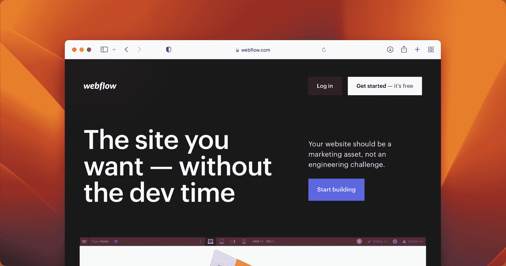
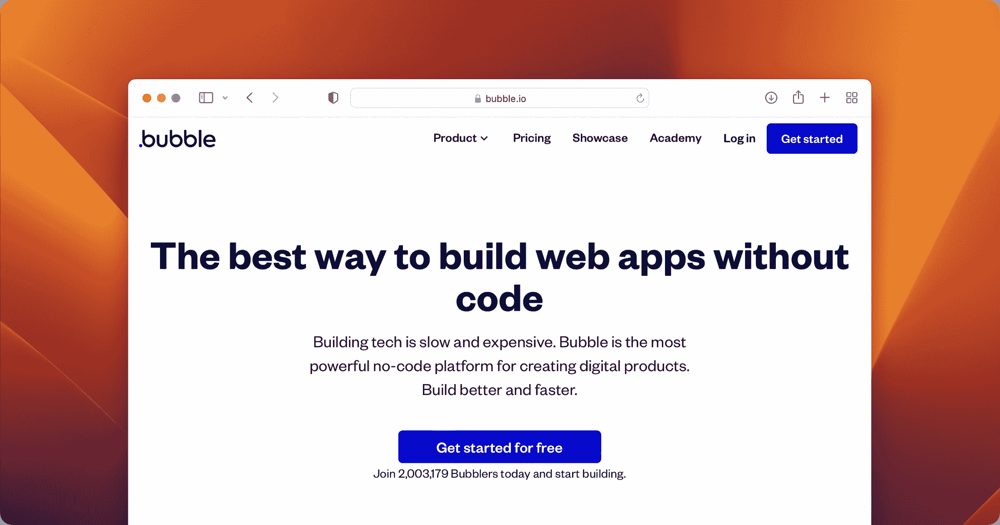
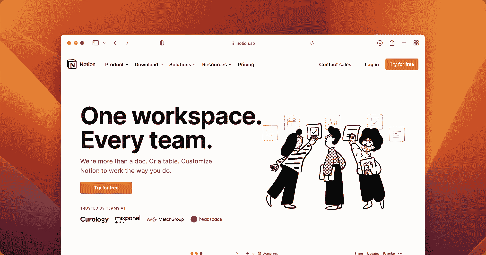
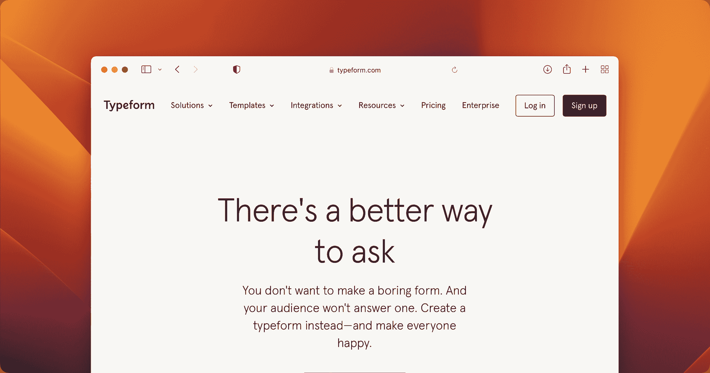
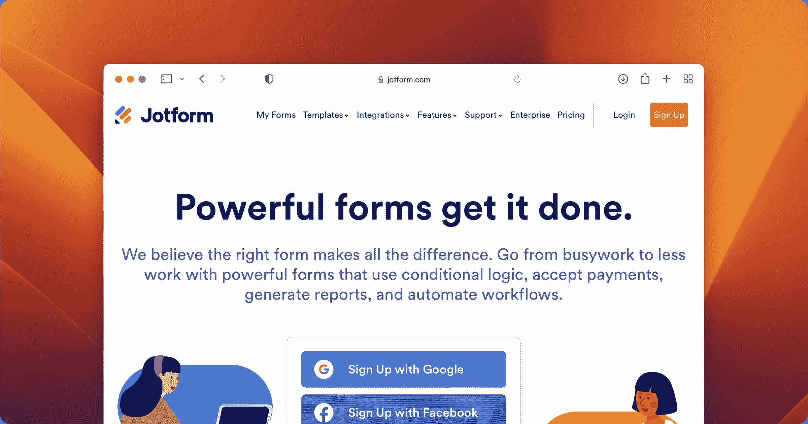
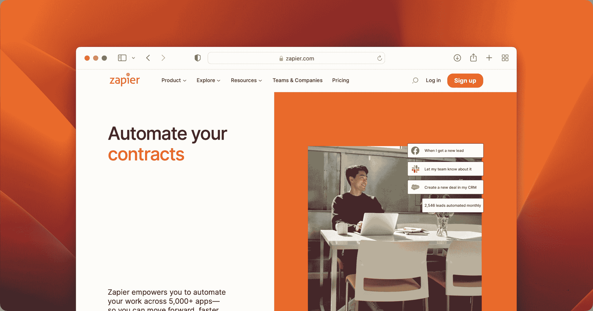
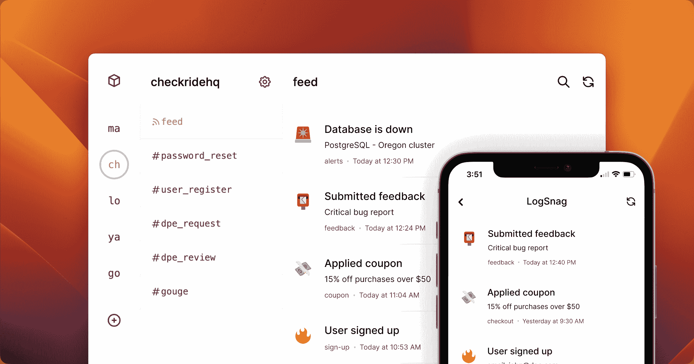

# 用于下一个项目的无代码工具

> 原文：<https://www.freecodecamp.org/news/no-code-tools-for-building-your-next-project/>

我最近开始活跃在几个在线创客社区，我遇到了很多有才华的人，他们正在制作令人惊叹的产品。

在与这些制造商打交道的过程中，有一点让我印象深刻，那就是他们中的许多人都不是开发人员——从某种意义上说，他们并不编写代码来构建他们的产品。

相反，他们使用的服务可以让你不用接触任何代码就能创建应用和网站，换句话说，就是无代码工具。

我从未真正花时间学习这些工具，原因有两个:首先，作为一名开发人员，我认为我有足够的技能用代码创建我想要的任何东西。第二个是成本——当我可以编写自己的代码并且不用支付任何费用就能完成时，我为什么要为 Webflow 这样的东西付费来创建一个网站呢？

但是我花在了解无代码社区上的时间越多，我就越意识到这里有一些重要的东西我已经错过了。即使是知道如何写代码的人。

对我来说至关重要的是，无代码允许你快速迭代想法，并以比编写代码快得多的速度将想法变为现实。

现在想想，在过去的几个月里，我用无代码平台和无代码自动化工具创建东西所节省的时间对我来说比小成本更有价值。

因此，简而言之，我只花了很少的时间就理解了我现在从这些工具中获得的巨大价值，即使是作为一名开发人员。

因此，我决定在本文中总结我在过去几个月里学到的无代码经验。我希望帮助那些想创造自己想法的人——不管你是不知道如何编码，还是愿意学习这些无代码工具的开发人员。

所以让我们从第一个也是最常见的问题开始。

## 什么是无代码？

这个问题没有单一的答案，因为它对不同的人有不同的含义。然而，一般来说，“无代码”指的是一种软件开发方法，它描述了远离手工编写代码和使用更多自动化工具的一步。

这个过程可以包括使用代码生成工具、代码库或交互式应用程序，使创建复杂的应用程序变得容易，而无需接触任何一行代码。

没有代码可以成为原型和测试新想法的好方法。使用允许您快速创建和部署应用程序的平台，您可以快速测试您的设想，并查看它们在现实世界中是如何工作的。这给了你迭代和验证你的想法的能力。

现在我们对无代码有了更好的理解，让我们看看下一个最常见的问题。

## 我应该学习哪种无代码工具？

通过快速搜索，您可以找到大量的数据库和网站，它们列出了您可以在下一个项目中使用的无代码和自动化工具。例如，这里有一个[无代码工具列表](https://nocodetoolslist.com)。

这对我们来说是一个巨大的好处，因为在无代码领域有很多选择有很多好处。您可以找到满足您需求的完美平台，快速启动并运行，避免学习新的语言或框架。

但是，要知道哪一个最符合您的需求是一件很有挑战性的事情。选择如此之多，很难跟上这个领域的所有变化。此外，很难找到合适的社区和支持网络。

因此，为了使这更容易，我将可用选项分为多个类别，如网站、应用程序和表单生成器。然后，我为每个类别选择了我遇到过的最常见的，希望能让你更容易决定用哪一个。

## 无代码网站建设者

### Webflow

[Webflow](https://webflow.com) 是一个拖放式的网站构建器。它有一个简单和用户友好的界面，让你不用接触一行代码就可以设计和建立网站。

Webflow 还附带了一个广泛的预制元素和模板库，可以在几个小时内轻松地从 0 到 1。

正如他们的网站上提到的，超过 350 万的设计师和团队正在使用 Webflow 来创建他们的网站，而对编写代码一无所知。

### Webflow 优势:

1.  轻松创建漂亮的网站
2.  用于管理动态内容的强大 CMS

### Webflow 定价计划:

1.  免费:永远免费
2.  基本:每月 19 美元或每年每月 12 美元
3.  CMS:每月 20 美元或每年每月 16 美元
4.  企业:每月 45 美元或每年每月 36 美元

Webflow Screenshot

### 泡泡

[Bubble](https://bubble.io) 是另一个用于建立网站、登陆页面和在线商店的在线设计工具。与 Webflow 类似，Bubble 也是一个无需编写任何代码就可以建立网站的无代码平台。

Bubble 可以让你的网站和应用程序完全正常运行，而不需要接触一行代码。

我个人使用过 Bubble，发现它对初学者和专家都是一个非常好的工具。

### 泡沫的好处:

1.  用于创建全功能 web 应用的强大工作流
2.  第三方服务的许多插件和集成

### 泡沫定价计划:

1.  免费:永远免费
2.  个人:每月 29 美元或每年每月 25 美元
3.  专业:每月 129 美元或每年 115 美元
4.  生产:每月 529 美元或每年每月 475 美元

Bubble Screenshot

### 泡泡 vs Webflow

所以你可能想知道 Webflow 和 Bubble 哪个更好？

嗯，Webflow 更适合开发轻量级网页和相对简单的 web 应用程序。Bubble 适用于更复杂、更可定制、更先进的在线项目。

Bubble 的插件引擎和工作流程可以轻松地为您的网站添加额外的逻辑，从而可以创建更复杂的应用程序。

另一方面，Webflow 使设计更复杂的 UI 和 UX 设计变得更容易，而 Bubble 则采用更具技术性和数据驱动的方法来进行 web 开发。

如果你想要一个简单的网页，一个博客，或者一个你的产品，服务或者想法的登陆页面，我建议你使用 Webflow。但是如果你正在做一个处理数据并需要工作流和插件的项目，Bubble 会是一个更好的选择。

如果你仍然不相信哪个对你来说是更好的选择，我已经写了一篇单独的博客文章，对 Bubble 和 Webflow 进行了彻底的比较。

既然你已经很有希望地决定了选择哪一个网站建设者，让我们进入下一步。对于许多开发人员来说，下一步是连接不同的应用程序并自动化工作流。

## 无代码数据库

### 概念

你可能已经听说过[这个概念](http://notion.so)，因为它在最近几年非常流行。该工具是一个灵活的工作空间，可以适应您的使用情况，使您可以轻松地组织您的想法和项目以及存储信息。

对于许多无代码开发人员来说，idea 的灵活性使其成为管理数据的一体化工具。它可以很容易地创建和共享模板，使用不同的组件来存储各种数据，甚至可以让您将内容发布到互联网上，这使它成为一个网站建设者。

您还可以将 concept 与您的项目(如 Bubble)集成，并将其用作管理数据的仪表板。

### 概念优势:

1.  非常用户友好
2.  简单学习曲线
3.  有利于协同工作

### 概念定价计划:

1.  免费:永远免费
2.  个人专业:每月 5 美元或每年 4 美元
3.  团队:每月 10 美元或每年每月 8 美元

Notion Screenshot

### 充气台

[Airtable](https://www.airtable.com) 是一个零件电子表格和零件数据库，使组织和管理数据变得非常容易。它非常简单易用，同时功能非常强大。

Airtable 使得创建不同的视图变得很容易，比如日历、表单、看板和网格，这使得它适用于许多用例。

与 concept 类似，您可以将 Airtable 与不同的工具集成，为您的项目创建更强大的工作流。

### Airtable 优势:

1.  易于创建复杂的数据库
2.  各种可用的数据库模式

### Airtable 定价计划:

1.  免费:永远免费
2.  另外:每月 12 美元或每年 10 美元
3.  赞成:每月 24 美元或每年每月 20 美元

Airtable Screenshot

### 无代码表单生成器

### 字体

Typeform 是一个基于网络的表单生成器，允许用户创建美观的表单。该构建器主要用于交互式调查，其问题结构便于受访者回答。

当我想出一个新的项目想法时，我发现 Typeform 是一个很好的工具，并且希望在开始创建项目之前得到一些反馈以进行验证。在这些情况下，我只需在表单上写几个问题，然后发给我的潜在用户，询问他们的想法。

### 类型优势:

1.  轻松创建有趣且漂亮的表单
2.  非常容易导出您的表单数据

### 键入定价计划:

1.  免费:永远免费
2.  基本:每月 29 美元或每年每月 25 美元
3.  另外:每月 59 美元或每年每月 50 美元
4.  企业:每月 99 美元或每年每月 83 美元

Typeform Screenshot

### JotForm

Jotform 是一个复杂的在线工具，允许任何人快速构建独特的网络表单。它的用户友好的拖放界面使创建表单变得轻而易举，并且不需要您编写任何代码。

JotForm 与 Typeform 非常相似，除了一些细微的差别，这些差别可能对您有影响，也可能没有影响。在一天结束的时候，我建议在决定哪一个对你来说是更好的选择之前，先检查一下他们的产品。

### JotForm 的好处:

1.  多种问题/输入格式
2.  可以添加自定义主题和品牌

### JotForm 定价计划:

1.  免费:永远免费
2.  铜牌:每月 29 美元或每年每月 24 美元
3.  银牌:每月 39 美元或每年每月 29 美元

JotForms Screenshot

## 无代码自动化列表

### 扎皮尔

Zapier 是一个简单的工具，允许您连接不同的应用程序，并创建自定义工作流来自动化您业务的各个部分。它是免费使用的，但你可以为更多的功能付费。

Zapier 是我最喜欢的工具之一，因为它提供了许多现成的集成，允许您连接许多不同的服务并创建自定义工作流。

例如，当我想通过调查表格获得一些验证反馈时，我使用 Zapier 的一个常见自动化功能。我有一个使用 Typeform 和 LogSnag 集成的自定义流程，它允许我跟踪每次在 Typeform 上获得的新调查，并将其发送到 LogSnag 以跟踪这些调查，并在调查发生时立即获得推送通知。

### Zapier 的优势:

1.  数以千计的集成和预构建的工作流
2.  非常灵活，多才多艺，易于使用

### Zapier 定价计划:

1.  免费:永远免费
2.  入门:每月 29.99 美元或每年 19.99 美元
3.  专业:每月 73.50 美元或每年每月 49 美元
4.  团队:每月 448.50 美元或每年每月 299 美元
5.  公司:每月 898.50 美元或每年 599 美元

Zapier Screenshot

### 制造

[Make](https://www.make.com) ，以前被称为 Integromat，是另一个自动化服务，用于将任务和工作流自动化到应用和系统。

Make works 通过连接您最喜爱的应用程序/服务来构建一个自动传输和转换您的数据的场景。只需设计一个在一个应用/服务中监视新数据的场景，为所需的最终结果配置以下模块，Make 将为您完成该过程。

像 Zapier 一样，Make 提供了许多插件来使集成过程尽可能简单。

### 创造效益:

1.  非常实惠的定价方案
2.  添加自定义代码的选项

### 制定定价计划:

1.  免费:永远免费
2.  核心:每月 10.59 美元或每年每月 9 美元
3.  利:18.82 美元/月或每年 16 美元/月
4.  团队:每月 34.12 美元或每年每月 29 美元

Make Screenshot

对于许多特定的用例，还有很多其他的非代码工具，但是根据我与非代码领域的开发者的讨论，大多数人对这个非代码工具列表中的服务感到满意。

表格使收集调查和验证你的想法变得容易。网站构建者可以非常容易地创建静态的甚至更复杂的 web 应用程序来重新获取列表。最后，自动化工具使得为这些网站创建定制工作流和自动化任务成为可能。

## 结论

在我结束这篇文章之前，我想介绍另一个无代码工具，这是我在过去几个月里一直在做的。

### LogSnag

LogSnag 是一个简单的事件跟踪工具，可以很容易地跟踪项目中的重要事件。例如，使用 LogSnag，您可以跟踪新的注册、订阅、付款或您希望关注的项目中的任何其他内容。

LogSnag 为 Zapier 和 Bubble 等其他服务提供插件，使其易于添加到您的项目中。此外，当发生重要事情时，它会向您发送推送通知，创建事件时间表，并提供简单的分析来了解您的项目进展情况。

LogSnag Screenshot

### LogSnag 优势:

1.  在您的所有设备上推送通知
2.  简单的图表和分析

### LogSnag 定价计划:

1.  免费:永远免费
2.  业余爱好者:每月 9 美元或每年 7 美元
3.  启动费:每月 16 美元或每年每月 19 美元
4.  专业:每月 59 美元或每年 49 美元

我希望您已经发现这个工具列表是有用的。我强烈建议你看看这些服务。

这里列出的大多数服务都有一个免费层，你可以使用它来了解产品的更多信息，并在为服务付费之前决定它是否适合你。