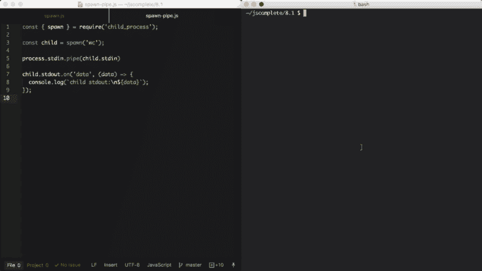
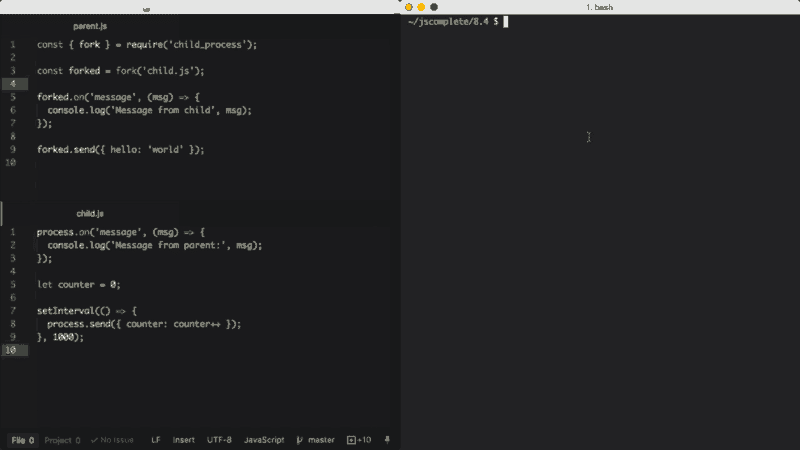

# Node.js 子进程:您需要知道的一切

> 原文：<https://www.freecodecamp.org/news/node-js-child-processes-everything-you-need-to-know-e69498fe970a/>

#### 如何使用 spawn()、exec()、execFile()和 fork()

> **更新:**这篇文章现在是我的书《Node.js Beyond The Basics》的一部分。
> 
> 阅读本内容更新版本更多关于节点在【jscomplete.com/node-beyond-basics】**。**

**Node.js 中的单线程、非阻塞性能非常适合单个进程。但是最终，一个 CPU 中的一个进程不足以处理应用程序不断增加的工作负载。**

**无论您的服务器有多强大，单个线程只能支持有限的负载。**

**Node.js 在单线程中运行的事实并不意味着我们不能利用多个进程，当然也不能利用多台机器。**

**使用多个进程是扩展节点应用程序的最佳方式。Node.js 是为构建具有许多节点的分布式应用程序而设计的。这就是它被命名为*节点*的原因。可伸缩性已经融入到平台中，它不是您在应用程序生命周期的后期才开始考虑的事情。**

> **这篇文章是我关于 Node.js 的 Pluralsight 课程的一部分。我在那里用视频格式报道了类似的内容。**

**请注意，在阅读本文之前，您需要很好地理解 Node.js *事件*和*流*。如果你还没有读过，我建议你在读这篇文章之前先读这两篇文章:**

****[了解 Node.js 事件驱动架构](https://www.freecodecamp.org/news/understanding-node-js-event-driven-architecture-223292fcbc2d/)**
*[Node 的大部分对象——如 HTTP 请求、响应和流——都实现了 EventEmitter 模块，因此它们可以…](https://www.freecodecamp.org/news/understanding-node-js-event-driven-architecture-223292fcbc2d/)***

**[**Streams:你需要知道的一切**](https://medium.freecodecamp.com/node-js-streams-everything-you-need-to-know-c9141306be93)
*[node . js Streams 以难以共事而闻名，甚至更难理解。我有好消息…](https://www.freecodecamp.org/news/node-js-streams-everything-you-need-to-know-c9141306be93/)***

### **子进程模块**

**我们可以使用 Node 的`child_process`模块轻松地旋转子流程，并且这些子流程可以通过消息传递系统轻松地相互通信。**

**模块使我们能够通过运行子进程中的任何系统命令来访问操作系统的功能。**

**我们可以控制子进程输入流，并监听其输出流。我们还可以控制传递给底层 OS 命令的参数，并且我们可以对该命令的输出做任何我们想做的事情。例如，我们可以将一个命令的输出作为另一个命令的输入(就像我们在 Linux 中做的那样)，因为这些命令的所有输入和输出都可以使用 [Node.js streams](https://medium.freecodecamp.com/node-js-streams-everything-you-need-to-know-c9141306be93) 呈现给我们。**

**请注意，我在本文中使用的例子都是基于 Linux 的。在 Windows 上，您需要将我使用的命令与其 Windows 替代命令进行切换。**

**在节点中创建子流程有四种不同的方式:`spawn()`、`fork()`、`exec()`和`execFile()`。**

**我们将看到这四个函数之间的区别以及何时使用它们。**

#### **衍生的子进程**

**`spawn`函数在一个新进程中启动一个命令，我们可以用它来传递这个命令的任何参数。例如，下面的代码生成了一个将执行`pwd`命令的新进程。**

```
`const { spawn } = require('child_process');

const child = spawn('pwd');`
```

**我们简单地从`child_process`模块中析构出`spawn`函数，并以 OS 命令作为第一个参数来执行它。**

**执行`spawn`函数(上面的`child`对象)的结果是一个`ChildProcess`实例，它实现了 [EventEmitter API](https://medium.freecodecamp.com/understanding-node-js-event-driven-architecture-223292fcbc2d) 。这意味着我们可以直接在这个子对象上注册事件的处理程序。例如，当子进程退出时，我们可以通过为`exit`事件注册一个处理程序来做一些事情:**

```
`child.on('exit', function (code, signal) {
  console.log('child process exited with ' +
              `code ${code} and signal ${signal}`);
});`
```

**上面的处理程序为我们提供了子进程的出口`code`和用于终止子进程的`signal`(如果有的话)。当子进程正常退出时，此`signal`变量为空。**

**我们可以用`ChildProcess`实例注册处理程序的其他事件有`disconnect`、`error`、`close`和`message`。**

*   **当父进程手动调用`child.disconnect`函数时，会发出`disconnect`事件。**
*   **如果不能产生或终止进程，就会发出`error`事件。**
*   **当子进程的`stdio`流关闭时，会发出`close`事件。**
*   **`message`事件是最重要的事件。当子进程使用`process.send()`函数发送消息时，它被发出。这是父进程/子进程相互通信的方式。我们将在下面看到一个这样的例子。**

**每个子进程也获得三个标准的`stdio`流，我们可以使用`child.stdin`、`child.stdout`和`child.stderr`来访问它们。**

**当这些流关闭时，使用它们的子进程将发出`close`事件。这个`close`事件不同于`exit`事件，因为多个子进程可能共享同一个`stdio`流，所以一个子进程退出并不意味着流被关闭。**

**因为所有的流都是事件发射器，所以我们可以监听那些附加到每个子进程的`stdio`流上的不同事件。与普通流程不同的是，在子流程中，`stdout` / `stderr`流是可读的，而`stdin`流是可写的。这基本上与主进程中的类型相反。我们可以用于这些流的事件是标准事件。最重要的是，在可读的流上，我们可以监听`data`事件，它将输出命令或执行命令时遇到的任何错误:**

```
`child.stdout.on('data', (data) => {
  console.log(`child stdout:\n${data}`);
});

child.stderr.on('data', (data) => {
  console.error(`child stderr:\n${data}`);
});`
```

**上面的两个处理程序会将这两种情况记录到主进程`stdout`和`stderr`中。当我们执行上面的`spawn`函数时，`pwd`命令的输出被打印出来，子进程以代码`0`退出，这意味着没有错误发生。**

**我们可以使用`spawn`函数的第二个参数将参数传递给由`spawn`函数执行的命令，第二个参数是传递给命令的所有参数的数组。例如，要在当前目录下执行带有`-type f`参数的`find`命令(只列出文件)，我们可以这样做:**

```
`const child = spawn('find', ['.', '-type', 'f']);`
```

**如果在命令执行过程中出现错误，例如，如果我们在上面给出了 find an invalid destination，那么`child.stderr` `data`事件处理程序将被触发，`exit`事件处理程序将报告一个退出代码`1`，这表示出现了一个错误。错误值实际上取决于主机操作系统和错误类型。**

**子进程`stdin`是一个可写的流。我们可以用它来发送一些输入命令。就像任何可写的流一样，使用它最简单的方法是使用`pipe`函数。我们只是将一个可读的流通过管道传输到一个可写的流中。由于主进程`stdin`是一个可读的流，我们可以通过管道将其传输到子进程`stdin`流中。例如:**

```
`const { spawn } = require('child_process');

const child = spawn('wc');

process.stdin.pipe(child.stdin)

child.stdout.on('data', (data) => {
  console.log(`child stdout:\n${data}`);
});`
```

**在上面的例子中，子进程调用了`wc`命令，它在 Linux 中计算行数、字数和字符数。然后，我们将主进程`stdin`(可读流)通过管道传输到子进程`stdin`(可写流)。这种组合的结果是我们得到了一个标准的输入模式，在这里我们可以键入一些东西，当我们点击`Ctrl+D`时，我们键入的内容将被用作`wc`命令的输入。**

**

Gif captured from my Pluralsight course — Advanced Node.js** 

**我们还可以通过管道将多个进程的标准输入/输出相互连接起来，就像我们可以使用 Linux 命令一样。例如，我们可以通过管道将`find`命令的`stdout`发送到`wc`命令的 stdin，以统计当前目录中的所有文件:**

```
`const { spawn } = require('child_process');

const find = spawn('find', ['.', '-type', 'f']);
const wc = spawn('wc', ['-l']);

find.stdout.pipe(wc.stdin);

wc.stdout.on('data', (data) => {
  console.log(`Number of files ${data}`);
});`
```

**我在`wc`命令中添加了`-l`参数，使其只计算行数。执行时，上面的代码将输出当前目录下所有目录中所有文件的数量。**

#### **Shell 语法和 exec 函数**

**默认情况下，`spawn`函数不会创建一个*外壳*来执行我们传递给它的命令。这使得它比创建外壳的`exec`函数稍微更有效。`exec`函数还有一个主要区别。它*缓冲*命令生成的输出，并将整个输出值传递给回调函数(而不是使用流，这正是`spawn`所做的)。**

**这是前面用`exec`函数实现的`find | wc` 例子。**

```
`const { exec } = require('child_process');

exec('find . -type f | wc -l', (err, stdout, stderr) => {
  if (err) {
    console.error(`exec error: ${err}`);
    return;
  }

  console.log(`Number of files ${stdout}`);
});`
```

**由于`exec`函数使用 shell 来执行命令，我们可以在这里利用 shell *管道*特性直接使用 *shell 语法*。**

**请注意，如果您正在执行外部提供的任何类型的动态输入，使用 shell 语法会带来[安全风险](https://blog.liftsecurity.io/2014/08/19/Avoid-Command-Injection-Node.js/)。用户可以使用 shell 语法字符进行简单的命令注入攻击，例如:和$(例如，`command + ’; rm -rf ~’`)**

**`exec`函数缓冲输出，并将其作为`stdout`参数传递给回调函数(第二个参数给`exec`)。这个`stdout`参数是我们想要打印出来的命令输出。**

**如果您需要使用 shell 语法，并且希望从命令中得到的数据很小，那么`exec`函数是一个很好的选择。(记住，`exec`在返回之前会将整个数据缓存在内存中。)**

**当命令预期的数据量很大时，`spawn`函数是一个更好的选择，因为这些数据将与标准 IO 对象一起传输。**

**如果我们愿意，我们可以让衍生的子进程继承其父进程的标准 IO 对象，但是更重要的是，我们也可以让`spawn`函数使用 shell 语法。下面是用`spawn`函数实现的相同的`find | wc`命令:**

```
`const child = spawn('find . -type f | wc -l', {
  stdio: 'inherit',
  shell: true
});`
```

**由于上面的`stdio: 'inherit'`选项，当我们执行代码时，子进程继承了主进程`stdin`、`stdout`和`stderr`。这导致子流程数据事件处理程序在主`process.stdout`流上被触发，使得脚本立即输出结果。**

**因为上面的`shell: true`选项，我们能够在传递的命令中使用 shell 语法，就像我们对`exec`所做的一样。但是有了这段代码，我们仍然可以获得`spawn`函数给我们的数据流的优势。*这真是两全其美。***

**除了`shell`和`stdio`之外，我们还可以在`child_process`函数的最后一个参数中使用一些其他好的选项。例如，我们可以使用`cwd`选项来改变脚本的工作目录。例如，下面是用一个 shell 和一个设置为 my Downloads 文件夹的工作目录的`spawn`函数完成的相同的 count-all-files 示例。这里的`cwd`选项将使脚本计算我在`~/Downloads`中的所有文件:**

```
`const child = spawn('find . -type f | wc -l', {
  stdio: 'inherit',
  shell: true,
  cwd: '/Users/samer/Downloads'
});`
```

**我们可以使用的另一个选项是`env`选项来指定对新的子流程可见的环境变量。该选项的默认值是`process.env`，它允许任何命令访问当前过程环境。如果我们想要覆盖那个行为，我们可以简单地传递一个空的对象作为`env`选项或者新的值作为唯一的环境变量:**

```
`const child = spawn('echo $ANSWER', {
  stdio: 'inherit',
  shell: true,
  env: { ANSWER: 42 },
});`
```

**上面的 echo 命令不能访问父进程的环境变量。例如，它不能访问`$HOME`，但是它可以访问`$ANSWER`，因为它是通过`env`选项作为自定义环境变量传递的。**

**这里要解释的最后一个重要的子进程选项是`detached`选项，它使子进程独立于其父进程运行。**

**假设我们有一个文件`timer.js`让事件循环保持忙碌:**

```
`setTimeout(() => {  
  // keep the event loop busy
}, 20000);`
```

**我们可以使用`detached`选项在后台执行它:**

```
`const { spawn } = require('child_process');

const child = spawn('node', ['timer.js'], {
  detached: true,
  stdio: 'ignore'
});

child.unref();`
```

**分离的子进程的确切行为取决于操作系统。在 Windows 上，分离的子进程将拥有自己的控制台窗口，而在 Linux 上，分离的子进程将成为新进程组和会话的领导者。**

**如果在分离的进程上调用`unref`函数，父进程可以独立于子进程退出。如果子进程正在执行一个长时间运行的进程，这可能是有用的，但是为了保持它在后台运行，子进程的`stdio`配置也必须独立于父进程。**

**上面的例子将在后台运行一个节点脚本(`timer.js`)，方法是分离并忽略它的父节点`stdio`文件描述符，这样父节点可以终止，而子节点继续在后台运行。**

**

Gif captured from my Pluralsight course — Advanced Node.js** 

#### **execFile 函数**

**如果你需要在不使用 shell 的情况下执行一个文件，那么`execFile`函数就是你需要的。它的行为与`exec`函数完全一样，但是不使用 shell，这使得它更有效。在 Windows 上，有些文件不能独立执行，比如`.bat`或`.cmd`文件。这些文件不能用`execFile`执行，需要 shell 设置为 true 的`exec`或`spawn`来执行。**

#### ***同步功能**

**来自`child_process`模块的函数`spawn`、`exec`和`execFile`也有同步阻塞版本，将等待直到子进程退出。**

```
`const { 
  spawnSync, 
  execSync, 
  execFileSync,
} = require('child_process');`
```

**当试图简化脚本任务或任何启动处理任务时，那些同步版本可能是有用的，但是否则应该避免它们。**

#### **fork()函数**

**`fork`函数是`spawn`函数的变体，用于生成节点流程。`spawn`和`fork`最大的区别是在使用`fork`时建立了一个到子进程的通信通道，所以我们可以在分叉进程上使用`send`函数和全局`process`对象本身在父进程和分叉进程之间交换消息。我们通过`EventEmitter`模块接口来实现。这里有一个例子:**

**`parent.js`父文件:**

```
`const { fork } = require('child_process');

const forked = fork('child.js');

forked.on('message', (msg) => {
  console.log('Message from child', msg);
});

forked.send({ hello: 'world' });`
```

**`child.js`子文件:**

```
`process.on('message', (msg) => {
  console.log('Message from parent:', msg);
});

let counter = 0;

setInterval(() => {
  process.send({ counter: counter++ });
}, 1000);`
```

**在上面的父文件中，我们分叉`child.js`(它将使用`node`命令执行文件)，然后我们监听`message`事件。每当孩子使用`process.send`时，就会发出`message`事件，我们每秒都在这样做。**

**为了将消息从父对象传递给子对象，我们可以对分叉对象本身执行`send`函数，然后在子脚本中，我们可以监听全局`process`对象上的`message`事件。**

**当执行上面的`parent.js`文件时，它将首先发送要由分叉子进程打印的`{ hello: 'world' }`对象，然后分叉子进程将每秒发送一个递增的计数器值，由父进程打印。**

**

Screenshot captured from my Pluralsight course — Advanced Node.js** 

**让我们做一个更实际的关于`fork`函数的例子。**

**假设我们有一个处理两个端点的 http 服务器。其中一个端点(`/compute`见下文)计算量很大，需要几秒钟才能完成。我们可以使用一个长 for 循环来模拟:**

```
`const http = require('http');

const longComputation = () => {
  let sum = 0;
  for (let i = 0; i < 1e9; i++) {
    sum += i;
  };
  return sum;
};

const server = http.createServer();

server.on('request', (req, res) => {
  if (req.url === '/compute') {
    const sum = longComputation();
    return res.end(`Sum is ${sum}`);
  } else {
    res.end('Ok')
  }
});

server.listen(3000);`
```

**这个程序有一个大问题；当请求`/compute`端点时，服务器将无法处理任何其他请求，因为事件循环正忙于长 for 循环操作。**

**根据长时间操作的性质，有几种方法可以解决这个问题，但是一种适用于所有操作的解决方案是使用`fork`将计算操作转移到另一个进程中。**

**我们首先将整个`longComputation`函数移动到它自己的文件中，并让它在通过主进程的消息得到指示时调用该函数:**

**在新的`compute.js`文件中:**

```
`const longComputation = () => {
  let sum = 0;
  for (let i = 0; i < 1e9; i++) {
    sum += i;
  };
  return sum;
};

process.on('message', (msg) => {
  const sum = longComputation();
  process.send(sum);
});`
```

**现在，我们可以`fork`文件并使用 messages 接口在服务器和分叉流程之间传递消息，而不是在主流程事件循环中进行长时间的操作。**

```
`const http = require('http');
const { fork } = require('child_process');

const server = http.createServer();

server.on('request', (req, res) => {
  if (req.url === '/compute') {
    const compute = fork('compute.js');
    compute.send('start');
    compute.on('message', sum => {
      res.end(`Sum is ${sum}`);
    });
  } else {
    res.end('Ok')
  }
});

server.listen(3000);`
```

**当上面的代码向`/compute`发出请求时，我们只需向分叉的流程发送一条消息，开始执行长操作。主进程的事件循环不会被阻塞。**

**一旦分叉流程完成了那个长操作，它就可以使用`process.send`将其结果发送回父流程。**

**在父流程中，我们监听分叉的子流程本身上的`message`事件。当我们得到那个事件时，我们将有一个`sum`值准备好通过 http 发送给请求用户。**

**当然，上面的代码受到我们可以派生的进程数量的限制，但是当我们执行它并通过 http 请求长计算端点时，主服务器完全不会被阻塞，可以接受进一步的请求。**

**Node 的`cluster`模块是我下一篇文章的主题，它基于子进程分叉的思想，并在我们可以在任何系统上创建的许多分叉中对请求进行负载平衡。**

**这个题目我就说这么多。感谢阅读！下次见！**

**学习 React 还是 Node？签出我的图书:**

*   **[通过构建游戏学习 react . js](http://amzn.to/2peYJZj)**
*   **[Node.js 超越基础](http://amzn.to/2FYfYru)**