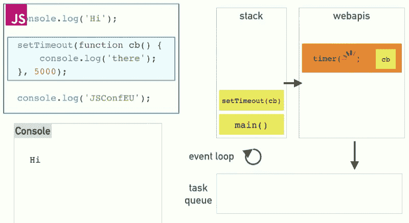
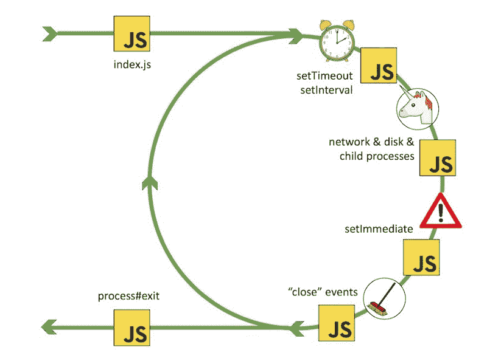

# Node.js:它是什么，何时以及如何使用它，以及为什么应该使用它

> 原文：<https://www.freecodecamp.org/news/node-js-what-when-where-why-how-ab8424886e2/>

巴勃罗·雷根

你可能以前读过这些句子…

> Node.js 是基于 Chrome 的 V8 JavaScript 引擎构建的 JavaScript 运行时

> Node.js 使用事件驱动的异步非阻塞 I/O 模型

> Node.js 在单线程事件循环上运行

…我们不知道这一切意味着什么。希望在本文结束时，您能更好地理解这些术语，以及什么是 Node，它是如何工作的，为什么以及何时使用它是个好主意。

让我们先来看一下术语。

#### 输入输出

**I/O** 是输入/输出的缩写，主要指程序与系统磁盘和网络的交互。I/O 操作的示例包括从磁盘读取数据/向磁盘写入数据、发出 HTTP 请求以及与数据库对话。与访问内存(RAM)或在 CPU 上工作相比，它们非常慢。

#### **同步与异步**

[**同步**](https://stackoverflow.com/questions/10570246/what-is-non-blocking-or-asynchronous-i-o-in-node-js) (或 sync)执行通常是指代码按顺序执行。在同步编程中，程序是逐行执行的，一次一行。每次调用一个函数时，程序执行会一直等到该函数返回，然后继续执行下一行代码。

**异步**(或称异步)执行是指不按照代码中出现的顺序运行的执行。在异步编程中，程序不会等待任务完成，而是继续下一个任务。

在以下示例中，同步操作导致警报按顺序触发。在异步操作中，虽然 alert(2)看起来是第二个执行的，但事实并非如此。

```
// Synchronous: 1,2,3
alert(1);
alert(2);
alert(3);

// Asynchronous: 1,3,2
alert(1);
setTimeout(() => alert(2), 0);
alert(3);
```

异步操作通常与 I/O 相关，尽管`setTimeout`是一个非 I/O 但仍然是异步的例子。一般来说，任何与计算相关的都是同步的，任何与输入/输出/定时相关的都是异步的。异步完成 I/O 操作的原因是它们非常慢，否则会阻塞代码的进一步执行。

#### **阻塞与非阻塞**

**阻塞**指的是阻塞进一步执行直到该操作结束的操作，而**非阻塞**指的是不阻塞执行的代码。或者正如 [Node.js](https://nodejs.org/en/docs/guides/blocking-vs-non-blocking/#blocking) docs 所说，阻塞是指 Node.js 进程中额外 JavaScript 的执行必须等到一个非 JavaScript 操作完成。

阻塞方法同步执行，而非阻塞方法异步执行。

```
// Blocking
const fs = require('fs');
const data = fs.readFileSync('/file.md'); // blocks here until file is read
console.log(data);
moreWork(); // will run after console.log

// Non-blocking
const fs = require('fs');
fs.readFile('/file.md', (err, data) => {
  if (err) throw err;
  console.log(data);
});
moreWork(); // will run before console.log
```

在上面的第一个例子中，`console.log`将在`moreWork()`之前被调用。在第二个例子中，`fs.readFile()`是非阻塞的，所以 JavaScript 可以继续执行，而`moreWork()`将首先被调用。

在 Node 中，非阻塞主要指 I/O 操作，由于占用大量 CPU 而不是等待非 JavaScript 操作(如 I/O)而表现不佳的 JavaScript 通常不被称为阻塞。

Node.js 标准库中的所有 I/O 方法都提供非阻塞的异步版本，并接受回调函数。一些方法也有阻塞的对应物，它们的名字以 Sync 结尾。

非阻塞 I/O 操作允许单个进程同时服务多个请求。该进程不再被阻塞并等待 I/O 操作完成，而是将 I/O 操作委托给系统，以便该进程可以执行下一段代码。非阻塞 I/O 操作提供了一个回调函数，当操作完成时调用该函数。

#### **回调**

**回调**是作为参数传递给另一个函数的函数，然后可以在外部函数内部调用(回调)该函数，以便在方便的时候完成某种动作。调用可以是即时的(同步回调)，也可以是稍后发生的(异步回调)。

```
// Sync callback
function greetings(callback) {
  callback();
}
greetings(() => { console.log('Hi'); });
moreWork(); // will run after console.log

// Async callback
const fs = require('fs');
fs.readFile('/file.md', function callback(err, data) { // fs.readFile is an async method provided by Node
  if (err) throw err;
  console.log(data);
});
moreWork(); // will run before console.log 
```

在第一个例子中，回调函数在外部问候函数中被立即调用，并在`moreWork()`继续之前记录到控制台。

在第二个例子中，fs . readfile(Node 提供的一个异步方法)读取文件，当它完成时，调用回调函数，返回一个错误或文件内容。同时，程序可以继续执行代码。

当事件发生或任务完成时，可以调用异步回调。它通过允许其他代码同时执行来防止阻塞。

与从上到下顺序读取代码不同的是，异步程序可以根据像 http 请求或文件系统读取这样的早期功能发生的顺序和速度，在不同的时间执行不同的功能。当您不知道某个异步操作何时完成时，可以使用它们。

你应该避免“ [**回调地狱**](http://callbackhell.com/) ”，这是一种回调嵌套在其他几层深的回调中的情况，使得代码难以理解、维护和调试。

#### 事件和事件驱动的编程

**事件**是由用户或系统产生的动作，如点击、完成文件下载或硬件或软件错误。

**事件驱动编程**是一种编程范式，其中程序的流程由事件决定。事件驱动的程序执行动作来响应事件。当一个事件发生时，它触发一个回调函数。

现在，让我们试着理解 Node，看看所有这些与它有什么关系。

### Node.js:它是什么，为什么被创建，它是如何工作的？

简单来说， **Node.js** 是一个执行服务器端 JavaScript 程序的平台，这些程序可以与网络和文件系统之类的 I/O 源进行通信。

当 Ryan Dahl 在 2009 年创建 Node 时，他认为 I/O 处理不正确，由于同步编程而阻塞了整个过程。

传统的 web 服务技术使用线程模型，即每个请求一个线程。因为在 I/O 操作中，请求花费大部分时间等待它完成，所以密集的 I/O 场景需要链接到这些线程的大量未使用的资源(例如内存)。因此，服务器的“每个请求一个线程”模型不能很好地扩展。

Dahl 认为软件应该能够执行多任务，并建议消除等待 I/O 结果返回所花费的时间。他说，处理多个并发连接的正确方法不是线程模型，而是单线程、事件循环和非阻塞 I/o。例如，当您对数据库进行查询时，您不是等待响应，而是给它一个回调，以便您的执行可以运行该语句并继续做其他事情。当结果返回时，您可以执行回调。

[**事件循环**](https://nodejs.org/de/docs/guides/event-loop-timers-and-nexttick/#what-is-the-event-loop) 允许 Node.js 执行非阻塞 I/O 操作，尽管 JavaScript 是单线程的。这个循环与 JavaScript 代码运行在同一个线程上，从代码中抓取一个任务并执行它。如果任务是异步或 I/O 操作，则循环将其卸载到系统内核，就像在新连接到服务器的情况下，或者卸载到线程池，就像文件系统相关的操作。然后，循环获取下一个任务并执行它。

由于大多数现代内核都是多线程的，它们可以处理后台执行的多个操作。当这些操作中的一个完成时(这是一个事件)，内核告诉 Node.js，以便适当的回调(依赖于操作完成的那个)可以被添加到轮询队列中，以便最终被执行。

节点跟踪未完成的异步操作，事件循环保持循环以检查它们是否完成，直到它们全部完成。


The Unicorn Velociraptor Library provides support for asynchronous I/O based on event loops

为了适应单线程事件循环，Node.js 使用了 [**libuv**](https://libuv.org/) 库，该库又使用了一个固定大小的**线程池**，该线程池并行处理一些非阻塞异步 I/O 操作的执行。主线程调用函数将任务发送到共享任务队列，线程池中的线程将获取并执行这些任务。

固有的非阻塞系统功能(如网络)转换为内核端非阻塞套接字，而固有的阻塞系统功能(如文件 I/O)以阻塞方式运行在自己的线程上。当线程池中的一个线程完成一个任务时，它会通知主线程，主线程会唤醒并执行注册的回调。



Image from Philip Roberts’ presentation at JSConf EU: [What the heck is the event loop anyway?](https://www.youtube.com/watch?v=8aGhZQkoFbQ)

上图摘自菲利普·罗伯茨在 JSConf EU 上的演讲:[到底什么是事件循环？](https://www.youtube.com/watch?v=8aGhZQkoFbQ)我建议观看完整视频，以便对事件循环的工作原理有一个较高的认识。

该图解释了事件循环如何与浏览器一起工作，但它看起来与 Node 基本相同。我们将拥有节点 API，而不是 web APIs。

根据介绍，调用堆栈(又名执行堆栈或“堆栈”)是一种数据结构，它记录了我们在程序中的位置。如果我们进入一个函数，我们把一些东西放到堆栈上。如果我们从一个函数返回，我们把它从栈顶弹出。

当我们运行图中的代码时，它是这样处理的:

1.  将`main()`压入堆栈(文件本身)
2.  将`console.log(‘Hi’);`推送到堆栈上，它立即执行将“Hi”记录到控制台并弹出堆栈
3.  将`setTimeout(cb, 5000)`推到堆栈上。setTimeout 是浏览器提供的一个 API(在后端它将是一个节点 API)。当用回调函数和延迟参数调用 setTimeout 时，浏览器用延迟时间启动一个计时器
4.  `setTimeout`调用完成并弹出堆栈
5.  将`console.log(‘JSConfEU’);`推送到堆栈上，它立即执行将“JSConfEU”记录到控制台并弹出堆栈
6.  从堆栈中弹出
7.  5000 毫秒后，API 计时器完成，回调被移动到任务队列
8.  事件循环检查堆栈是否为空，因为 JavaScript 是单线程的，一次只能做一件事(setTimeout 不是保证，而是最小执行时间)。如果堆栈是空的，它就取队列中的第一个东西，并把它推到堆栈上。因此，循环将回调推到堆栈上
9.  回调被执行，记录到控制台并弹出堆栈。我们结束了

如果你想更深入地了解 Node.js、libuv、事件循环和线程池如何工作的细节，我建议查看参考资料最后一节，特别是[这个](https://www.youtube.com/watch?v=cCOL7MC4Pl0)、[这个](https://www.youtube.com/watch?v=PNa9OMajw9w)和[这个](https://www.youtube.com/watch?v=sGTRmPiXD4Y)以及[节点文档](https://nodejs.org/de/docs/guides/event-loop-timers-and-nexttick/#what-is-the-event-loop)。



The Event Loop. Image from Bert Belder’s presentation: [Everything You Need to Know About Node.js Event Loop](https://www.youtube.com/watch?v=PNa9OMajw9w)

### Node.js: w **hy 以及在哪里使用？**

由于 Node 中几乎没有函数直接执行 I/O，所以进程从不阻塞(I/O 操作在系统中被卸载并异步执行)，这使得它成为开发高可伸缩系统的一个好选择。

由于其事件驱动的单线程事件循环和异步非阻塞 I/O 模型，Node.js 在需要速度和可扩展性以及大量并发连接的密集型 I/O 应用程序上表现最佳，如视频和音频流、实时应用程序、实时聊天、游戏应用程序、协作工具或股票交易软件。

Node.js 可能不是 CPU 密集型操作的正确选择。相反，传统的线程模型可能会执行得更好。

### **npm**


npm 是 Node.js 的默认包管理器，它在 Node.js 安装时被安装到系统中。它可以管理特定项目的本地依赖包，以及全局安装的 JavaScript 工具。

www.npmjs.com 拥有数以千计的免费库供你下载并在你的程序中使用，以使开发更快更有效。然而，由于任何人都可以创建库，并且没有提交的审查过程，所以你必须小心低质量、不安全或恶意的库。npm 依靠用户报告来删除违反策略的包，并且为了帮助您做出决定，它包括像下载数量和依赖包数量这样的统计数据。

### **如何运行 Node.js 中的代码**

如果你的电脑上还没有 Node，就从安装 Node 开始。最简单的方法是访问[nodejs.org](https://nodejs.org)，点击下载。除非您希望或需要获得最新的功能，否则请下载适用于您的操作系统的 LTS(长期支持)版本。

您从计算机的终端运行节点应用程序。例如，创建一个文件“app.js ”,并在其中添加`console.log(‘Hi’);`。在您的终端上，将目录切换到该文件所属的文件夹，并运行`node app.js`。它会将“嗨”记录到控制台。？

### 参考

这里是我在写这篇文章的时候回顾的一些有趣的资源。

Node.js 的作者介绍:

*   Ryan Dahl 在 JSConf 2009 上的原始 Node.js 演示文稿
*   Ryan Dahl 在 JSConf EU 2018 上发表的关于 Node.js 的 10 件令我遗憾的事情

节点、事件循环和 libuv 库演示:

*   事件循环到底是什么？菲利普·罗伯茨在欧盟联合安全会议上
*   Jeff Kunkle 解释的
*   Jake Archibald 在 JSConf Asia 2018 上发表的文章
*   关于 Node.js 事件循环你需要知道的一切
*   Saul Ibarra Coretge 在 NodeConf EU 2016 上对 libuv 的深入探讨

节点文档:

*   [关于 Node.js](https://nodejs.org/en/about/)
*   [node . js 事件循环，定时器，以及 process.nextTick()](https://nodejs.org/de/docs/guides/event-loop-timers-and-nexttick/)
*   [阻塞与非阻塞的概述](https://nodejs.org/en/docs/guides/blocking-vs-non-blocking/)

其他资源:

*   马克斯·奥格登的《节点艺术》
*   马克斯·奥格登的《回拨地狱》
*   [node . js 中的非阻塞或异步 I/O 是什么？](https://stackoverflow.com/questions/10570246/what-is-non-blocking-or-asynchronous-i-o-in-node-js)堆栈溢出时
*   维基百科上的[事件驱动编程](https://en.wikipedia.org/wiki/Event-driven_programming)
*   维基百科上的 [Node.js](https://en.wikipedia.org/wiki/Node.js)
*   维基百科上的[线程](https://en.wikipedia.org/wiki/Thread_(computing))
*   [libuv](https://libuv.org/)

感谢阅读。