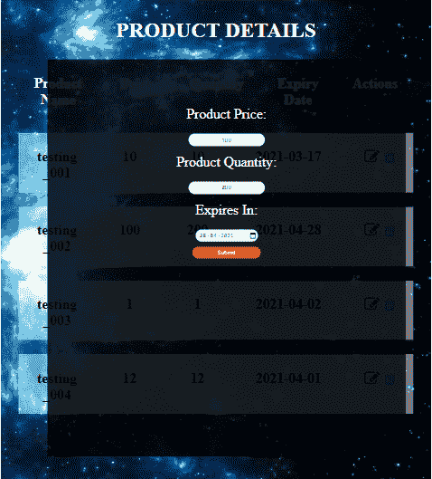
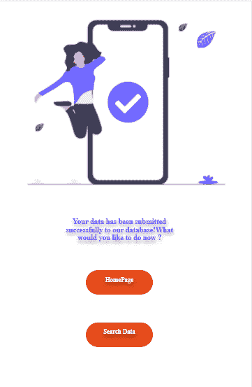

# Node.js 和 Cloud Firestore 教程——如何构建家庭库存系统

> 原文：<https://www.freecodecamp.org/news/nodejs-and-cloud-firestore-tutorial-build-a-home-inventory-system/>

在本文中，您将练习 JavaScript 技能，同时通过创建自己的家庭库存系统来简化家务。

我经常发现很难跟踪我经常购买的普通家庭用品，如食品、香料、药品等。当我从橱柜深处发现一包被遗忘已久的薯片时，往好了说是令人讨厌，往坏了说是令人沮丧。

厌倦了手动跟踪，我决定做自己的家庭库存系统。这个系统可以让我:

*   为每个项目创建记录，以及价格和数量等有用信息
*   根据不同的标准(如价格、数量和截止日期)过滤项目
*   根据给定标准对项目进行排序
*   删除不再使用的项目
*   编辑现有记录

在本教程中，我将带你了解我是如何建立这个系统的。让我们开始吧。

## 如何定义数据库模式

Cloud Firestore 是由 Firebase 提供的云托管、可扩展、灵活的 NoSQL 数据库。数据存储在文档中，文档被分组到集合中，类似于将多页信息存储在一个文件中，并将多个文件放在一个抽屉中。

Firestore 提供了强大的查询选项，从简单的排序到增加查询结果的限制。

出于我们的目的，我们将为特定的类别定义一个集合。每个文档将对应于该类别中的一个产品，文档的内容将是每个信息域及其数据值。例如:

```
"Snacks" : {
	"Food_Item_1" : { "Price":P1, "Quantity":Q1, "ExpiryDate":D1},
	"Food_Item_2" : { "Price":P2, "Quantity":Q2, "ExpiryDate":D2},	
    .
    .
	"Food_Item_N" : { "Price":PN, "Quantity":QN, "ExpiryDate":DN}
}
```

我们的集合名称是零食，我们的文档名称是 Food_Item_1、Food_Item_2 等等，每个文档的内容是价格、数量和有效期。

## 如何获得用户的输入

让我们首先创建一些路由和视图，并导入所需的节点模块。

```
const express = require("express")
const app = express()
//Middleware to parse data in body portion of incoming request, like POST //request
const body_parser = require("body-parser")

objForUrlencoded = body_parser.urlencoded({extended:false})

app.set("view engine", "ejs")
app.use("/assets", express.static("assets"))
app.use(objForUrlencoded)

app.get("/", (req,res,next)=>{//Show the homepage
	res.render("homepage")
})
app.get("/save_data.ejs", (req,res,next)=>{//Show the form for saving data
	res.render("save_data")
})
app.get("/search_data.ejs", (req,res,next)=>{//Show the form for searching data
	res.render("search_data")
})

app.listen(1337, ()=>{ console.log("Listening on port 1337")})
```

这里我们定义了一个简单的 Express 应用程序，它监听端口 1337，并按照 HTTP 方法(GET，POST)和 URL 的指定呈现页面。我们为用户输入创建了一个简单的表单。

请记住，每个 HTML 输入字段都必须有一个 name 属性，该属性稍后将作为访问输入字段的相应值的键。例如:

```
<input type="text" name="productName">
<br/><br/>
<label for="productCategory">Product Category:</label>
<select name="productCategory">
	<option value="Snacks">Snacks</option>
	<option value="Biscuits">Biscuits</option>
     <option value="Spices">Spices</option>
</select>
<br/><br/>
<label for="price">Price:</label>
  <input type="number" name="price">
<br/><br/>
<label for="quantity">Quantity:</label>
  <input type="number" name="quantity">
```

稍后，我们可以将产品的名称作为键“productName”的值来访问，将产品的类别作为键“productCategory”的值来访问，等等。

## 如何将数据保存到数据库


Simple UI of the home inventory system

好吧，现在我们已经得到了一些数据，让我们保存到 Firestore！这包括设置一个服务帐户，获得一个密钥，并使用它来初始化 Credentials 对象，以便使用 Firebase Admin API 将数据库连接到我们的应用程序。

关于这个过程的更深入的解释，你可以查看他们的[文档](https://firebase.google.com/docs/database/admin/start)。

```
/*Set up Admin API for Firebase*/
const admin = require('firebase-admin');
//Define path to secret key generated for service account
const serviceAccount = require(PATH TO KEY);
//Initialize the app
admin.initializeApp({
  credential: admin.credential.cert(serviceAccount)
});
```

这里，我们使用了一个 JSON 文件的密钥路径。你可以通过定义环境变量来做同样的事情，如这里的[所描述的](https://firebase.google.com/docs/admin/setup#prerequisites)。

接下来，我们使用 set 方法将数据保存到 Firestore，如下所示:

```
let db = admin.firestore()

//Depending on your schema, save data by specifying the collection name, //document name and data contents as follows
await db.collection(key).doc(prod).set(save_to_database[key][prod])
```

在浏览 Firestore 文档时，您应该熟悉以下几个术语，尤其是 [API 参考](https://firebase.google.com/docs/reference/js/firebase.firestore.CollectionReference):

*   **collection reference**–该对象用于添加文档、获取文档引用和查询文档。
*   **document reference**–这是指数据库中的一个文档位置，用于读/写/听该位置。
*   **query snapshot**–包含查询结果的对象
*   **文档快照**–包含从文档中读取的数据。您可以使用。data()方法。

## 如何查询数据


Simple UI for searching/filtering the data

一旦 Firestore 装满了数据，我们就可以对它执行各种复杂的查询。

比方说，我们想知道我们有多少个“零食”类别的商品。每当我们执行一个查询时，我们都会得到一个 QuerySnapshot，它是一个文档快照列表。

```
//Get all docs under the given category
helper_func_get_data = async (category, db) => {
	const data = await db.collection(category).get()
	if(data.empty)
		{
			return -1
		}
	else return data

}
```

我们可以使用。空属性，并使用 forEach 函数迭代所有接收到的文档，如下所示:

```
data.forEach((doc) => { Product_Info[doc.id] = doc.data()})

//Here data is a QuerySnapshot and Product_Info is a JavaScript object 
//with document names as keys and their corresponding values. We can pass this 
//object as an argument in render() method to display the received contents
```

以下是计算所有零食总价的方法:

```
total_agg = 0
data.forEach((doc) => { total_agg+=doc.data()[aggregate_over]

//aggregate_over is a variable which defines criteria to sum over like price //or quantity
```

要根据价格对所有零食进行排序，请执行以下操作:

```
const data = await db.collection(category).orderBy(filter_criteria).get() 
```

其中 filter_criteria =“价格”。

## 如何从数据库中删除项目

随着时间的推移，我们日常消费的家居用品会耗尽，我们需要从数据库中删除它们以保持一致性。

在有可行的机制将冰箱连接到云 Firestore 之前，我们必须手动删除我们吃过的零食记录。

```
firebase_delete_data = async (category, response, product_name) => {
	try
	{ 
	  let db = admin.firestore()
	  await db.collection(category).doc(product_name).delete()
	  response.render("search_data")
	   }
	catch(err)
	{console.log(err)}
}
```

## 如何更新数据库中的项目

```
firebase_update_data = async (category, response, reqbody) => {
	try
	{
		let db = admin.firestore()
		await db.collection(category).doc(reqbody["productName"]).update({"Price": parseFloat(reqbody["price"]), "Quantity": parseFloat(reqbody["quantity"]), "ExpiryDate": reqbody["expiryDate"]})
		response.render("successpage")
	}
	catch(err)
	{
		console.log(err)
		response.render("failurepage")
	}
}
```

我们希望拥有的另一个常见功能是更新数据库中的现有记录。



Simple UI for updating product details

一旦我们的功能实现，我们将从 Express 应用程序中导出要使用的功能，如下所示:

```
module.exports = {
	"firebase_save_data" : firebase_save_data,
	"firebase_retrieve_data": firebase_retrieve_data,
	"firebase_delete_data": firebase_delete_data,
	"firebase_update_data": firebase_update_data
	}
```

并导入所需的模块，如下所示:

```
const firebase_functions = require("./firebase_CRUD_custom_code/firebase_functions.js")
```

然后我们可以根据需要使用我们的函数。例如，如果我们想要更新任何项目，我们可以执行以下操作:

```
app.post("/update", objForUrlencoded, (req,res) => {

	firebase_functions.firebase_update_data(req.body["category"], res, req.body)
})
```

## 结束了！



最后，在本文中，我们学习了 Cloud Firestore 的数据模型、如何保存数据、检索数据的机制、如何使用 QuerySnapshots、在不同的过滤器上排序数据、删除项目以及通过我们的 Express 应用程序更新项目。

通过这种方式，我们可以自动跟踪家庭中经常使用的产品。我们还可以查看哪些产品缺货等等，让我们忙碌的生活更加轻松。

我希望你喜欢读这篇文章，就像我喜欢写它一样。感谢您的参与，祝您有美好的一天，编码愉快！