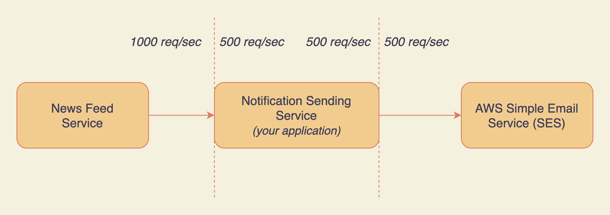
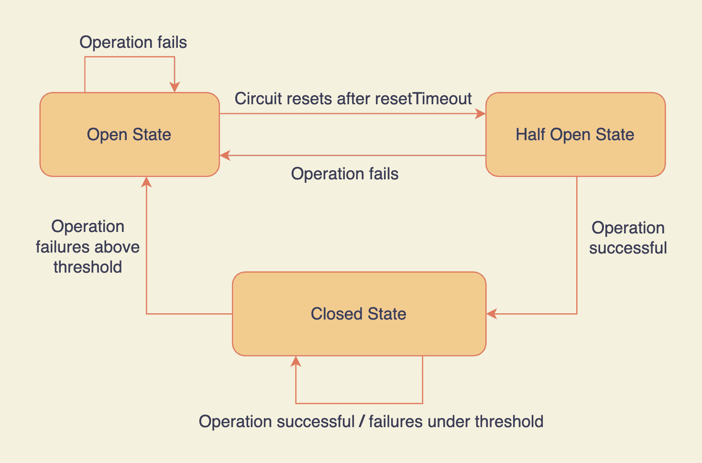
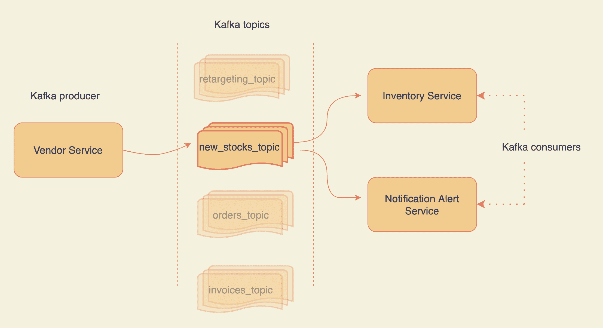
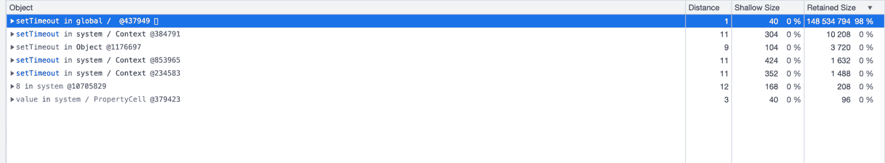
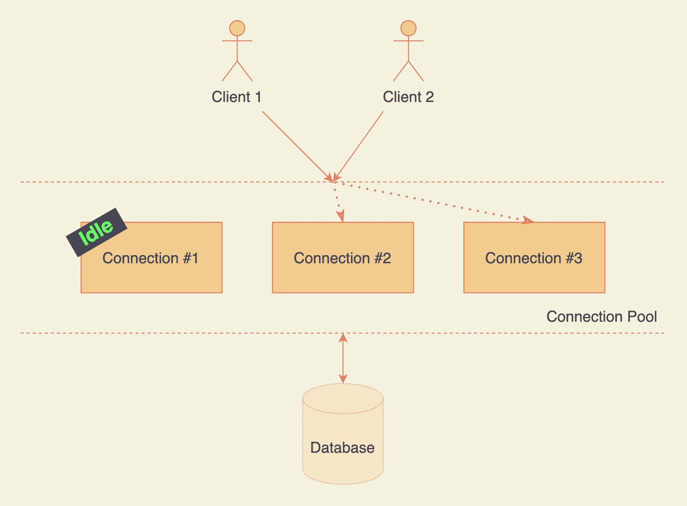
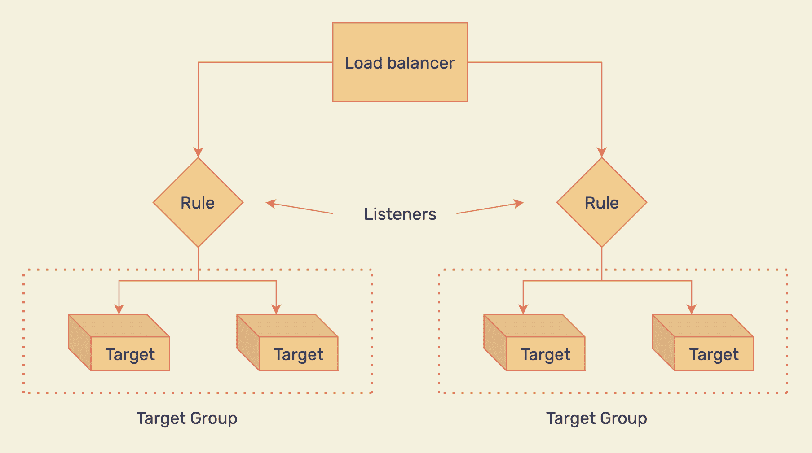

# 扩展 Node.js REST APIs 的最佳实践

> 原文：<https://www.freecodecamp.org/news/nodejs-api-best-practices-for-scaling/>

可伸缩性不仅仅是使用集群模式。在本教程中，我们将探索使 Node.js API 可伸缩的 10 种方法。

在做一个项目时，我们经常会得到一些关于如何以更好的方式做某事的真正的金块。我们开始回顾性地学习，然后我们完全准备好在下一次运用它。

但这种情况有多常见呢？有时候我甚至不记得我昨天做了什么。所以写了这篇文章。

这是我试图记录一些不经常被提及的 Node.js 可伸缩性的最佳实践。

您可以在 Node.js 项目的任何阶段采用这些实践。它不一定是最后一分钟的补丁。

也就是说，下面是我们将在本文中涉及的内容:

1.  🚦使用节流
2.  🐢优化您的数据库查询
3.  ䷪用断路器快速失败
4.  🔍记录您的检查点
5.  🌠通过 HTTP 请求使用 Kafka
6.  🪝小心内存泄漏
7.  🐇使用缓存
8.  🎏使用连接池
9.  🕋无缝纵向扩展
10.  💎OpenAPI 兼容文档

## 使用节流

节流允许您限制对服务的访问，以防止它们被过多的请求淹没。它有一些明显的好处——无论是大量用户还是拒绝服务攻击，你都可以保护你的应用程序。

实现节流机制的常见地方是输入和输出的速率不匹配的地方。特别是当入站流量超过服务能够(或想要)处理的流量时。

让我们用形象化的方法来理解。



Your application is throttling requests from News Feed Service

在您的应用程序和新闻订阅服务之间的第一个结合点有节流:

1.  *新闻订阅服务(NFS)* 订阅您发送通知的应用程序。
2.  它每秒钟向您的应用程序发送 1000 个请求。
3.  根据 NFS 订阅的计费计划，您的应用程序每秒仅处理 500 个请求。
4.  前 500 个请求会发送通知。

现在需要注意的是，NFS 超过 500 个请求/秒配额的所有请求都应该失败，并且必须由 NFS 重试。

当你可以将额外的请求排队时，为什么要拒绝它们？有几个原因:

1.  接受所有请求将导致您的应用程序开始累积这些请求。这将成为订阅您的应用程序的所有客户端(包括 NFS)的单点故障(由于 RAM/磁盘耗尽)。
2.  你不应该接受超出你的客户(在这种情况下，NFS)的订阅计划范围的请求。

对于应用程序级别的速率限制，您可以为您的 Express.js API 使用 [express-rate-limit](https://www.npmjs.com/package/express-rate-limit) 中间件。对于网络级节流，可以找到类似 [WAF](https://aws.amazon.com/waf/) 这样的解决方案。

如果您使用发布-订阅机制，您也可以限制您的消费者或订阅者。例如，通过设置 [maxBytes 选项](https://kafka.js.org/docs/consuming#a-name-options-a-options)，您可以选择在消费 Kafka 主题时只消费有限字节的数据。

## 优化您的数据库查询

有时候查询数据库是唯一的选择。您可能没有缓存数据，或者数据可能已经过时。

当这种情况发生时，请确保您的数据库为此做好了准备。拥有足够的内存和磁盘 IOPS 是良好的第一步。

其次，尽可能优化你的查询。首先，这里有几件事会让你走上正确的道路:

1.  查询时尽量使用索引字段。不要为了获得最佳性能而过度索引您的表。[指数有其成本](https://www.mongodb.com/blog/post/performance-best-practices-indexing#:~:text=Eliminate%20Unnecessary%20Indexes)。
2.  对于删除，坚持软删除。如果永久删除是必要的，推迟它。([有趣的故事](https://httpie.io/blog/stardust))
3.  读取数据时，仅使用投影提取所需字段。如果可能，去掉不必要的元数据和方法(例如，Mongoose 有 [lean](https://mongoosejs.com/docs/tutorials/lean.html) )。
4.  尝试将数据库性能与用户体验分离。如果数据库上的 CRUD 可以在后台发生(即非阻塞)，那么就去做。不要让用户等待。
5.  使用更新查询直接更新所需的字段。不要获取文档，更新字段，并将整个文档保存回数据库。它有网络和数据库开销。

## 用断路器快速失效

假设您的 Node.js 应用程序上出现突发流量，并且完成请求所需的外部服务之一出现故障。您是否希望此后的每个请求都进入死胡同？肯定不是。我们不想在注定要失败的请求上浪费时间和资源。

这就是断路器的全部概念。**过早失败。** **败得快**。

例如，如果 100 个请求中有 50 个失败，那么在接下来的 X 秒内，它不允许对该外部服务的任何请求。它防止必然会失败的触发请求。

一旦电路复位，它就允许请求通过。如果他们再次失败，电路中断，循环重复。



Node.js Opposum circuit breaker states

要了解更多关于如何向 Node.js 应用程序添加断路器的信息，请查看 [Opposum](https://github.com/nodeshift/opossum) 。你可以在这里阅读更多关于断路器[的内容。](https://en.wikipedia.org/wiki/Circuit_breaker_design_pattern)

## 记录您的检查点

一个好的日志记录设置可以让您快速发现错误。您可以创建可视化效果来了解您的应用程序的行为，设置提醒，并有效地进行调试。

你可以查看一下 [ELK 栈](https://www.elastic.co/what-is/elk-stack)来设置一个好的日志和警报管道。

虽然日志记录是一个重要的工具，但是很容易做过头。如果你开始记录所有的事情，你可能会耗尽你的磁盘 IOPS，导致你的应用程序受到影响。

一个好的经验法则是只记录检查点。

检查点可以是:

1.  请求，当它们进入应用程序中的主控制流时，以及在它们被验证和清理之后。
2.  与外部服务/SDK/API 交互时的请求和响应。
3.  对这一请求的最终回应。
4.  catch 处理程序的有用的错误消息(带有错误消息的默认设置)。

**PS:** 如果一个请求在生命周期中经历了多个服务，那么您可以在日志中传递一个惟一的 ID 来捕获跨所有服务的特定请求。

## 通过 HTTP 请求使用 Kafka

虽然 HTTP 有其使用案例，但很容易做过头。避免在不必要的地方使用 HTTP 请求。

让我们借助一个例子来理解这一点。



Overview of Kafka pub-sub using topics

假设你正在开发一个像亚马逊一样的产品，有两个服务:

1.  供应商服务
2.  库存服务

每当您从供应商服务收到新股票时，您会将股票详细信息推送到一个 [Kafka](https://kafka.apache.org/intro) 主题。库存服务监听该主题并更新数据库以确认新的库存。

请注意，您将新的股票数据推入管道，然后继续前进。它由库存服务以自己的速度使用。Kafka 允许你分离服务。

现在，如果您的库存服务停止，会发生什么？HTTP 请求并不简单。而在卡夫卡的情况下，你可以重放想要的信息(例如使用 [kcat](https://github.com/edenhill/kcat) )。**有了卡夫卡，消费后不会丢失数据。**

当一件商品回到库存时，您可能希望向希望将其列入清单的用户发送通知。为此，您的通知服务可以侦听与清单服务相同的主题。这样，**单个消息总线在不同的地方被消耗，而没有** **HTTP 开销**。

KafkaJS 的[入门页面](https://kafka.js.org/docs/getting-started)分享了确切的代码片段，帮助您开始 Node.js 应用程序的基本设置。我强烈推荐去看看，因为有很多值得探索的地方。

## 注意内存泄漏

如果你不写内存安全的代码，不经常[分析](https://nodejs.org/en/docs/guides/simple-profiling/)你的应用程序，你可能会以一个崩溃的服务器而告终。

您不希望您的分析结果看起来像这样:



setTimeout retaining 98% memory after execution is over

首先，我建议如下:

1.  使用`--inspect`标志运行 Node.js API。
2.  在你的 Chrome 浏览器中打开`chrome://inspect/#devices`。
3.  点击【检查】>`Memory`选项卡>>`Allocation instrumentation on timeline`。
4.  在你的应用上执行一些操作。您可以在 macOS 上使用 apache bench 来启动多个请求。在你的终端中运行`curl cheat.sh/ab`来学习如何使用它。
5.  停止记录并分析记忆保持器。

如果您发现任何大块的保留内存，尝试将其最小化。关于这个主题有很多资源。从谷歌“如何防止 Node.js 中的内存泄漏”开始。

分析 Node.js 应用程序并寻找内存利用模式应该是经常性的做法。让我们把“剖析驱动重构”(PDR)变成一件事？

## 使用缓存来防止过多的数据库查找

目标是不要让应用程序收到的每个请求都命中数据库。将结果存储在缓存中可以减少数据库的负载并提高性能。

使用缓存时有两种策略。

**直写**缓存确保当写操作发生时，数据被插入到数据库和缓存中。这保持了缓存的相关性，从而提高了性能。不利方面？昂贵的缓存，因为不常用的数据也存储在缓存中。

而在**延迟加载**中，数据仅在第一次读取时写入缓存。第一个请求提供来自数据库的数据，但是后续的请求使用缓存。它的成本较低，但对第一个请求的响应时间较长。

要决定缓存数据的 TTL(或生存时间),问问自己:

1.  底层数据更改的频率如何？
2.  将过期数据返回给最终用户的风险有多大？

如果可以的话，**有更多的 TTL 会帮助你有更好的性能**。

重要的是，**给你的 TTLs** 加上一个微小的增量。如果您的应用程序收到大量突发流量，并且您的所有缓存数据都立即过期，这可能会导致数据库无法承受的负载，从而影响用户体验。

```
final TTL = estimated value of TTL + small random delta
```

calculation of TTL

有许多策略可以执行[缓存回收](https://redis.io/docs/manual/eviction/)。但是保留默认设置是一种有效且可接受的方法。

## 使用连接池

打开到数据库的独立连接成本很高。它涉及 TCP 握手、SSL、认证和授权检查等等。

相反，您可以利用连接池。



Database connection pool

一个连接池在任何给定时间保存多个连接。无论何时需要，池管理器都会分配任何可用/空闲的连接。你可以跳过全新关系的冷启动阶段。

那么，为什么不最大化池中的连接数呢？因为它高度依赖于您的硬件资源。如果你忽略它，性能会付出巨大的代价。

连接数越多，每个连接的 RAM 就越少，利用 RAM 的查询(例如 sort)就越慢。同样的原理也适用于你的磁盘和 CPU。随着每一个新连接的出现，你在这些连接上分散了你的资源。

您可以调整连接数，直到它符合您的需要。首先，你可以从[这里](https://www.cybertec-postgresql.com/en/tuning-max_connections-in-postgresql/)得到一个你需要的大小的估计。

在这里阅读关于 MongoDB 连接池[的内容。对于 PostgreSQL，可以使用`node-postgres`包。它内置了对](https://www.mongodb.com/docs/manual/administration/connection-pool-overview/)[连接池](https://node-postgres.com/features/pooling)的支持。

## 无缝纵向扩展

当您的应用程序的用户群开始增长，并且您已经达到垂直扩展的上限时，您会怎么做？你水平缩放。

> 垂直扩展意味着增加节点的资源(CPU、内存等。)而水平扩展需要添加更多节点来平衡每个节点上的负载。

如果您使用 AWS，您可以利用自动扩展组(ASG ),它根据预定义的规则水平扩展服务器的数量(例如，当 CPU 利用率超过 50%时)。

在可预测的流量模式下(例如在世界杯决赛期间的流媒体服务)，您甚至可以使用[预定动作](https://docs.aws.amazon.com/autoscaling/application/userguide/examples-scheduled-actions.html)预先计划扩大和缩小流量。

一旦你有了 ASG，在前面添加一个负载平衡器将确保流量基于一个选择的策略被路由到所有的实例(例如像[循环](https://en.wikipedia.org/wiki/Round-robin_scheduling))。



Load balancing multiple targets based on predefined rules

**PS:** 估计您的单个服务器可以处理的请求(CPU、内存、磁盘等等)并至少多分配 30%总是一个好主意。

## OpenAPI 兼容文档

这可能不会直接影响您扩展 Node.js 应用程序的能力，但是我必须将这一点包括在列表中。如果你曾经做过 API 集成，你就知道了。

在迈出第一步之前，了解关于 API 的一切是至关重要的。它使得设计的集成、迭代和推理变得容易。更不用说发展速度的提高了。

确保**为 Node.js API** 创建 OpenAPI 规范(OAS)。

它允许您以行业标准的方式创建 API 文档。它是真理的唯一来源。如果定义得当，它会使与 API 的交互更加高效。

我在这里创建并发布了一个示例 API 文档[。你甚至可以使用](https://app.swaggerhub.com/apis/Rishabh570/test-API/0.1) [swagger inspector](https://swagger.io/tools/swagger-inspector/) 来检查任何 API。

你可以在 [Swagger Hub 仪表板](https://app.swaggerhub.com/home)中找到你所有的 API 文档并创建新的文档。

## 现在你走吧，上尉！

我们已经了解了十个鲜为人知的最佳实践来为 Node.js 的扩展做准备，以及如何使用其中的每一个来迈出第一步。

现在轮到您检查清单并探索 Node.js 应用程序中缺少的内容了。