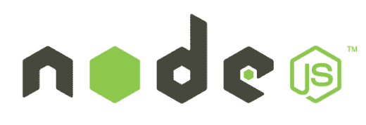
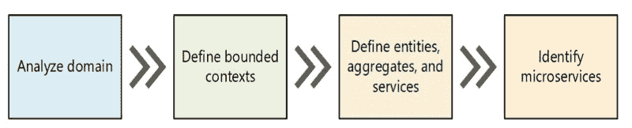

# NodeJS:生产的最佳实践

> 原文：<https://www.freecodecamp.org/news/nodejs-best-practices-for-production-5b173983d14b/>

作者:索拉博·拉亚克瓦尔

# node.js 生产最佳实践

这是一次尝试，列出了在 NodeJs 上开发和部署的最重要的实践。

我自己也研究这项技术有一段时间了。我意识到它在发展过程中的巨大潜力和地位。面对 Python 和 Golang 等语言的激烈竞争，NodeJS 已经在适当的用例中证明了它的实用性。

在我深入研究最佳实践之前？，我想简单介绍一下什么是微服务模式。然后在此基础上继续对话。

#### 那么，什么是微服务呢？

微服务——也称为微服务架构——是一种架构风格，它将应用程序构建为一组服务，这些服务:

*   高度可维护和可测试
*   松散耦合
*   可独立部署
*   围绕业务能力组织。

微服务架构支持大型复杂应用的持续交付/部署。它还使组织能够发展其技术堆栈。

#### 如何决定是否需要微服务

最初，当您刚刚开始处理您的 MVP 时，您可能不需要使用微服务。Y 轴缩放可能不是你现在的议程。但是当产品开始成熟时，有时过早地需要处理扩展问题，分解成功能模块更有意义，因为业务本身正在分解。这将是开始研究微服务架构模式的正确点。

我强烈推荐克里斯·理查森的一本书:[http://bit.ly/2EmJDYt](http://bit.ly/2EmJDYt)。

微服务在取代单片应用程序时是最常被考虑的，直到最近像 Docker 这样的容器化解决方案开始统治 DevOps 世界时，单片应用程序才变得非常普遍。但稍后会详细介绍。

如果我继续下去而不提及领域驱动设计(DDD)，那将是不公平的。将产品分解成功能模块是一种非常流行的策略。因此，创建微服务非常有用。

#### 那么，按照 DDD 的说法，什么是领域呢？

你试图解决的每个问题都是一个领域。

每个域被细分成互斥的有界上下文。这些背景只不过是那个特定问题的独立领域。

在微服务模式中，每个有界上下文都与一个微服务相关。DDD 模式帮助你理解领域中的复杂性。对于每个有界上下文的域模型，您识别和定义建模您的域的
实体、值对象和集合。

根据软件的复杂程度，你可以选择 DDD 原则或者执行一个更简单的方法。

目标是实现一个高度内聚和松散耦合的领域模型。对于以下这种方法:

这是关于 DDD 的一个简短介绍。要了解更多，我强烈推荐阅读埃里克·埃文斯的优秀著作《http://bit.ly/2Eoy17l》。

继续前进。

我希望你能和我在一起。？

因此，从现在开始，我将更多地讨论特定于 NodeJS 的实践。我的意思是，微服务和 DDD 帮助你测试 NodeJS 的真正潜力。它本身是完整的。怎么会？我们会看到的。

#### 使用 NodeJs 时使用哪种设计模式

设计模式是关于使用一些开发人员已知的标准来设计软件。

我们可以使用各种设计模式。我想为已经知道一种叫做存储库模式的模式的开发人员介绍和/或概括一下。

这种模式使得分离 MVC 逻辑更加容易，同时也使得处理模型定义和模型与其余逻辑的交互更加容易。

它包括:

1.  **控制器**:只处理请求和响应以及相关属性。它也没有任何业务逻辑或者模型定义或者模型关联。(文件夹名称:控制器)
2.  **Service** :包含你的微服务的业务逻辑。控制从控制器传递到服务。控制器和它的服务之间是 1:1 的关系，服务和存储库之间是 1:多的关系。(文件夹名称:服务)
3.  **存储库**:它与模型文件夹中的模型进行交互。任何通过模型层对数据库的查询都会在这里形成。它不会有任何业务逻辑。(文件夹名称:存储库)
4.  **模型**:它包含模型定义、关联、虚函数(例如在 mongoose 中)
5.  **Utilities** :这将包含可以用作服务的助手类/函数。一个 Redis 实用程序，拥有与 Redis 交互所需的所有功能。(文件夹名称:实用程序)
6.  测试用例:这将包括针对控制器方法的单元测试用例，以确保最大的代码覆盖率。(文件夹名称:规格)

想了解更多，你可以参考这个链接:[http://bit.ly/2TrSyRS](http://bit.ly/2TrSyRS)

#### 好的，给我讲讲集群模块

Node.js 的单个实例在单个线程中运行。为了利用多核系统，用户有时会希望启动 Node.js 进程集群来处理负载。

集群模块允许轻松创建共享服务器端口的子进程。

> 请注意，在使用 Docker 容器化通过微服务进行部署时，每个容器使用一个流程是最理想的。因此，当使用 docker 化时，集群模块没有用。

#### 如何处理 NodeJS 中的控制流

使用回调或承诺时，以下库可能会有用:

1.  异步([https://www.npmjs.com/package/async](https://www.npmjs.com/package/async))
2.  Vasync(更好地跟踪操作)[https://www.npmjs.com/package/vasync](https://www.npmjs.com/package/vasync)
3.  蓝鸟(处理承诺。)[https://www.npmjs.com/package/bluebird](https://www.npmjs.com/package/bluebird)

#### 还有循环？

*   串联循环:依次执行每个步骤

*   延迟循环:超时循环

*   并行循环:在一个循环中收集所有承诺并并行执行

#### 有哪些有用的林挺工具？

林挺工具静态分析你的代码(不运行它)。他们识别潜在的错误或危险的模式。像使用未声明的变量，或者没有“break”语句的开关内部的“case”语句。

如果 JavaScript 解析器可以识别出泄漏的全局或类似的不良行为，那么在您的代码库上启用带有“use strict”的严格模式可以帮助您的代码快速失败。

linters 的例子有 Javascript lint 和 JS lint。

#### 好，我们如何处理日志记录？

一些常用的 npm 包有:

*   温斯顿(https://www.npmjs.com/package/winston)
*   班扬语(https://www.npmjs.com/package/bunyan)

可能的日志记录格式:

对于像微服务这样的分布式系统，您可能想使用 ZipKin 等来探索分布式跟踪。

> 关于 NPM 软件包的一个注意事项:只有当软件包为你解决了你自己无法解决的问题时，你才应该使用它。定期执行 npm 审计，发现你的 npm 依赖的关键问题。

#### 处理未捕获的异常

默认情况下，Node.js 通过将堆栈跟踪打印到 stderr 并以代码 1 退出来处理此类异常，覆盖任何先前设置的 process.exitCode

注意:为“uncaughtException”事件添加一个处理程序会覆盖这个默认行为。

或者，在“uncaughtException”处理程序中更改 process.exitCode，这将导致进程以提供的退出代码退出。否则，在存在这样一个处理程序的情况下，进程将以 0 退出。

process . exit(0)–成功终止

#### 处理未处理的拒绝

承诺在 Node.js 代码中无处不在，有时会链接到一个很长的返回承诺的函数列表等等。

没有使用适当的。catch(…)拒绝处理程序将导致发出 unhandledRejection 事件。如果没有正确地发现和检查，您可能会失去检测和修复问题的唯一机会。

#### 额外提示:

#### console.time()和 console.timeEnd()

console 对象具有 time()和 timeEnd()方法，有助于分析代码片段的性能。

这不是用于生产的解决方案，但是当您没有更好的工具时，可以使用它。

非常感谢您抽出时间。
**[报名我的快讯](https://forms.gle/SWVTMcdgnqdecD3t9)**

其他类似主题的精彩文章:

1.  [https://microservices.io](https://microservices.io) ？
2.  [https://docs . Microsoft . com/en-us/dot net/standard/microservice-architecture/microservice-DDD-cqrs-patterns/DDD-oriented-microservice](https://docs.microsoft.com/en-us/dotnet/standard/microservices-architecture/microservice-ddd-cqrs-patterns/ddd-oriented-microservice)