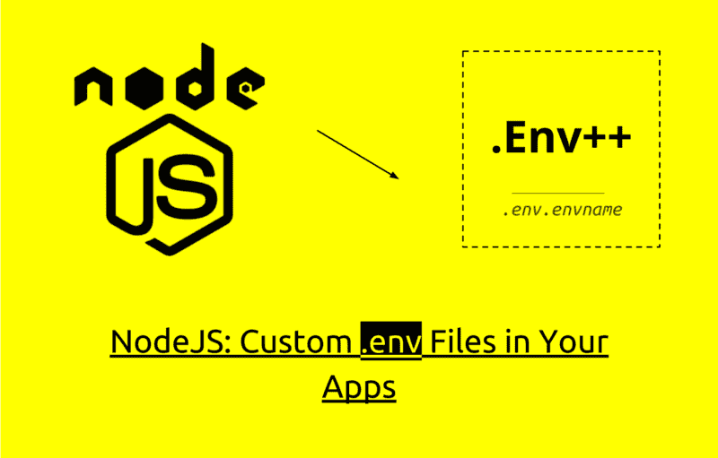
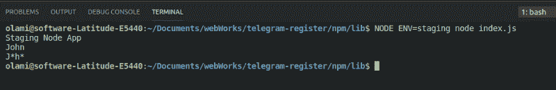

# 如何自定义 Node.js？不同环境阶段的 env 文件

> 原文：<https://www.freecodecamp.org/news/nodejs-custom-env-files-in-your-apps-fa7b3e67abe1/>

埃里森·奥拉西尼

# 如何自定义 Node.js？不同环境阶段的 env 文件



> ***您是否曾经遇到过这样的情况:您需要为应用程序的不同开发阶段定制环境变量？这里有一个单行解决方案。***

自从`.env`文件发明以来，开发变得容易多了。您可以使用语法`ENV_VARIABLE=VALUE`和 boom 轻松设置您的环境变量和值！这些变量作为您的环境变量被加载，使得快速访问它们成为可能:

```
console.log(process.env.ENV_VARIABLE)
```

如果你仍然想知道这意味着什么，那么，你可能是第一次接触`.env`文件。它实际上是一个简单的配置文本文件，用于定义一些要传递到应用程序环境中的变量。

这个文件需要一个类似于**解析器**的东西来使它工作。解析器逐个读取变量定义**和**，并将它们解析到环境中。它使用格式 **ENV_VARIABLE=VALUE** (对于 Node.js: `process.env[ENV_VARIABLE]=VALUE`)。

当然，这不是 Node.js 的内置特性，你必须用一个叫做 **dotenv** 的流行模块来设计它。

这是一个很好的变通方法，因为它确实使得合作开发者之间以及整个开发社区的开发更加容易。我个人一直在使用 **dotenv** 模块，直到我试图找到一个可以让我为特定环境使用不同配置文件的解决方案而陷入困境。那会更酷…对吗？是啊！但遗憾的是，**dotenv***模块并没有给我们提供这个好东西。*

那么下一步是什么？我们需要这个东西来简化不同开发阶段的开发和测试！

### 定制怎么样？不同环境阶段的 env 文件？

你不认为那会是一个好的解决办法吗？通过创建一个 *.env.envname* 文件来定义自定义环境变量？酷！这就是**海关总署**要做的事情。

**Custom env 是一个库，通过允许多个。不同环境的环境配置。**这是通过将环境变量从. env.envname 文件加载到节点的`process.env`对象中来完成的。

#### 装置

只需使用以下命令获取它:

```
npm i custom-env
```

#### 使用

```
require('custom-env').env()
```

默认情况下， *custom-env* 选择。开发阶段的 env 文件。但是，要为不同的阶段进行定制，请添加名称作为后缀，如 *.env.envname.*

**例子**

我们可以为**阶段开发定义一个定制的环境变量。**

*   创建一个. env.staging 文件
*   定义您的变量

```
APP_ENV=staging
APP_NAME=custom environment app
DB_HOST=localhost
DB_USER=user
DB_PASS=pass
```

*   访问您的变量

```
// Require custom-env and set your preferred env file

require ('custom-env').env('staging')

console.log(process.env.APP_ENV)

console.log(process.env.APP_NAME)

console.log(process.env.DB_HOST)

console.log(process.env.DB_PASS)
```

**预期产出**

```
staging
custom environment app
localhost
user
pass
```

就这样，很简单。请随意为您认为的不同阶段定义更多变量，例如:

*.env.testing、. env.staging、. env.server1、. env.server2、. env.localhost*

### 设置为当前环境

通过将 **true** 传递给`*env()*` 方法，您可以告诉 *custom-env* 使用与您当前开发阶段相匹配的配置。

**例子**

**文件:index.js**

```
// Pass true to env() to make it use the current environment stage.

require('custom-env').env(true)

console.log(process.env.APP_NAME)
console.log(process.env.USERNAME)
console.log(process.env.PASSKEY)
```

现在让我们定义一个分段配置文件:

**File: .env.staging**

```
APP_NAME=Staging Node App
USER_NAME=John
PASSKEY=J*h*
```

现在，让我们为节点提供登台环境:

```
NODE_ENV=staging node index.js
```

**预期产出**



Gets the variables according to the **staging** environment.

给你！

### 完整文档

关于 *custom-env、*的完整文档，请访问 https://www.npmjs.com/package/custom-env 的 **npm 页面**

### 源代码

您可以在 https://github.com/erisanolasheni/custom-env[的](https://github.com/erisanolasheni/custom-env)获得或贡献 *custom-env* 源代码

***快乐编码！***