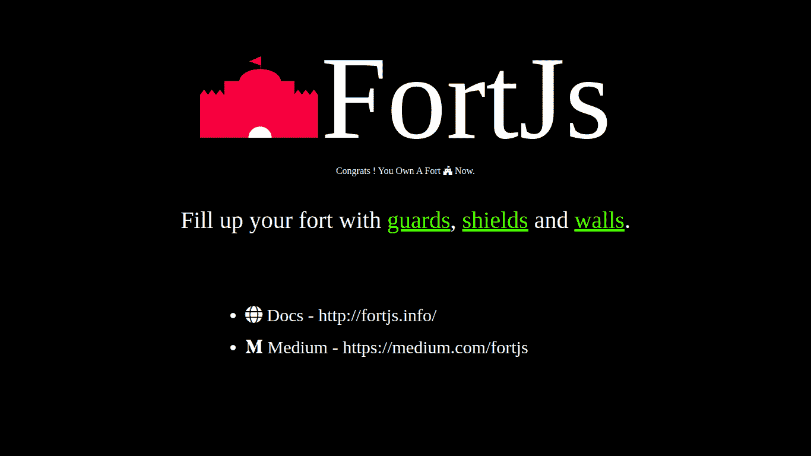
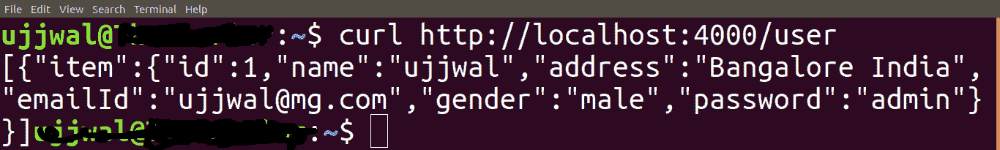
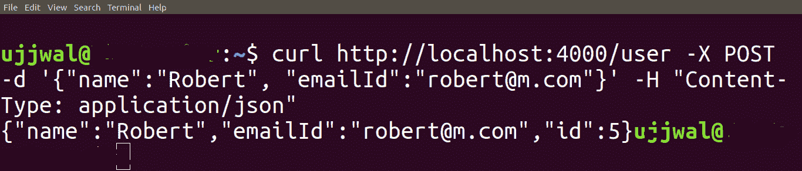
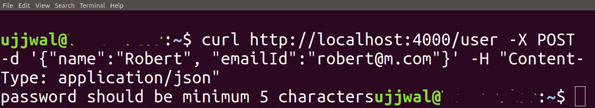
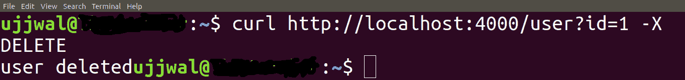
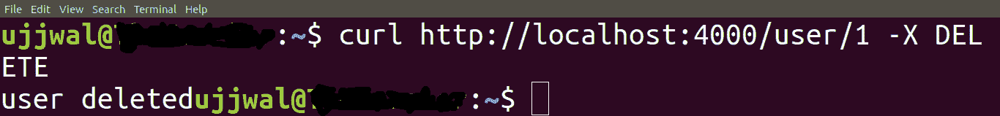

# 使用 FortJs 通过现代 JavaScript 开发 Node.js

> 原文：<https://www.freecodecamp.org/news/nodejs-development-with-modern-javascript-using-fortjs/>

## 介绍

Nodejs 赋予你使用 JavaScript 编写服务器端代码的能力。事实上，使用 Nodejs 创建 web 服务器是非常容易和快速的。Node package manager 上有几个可用的框架，这使得开发更加容易和快速。

但是 node.js 开发中存在一些挑战

*   Nodejs 都是关于回调的，随着回调越来越多，你最终会遇到一种叫做回调地狱的情况。
*   编写可读的代码。
*   编写可维护的代码。
*   你没有得到太多的智能感知支持，这使得开发缓慢。

如果您很有经验，并且对 Nodejs 有很好的了解，那么您可以使用不同的技术，尽量减少这些挑战。

解决这些问题的最好方法是使用现代的 JavaScript ES6、ES7 或 TypeScript，任何你觉得舒服的东西。我推荐 TypeScript，因为它为每一个代码字提供了 intillisense 支持，这使得您的开发速度更快。

所以我创建了一个非常容易学习和使用的框架，叫做 [FortJs](http://fortjs.info/) 。FortJs 使您能够使用 ES6 或 TypeScript 编写服务器端代码，这种代码是模块化的、安全的，并且非常漂亮和可读。

## 特征

FortJs 的一些重要特征是:

*   基于[堡](https://github.com/ujjwalguptaofficial/fort)架构。
*   MVC 框架并遵循 OOPS 方法，所以一切都是类和对象。
*   提供组件-墙壁、护罩和防护装置。组件有助于模块化应用程序。
*   使用 ES6 async/await 或 promise 执行异步代码。
*   一切都是可配置的-你可以配置你的会话存储，查看引擎，websocket 等。
*   依赖注入。
*   一切都可以进行单元测试，所以你可以使用 [TDD](https://guide.freecodecamp.org/agile/test-driven-development/) 方法。

## 让我们编码

在这篇文章中，我将使用 FortJs 和 ES6 创建一个 REST API。但是您也可以使用相同的代码和步骤通过 TypeScript 来实现。

### 项目设置

FortJs 提供了一个文件创建器。这有助于您更快地设置项目和开发。让我们使用 CLI 来开发。

按顺序执行以下步骤:

*   打开您的终端或命令提示符。
*   全局安装 **fort-creator** 运行命令“npm i fort-creator -g”。注意:确保您的系统中安装了 Nodejs。
*   创建一个新项目——运行命令“fort-creator new my-app”。这里“我的应用程序”是应用程序的名称，因此您可以选择任何名称。CLI 将提示您用两个选项选择语言:TypeScript 和 JavaScript。使用箭头键选择您的语言，然后按 enter 键——我选择了 JavaScript。创建项目需要一些时间，所以请等待，直到您看到“新项目我的应用程序已创建”。
*   进入项目目录——“CD my-app”。
    用实时重载启动开发服务器——运行命令“fort-creator start”。
*   打开浏览器，输入网址- [http://localhost:4000/](http://localhost:4000/) 。

您应该会在浏览器中看到类似这样的内容。



FortJs starter page

让我们了解一下这个页面是如何呈现的:

*   在您最喜欢的代码编辑器中打开项目文件夹。我将使用 VS 代码。你会在项目根目录下看到很多文件夹，比如控制器，视图等等。每个文件夹都按其用途分组，例如,“控制器”文件夹包含所有控制器,“视图”文件夹包含所有视图。
*   打开控制器文件夹->在控制器里面，你会看到一个文件名——default _ controller。让我们打开它，观察代码。该文件包含一个类 default controller——这是一个[控制器](http://fortjs.info/tutorial/controller/)类，它包含返回一些 http 响应的方法。
*   在类 DefaultController 中，您将看到一个“index”方法——这是将当前输出呈现给浏览器的方法。该方法在 FortJs 中被称为 [worker](http://fortjs.info/tutorial/worker/) ，因为它们执行某种工作并将结果作为 http 响应返回。我们来观察一下索引方法代码:

    ` `
    const data = {
    title:title
    }
    const result = await view result(' default/index . html '，data)；
    返回结果；它创建一个数据对象，并将该对象传递给 **viewResult** 方法。 **viewResult** 方法有两个参数——视图位置和视图数据。 **viewResult** 的工作是渲染视图并返回一个响应，这就是我们在浏览器中看到的。
*   让我们找到视图代码并理解它。打开视图文件夹->打开默认文件夹->打开 index.html。这是我们的视图代码。这是简单的 HTML 代码和一些小胡子语法。Fortjs 的默认视图引擎是 mustache。

我希望你已经理解了项目架构。如果你有任何困难或疑问，请在评论区提问。

现在我们将进入本文的下一部分，在这里我们将学习如何创建一个简单的 rest API。

## 休息

我们将为实体用户创建一个 REST 端点——它将为用户执行 CRUD 操作，比如添加用户、删除用户、获取用户和更新用户。

根据 REST:

1.  添加用户-应该使用 http 方法"`POST`"来完成
2.  删除用户-应使用 http 方法"`REMOVE`"完成
3.  获取用户应该使用 http 方法"`GET`"来完成
4.  更新用户-应该使用 http 方法"`PUT`"来完成

为了创建端点，我们需要创建一个类似于前面解释的默认控制器的控制器。

执行命令“`fort-creator add`”。它会问你“选择要添加的组件？”选择控制器&按**键进入**。输入控制器名称“用户”并按**键输入**。

现在我们已经创建了用户控制器，我们需要通过将它添加到 routes 来通知 FortJs。路线用于将我们的控制器映射到一条路径。

既然我们的实体是用户，“`/user`”将是一条很好的路线。补充一下吧。打开项目根目录下的 routes.js，将`UserController`添加到 routes 中。

添加 UserController 后，routes.js 将如下所示:

```
import { DefaultController } from "./controllers/default_controller";
import { UserController } from "./controllers/user_controller";

export const routes = [{
    path: "/*",
    controller: DefaultController
},
{
    path: "/user",
    controller: UserController
}]
```

routes.js

因此，当 http 请求的路径为“/user”时，将调用 UserController。

我们打开网址-[http://localhost:4000/user](http://localhost:4000/user)。

注意:如果您在添加控制器时停止了 FortJs，请通过运行 cmd - `fort-creator start`再次启动它

你看到一张白纸，对吗？

这是因为我们没有从 index 方法返回任何东西，因此我们得到一个空白的响应。让我们从 index 方法返回一个文本“Hello World”。将以下代码添加到索引方法中并保存:

```
return textResult('Hello World');
```

刷新网址-[http://localhost:4000/user](http://localhost:4000/user)

你看到“你好，世界”了吗？

现在，让我们将“UserController”转换成一个 REST API。但是在为 REST API 编写代码之前，让我们创建一个虚拟服务，它将为用户执行 CRUD 操作。

### 服务

创建一个名为“services”的文件夹，然后在该文件夹中创建一个文件“user_service.js”。将以下代码粘贴到文件中:

```
const store = {
    users: [{
        id: 1,
        name: "ujjwal",
        address: "Bangalore India",
        emailId: "ujjwal@mg.com",
        gender: "male",
        password: "admin"
    }]
}

export class UserService {
    getUsers() {
        return store.users;
    }

    addUser(user) {
        const lastUser = store.users[store.users.length - 1];
        user.id = lastUser == null ? 1 : lastUser.id + 1;
        store.users.push(user);
        return user;
    }

    updateUser(user) {
        const existingUser = store.users.find(qry => qry.id === user.id);
        if (existingUser != null) {
            existingUser.name = user.name;
            existingUser.address = user.address;
            existingUser.gender = user.gender;
            existingUser.emailId = user.emailId;
            return true;
        }
        return false;
    }

    getUser(id) {
        return store.users.find(user => user.id === id);
    }

    removeUser(id) {
        const index = store.users.findIndex(user => user.id === id);
        store.users.splice(index, 1);
    }
}
```

上面的代码包含一个变量 store，其中包含一个用户集合。服务内部的方法执行添加、更新、删除和获取存储等操作。

我们将在 REST API 实现中使用该服务。

### 得到

对于带有 http 方法“GET”的路由“/user”，API 应该返回所有用户的列表。

为了实现这一点，让我们将 user_controller.js 中的“index”方法重命名为“getUsers ”,使其语义正确。然后将下面的代码粘贴到该方法中:

```
const service = new UserService();
return jsonResult(service.getUsers());
```

现在 user_controller.js 看起来是这样的:

```
 import { Controller, DefaultWorker, Worker, textResult, jsonResult } from "fortjs";
import { UserService } from "../services/user_service";

export class UserController extends Controller {

    @DefaultWorker()
    async getUsers() {
        const service = new UserService();
        return jsonResult(service.getUsers());
    }
}
```

这里，我们使用了装饰器 DefaultWorker。DefaultWorker 做了两件事:它添加了路由“/”& http 方法“GET”。这是这种情况下的捷径。在下一部分中，我们将使用其他装饰器来定制路线。

让我们通过调用 URL[http://localhost:4000/user](http://localhost:4000/user)来测试一下。您可以在浏览器中打开它，或者使用任何 http 客户端工具，如 postman 或 curl。



好了，这样我们就成功创建了一个端点:)。

让我们再看一下我们的代码，看看我们是否能做得更好:

1.  服务“UserService”与控制器“UserController”紧密耦合，这成为单元测试“UserController”的一个问题。所以我们会用 FortJs 的[依赖注入](http://fortjs.info/tutorial/dependency-injection/)来注入 UserService。
2.  每次调用 getUsers 方法时，我们都会创建一个“UserService”实例。但是我们从“用户服务”中需要的是一个单独的对象，然后从该对象中调用“用户服务”方法。

因此，如果我们能够以某种方式存储一个“UserService”对象，那么我们可以使我们的代码更快(因为调用 new 在幕后做了一些工作)。为此，我们将使用 FortJs 的单例特性。

让我们用下面的代码来修改 user_controller.js 代码:

```
 import { Controller, DefaultWorker, Worker, textResult, jsonResult, Singleton } from "fortjs";
import { UserService } from "../services/user_service";

export class UserController extends Controller {

    @DefaultWorker()
    async getUsers(@Singleton(UserService) service) {
        return jsonResult(service.getUsers());
    }
}
```

如您所见，唯一的变化是我们在 getUsers 方法中使用了“Singleton”装饰器。这将创建一个 singleton，并在调用 getUsers 时注入该 singleton。这个单例将在整个应用程序中可用。

由于 service 现在是一个参数，我们可以在调用时手动传递该参数。这使得 getUsers 单元是可测试的。

为了做单元测试或者 E2E 测试，请阅读这个测试文档-[http://fortjs.info/tutorial/test/](http://fortjs.info/tutorial/test/)

### 邮政

让我们添加一个方法“addUser ”,它将从请求体中提取数据并调用服务来添加用户。

```
async addUser(@Singleton(UserService) service) {
        const user = {
            name: this.body.name,
            gender: this.body.gender,
            address: this.body.address,
            emailId: this.body.emailId,
            password: this.body.password
        };
        const newUser = service.addUser(user);
        return jsonResult(newUser, HTTP_STATUS_CODE.Created);
}
```

> 在上面的代码中，我们再次创建了 UserService 的单例。所以问题是它会创造另一个物体吗？

不，它将是 getUser 中相同对象。FortJs 在调用方法时将对象作为参数提供。

默认情况下，创建的方法对于 http 请求是不可见的。因此，为了使这个方法对 http 请求可见，我们需要将它标记为 worker。

通过添加装饰符“worker”将一个方法标记为 Worker。Worker decorator 获取一个 http 方法列表，并使该方法仅对那些 http 方法可用。所以让我们添加装饰器:

```
@Worker([HTTP_METHOD.Post])
async addUser(@Singleton(UserService) service) {
    const user = {
        name: this.body.name,
        gender: this.body.gender,
        address: this.body.address,
        emailId: this.body.emailId,
        password: this.body.password
    };
    const newUser = service.addUser(user);
    return jsonResult(newUser, HTTP_STATUS_CODE.Created);
}
```

现在这个方法的路由和方法名“addUser”是一样的。您可以通过向[http://localhost:4000/user/addUser](http://localhost:4000/user/addUser)发送一个 post 请求来检查这一点，请求体中包含用户数据。

但是我们希望路由是“/”，这样它将是一个 rest API。通过使用装饰器“route”来配置工人的路线。让我们现在改变路线。

```
@Worker([HTTP_METHOD.Post])
@Route("/")
async addUser(@Singleton(UserService) service) {
    const user = {
        name: this.body.name,
        gender: this.body.gender,
        address: this.body.address,
        emailId: this.body.emailId,
        password: this.body.password
    };
    const newUser = service.addUser(user);
    return jsonResult(newUser, HTTP_STATUS_CODE.Created);
}
```

现在我们的端点已经为 post 请求配置好了。让我们通过向[http://localhost:4000/user/](http://localhost:4000/user/)发送 post 请求来测试这一点，请求体中包含用户数据。



它返回用 id 创建的用户，这是我们的逻辑。因此，我们已经为 post 请求创建了端点，但是要做的一件重要的事情是验证数据。验证是任何应用程序必不可少的一部分，对于后端应用程序非常重要。

到目前为止，我们的代码是干净和可读的。但是如果我们添加验证代码，它会变得有点脏。

不用担心，FortJs 为这种工作提供了组件 [Guard](http://fortjs.info/tutorial/guard/) 。到 FortJs 文档的帐户:

> 警卫是工作人员之上的安全层。它控制是否允许请求调用工作线程。

因此，我们将使用 guard 来验证数据。让我们使用 fort-creator 创建守卫。执行命令`fort-creator add`并选择 Guard。输入文件名“UserValidator”。在 guards 文件夹中会创建一个文件“user_validator_guard.js”。打开那个文件。

警卫可以接触到尸体，所以你可以验证里面的数据。在方法`check`中返回 null 意味着我们允许调用 worker。返回任何其他内容都意味着阻止调用。

让我们通过编写验证代码来使它更清楚。将以下代码粘贴到文件“user_validator_guard.js”中:

```
 import { Guard, textResult, HTTP_STATUS_CODE } from "fortjs";

export class UserValidatorGuard extends Guard {

    async check() {
        const user = {
            name: this.body.name,
            gender: this.body.gender,
            address: this.body.address,
            emailId: this.body.emailId,
            password: this.body.password
        };
        const errMsg = this.validate(user);
        if (errMsg == null) {
            // pass user to worker method, so that they dont need to parse again  
            this.data.user = user;
            // returning null means - guard allows request to pass  
            return null;
        } else {
            return textResult(errMsg, HTTP_STATUS_CODE.BadRequest);
        }
    }

    validate(user) {
        let errMessage;
        if (user.name == null || user.name.length < 5) {
            errMessage = "name should be minimum 5 characters"
        } else if (user.password == null || user.password.length < 5) {
            errMessage = "password should be minimum 5 characters";
        } else if (user.gender == null || ["male", "female"].indexOf(user.gender) < 0) {
            errMessage = "gender should be either male or female";
        } else if (user.emailId == null || !this.isValidEmail(user.emailId)) {
            errMessage = "email not valid";
        } else if (user.address == null || user.address.length < 10) {
            errMessage = "address length should be greater than 10";
        }
        return errMessage;
    }

    isValidEmail(email) {
        var re = /^(([^<>()\[\]\\.,;:\s@"]+(\.[^<>()\[\]\\.,;:\s@"]+)*)|(".+"))@((\[[0-9]{1,3}\.[0-9]{1,3}\.[0-9]{1,3}\.[0-9]{1,3}\])|(([a-zA-Z\-0-9]+\.)+[a-zA-Z]{2,}))$/;
        return re.test(String(email).toLowerCase());
    }

}
```

在上面的代码中:

*   我们创建了一个接受参数 user 的 validate 方法。它验证用户&如果存在验证错误，则返回错误消息，否则返回 null。
*   我们在 check 方法中验证数据，这是 guard 生命周期的一部分。我们通过调用 validate 方法来验证其中的用户。
    如果用户有效，那么我们通过使用“data”属性传递用户值并返回 null。返回 null 意味着 guard 已经允许这个请求，应该调用 worker。
*   如果用户无效，我们将返回一条错误消息，作为带有 HTTP 代码“错误请求”的文本响应。在这种情况下，执行将在这里停止，并且不会调用该工作线程。

为了激活 addUser 方法的这个保护，我们需要将它添加到 addUser 之上。使用装饰符“Guards”添加防护。所以让我们添加守卫:

```
@Worker([HTTP_METHOD.Post])
@Route("/")
@Guards([UserValidatorGuard])
async addUser(@Singleton(UserService) service) {
    const newUser = service.addUser(this.data.user);
    return jsonResult(newUser, HTTP_STATUS_CODE.Created);
}
```

在上面的代码中:

*   我已经使用装饰守卫添加了守卫“UserValidatorGuard”。
*   有了流程中的防护，我们不再需要在 worker 内部解析来自主体的数据。相反，我们从“UserValidatorGuard”传递的 this.data 中读取它。
*   只有当 Guard 允许时，才会调用“addUser”方法，这意味着所有数据都是有效的。

需要注意的一点是，方法“addUser”在使用一个组件后看起来非常简单，而且它也在进行验证。您可以为一个 worker 添加多个防护，这使您能够将代码模块化为多个防护，并在多个地方使用该防护。

> 这不是很酷的:D 吗？

让我们尝试添加一个带有无效数据的用户:



正如你在截图中看到的，我已经尝试过在没有密码的情况下发送请求。结果是-“密码应该至少包含 5 个字符”。因此，这意味着警卫被激活，并完美地工作。

### 放

让我们添加另一个方法——“update user”用 route“/”，guard“UserValidatorGuard”(用于用户的验证)和最重要的——worker 用 http 方法“PUT”。

```
@Worker([HTTP_METHOD.Put])
@Guards([UserValidatorGuard])
@Route("/")
async updateUser(@Singleton(UserService) service) {
    const user = this.data.user;
    const userUpdated = service.updateUser(user);
    if (userUpdated === true) {
        return textResult("user updated");
    } else {
        return textResult("invalid user");
    }
}
```

更新后的代码类似于 addUser 代码，只是在功能上更新了数据。这里，我们重用了 UserValidatorGuard 来验证数据。

### 删除

为了删除数据，用户需要传递用户的 id。这可以通过:

*   在正文中发送数据，就像我们在添加和更新时所做的一样- {id:1}
*   在查询字符串中发送数据-？id=1
*   在路由中发送数据——为此，我们需要定制我们的路由——“/user/1”

我们已经实现了从身体获取数据。那么让我们看看另外两种方式:

**发送查询字符串中的数据**

让我们创建一个方法“removeByQueryString”并粘贴以下代码:

```
@Worker([HTTP_METHOD.Delete])
@Route("/")
async removeByQueryString(@Singleton(UserService) service) {
    // taking id from query string
    const userId = Number(this.query.id);
    const user = service.getUser(userId);
    if (user != null) {
        service.removeUser(userId);
        return textResult("user deleted");
    } else {
        return textResult("invalid user", 404);
    }
}
```



**发送路由中的数据**

您可以通过在路线中使用“{var}”来参数化路线。让我们看看怎么做。

让我们创建另一个方法“removeByRoute ”,并粘贴以下代码:

```
@Worker([HTTP_METHOD.Delete])
@Route("/{id}")
async removeByRoute(@Singleton(UserService) service) {

    // taking id from route
    const userId = Number(this.param.id);

    const user = service.getUser(userId);
    if (user != null) {
        service.removeUser(userId);
        return textResult("user deleted");
    } else {
        return textResult("invalid user");
    }
}
```

上面的代码与 removeByQueryString 完全相同，只是它从路由中提取 id 并在路由中使用参数，即“/{id}”，其中 id 是参数。

让我们来测试一下:



所以我们最终为所有功能创建了一个 REST API，除了通过 id 获取特定用户。我会把它留给你练习。

## 兴趣点

问:我们如何给“UserController”添加认证，让任何未经认证的请求都无法调用“/user”端点。

答:这有多种方法:

*   我们可以登记每个工人进行身份验证。(不好——这么多额外的工作和代码重复)
*   创建警卫组件并分配给每个员工。(好)
*   创建一个[屏蔽](http://fortjs.info/tutorial/shield/)组件并分配给控制器。Shield 是一个类似于 guard 的安全层，但它工作在控制器之上，所以如果 shield 拒绝，控制器就不会启动。(最佳)

看看 FortJs 认证文档-[http://fortjs.info/tutorial/authentication/](http://fortjs.info/tutorial/authentication/)

## 参考

*   [http://fortjs.info/](http://fortjs.info/)
*   [https://medium.com/fortjs](https://medium.com/fortjs)