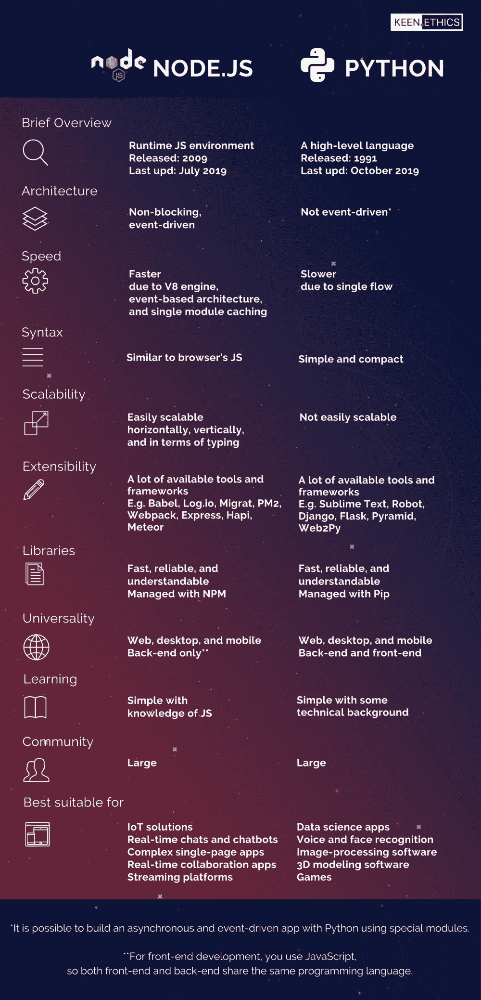

# NodeJS 与 Python:如何选择最好的技术来开发 Web 应用程序的后端

> 原文：<https://www.freecodecamp.org/news/nodejs-vs-python-choosing-the-best-technology-to-develop-back-end-of-your-web-app/>

在本文中，我们将大胆地宣称这些技术中的一种正在胜出。问题是:到底是哪一个？让我们跳进去找出答案。

### 背景和概述

Node.js 和 Python 是后端开发最流行的技术之一。常识认为编程语言没有好坏之分，一切取决于每个开发者的喜好。

然而，在这篇文章中，我将勇敢地宣称这些技术中的一种——[NodeJS](https://keenethics.com/services-web-development-node)或 Python 3——将会胜出。会是哪一个？让我们看看。

我要考虑的标准是:

1.  体系结构
2.  速度
3.  句法
4.  可量测性
5.  展开性
6.  图书馆
7.  一般性
8.  学习曲线
9.  社区
10.  最适合的应用程序

在我开始进行详细的横向比较之前，你可以看一下这张信息图，以便有一个大致的了解。

## 简要概述

### NodeJS

NodeJS 不是一种编程语言，而是 JavaScript 的开源运行时环境。它最初于 2009 年由瑞安·达尔 发行。最新版本-NodeJS 12 . 6 . 0-于 2019 年 7 月发布。

Node.js 最突出的一点就是基于谷歌的 V8 引擎。它是一个带有内置解释器、编译器和优化器的虚拟机。这个引擎是用 C++编写的，由谷歌设计用于谷歌 Chrome。这个引擎的目的是将 JavaScript 函数编译成机器码。V8 以其高速和不断提升的性能而闻名。

### **Python**

Python 是一种开源的高级编程语言。它于 1991 年由首次发行。最新版本是 Python 3.8，2019 年 10 月发布。但是 Python 3.7 仍然更受欢迎。

Python 主要运行在谷歌的应用引擎上。App Engine 也是由 Google 开发的，它允许您使用 Python 开发 web 应用程序，并允许您从众多最好的 Python 开发人员使用的库和工具中受益。

**nodejs vs python:0–0**

## 体系结构

### **节点 j**

Node.js 被设计为一个事件驱动的环境，支持异步输入/输出。一旦相应的事件发生，就调用某个进程，这意味着没有进程阻塞线程。Node.js 的事件驱动架构非常适合聊天应用和网页游戏的开发。

### **Python**

相比之下，Python 不是这样设计的。借助特殊工具，您可以使用它来构建异步和事件驱动的应用程序。像 [asyncio](https://docs.python.org/3/library/asyncio.html) 这样的模块使得用 Python 编写异步代码成为可能，就像在 Node.js 中一样。但是这个库不是在大多数 Python 框架中构建的，它需要一些额外的努力。

这种事件驱动的架构为 Node.js 带来了第一点。

**nodejs vs python:1–0**

## 速度

### **节点 j**

首先，由于 Node.js 中的 JavaScript 代码是用 V8 引擎解释的(Google 在这方面投入很大)，Node.js 的表现可圈可点。

第二，Node.js 在 web 浏览器之外执行代码，因此应用程序更节省资源，性能更好。这也允许您使用不能在浏览器中使用的功能，例如 TCP 套接字。

第三，事件驱动的非阻塞架构允许同时处理几个请求，这加快了代码执行。

最后，Node.js 中启用了单模块缓存，这减少了应用程序加载时间，使其响应速度更快。

### **Python**

Python 和 JavaScript 都是解释型语言，一般都比编译型语言慢，比如 Java。Python 在这种情况下被 Node.js 打败了。

与 Node.js 不同，Python 是单流的，处理请求要慢得多。因此，对于优先考虑速度和性能或涉及大量复杂计算的应用程序，Python 不是最佳选择。所以 Python web 应用比 [Node.js web 应用慢。](https://keenethics.com/services-web-development-node)

由于 Node.js 更快，所以在性能和速度上赢了一分。

**nodejs vs python:2–0**

## 句法

### **节点 j**

语法在很大程度上是个人喜好的问题。如果我开始说一个更好，另一个更差，我知道我会面临读者的很多批评和怀疑。

事实上，Node.js 语法与浏览器的 JavaScript 非常相似。因此，如果您熟悉 JavaScript，使用 Node.js 不会有任何困难。

### **Python**

Python 的语法通常被认为是它最大的优势。在用 Python 编码时，软件开发人员需要比用 Node.js 编码时编写更少的代码行。Python 的语法非常简单，并且没有花括号。

因此，代码更容易阅读和调试。事实上，Python 代码的可读性很强，一些有技术背景的客户也能理解。不过还是那句话，看个人喜好。

但是最后因为 Python 的语法对于初学者来说更容易理解和学习，所以 Python 在这里赢了一分。

**nodejs vs python:2–1**

## 可量测性

### **节点 j**

Node.js 使您无需创建大型的整体核心。相反，您创建一组微服务和模块，它们中的每一个都将与一个轻量级机制进行通信，并运行自己的进程。您可以轻松添加额外的微服务和模块，这使得开发过程非常灵活。

此外，您可以轻松地水平和垂直缩放 Node.js web 应用程序。要水平扩展，您需要向现有系统添加新节点。要纵向扩展，您需要向现有节点添加额外的资源。

最后，在输入方面，Node.js 比 Python 有更多的选择。您可以使用弱类型 JavaScript 或强类型 TypeScript。

### **Python**

为了扩展应用程序，需要启用多线程。但是 Python 不支持多线程，因为它使用全局解释器锁(GIL)。

虽然 Python 有用于多线程的库，但它不是“真正的”多线程。即使你有多个线程，GIL 也不会让 Python 解释器同时执行任务，而是一次只运行一个线程。Python 必须使用 GIL，即使这会对性能产生负面影响，因为 Python 的内存管理不是线程安全的。

此外，Python 是动态类型的。然而，动态类型语言并不适合开发团队不断增长的大型项目。随着它的增长，系统逐渐变得过于复杂和难以维护。

显然，Python 在可伸缩性方面比 Node.js 稍逊一筹。

**nodejs vs python:3–1**

## 展开性

### **节点 j**

Node.js 可以轻松定制、扩展，并与各种工具集成。它可以借助内置的 API 进行扩展，用于开发 HTTP 或 DNS 服务器。

它可以与 [Babel](https://babeljs.io/) (一个 JS 编译器)集成，这有助于使用旧版本的 Node 或浏览器进行前端开发。

Jasmine 有助于单元测试， [Log.io](http://logio.org/) 有助于项目监控和故障排除。对于数据迁移、流程管理和模块捆绑，您可以使用[迁移](https://github.com/naturalatlas/migrat)、 [PM2](http://pm2.keymetrics.io/) 和 [Webpack](https://webpack.github.io/) 。

而 Node.js 可以用 [Express](https://keenethics.com/tech-back-end-express) 、哈比神、 [Meteor](https://keenethics.com/services-web-development-meteor) 、Koa、Fastify、Nest、Restify 等框架进行扩展。

### **Python**

Python 于 1991 年问世，纵观其历史，已经产生了许多开发工具和框架。

例如，Python 可以与流行的代码编辑器 [Sublime Text](https://www.sublimetext.com/) 集成，后者提供了一些额外的编辑功能和语法扩展。

对于测试自动化，有 [机器人框架](https://robotframework.org/) 。也有一些强大的 web 开发框架，比如 Django、Flask、Pyramid、Web2Py 或 CherryPy。

所以，这两个网络都很容易扩展，而且都赢了一分。

**节点 JS vs Python:4–2**

## 图书馆

### **节点 j**

在 Node.js 中，库和包由节点包管理器 NPM 管理。它是最大的软件库之一。NPM 速度快，文档丰富，并且易于学习使用。

### **Python**

在 Python 中，库和包是由 Pip 管理的，Pip 代表“Pip 安装 Python”。Pip 快速、可靠且易于使用，因此开发人员也很容易学会使用它。

再次，双方都赢得一分。

**节点 JS vs Python:5–3**

## 一般性

### **节点 j**

Node.js 主要用于 web 应用程序的后端开发。然而，对于前端开发，您使用 JavaScript 以便前端和后端共享相同的编程语言。

使用 Node.js，你不仅可以开发 [web 应用](https://keenethics.com/services-web-development)，还可以开发桌面和混合[移动应用](https://keenethics.com/services-mobile-development)，以及云和物联网解决方案。

Node.js 也是跨平台的，这意味着开发人员可以创建一个可以在 Windows、Linux 和 Mac 上运行的桌面应用程序。这种通用性是降低项目成本的一个很好的方法，因为一个开发团队可以完成所有的工作。

### **Python**

Python 是全栈的，所以后端和前端开发都可以用。和 Node.js 类似，Python 是跨平台的，所以一个在 Mac 上写的 Python 程序会在 Linux 上运行。

Mac 和 Linux 都预装了 Python，但是在 Windows 上你需要自己安装 Python 解释器。

虽然 Python 非常适合 web 和桌面开发，但它对于移动计算来说相当弱。所以移动应用一般不用 Python 写。至于物联网和人工智能解决方案，Python 的受欢迎程度正在快速增长。

从通用性上来说，Node.js 和 Python 是比肩的。在这里给每个人一分是公平的。

**节点 JS vs Python:6–4**

## 学习曲线

### **节点 j**

Node.js 是基于 JavaScript 的，初学者很容易学会。一旦掌握了一些 JavaScript 知识，掌握 Node.js 应该不是问题。

安装 Node.js 非常简单，但是它引入了一些高级主题。比如一开始可能很难理解它的事件驱动架构。事件驱动架构对应用性能有着突出的影响，但开发人员通常需要一些时间来掌握它。

即便如此，Node.js 的入门门槛还是相当低的。但这可能意味着有很多不熟练的 Node.js 开发人员。这可能会让你在如此繁忙的市场中更难找到工作。但是如果你很自信，有一个很棒的投资组合，你可以很容易地解决这个问题。

另一方面，如果你是企业主，你可能会面临雇佣低质量专家的问题。但是你也可以通过雇佣一个可信的软件开发机构来解决这个问题。

### **Python**

如果你不懂 JavaScript，而你必须选择学习什么——Python 还是 node . js——你可能应该从前者开始。Python 可能更容易学，因为它的语法简单紧凑。

通常，在 Python 中编写某个函数比在 Node.js 中编写相同的函数需要更少的代码行。但情况并非总是如此，因为代码的长度在很大程度上取决于您的编程风格和范式。另一个好处是没有 JavaScript 中的花括号。

学习 Python 还可以教你如何正确缩进代码，因为这种语言对缩进和空格是敏感的。(Node.js 也是如此)对缩进和空白敏感的语言的问题是，一个缩进错误或一个放错位置的括号会莫名其妙地破坏您的代码。新开发人员可能会发现很难解决这些问题。

安装 Python 比安装 Node.js 更难，如果你有 Linux 或者 Windows，应该可以毫无问题的安装 Python。如果你使用 MacOS，你会看到你已经预装了 Python 2.0 但是你不能使用它，因为它会干扰系统库。相反，你需要下载并使用另一个版本。当您配置开发环境时，不要忘记选择合适的版本。

Python 和 Node.js 都很好学，很难客观的说哪个更简单。这也是个人喜好的问题。所以，这两种技术又一次各得一分。

**节点 JS vs Python:7–5**

## 社区

### **节点 j**

Node.js 社区很大而且很活跃。它是一种成熟的开源语言，拥有庞大的用户群体。它发布已经十年了，来自世界各地的开发人员已经爱上了这项技术。作为企业主，你很容易找到 Node.js 开发者。作为一名开发人员，您可以始终依赖同行的支持。

### **Python**

Python 比 Node.js 要老一些，而且它也是开源的。用户社区有大量具有不同经验水平的贡献者。再说一次，如果你是一个企业主或开发商，你会从这个大型社区中受益。

Python 和 Node.js 都有很好的社区，所以都得了一分。

**节点 JS vs Python:8–6**

## 最适合的应用程序

### **节点 j**

由于其基于事件的架构，Node.js 非常适合具有大量并发请求、繁重的客户端呈现或频繁地将数据从客户端转移到服务器的应用程序。

一些例子包括物联网解决方案、实时聊天机器人和信使以及复杂的单页应用程序。

Node.js 在开发实时协作服务或流媒体平台方面也非常出色。然而，Node.js 并不是开发需要大量 CPU 资源的应用程序的最佳选择。

### **Python**

Python 适合小型和大型项目的开发。它可以用于涉及数据分析和可视化的数据科学应用程序，用于语音和人脸识别系统、图像处理软件、神经网络和机器学习系统。Python 还可以用于 3D 建模软件和游戏的开发。

这两种技术都可以让你开发各种各样的应用。哪种更合适，完全看你需要什么了。所以，选一个更好的没有任何意义。在这里，两种技术都没有得分，因为它们没有以这种方式直接竞争。

**节点 JS vs Python:8–6**

## 总结

你还记得我说过我会证明一种技术比另一种好吗？很好！

但是你也应该记住每个软件项目都有自己的需求和要求，你应该根据这些需求来选择你的技术。

适用于一个项目的语言可能根本不适用于另一个项目。

现在，我可以下结论了。凭借 8–6 的分数，Node.js 略微领先于 Python。在选择 Python 还是 JavaScript 进行 web 开发时，请记住这些结果。

## 你对一个项目有想法吗？

我的公司 KeenEthics 无法在 Python 上帮你，但我们是一家经验丰富的 Node.js 公司，愿意接受挑战。如果你准备好改变游戏，开始你的项目，请随时[联系](https://keenethics.com/contacts)********。********

如果你喜欢这篇文章，你一定会读到另一个精彩的对比: [Angular vs React:为你的 App 选择什么？](https://keenethics.com/blog/angular-vs-react-what-to-choose-for-your-app)或[渐进式网络应用与加速移动页面:有什么区别，哪个最适合你？](https://www.freecodecamp.org/news/pwa-vs-amp-what-is-the-difference-and-how-do-you-choose/)

## 附言

我还想感谢 Yaryna Korduba，KeenEthics 最出色的网站开发人员之一，感谢她激发了我的灵感并为这篇文章做出了贡献。

发布在 KeenEthics 博客上的原始文章可以在这里找到: [NodeJS vs Python:选择最佳技术开发你的 Web 应用后端](https://keenethics.com/blog/nodejs-vs-python)。