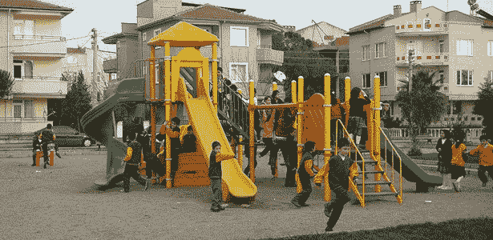

# 噪音无处不在。

> 原文：<https://www.freecodecamp.org/news/noise-is-all-around-us-d0c0fcb8d48/>

多纳文·韦斯特

# 噪音无处不在。它甚至在我们的源代码中。它会分散我们对重要事物的注意力。


Image: [CC0](https://creativecommons.org/publicdomain/zero/1.0/) license by [Tookapic](https://www.pexels.com/photo/night-television-tv-video-8158/)

噪音！噪音！噪音！它就在我们周围。火车上的那个人开着声音在手机上玩视频游戏，没有戴耳机。那些认为在星巴克排队时拿着免提电话是他们的权利的人。紧急车辆警报器，以及交通堵塞时汽车鸣笛(好像这样就能解决任何问题)。

噪音可能看起来无伤大雅，就像有人在开会时没有关掉笔记本电脑一样——直到每个人都被迫听到每隔 3 到 4 分钟就会收到的懈怠通知。你想成为那个让他们把电脑调成静音的人吗？或者，当你努力集中精力做演示时，你会咬紧牙关，试图忽略那些“咯咯声”吗？

> 噪音，尤指大声的、令人不快的或引起骚乱的声音

噪音是一个如此严重的问题，以至于它甚至有自己的一天——国际噪音意识日。

### 视觉噪声

但是噪音不仅仅局限于声音。我们的眼睛也会被噪音淹没。广告牌、公园长椅上的广告和闪烁的霓虹灯都是视觉噪音的来源。

许多城市都有限制户外广告和分散建筑设计的法令。例如，在亚利桑那州的斯科茨代尔，许多建筑都是与自然环境融为一体的浅棕色。与纽约时代广场形成对比。请递给我阿司匹林！


Image: [CC BY-SA 3.0](https://creativecommons.org/licenses/by-sa/3.0) from [Wikipedia](https://en.wikipedia.org/wiki/Times_Square#/media/File:New_york_times_square-terabass.jpg)

### 代码噪声

我知道你在想什么，多纳文。我开始关注你是因为你对技术问题的敏锐洞察力。这一切有意义吗？”首先，“谢谢。”是的，我很高兴你问了！

重点是…编码可以足够复杂，不需要添加额外的噪音，或者我喜欢称之为“视觉混乱”。

我们来看几个例子。

#### 重复的代码段

不必要的重复代码会被认为是视觉混乱。[不要重复自己](https://en.wikipedia.org/wiki/Don%27t_repeat_yourself)。写干巴巴的代码不仅减少了出错的机会，而且看起来也更轻松。

举下面这个例子。看看所有重复的代码。

```
const Foo = () => (  <div>    <Bar className="fruit medium">      <span>Apple</span>    </Bar>    <Bar className="fruit medium">      <span>Orange</span>    </Bar>    <Bar className="fruit large">      <span>Watermelon</span>    </Bar>    <Bar className="fruit large">      <span>Jack Fruit</span>    </Bar>    </div>);
```

但是我们可以通过将重复的代码放入它自己的组件中来很好地解决这个问题，并通过将它放入它自己的文件中来使它消失。

```
const Fruit = ({ size, type }) => (  <Bar className={`fruit ${size}`}>    <span>{type}</span>  </Bar>);Fruit.defaultProps = {  size: 'medium',};
```

现在`Foo`干透了。

```
const Foo = () => (  <div>    <Fruit type="Apple" />    <Fruit type="Orange" />    <Fruit type="Watermelon" size="large" />    <Fruit type="Jack Fruit" size="large" />  </div>);
```

#### 反应无状态功能组件与 ES6 类组件

这里我们有一个使用 ES6 类编写的传统 React 组件。

```
Hello class extends Component {  render() {    return (      <div>Hello {this.name}</div>    );  }}
```

请注意，它不保留任何状态，也不使用任何生命周期事件。那么，为什么我们不使用无状态功能组件(SFC)呢？

下面是作为 SFC 编写的相同组件。

```
const Hello = ({ name }) => (  <div>Hello {name}</div>);
```

注意，SFC 基本上只是传统 ES6 类组件的`render`方法。因为它不是一个类的实例，任何被引用的`props`都不需要使用`this`。因为我们所做的只是返回一个值，所以我们可以使用 ES6 arrow 函数的“单语句”形式，这意味着我们也可以消除`return`语句。

使用 SFC 可以让我们减少将近一半的代码。但是请不要认为这是一场写最少行数的竞赛(让你的代码过于简洁也会让代码难以理解)。这是关于消除不必要的，样板文件，它让我们只关注手头的问题。

> sfc 有助于降低信噪比。

#### 自我注释代码

给你的代码加注释看起来是个好主意，对吗？但是很多人会说，只有当你需要解释一些不明显的东西或者解释问题的时候，才应该加上注释。代码本身应该能够自我注释。

> 应该用注释来陈述问题。您的代码显示了解决方案。

以下面这个例子为例。

```
// display a message if high risk and driver has too many accidentsif (driver.age < 25 || driver.age > 85 && driver.accidents > 2) {  doSomething();}
```

还不错。我们都习惯于阅读这样的代码。但是很复杂。现在考虑这个例子。

```
const { age, accidents } = driver;const isHighRiskAge = age < 25 || age > 85;const hasManyAccidents = accidents > 2;
```

```
if (isHighRiskAge && hasManyAccidents) {  doSomething();}
```

请注意，我们没有删除代码行——事实上，代码长度**增加了**——但是逻辑被分散成小块，你的大脑可以评估和搁置。通过使用描述性变量名(即`isHighRiskAge`和`hasManyAccidents`),`if`语句现在是自解释的，消除了注释的需要。

消除评论的另一大好处是混淆。今天，您编写并注释代码，如下所示。

```
if (age > 75) { // do something if over 75
```

明天你发现一个错误，然后修改代码。

```
if (age > 85) { // do something if over 75
```

但是你记得更新评论来匹配吗？也许吧？也许不是？几个月后，另一个程序员阅读这段代码时，可能会看到注释并感到困惑。计算机不执行注释。

> 不要评论显而易见的事情。

#### 小型可重复使用的组件

创建更小的、可重用的组件也可以减少视觉混乱。举下面这个例子。

```
const Foo = () => (  <div>    <div      style={{        color: 'red',        width: '200px',        height: '200px'      }}    >Hello World</div>  </div>);
```

不错，但我们可以做得更好。如果我们创建一个封装样式的`RedBox`组件会怎么样？

```
const Foo = () => (  <div>    <RedBox>Hello World</RedBox>  </div>);
```

细节现在被隐藏起来了。如果有问题，您只需要查看它的实现。否则你应该假设`RedBox`正在正确地完成它的工作。

下面是一个`RedBox`的实现，它使用了[风格的组件](https://www.styled-components.com/)，这使得 T0 可以进一步减少视觉混乱。如果你以前没用过，那就去看看吧！

```
const RedBox = styled.div`  color: red;  width: 200px;  height: 200px;`;
```

### 结论

消除生活中各种形式的噪音可以为你的心理健康创造奇迹。在一个安静的公园散步，远离城市街道的喧嚣。享受愉快的鸟鸣声和树木的自然美。离操场远点！？



*Image: [Wikimedia Commons](https://commons.wikimedia.org/wiki/File:%C3%87ocuk_park%C4%B1.JPG)*

我也为美国运通工程博客写稿。在 [AmericanExpress.io](http://americanexpress.io/) 查看我的其他作品和我才华横溢的同事的作品。你也可以[在推特](https://twitter.com/donavon)上关注我。