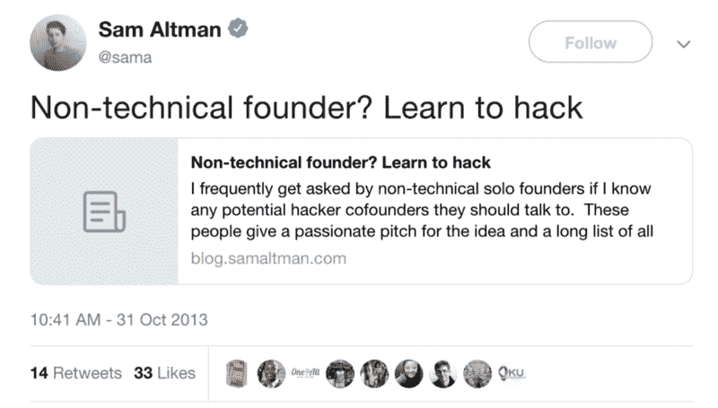

# 如何成为你自己的技术合伙人——以及为什么值得你花时间

> 原文：<https://www.freecodecamp.org/news/non-technical-and-looking-for-a-technical-co-founder-2c212c01d6da/>

> ***注意*** *:* 这篇博客的灵感来自我最近对 freeCodeCamp 的昆西·拉森的播客采访，我们在最后 15 分钟左右的时间里讨论了这个话题。

寻找技术联合创始人？我也是。很多年了。这是一个艰难的旅程，因为流行的“智慧”是你需要出去找一个技术联合创始人，因为所有成功的创业公司都有他们(顺便说一句，这不是真的)。但是当你在跑道的尽头，你的选择是学习编码，还是放弃，会发生什么呢？

技术型联合创始人应该给你稳定性、基本技能的补充和责任感，而这些是单枪匹马的创始人不可能做到的。当然，没有人在追踪无数的例子，在这些例子中，有一个垃圾联合创始人让你的旅程变得无比艰难，或者完全阻碍了你进步的能力。但是当然,“他们”的意思是你不仅仅需要一个技术联合创始人，你还需要一个合适的技术联合创始人。

当然了。

这些都不是特别有用的建议。这就像说你需要保持清醒才能有好的想法(看似显而易见和直观，但并不总是正确的)。

### **我作为一名非技术型(单干)创始人的经历**

以下是我多年来寻找技术型联合创始人的亲身经历:

1.  我花了大量时间浏览论坛、LinkedIn 和联系人列表，寻找符合最低标准的人
2.  我花了大量时间无法验证、测试和进步，因为除了一个经过精心打磨的推销之外，我没有任何东西可以验证、测试或进步
3.  我见过很多人，大多数人对创业不感兴趣，或者没有必要的职业道德(又名受虐倾向)
4.  我遇到了很多对此感兴趣的人，但都是出于错误的动机(快速致富、荣誉、名声……)
5.  我遇到过一些人，他们有正确的动机和(据我所知)正确的技能，但他们没有承受创业残酷的心态
6.  我见过极少数经历过创业*和*的人拥有技能，但他们中没有人对我的概念(统计必然性)感兴趣

尽管我想创办一家科技公司，但我对软件一窍不通。以下是我当时犯的错误:

1.  我对软件及其设计的基础、最基本的方面一无所知
2.  我严重低估了其中的复杂性(不知道有多少我不知道)
3.  我严重低估了所花的时间
4.  我严重高估了我接触的技术联合创始人
5.  我明显(但不是有意地)夸大了我在最初阶段的角色——“推销”和“业务发展”是我的技能，我没有意识到一些最成功的初创公司把三分之一的时间花在这些事情上，而把大部分时间花在了开发产品和响应客户需求上

在将近 4 年的时间里，我告诉自己"*我不需要学习编码。我的才能用在别处更好*”。听起来熟悉吗？

这只是部分真实。作为一个资源非常有限的人，我的才能需要用在能给我带来最大成功机会的事情上。我有一些闲钱可以花在开发商身上。我有一些时间可以用来管理它们，这些时间主要是通过减少社交活动、睡眠和禁止自己周末来创造的。我有宝贵的经验，可以用来制定商业计划。我有很强的社交技巧和沟通技巧，可以用来向潜在客户以及潜在的联合创始人推销。

我做了所有这些事情，一点点接近我的目标。但是花了太多时间。当然，进展总是缓慢的，肯定比我们希望的要慢。但是，如果我们不客观地看待这个情况，我们只会让自己慢下来。即使当我有联合创始人时(他们最终因为太难或生活环境改变而辞职)，我发现管理他们的职业道德、期望和情绪花费了我大量的时间和精力。这很好——但是没有人为此做预算。

你看，作为有抱负的创业者，我们最大的敌人是任何导致我们浪费时间的事情。随着每一周毫无结果的过去，你更有可能放弃。当我们选择一个行动方案时，我们永远不会真正知道我们的时间成本是多少。我们永远不知道自己何时成为沉没成本谬误的受害者。

回想起来，这花了我 4 年时间，也花了我不少钱。最后，重新开始的唯一方法是重复花费时间、精力和金钱，做同样的事情——制定计划，然后拼命寻找技术联合创始人。

又来了…

### ***简单的时间数学***

2014 年，我读了一篇博客，作者是[y combinator](https://en.wikipedia.org/wiki/Y_Combinator)总裁山姆·奥特曼。在这本书里，萨姆说了一些我曾经忽视的最深刻的真理。这是我为了好玩挖出来的推文。

前两三次我读他的文章时，我提出了听起来很合理的论点，解释为什么它不适用于我。我错了，这花了我钱，但更糟糕的是，这花了我很多时间(我赚回了钱)。

他基本上认为，学会编写足够多的程序*来构建你的原型*比找到一个可靠的、值得信赖的、合适的、能坚持到底的联合创始人要快得多。不仅更快，而且进步的几率也大大提高了。

很明显。找到一个好的联合创始人，无论是技术方面的还是其他方面的，都是一个漫长的过程——就像找到合适的终身伴侣一样——需要一定程度的运气。学习编码速度更快，不需要运气，因此成功率更高。

事实上，如果你愿意，你可以在这里停止阅读这篇博客。看他的。这样更好。我写我的唯一原因是分享直接的，个人的经验，证实他所说的。很明显，到目前为止，他的博客只有大约 8500 次浏览，其中十几次是我的。这比有抱负的非技术型创业者的数量要少得多。

### **约会类比**

在高中，我记得有人告诉我，如果你不顾一切地想要得到某人的爱，你会做出损害自己的行为——你的标准、价值观和最大利益。你会勉强接受不适合你的人、行为和情况。

和找联合创始人一模一样。随着时间的推移，我的恐惧和绝望增加了，我发现自己在妥协——降低自己的标准。和自己谈判。给别人找借口。和解。

随着时间的推移，我做出了错误的决定和妥协。幸运的是，这些糟糕的决定都没有导致真正的共同创业关系。

我的观点是，我准备好了做出糟糕的妥协，只是为了取得进展。这是一个糟糕的开始，你可能要在接下来的 10-20 年里继续努力。

### **技术上的东西不会在发布时结束**

很容易被战术性地说，我只需要启动。这不是一个可持续的计划。*计划*去“当我到达那座桥时弥补”和*让*去做是有区别的，因为生活让你别无选择。

我痛苦地认识到，在发布后，我对技术帮助的需求*增加了。我以为硬码要推出了。伙计，我错了。东西坏掉了。虫子出现了。功能无法按预期工作。用户对事物有强烈的看法。迭代是实现产品-市场契合的方式。它必须是迅速的、协调的和系统的。数据是有帮助的，许多有价值的数据都是在发布后获得的！*

这就是为什么除非你有大量资金，否则为开发者付费是不可持续的。而且在你有一个产品之前，你不太可能得到很多资金。有可能，但对大多数创始人来说不是。

那么，当产品发布 4 周后出现问题，用户报告意外错误，服务器崩溃，或者应用商店改变了一些政策时，你会怎么做呢？你花更多的钱。求开发商快点。与此同时，你正在竭尽全力寻找用户、推销、销售等。

毫无疑问，你把时间花在了一些事情上，而且这些事情很重要。但是，如果要在修复一个 bug /增加一个用户要求的功能和向潜在的种子投资者推销你的商业计划之间做出选择，最好的利用时间是产品，而不是推销。你做不到，因为你不知道怎么做。所以你在次要的事情上努力，因为你不能在最重要的事情上努力。

### **培养技术同理心**

正如我在[播客](http://podcast.freecodecamp.org/53-zubin-pratap-from-lawyer-to-developer#)中提到的，我是(令人尴尬的)那些坚持“这是一个简单、快速的原型”的人之一。可悲的是，我完全不知道开发过程是什么样的。

freeCodeCamp 的创始人兼播客的运营者昆西总结得很好:

> 它让你对开发人员的体验感同身受，并帮助你做出有意义的时间估计，不仅仅是根据什么是可能的，还有什么是简单的，什么是复杂的。【转述】

想象一下，如果一个对你的工作毫无头绪的人来找你，并坚持认为需要一周的事情应该需要 2 天——难道你不想敲敲他们的头，然后厌恶地转身离开吗？

我对我这么做的所有次数感到严重尴尬(坚持说这是一个简单的 app，不是敲某人的头)。

更糟糕的是，他们为什么要认真对待我？我是否真的通过至少尝试学习一点他们的手艺向他们表示了尊重和承诺？从他们的角度来看，我隐藏在我的技能和合理的借口后面，即编码是“对我的时间的最好利用”。

这是对技术知识了解不够的另一个不好的副作用。我永远无法评估我与之交谈的人的相关技能。我不得不依靠信念、信任或推荐。我无法评估他们是否适合我需要他们实现的目标。

回过头来看，如果我早点学会编码，我本可以为自己省下一大笔钱和几个月的努力，同时建立一种几乎无限延伸我的跑道的技能。

正如山姆·奥特曼所说:

> 当像这样的人说“我会不惜一切代价让这个企业成功”(他们几乎总是这么说)，我会说“为什么不学学黑客呢？"

为什么不呢？不惜一切代价。尤其是如果它有助于[你的创业“不死”](http://www.paulgraham.com/die.html)。

### **工程不是一切**

我从来不认为编码是一切的答案。如果你是那些有兴趣的**和**完全可靠的技术联合创始人、同学、同事、兄弟姐妹等的人，那么是的，这不是对你时间的最好利用——为什么？因为你在别人身上获得了巨大的资源。那么学习编码就是复制技能。

但是当你没有这些技能的时候，学一点是对你时间的最好利用，如果从长远来看能节省你很多时间的话。以下是我运用的数学方法:

> *优先级=给定时间单位内的结果概率*

所以:

在 6 个月内找到联合创始人，并在第 7 个月开始创建:50%的可能性

在 6 个月内学会足够的代码，并在第 7 个月开始构建:90%

如果这篇文章说编码人员需要学习营销和沟通技巧来推销，那就太明显了。编码人员需要走出大楼，与他们的客户交谈，而不仅仅是编码。这现在被认为是“显而易见”的建议。

那么，为什么反过来不一样明显呢？

### **给自己可信度**

工程师就像酒吧里真正漂亮的女孩。他们总是被“搭讪”。他们总是被人接近。我不知道直接，但我猜很快就厌倦了，玩世不恭只是另一个“你会喜欢我的创业想法”了。

你知道在酒吧和你聊天的人觉得什么最爽吗？对它们的兴趣和认识。编码员也是如此。如果你对他们的世界足够了解，对他们技能的细节足够感兴趣，他们会回应，至少会帮助你。

这一点我是从个人经历中知道的。自从我学会了编码，就有更多的工程师乐于给我建议，指导我，纠正我，甚至和我一起钻研我的想法。找到合适的联合创始人并不容易，但这与专业知识无关，更多的是与他们的兴趣、优先事项和生活环境有关。

### 现在呢？

现在，这是我人生中第一次，我可以尝试我的想法。早先它花费我时间和金钱。现在它花费我一点时间，甚至比寻找开发人员，协商范围，监督工作，审查工作，测试工作还要少。时间是一种投资，因为我会不断提高技能，即使这个想法在商业上不可行。

我不是一个伟大的程序员。我不认为我需要这样(也许 5 年后我会改变这个观点)。但是我知道足够的知识来构建我自己的原型，并且理解构建一个可行的产品需要什么。我知道的足够多，可以打电话决定外包哪些业务，如何描述我想要什么，不被骗，评估结果，并与其他黑客合作获得结果。我可能永远不会成为一名专业的开发人员，这没关系。这不是问题所在。

但我已经成为自己的技术联合创始人。也许有一天，最能利用我时间的真的是非技术性的东西。但那一天会到来的，一旦我造出了正在成长的东西。我相信我增加了找到那个东西的机会，只是因为我可以进行更多廉价、低压力的实验，而不需要我花钱或乞求别人的帮助。

这一切都发生在不到 12 个月的时间里。想想吧。如果你想成为一名创始人，也许这真的是最好的利用时间的方式。

我真的真的相信你最宝贵的资源是你的时间、努力和金钱。其中，最重要的资源是时间，因为另外两种资源是可以更新和恢复的。所以如果你打算花时间在某件事情上，确保它能让你更接近这个目标。

如果你想了解更多关于我的代码之旅，请查看[免费代码营播客](http://podcast.freecodecamp.org/)的[第 53 集](http://podcast.freecodecamp.org/53-zubin-pratap-from-lawyer-to-developer)，昆西(免费代码营的创始人)和我分享了我们作为职业改变者的经验，可能对你的旅程有所帮助。你也可以在 [iTunes](https://itunes.apple.com/au/podcast/ep-53-zubin-pratap-from-lawyer-to-developer/id1313660749?i=1000431046274&mt=2) 、 [Stitcher](https://www.stitcher.com/podcast/freecodecamp-podcast/e/59201373?autoplay=true) 和 [Spotify](https://open.spotify.com/episode/4lG0RGpzriG5vXRMgza05C) 上访问播客。

在接下来的几个月里，我还将举办一些 ama 和网络研讨会。如果您对此感兴趣，请点击[此处](http://www.matchfitmastery.com/)告知我。当然，你也可以在 [@ZubinPratap](https://twitter.com/zubinpratap) 给我发微博。