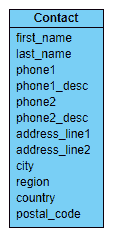
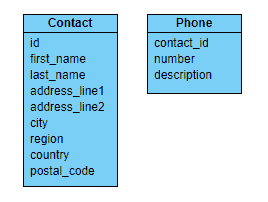
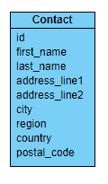
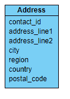
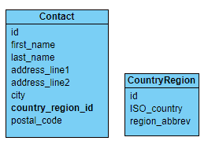

# 范式不仅仅适用于数据库

> 原文：<https://www.freecodecamp.org/news/normal-forms-arent-just-for-databases-2443741bd627/>

#### 您也可以对数据对象类型应用类似的规则。

您可能在定义关系数据库模式的上下文中学习了术语[范式](https://en.wikipedia.org/wiki/Database_normalization#Normal_forms)。数据库规范化努力减少表行和列中的数据冗余。因此，不太可能出现数据异常。

#### 什么是数据异常？

假设我们有这种情况:

> 表 A 包含由 id**X**标识的行的属性 X、Y、Z 的值；这些是关于 x 的 ***断言****假设第**行中的 Y 被断言为值 3。
> 
> 表 B 也包含同样的断言，关于为什么 Y 为 **x 为**
> 
> 表 A 后来被告知，“事实已经改变。Y 现在是 4"
> 
> 表 B 后来查询，说 Y 还是 3。
> 
> 现在 A 和 B 断言了关于 Y 的两个不同的事实，这取决于你查询的是哪个表。***

*这是一种数据异常:对一个事实的两种不同的断言。事实在计算机系统中很重要。*

### *范式的是什么和为什么*

*我将使用术语 **type** 来表示对象的元数据。这可以通过一个[类](https://docs.oracle.com/javase/8/docs/api/java/lang/Class.html)定义、 [mixin](https://www.culttt.com/2015/07/08/working-with-mixins-in-ruby/) 、 [trait](http://php.net/manual/en/language.oop5.traits.php) 、 [stamp](https://medium.com/javascript-scene/introducing-the-stamp-specification-77f8911c2fee) 或者您的偏好和选择的语言所支持的任何机制来实现。我还将关注**数据对象** *，*，例如[POJO](https://spring.io/understanding/POJO)， [PODOs](https://benatkin.com/2012/11/10/podo-generalization-of-pojo/) ，JSON 和类似的简单对象。*

*非正式地说，前三个范式[描述如下](http://www.andrewrollins.com/2009/08/11/database-normalization-first-second-and-third-normal-forms/):*

> *第一范式(1NF):没有重复的元素或元素组
> 
> ；第二范式(2NF):所有非键属性依赖于所有键
> 
> ；第三范式(3NF):不依赖于非键属性*

*那是相当枯燥的读物。但是将这些原则应用于对象类型定义实际上是非常直观的。一旦你内化了这些规则，你甚至不会再有意识地去想它们。*

### *对象也是相关的*

*关系数据库通过主键和外键约束支持**关联**。如果层次结构存在的话，它是隐含的。关联比层次和分类法更松散，但也更难思考。*

*在层次结构中，有父子关系。通常也有数据类型的层次结构(类-子类),这也是模型化的。对象包含层次结构中的关系更受约束，通常是单向的(父到子)，但也比更一般(和灵活)的关联更容易理解。*

#### *1NF:没有重复的元素或元素组*

*假设我们有以下联系信息:*

**

*重复元素在哪里？*

1.  *名称属性:这可以被认为是一对多的关系，其中名称的数量是不确定的(例如英国皇室)。但是，在实践中，名字、姓氏以及可能的中间名对于大多数应用程序域来说已经足够了，所以没有必要对这些字段进行规范化。*
2.  *电话:电话属性的重复看起来确实是一个潜在的问题:两部电话够了吗？如果后来进一步的信息与电话号码相关联，比如可用时间，该怎么办？*
3.  *地址行:同样，两个够了吗？在一些国家，街道地址可以有四行长，但这是极限。因为它们是简单的字符串，所以如果以后再添加一两条地址线也没什么大不了的。*

*以下是一个可能的模型，包括联系人和电话类型:*

**

#### *2NF:所有非键属性都依赖于所有键*

*用简单的英语来说，这是什么意思？在数据库中，这意味着一行中的所有列都应该直接依赖于该行的任何[候选键](https://en.wikipedia.org/wiki/Second_normal_form)。*

*那么让我们再来看看接触:*

**

*这里的键是一个生成的 id 值，有时也称为代理键。地址属性是否依赖于联系人 ID？嗯…*

*这完全取决于领域。*

*这六个地址属性肯定不是联系人的属性，而是标识物理位置的手段。一个联系人可能有多个地址，也许一个地址有多个联系人。*

*这应该被建模为多对多的关系吗，用一些具有联系人 ID 和地址 ID 的 ContactAddress 对象类型？这将取决于什么对你的应用领域是重要的。一些应用程序可能将联系人视为独立于地址强实体，而将地址视为弱实体，依赖于联系人的存在。在这种情况下，一个联系人可以有多个地址，每个地址都指向一个联系人，如下所示:*

**

*有一个潜在的数据异常:如果您更改一个联系人的地址，您不会更改所有联系人的相同地址。如果联系人是你的主要参考来源，那么这可能是你想要的行为:你的联系人移动了(比如说，到了另一个组织),而其余的联系人留在原地。*

#### *3NF:不依赖于非键属性*

*再次查看 Address，您可能会发现两个相关字段， **region** 和 **country。**一个国家可能有也可能没有地区，但一个地区确实有一个国家:你不会想把它们搞混的。*

*确保该地区属于正确国家/地区的一种方法是为每个(国家/地区)对创建一个标识符，然后让地址引用该标识符，而不是单独引用地区和国家/地区:*

**

#### *关于生成的标识符*

*在我看来，生成的标识符是一个实现细节，实际上只有在修改或删除后端记录(比如数据库中的一行)时，客户端代码才需要，而不是作为只读查询的一部分。它们也不应该被系统的用户看到，因为它们毫无意义。*

### *每种类型的表，每种类型的表层次结构*

*规范化对象类型的优点是它们可以很容易地映射到关系数据库表。对于关系数据库实现，表镜像对象类型([每种类型的表](https://blog.devart.com/table-per-type-vs-table-per-hierarchy-inheritance.html))或者至少包含从基本类型派生的多种类型的信息([每种类型层次结构的表](https://www.codeproject.com/Articles/545395/A-Beginners-Tutorial-on-Understanding-Table-Per-Ty))。这听起来好像我在提倡[对象-关系映射](https://en.wikipedia.org/wiki/Object-relational_mapping)，但是不……我只是说让你的[逻辑模型](https://www.1keydata.com/datawarehousing/logical-data-model.html)在**概念** 层次上共享[物理模型](https://www.1keydata.com/datawarehousing/physical-data-model.html)的相同特征是有益的。实施完全是另一个问题。*

### ***参考文献***

*有大量关于关系数据库模式规范化的资源:*

*[**数据库规范化:第一、第二、第三范式——安德鲁·罗林斯**](http://www.andrewrollins.com/2009/08/11/database-normalization-first-second-and-third-normal-forms/)
[*几周前我看了一篇关于第一、第二、第三范式的精彩讲解。对于那些知道什么数据库…*](http://www.andrewrollins.com/2009/08/11/database-normalization-first-second-and-third-normal-forms/)
[www.andrewrollins.com](http://www.andrewrollins.com/2009/08/11/database-normalization-first-second-and-third-normal-forms/)*

*[**数据库第二范式用简单的英语解释**](https://www.essentialsql.com/get-ready-to-learn-sql-10-database-second-normal-form-explained-in-simple-english/)
[*第二篇文章重点介绍第一范式，它的定义，并举例说明。现在是……*](https://www.essentialsql.com/get-ready-to-learn-sql-10-database-second-normal-form-explained-in-simple-english/)
[www.essentialsql.com](https://www.essentialsql.com/get-ready-to-learn-sql-10-database-second-normal-form-explained-in-simple-english/)的时候了*

*[**什么是第二范式(2NF)？-来自 Techopedia 的定义**](https://www.techopedia.com/definition/21980/second-normal-form-2nf)
[*第二范式 2NF 定义-第二范式(2NF)是规范化数据库的第二步。2NF 构建…*](https://www.techopedia.com/definition/21980/second-normal-form-2nf)
[www.techopedia.com](https://www.techopedia.com/definition/21980/second-normal-form-2nf)*

*[**数据库第三范式用简单的英语解释**](https://www.essentialsql.com/get-ready-to-learn-sql-11-database-third-normal-form-explained-in-simple-english/)
[*第三篇文章重点介绍了第二范式，它的定义，并举例说明。曾经有一张表是在…*](https://www.essentialsql.com/get-ready-to-learn-sql-11-database-third-normal-form-explained-in-simple-english/)
[【www.essentialsql.com】](https://www.essentialsql.com/get-ready-to-learn-sql-11-database-third-normal-form-explained-in-simple-english/)*

*此外，在研究这篇文章时，我遇到了一个关于如何将规范化规则应用于对象类型的不同观点。*

*[**班级正规化简介**](http://www.agiledata.org/essays/classNormalization.html)
[www.agiledata.org](http://www.agiledata.org/essays/classNormalization.html)*