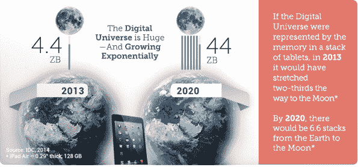
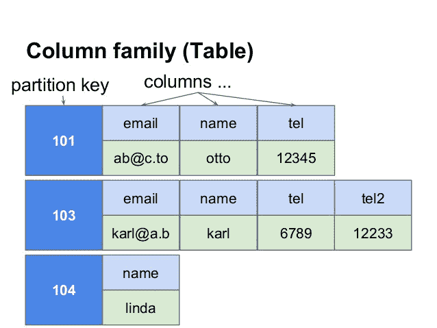
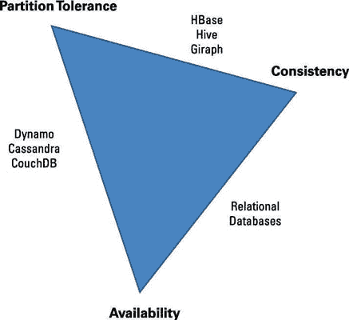
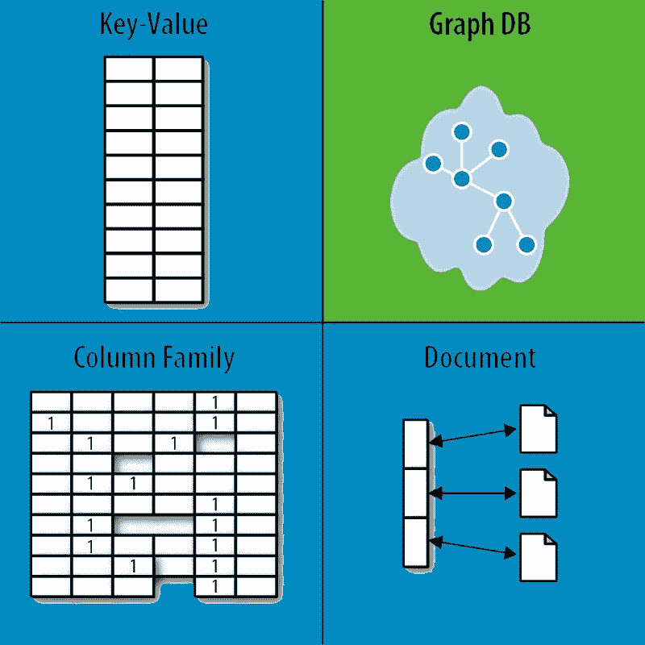
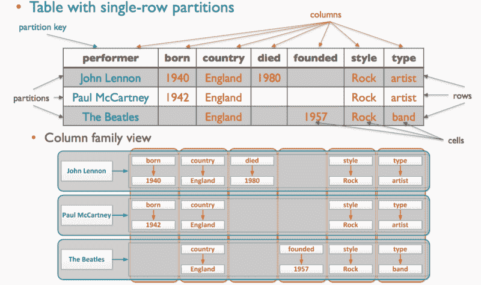
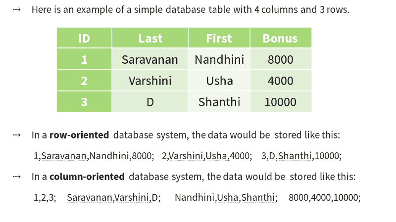
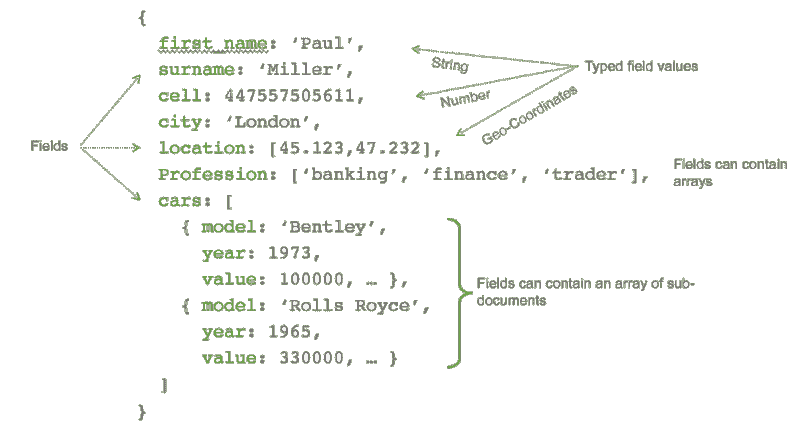
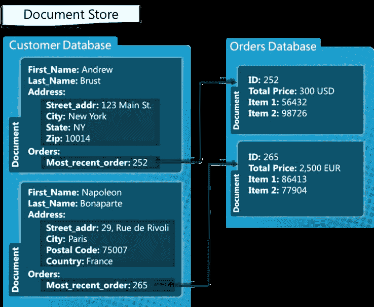
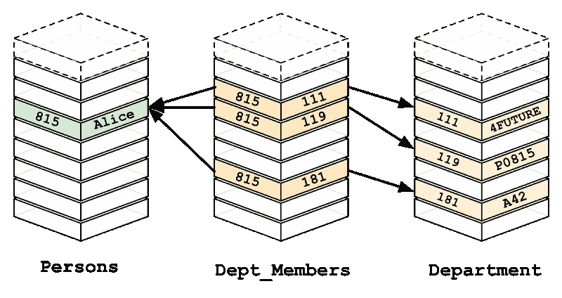
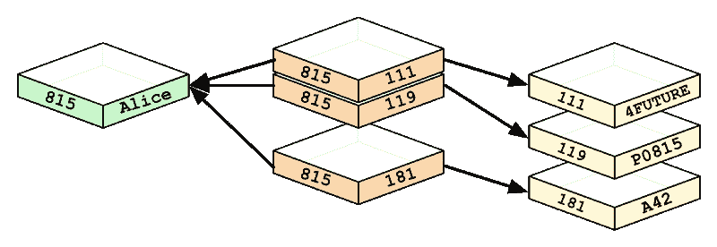

# NoSQL 数据库的基础——以及我们为什么需要它们

> 原文：<https://www.freecodecamp.org/news/nosql-databases-5f6639ed9574/>

作者:Nandhini Saravanan

#### NoSQL 世界入门指南

组织数据是一项非常困难的任务。当我们说整理时，我们实际上是根据物品的类型和功能对其进行分类。


[Source](https://bitnine.net/wp-content/uploads/2016/12/SQL-vs.-NoSQL-Comparative-Advantages-and-Disadvantages.jpg)

一种选择是 RDBMS 就像一个 Excel 表——你以表格的形式对数据进行分类。您可以在表之间形成关系。

一个 ***查询*** 向数据库提问，数据库给你一个相关的回答作为回报。这种查询语言是 **SQL** 或**结构化查询语言。**

举个例子，

```
select * from Employee_Data;
```

从 Employee_Data 表中选择所有雇员数据。

关系数据库遵循一个 [***模式***](https://en.wikipedia.org/wiki/Database_schema) ，一个你的表如何工作的详细蓝图。

你使用亚马逊、脸书和许多网络应用。他们发布更新，增加新的功能，甚至额外的模块。那么如何每次都改变模式呢？这样的大公司投入时间和劳动去改变模式难道不浪费时间吗？

这就是 SQL 无法工作的地方。

### 关系数据库管理系统的缺点

关系数据库并不像现在人们描述的那样糟糕。许多组织仍在使用它们。NoSQL 的引入是为了填补 RDBMS 不再有用的空白。

我将向你展示一些例子，以便你有一个清晰的理解。

#### 1.RDBMS 不能处理“数据多样性”。

非结构化数据的数量每年都在持续增长，管理这些数据非常困难。RDBMS 不能在统一的表模式下强制所有类型的数据。

数据孤岛对于开发者来说也是一个问题。

根据[技术目标](https://www.techtarget.com/),**数据仓**是一个由一个部门控制的数据仓库。它与组织的其他部分相隔离。

这意味着，当相同的数据存在多个孤岛时，它们的内容可能会有所不同。它会混淆哪个存储库代表最新的版本。

下图显示了从 2013 年到 2020 年的数据增长。

> 2020 年将会产生大约 44 Zeta 字节的数据。

在 RDBMS 中处理如此多样的彼此不相关的数据可能要困难得多。



[Source](https://www.emc.com/leadership/digital-universe/2014iview/executive-summary.htm)

**示例:**很难存储患者的详细信息，因为患者的身体状况各不相同。在 RDBMS 中，对如此多样的数据进行分类是很困难的。

#### 2.难以更改表和关系。

改变表之间的关系或添加新表会影响现有的关系。这意味着改变模式。

模式的改变就像删除现有的模式并设计一个新的模式。

添加新功能需要所有元素来支持新结构。变化是不可避免的。

**示例:**每个额外的列需要所有先前的行都有该列的值。而在 **Cassandra** (一个 NoSQL 数据库)中，您可以向特定的行分区添加一列。



In RDBMS, every entry should have the same number of columns. But in Cassandra, each row can have a different number of columns. As you can see, 104 has name only whereas 103 has email, name, tel and tel2\. — [Markus Klems](https://www.slideshare.net/yellow7?utm_campaign=profiletracking&utm_medium=sssite&utm_source=ssslideview)

#### 3.RDBMS 遵循数据库的 ACID 属性。

数据库的 ACID 属性是原子性、一致性、隔离性和持久性。‌

**原子性**——一种“全有或全无”的方法。如果事务中的任何语句失败，整个事务都将回滚。

**一致性—** 交易必须符合系统定义的所有协议。没有半完成的交易。

**隔离—** 任何事务都不能访问任何其他处于中间或未完成状态的事务。每个事务都是独立的。

**持久性** —确保一旦事务提交到数据库，就通过使用备份和事务日志来保存它。

酸性是不灵活的。

例如，RDBMS 遵循 [**规范化**](https://en.wikipedia.org/wiki/Database_normalization) 或**单点真实**的概念。对于您所做的每个更改，您都应该确保严格的 ACID 属性。[实体完整性](https://en.wikipedia.org/wiki/Entity_integrity)和[参照完整性](https://en.wikipedia.org/wiki/Referential_integrity)规则也适用。

### CAP 定理

根据[维基百科](https://en.wikipedia.org/wiki/CAP_theorem),**上限定理**(布鲁尔定理)指出，分布式数据存储不可能**同时提供以下三种保证中的两种以上**:

**稠度:**像酸中的 C。

可用性:‌Resources 应该总是可用的。应该有一个无错误的响应。

**分区容差**:无单点(或节点)故障。

三个条件都很难做到。一个人必须在三者之间妥协。



[Source](https://www.dummies.com/wp-content/uploads/423504.image0.jpg)

### 基地来救援了！

‌NoSQL 依赖于一个被称为基础模型的软模型。**基础** ( **B** 辅助 **A** 可用， **S** oft 状态，**E**vent consistency)。

**基本可用:**保证数据的可用性。任何请求都会有响应(也可能是失败)。

**软状态**:系统的状态可能会随着时间而改变。

**最终一致性:**一旦停止接收输入，系统最终会变得一致。

NoSQL 数据库放弃了 A、C 和/或 D 需求，作为回报，它们提高了可伸缩性。

### NoSQL

这是 NoSQL 来救援。‌它是"**不仅 SQL"** 还是"非关系型"数据库。

NoSQL 的特点:

*   模式自由
*   最终一致(如在基本属性中)
*   复制数据存储以避免单点故障。
*   可以处理各种数据和大量数据。

### NoSQL 数据库的类型

NoSQL 数据库分为四大类:

**关键价值存储—** Riak、Voldemort 和 Redis

**宽列商店—** Cassandra 和 HBase。

**文档数据库—** MongoDB

**图形数据库** — Neo4J 和 HyperGraphDB。

右边的单词是 NoSQL 数据库类型的例子。



[Source](https://s3.amazonaws.com/dev.assets.neo4j.com/wp-content/uploads/nosql-quadrant.jpg)

### 1.**键值存储**

键值存储使用一个**散列表**，其中存在一个**唯一键**和一个指向特定数据项的**指针**。

想象一下，键值存储就像一个电话号码簿，个人的名字和他们的号码被映射在一起。

键值存储没有默认的查询语言。使用 *get、put 和 delete* 命令检索数据。这就是它拥有**高性能的原因。**

**应用**:用于存储评论和会话信息。‌Pinterest 使用 Redis 来存储用户、关注者、非关注者和留言板的列表。

### **2。宽列商店**

在列存储数据库中，每一行中的列都包含在该行中。

每个**列族**都是 RDBMS 表中行的容器。**键**标识由多列组成的行。

行不需要具有与列数相同的列数**。可以随时将列添加到任何行，而不必将其添加到其他行。这是一个**分区行存储。****



[Source](https://studio3t.com/wp-content/uploads/2017/12/cassandra-column-family-example.png)

#### **柱状数据库如何存储数据？**



How columnar stores store data

**应用** : [**Spotify**](https://www.spotify.com/) 使用 Cassandra 存储用户资料属性和元数据。

### **3。文档数据库**

‌Document 商店使用 JSON、XML 或 bson(JSON 的二进制编码)文档来存储数据。

它类似于键值数据库，但是文档存储由**半结构化数据**组成。

单个文档用于存储记录及其数据。

‌It **不支持关系或连接。**



An example of a JSON document — [Source](https://webassets.mongodb.com/_com_assets/cms/JSON_Example_Python_MongoDB-mzqqz0keng.png)

如果我们想存储客户的详细信息和他们的订单，我们可以使用文档存储来实现。



The Customer database is stored as a set of documents(can be JSON) which is mapped to the Orders database. Source : [MSDN Microsoft Blog](https://blogs.msdn.microsoft.com/usisvde/2012/04/05/getting-acquainted-with-nosql-on-windows-azure/)

应用:‌ [**世嘉**](https://www.sega.com/games) 使用 MongoDB 处理建立在 MongoDB 上的 1100 万个游戏内账号。

### **4。图形数据库**

‌Nodes 和关系是图形数据库的基本组成部分。一个**节点代表一个实体。**一个**关系**表示两个节点是如何关联的。

‌In RDBMS，增加另一个关系导致大量的模式变化。

图形数据库只需要存储一次数据(节点)。不同类型的关系(边)被指定给存储的数据。

节点之间的关系是预先确定的，也就是说，它不是在查询时确定的。

遍历**持久关系**更快。

很难改变两个节点之间的关系。这将导致数据库的倒退变化。

**示例**:这张图片是 **MySQL** 的工作方式，它必须执行许多操作来为爱丽丝找到正确的结果。



[Source](https://s3.amazonaws.com/dev.assets.neo4j.com/wp-content/uploads/from_relational_model.png)

‌ **一个图形数据库**，它**预先确定关系。**



[Source](https://s3.amazonaws.com/dev.assets.neo4j.com/wp-content/uploads/relational_to_graph.png)

这是你开始探索 NoSQL 需要的一些基本信息。新的数据库正被发明用于特殊用途。

了解应用程序生成的数据类型，然后就很容易选择合适的数据库。

#### 我写关于生活课程、编码和技术的故事。要阅读更多内容，请在[推特](https://twitter.com/snandhini98)和[媒体上关注我。](http://medium.com/@nandhus05)