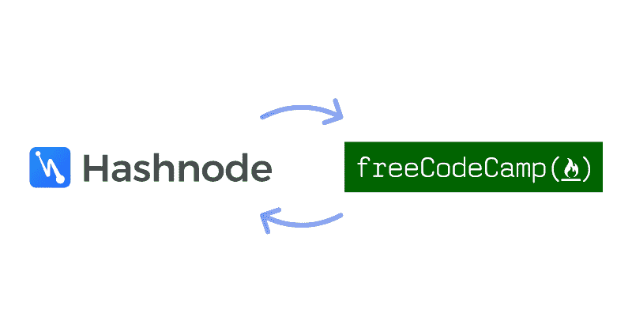
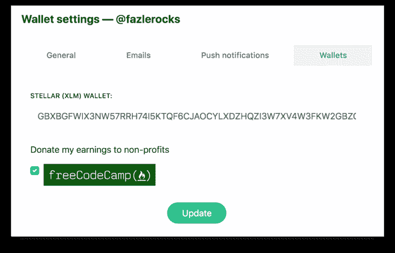

# 现在你可以通过回答 Hashnode 上的编程问题来支持 freeCodeCamp

> 原文：<https://www.freecodecamp.org/news/now-you-can-support-freecodecamp-by-answering-questions-on-hashnode-24b8876fd129/>

赛义德·法兹勒·拉赫曼

# 现在你可以通过回答 Hashnode 上的编程问题来支持 freeCodeCamp，然后捐赠你获得的密码

你好。？

我的名字是 [Fazle](https://twitter.com/fazlerocks) ，我经营着 [Hashnode](https://hashnode.com) ，这是一个面向软件开发人员的友好且包容的社区。

如果你还没有机会访问 Hashnode，你可以先看看几个月前自由代码营创始人 T2·昆西·拉森做的这个“问我任何问题”节目。

上周，Hashnode 宣布了✨ [加密奖励计划](https://hashnode.com/crypto-rewards?tab=announcement) ✨，奖励开发者(加密货币)提出问题并写出答案。

该计划的要点如下:

*   如果你在 Hashnode 上问了一个问题，我们决定给它附加一个奖励，你会得到固定数量的恒星流明(XLM)。
*   如果你回答了一个带有奖金的问题，并且社区选择了它作为最佳答案(通过向上投票？还有欣赏？)，您将获得赏金金额。

赏金金额始终以恒星流明(XLM)加密货币为单位。你可以阅读完整的公告，并了解它是如何运作的[在这里](https://hashnode.com/crypto-rewards?tab=announcement)。

### 把你的奖金捐给自由代码营

最近，一些社区成员联系我们，询问他们是否可以将获得的加密货币捐赠给帮助开发者的非营利组织。

我已经和昆西·拉森联系了一段时间，我非常喜欢 freeCodeCamp 和他的工作。因此，我们决定合作并帮助 Hashnode 用户将他们的加密奖励直接捐赠给 freeCodeCamp。

在 Hashnode 上，您可以在您的设置页面中启用选项**“将我的收入捐赠给 freeCodeCamp”**。一旦启用，您赢得的流明将在每次付款时自动转移到 freeCodeCamp 的钱包中。

您可以随时跟踪您捐赠的加密货币的数量，您的公共档案将展示您对 freeCodeCamp 的支持。

### 说够了。帮我开始吧！

以下是你现在可以开始的方法:

*   [在 Hashnode 上登录或注册](https://hashnode.com)。加入不到 6 秒。
*   在[您的设置](https://hashnode.com/settings/wallets)中更新您的 XLM 钱包地址，并启用“捐赠给 freeCodeCamp”选项。
*   [浏览有赏金的问题](https://hashnode.com/crypto-rewards)回答喜欢的。如果它得到了社区最多的支持和赞赏，你将获得奖金。

或者:

*   [像平常在 Hashnode 上一样问一个问题](https://hashnode.com/create/question)。如果它被 Hashnode 团队选为奖励问题，您将获得固定的奖金。

### 分享你的编程智慧，帮助一个好的事业

我们对这次合作感到非常兴奋。通过鼓掌和分享这篇文章，帮助我们向尽可能多的开发者传播这个消息。？

期待您参与[加密奖励计划](https://hashnode.com/crypto-rewards?tab=announcement)。:)