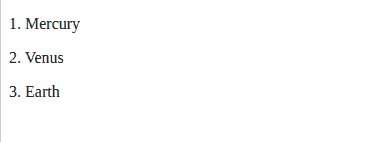
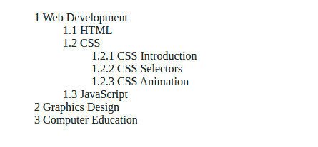
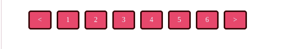

# 如何用 CSS 计数器自动给元素编号

> 原文：<https://www.freecodecamp.org/news/numbering-with-css-counters/>

CSS 计数器用于向元素添加计数。通过提供可以初始化的**变量**(使用`counter-reset`)来增加计数，然后这些变量可以通过 CSS 规则递增。

许多开发人员忽略了这个强大的 CSS 特性，这就是为什么我们要在本教程中讨论如何使用计数器。

## 何时使用 CSS 计数器

CSS 计数器可以在你的网页需要计数系统的时候使用。一些最佳使用案例包括:

*   复杂列表编号
*   创建动态分页链接
*   车载系统中的编号步骤。

在本教程中，我们将讨论如何使用 CSS 计数器**制作复杂列表**和**创建动态分页**。

## 如何使用 CSS 计数器

CSS 计数系统由`counter-reset`、`counter-increment`、`counter()`、`counters()`和`content`属性组成。这些属性负责你在 CSS 计数系统中需要做的一切。

让我们更仔细地看看这些属性，以便了解如何使用它们。

### 计数器属性解释

*   `counter-reset`:用于**复位**或**初始化**计数器。要使用 CSS 计数器，您必须首先创建一个具有此属性的计数器。
*   `counter-increment`:用于**增加**一个已经**初始化的**计数器的变量。
*   这个函数很神奇。它在内容属性内部使用，在一个`:before`或`:after`伪选择器上，对**加总**计数。
*   `counters()`:用于继承计数，在子代中生成父计数器**变量**的实例。
*   `content`:用于**通过操作`:before`和`:after` [css 选择器](https://lyty.dev/css/css-selector.html)的内容，将**计数**值**(字符串)相加。

既然我们已经理解了这些 CSS 计数器属性和值，让我们深入到我们的例子中。

## 给网页上的元素编号

编号可以在 HTML 中完成，但 CSS 编号提供了使用 CSS 计数器完成工作的动态且易于控制的方式。下面的例子将使用 CSS 对网页上的元素进行编号。

首先，我们将设置一些简单的编号，只进行一级编号。然后我们将进入一个更高级的例子，我们将建立一个目录表。

### 简单编号

在这个例子中，我们将使用 CSS 创建一个简单的项目计数器。在您的 HTML 中，只需创建如下所示的项目结构:

```
<div>
  <p>Mercury</p>
  <p>Venus</p>
  <p>Earth</p>
</div> 
```

在 CSS 中，我们要做三件关键的事情:

1.  使用`counter-reset`初始化父 div 上的计数器
2.  使用`counter-increment`将子`div p`上的计数器值增加 1
3.  使用`:before`伪选择器在`div p`内容前添加计数器变量。

我们走吧！

```
div {
  list-style-type: none;
  counter-reset: css-counter 0; /* initializes counter to 0; use -1 for zero-based numbering */
}

div p {
  counter-increment: css-counter 1; /* Increase the counter by 1\. */
}

div p:before {
  content: counter(css-counter) ". "; /* Apply counter before children's content. */
} 
```

### 结果呢



上面的编号是用纯 CSS 完成的。很有趣，对吧？

现在我们要实现一些更复杂的编号，这使得 CSS 计数器值得学习。我们将使用`counters()`函数对嵌套元素进行编号，该函数可用于继承计数。这将在子级中生成父级计数器的实例。

### 目录编号

```
<ul>
  <li>
    Web Development
    <ul>
      <li>HTML</li>
      <li>
        CSS
        <ul>
          <li>CSS Introduction</li>
          <li>CSS Selectors</li>
          <li>CSS Animation</li>
        </ul>
      </li>
      <li>JavaScript</li>
    </ul>
  </li>
  <li>Graphics Design</li>
  <li>Computer Education</li>
</ul> 
```

CSS 看起来像这样:

```
ul {
  list-style-type: none;
  counter-reset: css-counters 0; /* intializes counter, set -1 for zero-based counters */
}

ul li:before {
  counter-increment: css-counters;
  content: counters(css-counters, ".") " "; /* generates inherited counters from parents */
} 
```

### 结果呢



现在你可以用`counters()`看到嵌套计数的威力了。这样就省去了不恰当嵌套的麻烦。为了帮助您避免错误，它继承了父级的计数器属性，并将子级的计数器附加到它上面。

现在我们已经很好地对元素进行了编号，接下来呢？

## 制作动态分页

用 CSS 计数器进行分页非常简单。分页通常是用 HTML 来完成的，重复相同的元素集并改变其中的数字来创建到结果的每一页的导航。

开发人员可以选择使用一些动态的东西，比如生成元素的循环，或者从服务器上完成。但是今天我们要用 CSS 动态地做到这一点！

怎么会？用我们的高级`counters()`功能。

同样的方法，我们已经为上面的编号增加了值，我们也可以用 CSS 计数器制作一个动态分页列表(你猜对了)。

让我们开始:

```
<ul>
  <li class="previous">&lt;</li>
  <li></li>
  <li></li>
  <li></li>
  <li></li>
  <li></li>
  <li></li>
  <li class="next">&gt;</li>
</ul> 
```

**注:**`li`里面不用加数字，想做多少就做多少。我们的 CSS `counters()`将为我们进行编号。

CSS 看起来像这样:

```
ul {
  list-style-type: none;
  counter-reset: paginate-counter 0;
}

ul li {
  border: solid 3px #ccc;
  color: #36f;
  border: 5px;
  float: left;
  margin: 5px;
  padding: 8px 10px;
  font-size: 14px;
  cursor: pointer;
  text-align: center;
}

/* Setting styles for the inner text */
ul li:not(.previous):not(.next):before {
  counter-increment: paginate-counter;
  content: counter(paginate-counter);
} 
```

结果



你还能用计数器做什么？让我听听你的想法。

谢谢！