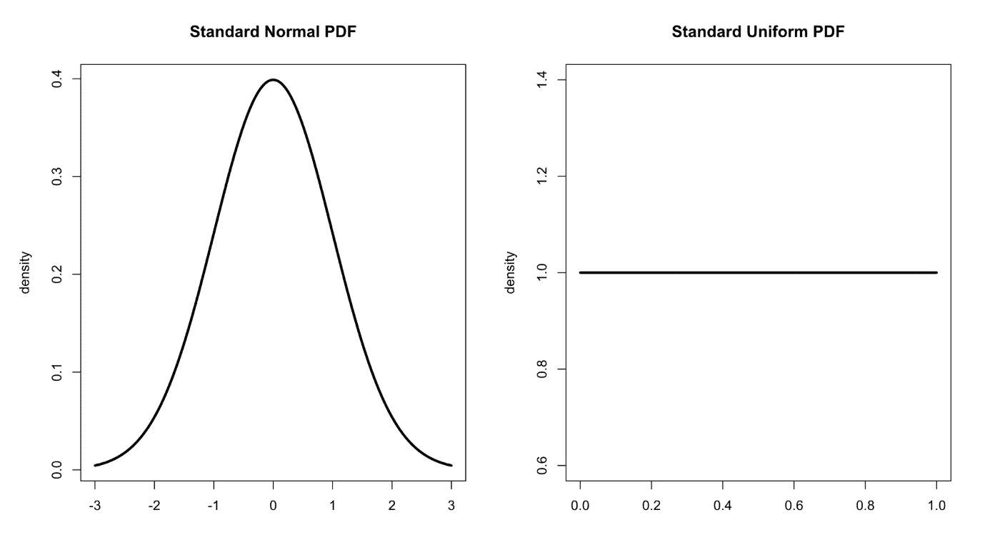

# Python NumPy 速成班——如何为机器学习构建 N 维数组

> 原文：<https://www.freecodecamp.org/news/numpy-crash-course-build-powerful-n-d-arrays-with-numpy/>

NumPy 是一个用于执行大规模数值计算的 Python 库。它非常有用，尤其是在机器学习方面。让我们看看 NumPy 提供了什么。

# NymPy 简介

NumPy 是一个 Python 库，用于对大型数据集执行数值计算。这个名字代表数值 Python，它是数据科学家使用的一个流行库，特别是用于机器学习问题。

在使用机器学习算法训练数据之前，NumPy 在预处理数据时非常有用。

与 Python 列表相比，在 NumPy 中使用 n 维数组更容易。NumPy 数组也比 Python 列表快，因为与列表不同，NumPy 数组存储在内存中的一个连续位置。这使得处理器能够有效地执行计算。

在本文中，我们将了解使用 NumPy 的基础知识，包括数组操作、矩阵转换、生成随机值等等。

# 装置

NumPy 官网上提供了明确的安装说明，所以我不打算在本文中重复。[请在这里找到这些说明](https://numpy.org/install/)。

# 使用 NumPy

## 导入数字

要开始在脚本中使用 NumPy，您必须导入它。

```
import numpy as np
```

## 将数组转换为 NumPy 数组

您可以使用 np.array()方法将现有的 Python 列表转换成 NumPy 数组，如下所示:

```
arr = [1,2,3]
np.array(arr)
```

这也适用于多维数组。NumPy 将跟踪数组的形状(维度)。

```
nested_arr = [[1,2],[3,4],[5,6]]
np.array(nested_arr)
```

## 数字排列功能

在处理数据时，您经常会遇到需要生成数据的用例。

NumPy 作为一个“arrange()”方法，用它可以生成两个数字之间的一系列值。arrange 函数接受起点、终点和一个可选的距离参数。

```
print(np.arrange(0,10)) # without distance parameter
OUTPUT:[0 1 2 3 4 5 6 7 8 9]

print(np.arrange(0,10,2)) # with distance parameter
OUTPUT: [0 2 4 6 8]
```

## 零和一

您还可以使用 NumPy 生成 0 或 1 的数组或矩阵(相信我，您会需要它)。以下是方法。

```
print(np.zeros(3))
OUTPUT: [0\. 0\. 0.]

print(np.ones(3))
OUTPUT: [1\. 1\. 1.]
```

这两个函数也支持 n 维数组。您可以将形状添加为包含行和列的元组。

```
print(np.zeros((4,5)))
OUTPUT:
[
 [0\. 0\. 0\. 0\. 0.]
 [0\. 0\. 0\. 0\. 0.]
 [0\. 0\. 0\. 0\. 0.]
 [0\. 0\. 0\. 0\. 0.]
 [0\. 0\. 0\. 0\. 0.]
]

print(np.ones((4,5)))
OUTPUT:
[
 [1\. 1\. 1\. 1\. 1.]
 [1\. 1\. 1\. 1\. 1.]
 [1\. 1\. 1\. 1\. 1.]
 [1\. 1\. 1\. 1\. 1.]
 [1\. 1\. 1\. 1\. 1.]
]
```

## 单位矩阵

还可以使用一个名为“eye”的内置 NumPy 函数生成一个[单位矩阵](https://en.wikipedia.org/wiki/Identity_matrix)。

```
np.eye(5)
OUTPUT:
[[1., 0., 0., 0., 0.]
[0., 1., 0., 0., 0.]
[0., 0., 1., 0., 0.]
[0., 0., 0., 1., 0.]
[0., 0., 0., 0., 1.]]
```

## NumPy Linspace 函数

NumPy 有一个 linspace 方法，可以在两个数之间生成均匀间隔的点。

```
print(np.linspace(0,10,3))
OUTPUT:[ 0\.  5\. 10.]
```

在上面的例子中，第一个和第二个参数是起点和终点，而第三个参数是起点和终点之间需要的点数。

这里是同样的范围，有 20 个点。

```
print(np.linspace(0,10,20))
OUTPUT:[ 0\. 0.52631579  1.05263158  1.57894737  2.10526316  2.63157895   3.15789474  3.68421053  4.21052632  4.73684211  5.26315789  5.78947368   6.31578947  6.84210526  7.36842105  7.89473684  8.42105263  8.94736842   9.47368421 10.]
```

## 随机数生成

当你在处理机器学习问题时，你经常需要生成随机数。NumPy 对此也有内置函数。

但是在我们开始生成随机数之前，让我们来看看两种主要的分布类型。



### 正态分布

在[标准正态分布](https://www.mathsisfun.com/data/standard-normal-distribution.html)中，数值在中间达到峰值。

正态分布是统计学中一个非常重要的概念，因为它出现在许多自然现象中。它也被称为“钟形曲线”。

### 均匀分布

如果分布中的值的概率为常数，则称之为[均匀分布](https://www.investopedia.com/terms/u/uniform-distribution.asp)。

例如，一次掷硬币具有均匀的分布，因为在一次掷硬币中得到正面或反面的概率是相同的。

现在你已经知道了两个主要的分布是如何工作的，让我们来生成一些随机数。

*   要生成均匀分布的随机数，请使用 ****np.random**** 中的 ****rand()**** 函数:

```
print(np.random.rand(10)) # array
OUTPUT: [0.46015141 0.89326339 0.22589334 0.29874476 0.5664353  0.39257603  0.77672998 0.35768031 0.95087408 0.34418542]

print(np.random.rand(3,4)) # 3x4 matrix
OUTPUT:[[0.63775985 0.91746663 0.41667645 0.28272243]  [0.14919547 0.72895922 0.87147748 0.94037953]  [0.5545835  0.30870297 0.49341904 0.27852723]]
```

*   要生成正态分布的随机数，请使用 ****np.random**** 中的 ****randn()**** 函数:

```
print(np.random.randn(10))
OUTPUT:[-1.02087155 -0.75207769 -0.22696798  0.86739858  0.07367362 -0.41932541   0.86303979  0.13739312  0.13214285  1.23089936]

print(np.random.randn(3,4))
OUTPUT: [[ 1.61013773  1.37400445  0.55494053  0.23133522]  [ 0.31290971 -0.30866402  0.33093618  0.34868954]  [-0.11659865 -1.22311073  0.36676476  0.40819545]]
```

*   要生成高低值之间的随机整数，请使用 ****np.random**** 中的 ****randint()**** 函数:

```
print(np.random.randint(1,100,10))
OUTPUT:[64 37 62 27  4 33 23 52 70  7]

print(np.random.randint(1,100,(2,3)))
OUTPUT:[[92 42 38]  [87 69 38]]
```

如果你想让你的随机数在每次计算中保持一致，就使用一个[种子值](https://en.wikipedia.org/wiki/Random_seed)。下面是如何在 NumPy 中设置种子值。

*   要在 NumPy 中设置种子值，请执行以下操作:

```
np.random.seed(42)
print(np.random.rand(4))
OUTPUT:[0.37454012, 0.95071431, 0.73199394, 0.59865848]
```

每当你使用一个种子数字，你将总是得到相同的数组生成没有任何变化。

## 重塑数组

作为一名数据科学家，您将为不同类型的计算重塑数据集。在这一节中，我们将看看如何处理数组的形状。

*   要获得数组的形状，使用 ****形状**** 属性。

```
arr = np.random.rand(2,2)
print(arr)
print(arr.shape)
OUTPUT:[
[0.19890857 0.00806693]
[0.48199837 0.55373954]
]
(2, 2)
```

*   要整形一个数组，使用****shape()****函数。

```
print(arr.reshape(1,4))
OUTPUT: [[0.19890857 0.00806693 0.48199837 0.55373954]]
print(arr.reshape(4,1))
OUTPUT:[
[0.19890857]
[0.00806693]
[0.48199837]
[0.55373954]
]
```

为了永久地改变一个数组的形状，你必须将改变形状的数组赋给 arr 变量。

此外，仅当现有结构有意义时，整形才有效。您不能将 2x2 阵列重新调整为 3x1 阵列。

## 切片数据

让我们看看从 NumPy 数组中获取数据。在获取操作中，NumPy 数组的工作方式类似于 Python 列表。

*   要分割数组，请执行以下操作:

```
myarr = np.arange(0,11)
print(myarr)
OUTPUT:[ 0  1  2  3  4  5  6  7  8  9 10]

sliced = myarr[0:5]
print(sliced)
OUTPUT: [0 1 2 3 4]

sliced[:] = 99
print(sliced)
OUTPUT: [99 99 99 99 99]

print(myarr)
OUTPUT:[99 99 99 99 99  5  6  7  8  9 10]
```

如果你看一下上面的例子，即使我们把“myarr”的切片赋给了变量“sliced”，改变“sliced”的值也会影响原来的数组。这是因为“切片”只是指向原始数组。

要制作一个数组的独立部分，使用 ****copy()**** 函数。

```
sliced = myarr.copy()[0:5]
```

*   对多维数组切片的工作方式与一维数组相似。

```
my_matrix = np.random.randint(1,30,(3,3))
print(my_matrix)
OUTPUT: [
[21  1 20]
[22 16 27]
[24 14 22]
]

print(my_matrix[0]) # print a single row
OUTPUT: [21  1 20]

print(my_matrix[0][0]) # print a single value or row 0, column 0
OUTPUT: 21

print(my_matrix[0,0]) #alternate way to print value from row0,col0
OUTPUT: 21
```

## 数组计算

现在让我们看看数组计算。NumPy 以其在大型多维数组上执行复杂计算时的速度而闻名。

我们来试几个基本操作。

```
new_arr = np.arange(1,11)
print(new_arr)
OUTPUT: [ 1  2  3  4  5  6  7  8  9 10]
```

*   添加

```
print(new_arr + 5)
OUTPUT: [ 6  7  8  9 10 11 12 13 14 15]
```

*   减法

```
print(new_arr - 5)
OUTPUT: [-4 -3 -2 -1  0  1  2  3  4  5]
```

*   数组加法

```
print(new_arr + new_arr)
OUTPUT: [ 2  4  6  8 10 12 14 16 18 20]
```

*   数组除法

```
print(new_arr / new_arr)
OUTPUT:[1\. 1\. 1\. 1\. 1\. 1\. 1\. 1\. 1\. 1.]
```

对于[零除法误差](https://airbrake.io/blog/python-exception-handling/zerodivisionerror-2)，Numpy 会将数值转换为 NaN(不是数字)。

NumPy 中还有一些内置的计算方法可以用来计算平均值、标准差、方差等值。

*   Sum — np.sum()
*   平方根— np.sqrt()
*   Mean — np.mean()
*   方差— np.var()
*   标准差— np.std()

使用 2d 数组时，您通常需要计算行或列的总和、平均值、方差等。您可以使用可选的 axis 参数来指定是选择行还是列。

```
arr2d = np.arange(25).reshape(5,5)
print(arr2d)
OUTPUT: [
[ 0  1  2  3  4]
[ 5  6  7  8  9]
[10 11 12 13 14]
[15 16 17 18 19]
[20 21 22 23 24]
]

print(arr2d.sum())
OUTPUT: 300

print(arr2d.sum(axis=0))  # sum of columns
OUTPUT: [50 55 60 65 70]

print(arr2d.sum(axis=1)) #sum of rows
OUTPUT: [ 10  35  60  85 110]
```

## 条件运算

您还可以使用方括号符号通过 NumPy 进行条件过滤。这里有一个例子:

```
arr = np.arange(0,10)
OUTPUT: [0,2,3,4,5,6,7,8,9]

print(arr > 4)
OUTPUT: [False False False False False  True  True  True  True  True]

print(arr[arr > 4])
OUTPUT: [5 6 7 8 9]
```

# 摘要

当涉及到处理大型数据集时，NumPy 是您工具箱中的一个强大工具。它能够处理高级数值计算和复杂的 n 维数组运算。

如果你打算开始机器学习的职业生涯，我强烈建议你学习 NumPy。

如果你想尝试这些例子，这里有一个 Google colab 笔记本。

[****每周一早上把我的文章****](https://tinyletter.com/manishmshiva) 和视频汇总发到你的邮箱里。也可以 [****在这里和我****](https://www.manishmshiva.com/) 连线。