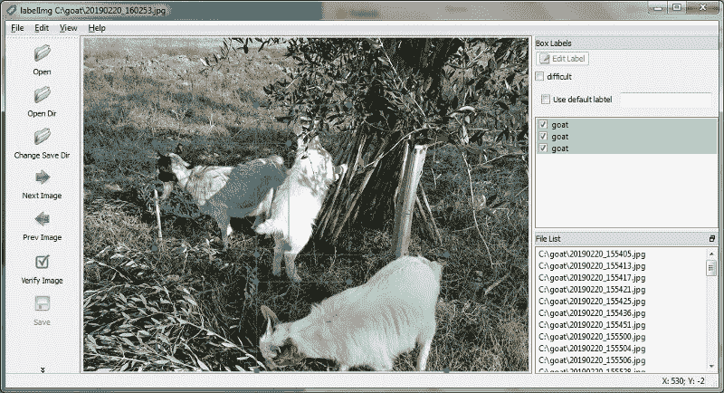
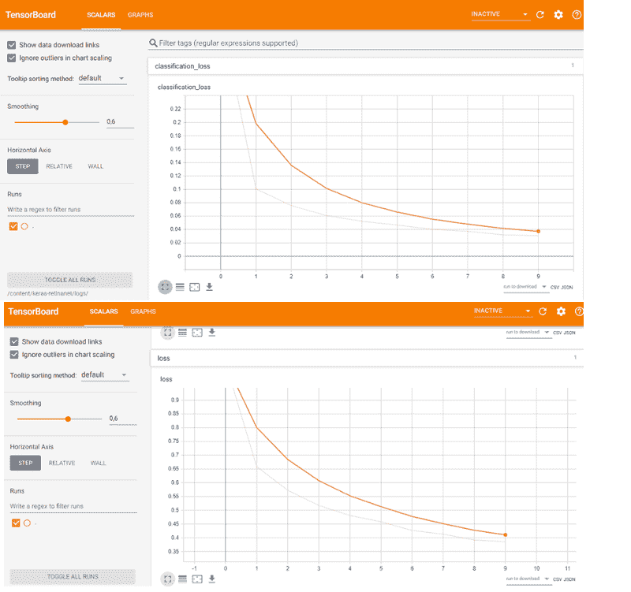
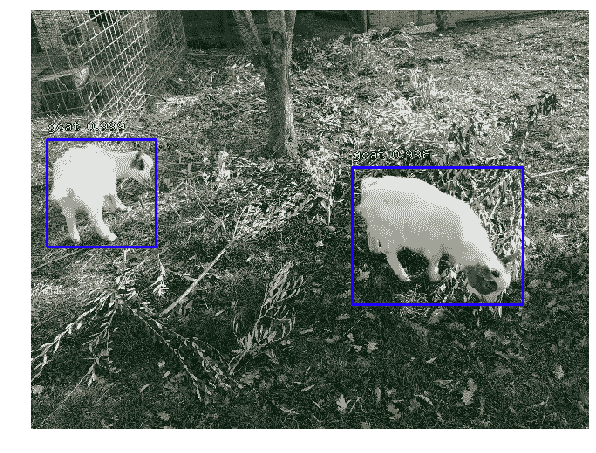

# 基于 Fizyr Retinanet 的 Colab 中的目标检测

> 原文：<https://www.freecodecamp.org/news/object-detection-in-colab-with-fizyr-retinanet-efed36ac4af3/>

作者:罗姆克

# 使用 Fizyr Retinanet 的 Google Colab 中的对象检测

让我们继续探索计算机视觉领域最佳机器学习框架的旅程。

在[第一篇文章](https://hackernoon.com/object-detection-in-google-colab-with-custom-dataset-5a7bb2b0e97e)中，我们探索了官方 Tensorflow APIs 的对象检测。[的第二篇文章](https://hackernoon.com/instance-segmentation-in-google-colab-with-custom-dataset-b3099ac23f35)致力于一个优秀的实例分割框架，基于 Keras 的 Matterport Mask R-CNN。

在这篇文章中，我们研究了由[Fizyr](https://github.com/fizyr/keras-retinanet)开发的 RetinaNet 对象检测的 **Keras 实现。如[密集物体探测的焦点损失](https://arxiv.org/abs/1708.02002)中所述，RetinaNet 是物体探测的最新技术。用训练好的模型检测的对象将是我的小山羊罗莎。**


Object detection with Fizyr

**colab 笔记本和数据集可在[我的 Github repo](https://github.com/RomRoc/objdet_fizyr_colab) 中获得。**

在本文中，我们将在一本 Google Colab netebook 中介绍从自定义数据集开始训练模型的所有步骤。

我们将牢记这些原则:

*   说明如何制作注记数据集
*   在单个笔记本中描述所有步骤
*   使用免费软件，Google Colab 和 Google Drive，所以完全基于 ***免费云资源***

在文章的最后，你会惊讶于使用的简单性和我们通过这个对象检测框架获得的良好结果。

*尽管 Fizyr 易于使用，但它是一个很棒的框架，也被 Kaggle 竞赛“RSNA 肺炎检测挑战赛”的[](https://www.kaggle.com/c/rsna-pneumonia-detection-challenge/discussion/70421)****获胜者使用。*****

### **制作数据集**

**我们首先使用工具[](https://github.com/tzutalin/labelImg)**为训练和验证数据集创建注释。这个优秀的注释工具可以让你快速注释对象的边界框，以训练机器学习模型。****

****

LabelImg annotation tool**** 

****LabelImg 以 PascalVoc 格式创建注释，因此我们需要将注释转换为 Fizyr 格式:****

*   ****用相同的文件名创建一个包含训练数据集图像和注释的 zip 文件(查看我在 Github 中的示例数据集)****

```
**`objdet_dataset.zip|- img1.jpg|- img1.xml|- img2.jpg|- img2.xml...`**
```

*   ****在 Google Drive 中上传 zip 文件，获取驱动器文件 id，并替换 DATASET_DRIVEID 值****
*   ****运行迭代 xml 文件并创建 annotations.csv 文件的单元****

*****注:你可以在 Stackoverflow 上看到[我的回答](https://stackoverflow.com/a/48855034/9250875)获取驱动文件 id。*****

### ****模特培训****

****模型训练是笔记本的核心。Fizyr 提供了各种参数来运行和优化这个步骤，这些参数在 [Github](https://github.com/fizyr/keras-retinanet/blob/c841da27f540084d27e971b6d00c178ff005d344/keras_retinanet/bin/train.py#L358) 中有描述。****

****从预训练的模型开始，而不是从零开始训练模型，这是一个很好的选择。Fizyr 发布了一个基于 ResNet50 架构的模型，在 Coco 数据集上进行了预训练。****

```
**`URL_MODEL = 'https://github.com/fizyr/keras-retinanet/releases/download/0.5.0/resnet50_coco_best_v2.1.0.h5'`**
```

****我们甚至可以使用我们的预训练模型，并从它继续训练。此选项对于某些纪元的训练特别有用，因此将其保存在 Google Drive 中，稍后从保存的模型重新开始训练。通过这种方式，我们可以绕过 Colab 中 12 小时的执行限制，并且我们可以为多个时期训练模型。****

****从我的测试来看，batch_size 和 steps 的高值提供了更好的结果，但是它们大大增加了每个 epoch 的执行时间。****

****

Tensorboard training charts**** 

****我们可以从我们的自定义数据集开始训练:****

```
**`!keras_retinanet/bin/train.py --freeze-backbone --random-transform --weights {PRETRAINED_MODEL} --batch-size 8 --steps 500 --epochs 10 csv annotations.csv classes.csv`**
```

****让我们分析传递给脚本 train.py 的每个参数。****

*   ****冻结主干:冻结主干层，这在我们使用小数据集时特别有用，以避免过度拟合****
*   ****随机转换:随机转换数据集以获得数据扩充****
*   ****权重:使用预训练的模型(您自己的模型或 Fizyr 发布的模型)初始化模型****
*   ****批量大小:训练批量大小，值越高，学习曲线越平滑****
*   ****步骤:历元的步骤数****
*   ****时期:要训练的时期数****
*   ****csv:由上面的脚本生成的注释文件****

****训练过程输出包含对训练期间的层和损失度量的描述，如您所见，损失度量在每个时期都有所减少:****

```
**`Using TensorFlow backend....Layer (type)                    Output Shape         Param #     Connected toinput_1 (InputLayer)            (None, None, None, 3 0padding_conv1 (ZeroPadding2D)   (None, None, None, 3 0           input_1[0][0]                    ...Total params: 36,382,957Trainable params: 12,821,805Non-trainable params: 23,561,152NoneEpoch 1/10500/500 [==============================] - 1314s 3s/step - loss: 1.0659 - regression_loss: 0.6996 - classification_loss: 0.3663Epoch 2/10500/500 [==============================] - 1296s 3s/step - loss: 0.6747 - regression_loss: 0.5698 - classification_loss: 0.1048Epoch 3/10500/500 [==============================] - 1304s 3s/step - loss: 0.5763 - regression_loss: 0.5010 - classification_loss: 0.0753`**
```

```
**`Epoch 3/10500/500 [==============================] - 1257s 3s/step - loss: 0.5705 - regression_loss: 0.4974 - classification_loss: 0.0732`**
```

### ****推理****

****最后一步用训练好的模型对测试图像进行推理。Fizyr 框架允许我们使用 CPU 进行推理，即使你用 GPU 训练模型。这一特性在典型的生产环境中非常重要，在这种环境中，人们通常会选择不使用 GPU 的较便宜的硬件基础设施来进行推理。****

****让我们详细检查以下几行:****

```
**`model_path = os.path.join('snapshots', sorted(os.listdir('snapshots'), reverse=True)[0])print(model_path)`**
```

```
**`# load retinanet modelmodel = models.load_model(model_path, backbone_name='resnet50')model = models.convert_model(model)`**
```

****第一行将模型文件设置为/snapshots 目录中由训练过程生成的最后一个模型。然后，从文件系统加载模型，并将其转换为运行推理。****

****您可以更改 THRES_SCORE 的值，它代表显示对象检测的置信度阈值。****

****

Object detection inference**** 

### ****结论****

****我们经历了使用 RetinaNet 的 Fizyr 实现进行对象检测的完整过程。我们创建了一个数据集，训练了一个模型，运行了推理([这里](https://github.com/RomRoc/objdet_fizyr_colab)是我对笔记本和数据集的 Github repo)。****

****这个优秀框架的以下几个方面给我留下了深刻的印象:****

*   ****这个框架很容易使用来得到好的推论，甚至不需要太多的定制****
*   ****与其他框架相比，将注释转换成 Fizyr 的数据集格式很简单。****

****总的来说，Fizyr 是开始一个对象检测项目的好选择，特别是如果你需要快速得到好的结果。****

****如果你喜欢这篇文章，请留下一些掌声，这将鼓励我探索进一步的机器学习机会:)****