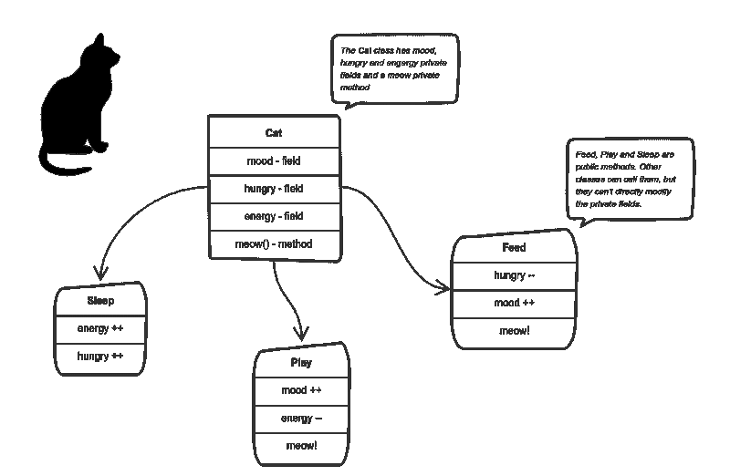
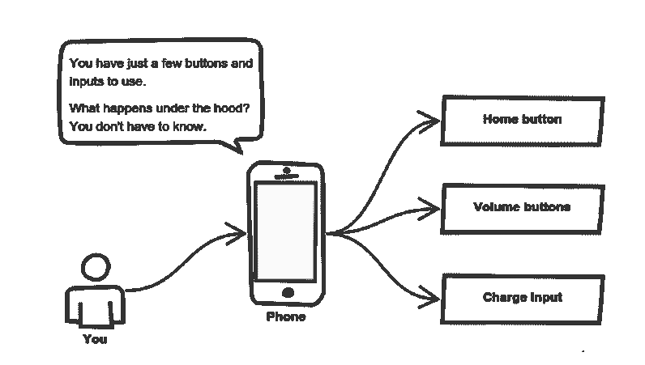
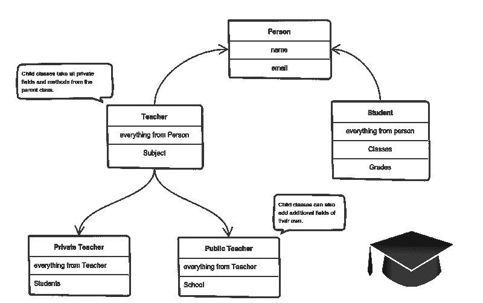
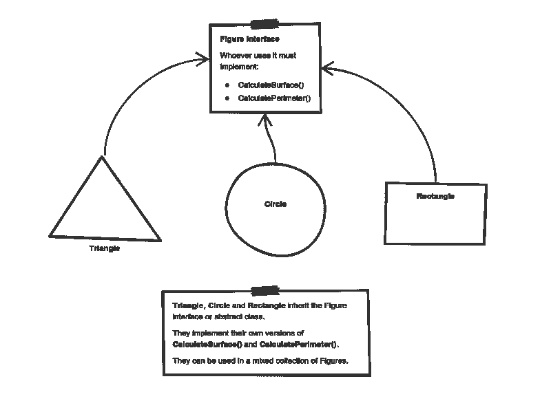

# 如何向 6 岁的孩子解释面向对象的编程概念

> 原文：<https://www.freecodecamp.org/news/object-oriented-programming-concepts-21bb035f7260/>

亚历山大·彼得科夫

你有没有注意到在求职面试中，同样的老生常谈的问题总是被一遍又一遍地问到？

我相信你明白我的意思。

例如:

> 你认为自己五年后会怎样？

或者更糟的是:

> 你认为你最大的缺点是什么？

啊…饶了我吧。我认为回答这个问题是一个很大的弱点！总之，这不是我的重点。

像这样的问题可能很琐碎，但它们很重要，因为它们提供了关于你的线索。你现在的心态，你的态度，你的视角。

回答时，你应该小心，因为你可能会透露一些你后来后悔的事情。

今天我想谈谈编程世界中的一个类似问题:

> 面向对象编程的主要原则是什么？

这个问题我两边都有过。这是一个经常被问到的话题，你不能让自己不知道。

初级和入门级开发者一般都要回答。因为对于面试官来说，这是一种简单的方式来告诉你三件事:

1.  候选人准备好这次面试了吗？
    如果你立即听到一个回答，你会得到加分——这表明你态度认真。
2.  候选人是否通过了辅导阶段？
    理解面向对象编程(OOP)的原理表明你已经超越了教程中的复制和粘贴——你已经从更高的角度看待事物。
3.  **考生的理解是深还是浅？**
    在这个问题上的能力水平通常等同于在**大多数其他科目上的能力水平**。相信我。

How an entry-level developer looks like after nailing this question!

面向对象编程的四大原则是**封装**、**抽象**、**继承**、**T7、**多态**。**

这些话对于一个初级开发人员来说可能听起来很吓人。维基百科中复杂、过长的解释有时会加倍混淆。

这就是为什么我想对这些概念中的每一个给出一个简单、简短、清晰的解释。这听起来像是你向一个孩子解释的事情，但我真的很想在我进行采访时听到这些答案。

### 包装

假设我们有一个程序。它有几个逻辑上不同的对象，这些对象根据程序中定义的规则相互通信。

当每个对象在一个类中保持其状态**私有**时，封装就完成了。其他对象不能直接访问该状态。相反，它们只能调用一系列公共函数，即所谓的方法。

因此，该对象通过方法管理自己的状态——除非明确允许，否则任何其他类都不能接触它。如果要与对象通信，应该使用提供的方法。但是(默认情况下)，你不能改变状态。

假设我们正在构建一个微型模拟人生游戏。有一些人和一只猫。他们互相交流。我们希望应用封装，所以我们将所有“猫”逻辑封装到一个`Cat` 类中。它可能看起来像这样:

You can feed the cat. But you can’t directly change how hungry the cat is.

这里猫的“状态”就是**私有变量** `mood`、`hungry`和`energy`。它还有一个私有方法`meow()` *。它可以随时调用它，其他类不能告诉猫什么时候喵叫。*

它们能做什么在**公共方法** `sleep()`、`play()`和`feed()` *中定义。*它们中的每一个都以某种方式修改内部状态，并可能调用`meow()` *。*这样，私有状态和公共方法之间的绑定就完成了。

这就是封装。

### 抽象

抽象可以被认为是封装的自然延伸。

在面向对象的设计中，程序通常非常大。不同的物体之间会有很多交流。因此，多年来维护这样一个庞大的代码库——并且不断变化——是很困难的。

抽象是一个旨在缓解这个问题的概念。

应用抽象意味着每个对象应该**只**公开使用它的高级机制。

这种机制应该隐藏内部实现细节。它应该只显示与其他对象相关的操作。

想象一下——一台咖啡机。它做了很多事情，并在引擎盖下发出古怪的噪音。但是你所要做的就是放进咖啡，然后按一个按钮。

优选地，这种机制应该易于使用，并且应该很少随时间改变。可以把它想象成一个公共方法的小集合，任何其他类都可以在不“知道”它们如何工作的情况下调用它。

另一个现实生活中的抽象例子？
想想你是如何使用手机的:

Cell phones are complex. But using them is simple.

你只需使用几个按钮就能与手机互动。引擎盖下到底发生了什么？您不必知道—实现细节是隐藏的。你只需要知道一组简短的动作。

实现的变化——例如，软件更新——很少影响您使用的抽象。

### 遗产

好了，我们看到了封装和抽象如何帮助我们开发和维护一个大的代码库。

但是你知道 OOP 设计的另一个常见问题是什么吗？

对象往往非常相似。他们有共同的逻辑。但是它们并不完全相同。呃…

那么我们如何重用通用的逻辑，将独特的逻辑提取到单独的类中呢？实现这一点的方法之一是继承。

这意味着您通过从另一个(父)类派生来创建一个(子)类。这样，我们就形成了一个层级。

子类重用父类(公共部分)的所有字段和方法，并且可以实现自己的(唯一部分)。

例如:

A private teacher is a type of teacher. And any teacher is a type of Person.

如果我们的程序需要管理公立和私立教师，以及其他类型的人，如学生，我们可以实现这个类层次结构。

这样，每个类只添加它所必需的，同时重用父类的公共逻辑。

### 多态性

我们只剩下最复杂的单词了！多态在希腊语中的意思是“许多形状”。

所以我们已经知道了遗传的力量，并愉快地使用它。但是这个问题就来了。

假设我们有一个父类和几个继承它的子类。有时我们想要使用一个集合——例如一个列表——它包含了所有这些类的混合。或者我们有一个为父类实现的方法——但是我们也想为子类使用它。

这可以通过使用多态性来解决。

简而言之，多态性提供了一种使用与其父类完全相同的类的方法，因此不会混淆混合类型。但是每个子类都保持自己的方法不变。

这通常是通过定义要重用的(父)接口来实现的。它概述了一堆常见的方法。然后，每个子类实现自己版本的这些方法。

任何时候一个集合(比如一个列表)或者一个方法需要一个父类的实例(在这里列出了公共方法),这种语言都会考虑评估公共方法的正确实现——不管传递的是哪个子类。

看看几何图形实现的草图。他们重新使用一个通用界面来计算表面积和周长:

Triangle, Circle, and Rectangle now can be used in the same collection

让这三个数字继承父项`Figure Interface`，可以创建一个混合了`triangles`、`circles`和`rectangles`的列表。把它们当作同一类型的物体。

然后，如果这个列表试图计算一个元素的表面，将找到并执行正确的方法。如果元素是三角形，则三角形的`CalculateSurface()` *称为*。如果是圆，那么圆的`CalculateSurface()` 就叫做。诸如此类。

如果您有一个通过使用其参数来操作图形的函数，您不必定义它三次——一次用于三角形、圆形和矩形。

可以定义一次，接受一个`Figure` 作为参数。无论你传递的是三角形、圆形还是矩形——只要它们实现了`CalculateParamter()`，它们的类型并不重要。

我希望这有所帮助。你可以在工作面试中直接使用这些完全相同的解释。

如果你发现还有什么难以理解的，请在下面的评论中提问。

### 下一步是什么？

准备好回答一个有史以来最经典的面试问题是很棒的——但有时你永远不会被邀请参加面试。

接下来，我将重点讨论雇主希望初级开发人员具备哪些品质，以及如何在求职时脱颖而出。

敬请关注。

Did you like the read? If you'd like to support me, you can buy me a coffee :)