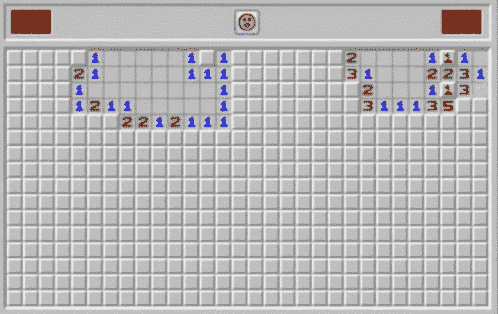

# 用 Python 进行面向对象编程——编写一个扫雷游戏

> 原文：<https://www.freecodecamp.org/news/object-oriented-programming-with-python-code-a-minesweeper-game/>

通过编写每个人都喜欢的 Windows 3.1 游戏《扫雷》来提高您的 Python 编程技能。

我们刚刚在 freeCodeCamp.org YouTube 频道上发布了一个 Python 课程，将教你如何使用 tkinter 库编写扫雷程序。

JimShapedCoding 的 Jim 开发了这个课程。他在 freeCodeCamp 频道和他自己的频道上发表了许多受欢迎的编程课程。

这个游戏是完全使用面向对象编程实现的。

以下是本教程涵盖的部分:

*   入门指南
*   创建细胞和矿
*   扫雷算法
*   显示游戏数据
*   收尾工作和玩游戏

Minesweeper (but not the version you will create)

观看 freeCodeCamp.org YouTube 频道的全部课程(3 小时观看)。

[https://www.youtube.com/embed/OqbGRZx4xUc?feature=oembed](https://www.youtube.com/embed/OqbGRZx4xUc?feature=oembed)

## 副本

(自动生成)

在本课程中，Jim 将通过教您如何构建扫雷游戏来帮助您提高 Python 技能。

吉姆在我们的频道上创造了许多受欢迎的课程，是一位优秀的老师。

所以他刚刚开始学习 Python，在学习基础知识之后，你会想要开发一个很酷的项目。

嗯，这一系列视频正是为你准备的，因为在这一系列视频中，我们要用 Python 开发一个游戏。

现在，如果你知道基础知识，并且上过一些基础课程，无论是什么渠道或什么课程，那么这就是你正在寻找的系列，因为它将为你提供如何开始构建 Python 项目的基础知识。

在这个系列中，我们将开发一款名为扫雷的游戏，这是一款单人游戏，非常有趣，也很有挑战性。

看看那个系列你会学习开发什么游戏。

好的，这将是我们在整个系列中开发的游戏。

现在我们可以看到，我们有一些销售额，我们可以点击并打开它们。

现在《扫雷》的主要目标是不要点击背后有想法的销售。

这意味着，如果我去打开它，你会看到我收到一个数字。

现在这意味着，在那次销售的周边销售中，有一个我不应该点击的头脑。

所以我要猜一猜，说你在这里没有想到。

而你也没有在那里放在心上。

你可以看到我说得很对。

所以我要用我的鼠标右键点击，把它标记为一个头脑，因为如果我用我的鼠标左键点击，那么 y 就会输掉游戏，对吗？

所以我现在要做的是尝试获取其余的位置，这些位置是不需要思考的位置，对，所以我要单击那里。

你可以看到我收到了一些数字，你可以看到，例如，在销售周围，我有零矿，所以它是安全的点击这里，这里和那里。

现在让我们试着左键点击那个位置。

你可以看到它说你点击了一个想法，我输了一局。

主要目标是得到所有没有头脑的地点，然后你将赢得比赛。

因此，为了开发这款游戏，我们需要进行大量的思考。

处理这个游戏带来的所有挑战会很酷。

所以在我们开始之前，如果你能点击那个视频上的 like 按钮，我会很感激，这将有助于把视频传播到整个 YouTube。

此外，如果你认识刚开始学习 Python 的人，他们想开发一个很酷的项目，那么欢迎他们也来观看我的系列，这对那些处于入门和成为专家之间的水平的视频非常有帮助。

话虽如此，我们还是开始吧。

现在，在我们开始写这个项目之前，我希望你已经在你的电脑上安装了 Python。

我将使用 Python 3.8，这是一个现成的 IDE，可以识别计算机上的 Python 解释器。

但是只要你有一个高于那个版本的版本，那么你应该可以很好地编写这个项目。

现在我们不打算使用太多的外部库，或者太多依赖于 Python 版本的代码。

所以没关系，如果你甚至使用 python 3.10 或 python 3.11，这可能会在未来出现。

好吧。

所以让我们开始吧。

现在，为了编写一个 2d 游戏，我们可以使用 Python 中的很多库。

在这个例子中，我们将使用 TK inter，这是一个很好的实践库，因为它提供了很多有用的类，我们将实例化这些类来创建我们的窗口。

因此，我们将通过以下方式导入它。

所以我会说从 tkinter，进口一切。

这对我们来说将是一个很好的开端。

所以我要写的下一行是实例化一个窗口实例。

我们可能想这么做，因为我们的项目将在一个窗口中，我将把我的变量命名为 root，这个变量将等同于那个关键角色 T . k .的实例化。

这只是你能创造的最基本的元素。

这只是一个普通的窗口。

现在，当我们运行它时，什么也不会发生，因为我们需要告诉 TK 它应该运行，直到我们用右上角的 X 按钮关闭它。

这就是说，像这样的点状主循环。

所以我们需要调用这个方法，所有的代码都在这两行之间。

所以如果我们运行它，你可以看到我们有最基本的窗口。

现在快速补充一下，我使用根变量的原因只是 TK inter 项目中的一个约定。

因此，您可以更容易地查找堆栈溢出中的问题。

例如，如果你遵循这些惯例，那么让我们继续，看看我们可以在这里改变的一些属性，使我们的窗口更好。

所以第一个显然是改变窗口的大小。

我们可以通过调用几何函数来实现，我指的是这条路线的方法。

它接受一个看起来像下面的重量，X，高度的字符串。

在这里，很明显，你可以输入任何你想输入的数字。注意，如果我把这些数字替换成下面这样的数字，会发生什么，你会立刻看到不同之处。

如果我运行它，你可以看到它是如何变化的。

现在我们还可以注意到，它使用这个字符串作为我们的窗口的标题，我们可以通过调用一个名为 title 的方法来改变它，并给它任何我们喜欢的标题。

所以我们可以玩扫雷游戏，重新执行我们的程序。

你可以看到变化。

现在，我没有谈论这个。

但是默认情况下，所有的窗口都是可调整大小的。

当你在这个窗口中创建了很多像按钮或框架这样的元素时，这可能会很烦人。

所以这就是为什么我们可能希望避免调整这个窗口的大小，因为当我们继续在这个窗口中放入更多的元素时，这只会让我们的生活更轻松。

所以实现这个的方法，就是像这样调用 resizeable 方法，并指定我们不允许调整这个窗口的宽度和高度。

这可以通过两次传递 false 来实现，一次传递重量，另一次传递高度。

现在，如果我再次，重新运行我们的程序，你可以看到这个最大化被禁用的效果。

当我们开发这款游戏时，这将使我们未来的生活更加轻松。

现在，在我们到达那个阶段之后，我们可能也会好奇如何改变我们窗口的背景颜色。

现在，如果你知道如何使用十六进制值，你可以继续使用它们。

但基本上，它为他们提供了许多指定颜色的关键字。

现在我们不想过多地处理样式，我们更想关注如何编写这样一个游戏的算法中的逻辑。

因此，出于这个目的，我将保持简单。

但是，我们仍然希望在这里有一个很好的可视化窗口。

所以我要去第五行。

我要说的是路由器点配置。

我们需要为我们的窗口配置背景颜色。

所以我们需要继续调用这个方法，我们需要传入 BG 等于我们喜欢的任何颜色。

现在在描述中，您可以通过使用关键字 colors 找到可用的颜色列表。

因此，在描述中，有一个链接，其中有一个很大的可用颜色列表，我将在这个窗口中使用黑色。

这将被添加，所以你可以看到改变背景颜色的直接影响。

好了，现在我们明白了这一点，接下来让我们看看如何在窗口中创建一些元素。

现在我们将从你可以在窗口中创建的最基本的元素开始，它被称为框架。

现在，frame 就像一个容器，可以包含更多我们将在未来创建的元素。

现在我们想使用这些框架，因为显然我们想把我们的窗口分成几个部分。

因此，将来我们想把每个按钮或文本放在哪里就更容易理解了。

例如，我们可以将窗口的那个区域专用于一个标题，对，所以我们将标题放在这里。

我们可以决定我们想要一个左边栏。

所以我们可以把窗口的左边区域变成侧边栏来显示分数，比如，类似这样的东西。

我们可以在这里放另一个框架。

所以我们在这里称之为显示游戏。

因此，将窗口分成多个框架是一个很好的主意，这将有助于以后可视化不同的元素。

所以我现在要做的是在这里写一个注释，说覆盖窗口的设置。

就在 root.me 循环之前，我还将注释掉 run window，这是我们开始创建一些框架的确切位置。

所以让我们开始吧。

所以我们说我们想要一个位于顶部的框架。

所以我把这个变量命名为 top frame，它等于一个名为 frame 的类。

一旦我们从这个框架类中实例化，那么它将负责实例化一个框架，我们稍后将决定它在我们的窗口中的位置。

现在，这个框架必须接受的第一个参数是，我们想要在哪个元素中定位这个框架。

所以它将位于窗口中。

所以我们将通过根。

然后我会把它们分成多行。

所以读起来会比较容易。

如你所见，括号在这里打开，在这里关闭。

现在让我们继续给它更多的属性。

所以首先，我们想给出一个不同的背景。

所以我们真的可以区分框架和窗口，因为如果我们保持相同的颜色，很难理解框架的位置，所以出于调试的原因，我稍后将红色改为黑色。

我们会在这里进行注释。

然后在这里，我将决定重量和高度。

所以我会说，重量应该等于我们给窗口的宽度大小，因为我们想覆盖整个窗口。

所以这应该是整个重量，就像窗户一样，高度应该大概是一个广告那么高。

所以只有 20 分之 7 给外国，这完全说得通。

现在我们得到了这个，然后我们需要决定我们想从哪里开始这个框架。

因此，为了做到这一点，我将继续说顶部下划线框架点的地方。

现在这个地方将收到两个强制性的论点。

在我继续讲解之前，让我向大家展示一下窗口中的位置是如何工作的。

所以当我们使用布局时，它需要接收像素值。

现在我们知道我们有一个框架，我们想从这里开始。

我们知道它可能会覆盖这个区域。

但是我们如何告诉它从这里开始。

好了，我们需要指定 x 轴和 Y 轴，这意味着如果我们想从左上角开始，那么我们需要给它 0.0 的值。

因为这是一切从像素开始的地方。

现在，这里的整个区域是 1400 像素，因为这是 x 轴，y 轴是 720 像素。

所以这里的总高度是 720。

例如，如果我们想要一个按钮，我这次不会这么做。

但是假设我们想要一个按钮，我们想从这里开始。

所以我们想把它放在页面的中间，所以我们需要把这个值除以 2，所以 x 轴是 720。

我们知道我们希望尽可能把它放在首位。

所以这应该是 y 轴的值，为零。

这就是 place 方法的工作原理，我们需要指定 x 轴和 y 轴的像素值。

让我清空我在这里画的所有东西，然后回到 Python，在这里给 x 等于 0，y 等于 0 的值。

现在看看这个框架是如何被可视化的。

如果我停下来重新运行，你可以看到这就是我们想要的预期结果，它从这里开始，取整个重量区域，从高度取 180 个像素。

这正是我们现在想要的，只是为了确保你们理解了，我要把 x 改为 20。

你会猜到会发生什么。

所以如果我们读它，显然它会从左边一点的位置开始，你可以看到它在哪里，就从这里开始。

如果我们跳到 y 点 20，停下来重新运行，你可以看到结果。

这就是 place 方法的工作原理。

显然，我要把它们改回零，然后从这里继续。

好了，现在我们明白了这一点，那么让我们继续尝试创建一个框架。

现在，这一次我想做一个框架，我们将使用它作为左边栏，在那里我们可能会显示分数或其他有用的东西。

所以我将继续创建一个左框架变量，它将等于这个框架。

所以我们将从那个类中再实例化一个。

我们希望这个框架是原始的，然后我们会说 BG 等于另一种颜色。

我将复制该行并将其粘贴到 a 中，让我们使用类似蓝色的东西，以便我们可以区分不同的帧，权重将为 360，我故意使用该值的四分之一。

所以对我来说，更容易理解我用我的框架覆盖了整个重量的多少百分比。

现在我指定了宽度，我要指定高度。

所以我要说的是，这应该覆盖了我们窗户的整个高度。

现在请注意，我们已经覆盖了顶部框架的 100 个广告像素。

所以我们不能只说公元 700 年，我的意思是，7 年和 20 年。

就像这样，我们需要记住整个窗口的高度，然后用这个数减去这个数。

所以我们应该已经过了 500 年了。

现在，不要担心，如果你认为我们硬编码了太多的值，我会确保我们以后没有任何硬编码的值，当我们将来重组这个项目时。

所以现在我们专注于理解 TK inter 是如何工作的。

现在我们明白了这一点，那么让我们继续说，左边的框架应该放在 x = 0，但 y 应该等于 180，对吧，因为我们想在顶部框架的位置之后开始。

如果我运行我们的程序，你会看到我们有完美的结果。

为了更好地理解这一点，如果我们把 Y 轴移动 20，你可以看到它从这里开始，因为它在 Y 轴上移动了 20 个像素。

所以这就是为什么我要确保我们保持公元 100 年的价值。

好了，现在我们已经到了那个阶段，你可能会注意到，在使用重量，高度和像素等方面，我们将会有太多的硬编码数字。

所以这是一个很好的时机，为我们所有的常数建立一个单独的文件，至少有一些变量存储在某个地方。

现在，我不打算在我们的 main.py 文件中创建它，因为这可能需要在一个文件中存储太多的信息，此外，我将获取一个新的 Python 文件，我将调用该设置。

所以在这里，我可以使用一些有用的常数。

为了真正并排显示这些窗口，让我使用右键单击并垂直拆分选项。

所以我们可以开始考虑一些好的候选变量，我们想把它们存储在这里。

例如，我们可以从我们的窗口的宽度大小开始，我们可以说宽度等于 1440，我们可以说高度等于 720。

我们可以立即返回到我们的 main.py 文件，说一些类似导入设置的话。

然后我们可以在这里使用格式化字符串。

我们可以把它们转换成那个字符串，对，我们可以在这里说，设置，点宽度。

我们可以像这样设置点的高度。

这只是我们项目中的一个巨大变化。

现在，如果我运行我们的主文件，那么你可以看到没有什么真正改变。

我们有很好的条件继续做这些操作来存储更多的变量。

现在，如果你还记得，我在教程中说过，我故意使用这些数字，这样我们就可以有一个准确的重量百分比。

例如，我在顶部框架高度中使用 100 广告值有一个很好的理由，因为的一个广告时间类似于 20。

所以我可以说，我喜欢消耗我们窗口整个高度的 25%。

这些都很重要，因为我们不会有太多的硬编码值。

所以我们现在能做的是，为一些函数准备一个文件，可以帮助计算这些东西。

例如，我们可以有一个函数来计算我们窗口整个高度的 20%是多少，对吗？所以我们可以继续使用另一个 Python 文件。

我们可以称之为工具或实用程序。

我们可以有一个函数来计算我们身高的百分比。

首先，我们可以使用导入设置，这样我们就可以导入项目的设置。

我们可以继续使用一个函数。

让我们把这个函数叫做 height 下划线 PRC T，只是百分比的缩写，对吧，所以我们可以在这里接收百分比量作为参数，我们把它变小一点。

然后我可以继续，在里面，我可以根据这里收到的参数返回值。

所以我可以使用 return 键。

我可以说，设置点的高度，除以 100。

我可以用括号把它括起来。

我可以把它乘以百分比。

现在我想验证一下，我已经很好地编写了这个函数，对，我不想马上调用我的函数，只是试着使用它们，因为我在编写函数时可能会有一个 bug。

在不同的文件中定位不同的函数也是一个很大的优势，因为这将给你调试你的东西带来巨大的优势。

例如，我可以暂时只执行 utils.py 文件并测试我的函数，我可以继续尝试调用它并传递 il 25。

并验证我真的会收到 100 广告回来。

所以我可以继续使用 print，并执行 utils。

所以我没有执行我原来的项目。

现在，如果你继续下去，你会看到这里的价值，你会看到我真的收到了一个广告。

这很好。

这意味着我们已经很好地编写了这个函数。

现在，我可以真正开始在我们的原始项目 main.py 文件中使用它，所以我可以继续导入所有 utils 文件，我可以说 import utils。

我可以继续调用高度百分比函数，我可以使用 utils 点高度，PRT CT 和传递 25。

同样，这不会有任何影响。

这意味着我们已经做得很好了，只是现在我们更有活力了，我们不再硬编码价值观了。

我们将快速重复这个重量。

然后我们将继续下一个主题，对，所以我将到这里，我将使用这个高度，我的意思是体重，PR 城市，我们将再次收到百分比，我们将说返回左括号，这样我们可以在这个公式中有一个更清晰的外观。

而我们可以说设置网点宽度除以 100 乘以当前年龄。

现在我可以继续，在不同的硬编码值中做几乎相同的操作。

所以我们来看看。

所以在顶部框架中，我们使用整个窗口。

因此，将它更改为设置点宽度是有意义的，因为它已经是 1440 了。

让我们来看看左边的画面。

因此，在左侧框架中，我们看到我们使用了整个宽度的 25%。

因此，我们可以继续使用 utils 点高度 PR CT，对不起，用 brct 我会改变这一点。

然后我会在 25 分钟内通过。

你也可以看到在高度上，我们用了整个高度的 75%。

这意味着我可以在这里使用点高度概念，并通过 75 年。

当我想定位我的左框架时，我也可以这样做。

你可以注意到 y 轴的值也是整个高度的 25%。

所以我可以说 utils 点高度 brct，并在这里传递 25%。

现在让我们看看我们是否做得很好，你可以看到结果又是完美的。

好了，现在我们得到了这个，那么让我把它们改成原来的值，然后从这里继续创建我们的最后一个框架。

所以我们说，我们还希望有一个框架，将在我们的页面中心。

这样我们就有了一个专用于我们游戏的框架，对吧。

因此，我将快速前进，创建一个中心框架，这将再次等于一个框架，这应该是内部路线的背景应该是绿色的，这样我们就可以分开它。

我需要在几分钟内将所有这些更改为黑色。

然后我想说权重等于 utils 点权重 PR city，这一次我想使用我们整个宽度的 75%,高度将再次是 utils 点高度凶猛度，这也将是 75 %,现在 place 方法将接收以下参数。

因此，x 值应为 utils 点，PRC 为 25%。

因为我们想从这里开始，而高度，也就是 Y 轴应该是一样的，对吧，所以我要复制它，Y，然后把它变成高度周期。

就像这样，因为我们想让这个从这里开始，对，所以它将从左边取 360 个像素，从顶部取 180 个像素。

现在，如果我们要测试我们的代码，你会看到我们得到了预期的结果。

所以现在是时候把我们的镜框换成黑色了。

因为我们已经做了很好的工作，我们可以继续将它们更改为黑色。

现在你将看到的只是一扇看起来像纯黑色的窗户。

但是在后台，在真正的 Python 代码中，我们有两个分开的框架，就像我们想要的那样。

因此，现在我已经改变了整个背景为黑色的东西，我们只是要看到相同的。

但是在原始代码的背景中，我们真的有两个框架，我的意思是三个框架，好的，所以在这之前，我们知道这里有一个框架。

这里还有一个框架。

现在，我们说在这里我们要写一些关于游戏的信息。

在这里，我们将有扫雷标题这样，对不对。

但是我们在中间这里想要做的实际上是开发棋盘，对，玩家将要点击的每个单元格都应该在这里。

在这里，我们应该定位我们所有的细胞。

现在，创建硬编码的 36 单元或 49 单元，基本上只是一个巨大的销售将是困难的。

这就是我们想要让我们的东西更动态一点的确切位置，我们希望能够进行 for 循环，从而动态地创建这些类型的单元格。

现在，我们还想为每一个销售行为做一个按钮行为，之所以这么叫是因为我们想要点击某个东西的能力。

接下来的事情是游戏中会发生一些事情，我们会看到一些关于出售的信息。

这是创建一个类的确切时间，我们可以把它命名为 cell，因为我们知道，对于每个单元格，我们也喜欢给出一些属性，比如这个单元格是不是我的。

或者这是一个已经打开或关闭的单元格。

所以这正是我们考虑创建一个类的时候，我们可以把它命名为 Sal。

稍后我们可以创建一些这样的实例。

现在，作为一个简单的例子，在我给你们看完这个基本的例子后，我会删除它。

但是这是你如何使用 TK Inter 库在一个窗口上创建一个按钮，对，所以让我们使用一个像 button one 一样的随机变量。

这相当于像这样的按钮。

现在这个按钮将接收几个参数。

假设我们希望它在中心框架内。

我们想把背景颜色设为蓝色。

让我们给它一个文本。

抱歉这里漏掉了逗号。

让我们给它一个像第一个按钮的文本。

然后我现在要做的是说按钮一点的地方，我们将它放在第一个像素在 x 轴和 y 轴在中心框架。

所以它应该在最左上方的位置，中间有一个框架，对吧。

因此，如果我们继续运行它，您会看到我在这里有一个按钮，它是可点击的。

现在我们知道我们想用自定义类抽象它，因为我们需要给这个单元格一些属性，就像我前面描述的那样。

这就是为什么我想创建一个细胞类。

然后，我们还将看到按钮类将如何参与到我们将开始开发的单元格类中，但让我们实际上继续进行，并开始处理这一权利。

所以在我们继续写更多的代码之前，我想向你们展示如何创建一个按钮。

因此，我将在这里创建一个单元格 Python 文件，我将放大一点，这样每个人都可以看到，我将使用类。

所以现在暂时，我不想从 button 类继承，因为说细胞是一种按钮是不正确的，我们知道我们用继承来描述各种事物，比如狗是一种动物。

所以 dog 类应该从 animal 类继承。

但事实并非如此。

所以我不会那么做。

现在我已经创建了这个类，让我们继续编写这个类的构造函数。

正如我们所知，构造函数是一种金属，一旦一个类被实例化，它将被立即调用。

现在我将在这里临时接收一个参数，我也将为它提供一个默认值 false。

你可以看到它被称为是我的，对，我要说 self.is 下划线 mine 等于 is 下划线 mine，就像下面这样。

好了，现在我们有了这个，让我们看看如何在我们的代码中使用它。

因此，我将转到我的 main.py 文件。

我们将滚动到该注释上方，运行窗口。

我肯定需要导入这个类。

让我们继续，使用 from cell，也就是文件，像这样导入 sale 类，对，我就把它放在那一行。

所以我们会有一个更干净的外观。

而现在我要走到这里，我就说 c 一等于卖出。

然后我就让它保持原样，因为它的默认值是 false。

现在我有了这个，我就可以运行它了。

你可以看到，实例化的类可能是一个好类，因为我们没有收到任何箭头。

很明显，我们在这里看不到任何按钮，因为我们刚刚创建了一个自定义类，没有将它与来自这个 TK inter 库的按钮类相关联。

所以现在这正是我们要做的。

好的，我们将转到我们的单元格文件，我们将创建一个属于每个单元格对象的按钮实例。

这意味着什么，这意味着这个自我将会得到另一个属性，我们可以把它命名为出售按钮对象，类似的东西。

然后我们要给它分配一个按钮对象。

这就是销售对象和按钮对象之间的关系是如何实现的。

首先，我要暂时关闭游戏。

我会在这里说，从 T 国际进口。

您知道吗，让我们只导入 button 类。

我们不要在这里使用通配符导入。

现在我要继续说，这一开始应该等于零。

然后我们现在要做的是创建一个实例方法，它将为我们创建这个按钮，我将把它分配给 self dot sale 按钮对象。

让我们来看看我们将如何做到这一点。

所以我要说创建按钮对象。

我们现在只接受自我。

我们说这里的按钮等于这样的按钮。

我们只是实例化了那个按钮类的一个实例。

现在，除了 self 之外，我们不接收任何额外的参数，这在实例方法中是强制的。

所以我们需要接收至少一个非常重要的参数，我们可以把它命名为 location，因为我们知道，对于我们想要在窗口中创建的每个元素，我们应该传递一条信息，让 TK 知道应该在哪里定位该元素。

如果我们收到一个名为 location 的参数，那么我可以直接传入这个位置。

每当我调用这个方法时，我都会引用实际的传感器帧，它来自 main.py。

这就是我在这里接收位置参数的原因。

只是一个暂时的例子，让我们给它一个随机的文本，就像初学者一样。

然后我会说 self dot sale btn 对象将等于我刚刚创建的按钮对象。

这将很有帮助，因为一旦我将这些属性分配到按钮对象中，这将有助于我稍后自定义该按钮，您马上就会看到这将非常有帮助。

让我们继续，现在垂直拆分，这样我们可以了解我们在这里做了什么。

在左侧，我们有单元格文件，在左侧，我将处理我的 main.py 文件。

我现在要做的是，说 c 一点创建按钮对象，因为我可以允许自己调用该按钮，然后我可以传入位置，因为中心框架是一个变量，可以从 main.py 文件中访问，所以我可以直接说中心框架是一个参数。

然后，我可以继续使用我的按钮对象，这要感谢我在这里使用的正弦波属性，对，所以我可以继续，我可以说 c one，点单元格 btn 对象，像这样的点位置。

我可以说，我想把它放在 x 等于零，y 等于零，就像我们在这一集开始时做的那样。

现在我已经完成了，接下来是测试我们代码的好时机。

我将运行此应用程序，您会看到我们有一个按钮。

因此，开发这个应用程序并将代码分布在不同的文件中是一个非常好的开始。

所以它更容易维护，可读性更好。

好了，现在我们已经完成了，那么我们需要明白，如果我们继续使用那个位置或者为了放置我们的元素，我们将来会有一些问题。

现在为了向你们展示我正在谈论的问题，我将在这里再创建一个我们提出的同一个类的实例。

所以我要说 C2 等于一个细胞，像下面这样。

然后我要说 c 两点创建按钮对象，它将再次成为中心框架。

然后我要第一次销售附近的那个房间，好的。

因此，我不应该说，像看到销售按钮对象点的地方。

然后，我们应该动态地知道我们应该跳跃多少像素，以便将它准确地放置在我们想要的位置。

但是这将是一个很大的麻烦，总是知道我们想要经过的确切位置。

因为，比如说，我会传入 x 等于 20，y 等于 0，然后运行我们的游戏。

现在，你可以看到右边的按钮看起来像是在左边的按钮之前，因为我们几乎看不到左边按钮上的文字。

所以我们可以试着把 X 的数量增加到 40，就像这样，然后重新执行我们的游戏。

你可以看到现在已经好多了。

但是当我们想要动态地创建多个元素时，使用放置或者不是最好的选择。

所以当我们使用 TK inter 时，当涉及到我们想要动态创建的数十个元素时，我们需要考虑改变我们的放置方法。

我们可以通过改变我们的方法来做到这一点。

现在 grid 所做的是，它获取父元素，就在那里，它把父元素变成列和行。

美妙之处在于它从零开始计算列和行。

例如，如果我们想在这里放置一个按钮，那么我们可以说我们想要问候它，然后给它一些值，这些值将被认为是列号和卷号。

让我们来看看实际情况。

所以在理论上理解起来可能有点混乱。

但是现在我们将继续进行编码，这将更容易理解。

所以我要把这里的东西都删了，回到 pi charm。

实际上，继续更改这两个按钮的位置方法。

所以我要去我的 C one，我要说 grid，然后我要在这里传入列等于零，行等于零，就像这样。

现在我要抓住这些参数，同样的改变这个方法来打招呼。

当我说ρ等于 1 时，你们会看到不同之处。

现在如果我们继续运行我们的程序，你会发现我们有所不同。

这里的文本本来是放在第 0 列第 0 行的，但是这个本来是放在第 0 列第 1 行的，这就是为什么你会在第一个按钮下面看到第二个按钮。

如果我把这个换成 0，把那个换成 1，意思是列等于 1，那么你会看到这些按钮一个挨着一个，这很好。

当我们想要创建大量的按钮来为扫雷游戏做准备时，这将会很有帮助。

好了，现在我们了解了网格方法是如何工作的，然后我们将开始创建我们想要的那些单元格，我们把 game 放在这里，这是我们可以用嵌套的 for 循环来实现的。

因此，让我向您展示它将会是什么样子，以便将来更容易维护。

先把这个删掉。

我将开始我的第一个 for 循环，比方说，对于范围为 5 的 x。

现在 range 只是一个函数，负责生成给定数字范围内的所有整数。

如果我只传递你的 5，那么它会产生 0123 和 4。

没错。

所以我要进入这里，然后我会说 y 在 5 的范围内。

我在这里基本上实现了创建 25 个按钮的行为，因为我有一个循环，在里面迭代了 5 次，还有一个循环也迭代了 5 次。

所以现在我可以进去了。

而且我可以说 c 等于卖出。

所以我实例化了它的一个对象。

然后我可以继续说，创建 btn 对象。

作为位置，我肯定会通过中央框架。

现在，我们已经创建了按钮对象，然后我可以使用我们之前创建的属性来访问它，这是单元格 btn 对象，我可以使用 grid 选项。

然后我可以传入等于 y 的列。

我可以说 row 等于 Wickes。

就像那样。

现在让我们看看结果。

所以我要运行它。

你可以看到它看起来有多美。

是的，所以我们已经开始看到一些类似于扫雷游戏的东西。

这是完美的。

现在我们能做的，不是在这四个循环中的五个循环中进行硬编码，我们实际上可以允许自己去设置文件，并在这里写一个新的设置，看起来像网格大小。

然后我们可以决定它等于我们喜欢的任何数字，我会说是 6，因为这是我在整个系列的开始，作为一个示例游戏显示的数字。

然后我会到这里说，设置，点网格大小。

现在，记住，我在这里导入了整个设置文件，所以我可以访问网格大小变量。

我也可以在这里说，同样的事情。

然后我可以再次运行我们的程序，你可以看到它是什么样子。

所以我们有六列和六行。

这只是一个很好的开端。

现在，在我们继续之前，抱歉这里有些混乱，我想如果我们说列等于 x，行等于 y 会更好。

因为如果我们把它改为三行，而不是设置点网格大小，那么更准确的说法是我们有三行，对，一行，两行，三行。

这就是为什么我坚持列等于 x，行等于 y，就像下面这样。

现在，我可以将它转换回设置点网格大小，并从这里继续。

好了，现在我们已经完全理解了这一点，那么我们可能还想理解如何给我们的按钮分配事件。

现在一个事件基本上是你点击一个按钮后想要采取的行动的列表。

我们在整个系列的开头说过，我们喜欢区分当我们左键单击按钮和右键单击按钮时所采取的动作，因为在扫雷游戏中这是两种不同的动作。

所以在扫雷游戏中设计这个东西将会非常酷，为我们的按钮提供事件实际上是我们游戏中非常有趣的部分。

所以让我们来看看如何做到这一点。

所以我要去我的 cell.py 文件。

这是我们可以开始为我们创建的按钮分配一些事件的确切位置。

因为这正是我们创建按钮对象的位置，所以我们还可以给它分配一个事件。

现在让我们继续写这个。

因此，当我们想要将一个事件分配给一个按钮时，我们需要使用一个叫做 bind 的特定方法。

所以有了 bind，我们实际上可以说，当我们左键单击一个按钮时，我们想要打印一些东西。

让我们看看我们将如何做到这一点。

所以我们需要传入两个参数，第一个参数是按钮上被点击的键。

当你点击任何一个按钮时，你想要执行的功能是什么。

首先，我们想说的是，当我们左键点击一个按钮时，我们想要做一些事情。

左键点击传入 TK 的约定如下。

所以我要用小于号。

我要说按钮大写破折号比符号大一号。

所以按钮破折号 1 只是一个惯例，表示左键破折号 3 将会是右键，我们马上就会看到。

然后我们还想说，我们想执行一些函数，对吗？这将是 bind 方法的第二个参数。

所以让我们从我们能想到的最简单的函数开始。

因此，我将在我的灵魂类中创建一个金属，我将把它称为左击动作，就像那样，它也将收到银，当然它是一个实例人第三，然后它只会说，我被左击了，只是作为一个基本的例子，我将让它保持原样。

现在我们已经完成了，那么我可以很容易地传入这个方法的引用。

所以它不会像左击动作一样。

而且我会这样调用这个方法，除此之外，我只是给它引用，就像下面这样。

所以要注意，你不是在调用这个方法，你只是在传递那个方法的引用。

既然我们已经了解了这一点，那么让我们来检验一下，看看这是否对我们有用。

所以我要把它放大一点。

我将尝试点击其中一个单元格。

你可以看到我们有一个错误。

现在你可以看到这里写着，一个左键点击动作需要一个位置参数，但是给出了两个。

在我的 op 系列中，这可能是一个熟悉的箭头，但基本上，这意味着这个 self click 操作试图传入两个参数，当它试图调用左键单击操作方法时。

现在，这意味着这个方法需要再接收一个额外的参数，以便成功地进行这个事件赋值。

这是 Kindle 的一个惯例，它需要接收一个参数，当你给一个事件分配一些东西时，可能会有点混乱，但这就是 TK 中事件的工作方式。

按照惯例，我只会收到一个初始参数，我称之为 event。

这就足够了，因为 tkinter 试图传递参数。

因此，随着时间的推移，这里的另一个参数不应该是完美的。

所以我要重新执行这个程序。

然后我会试着点击一些按钮。

你可以看到我们在这里有一个很好的结果。

对于我点击的每一个按钮，我都会收到这样的信息:我被左击了，这很好。

现在我还想在这里添加一行，它将负责输出事件参数的信息。

你会看到它实际上被填充了一些 TK into 在后台传递的信息。

所以现在让我们再次运行我们的游戏。

如果我单击某个东西，那么您可以看到我收到了一些关于全部被杀事件的信息。

所以你可以看到，我有一个按钮按下事件状态等于模 1，只是基本上一些元数据，关于事件发生在那一刻。

您还可以看到，我收到了它被点击的确切位置的 x 轴和 y 轴的值。

所以这只是一个很好的背景信息，你可以继续做一些事情。

如果你愿意的话。

现在，您可以清楚地看到，当我们将一个函数指定为需要调用的事件时，为什么这个 bind 方法要求我们再接收一个参数。

现在，为我们的右键单击准备 bind 方法可能是一个好主意。

所以我要最小化这个控制台。

我要复制这一行。

我要说的是，我们还应该绑定按钮破折号 3。

这代表右键，这代表左键。

如果按钮破折号三对你不起作用，现在你可能也想试试按钮破折号二。

为了安全起见。

如果当你右击 3 时 3 不起作用，也可以点击 2。

如果你还有其他问题，请在评论区告诉我。

好了，我要说的是，右击动作。

很明显，我会在这里说这个右击动作。

同样，我会收到这个事件。

我也要做同样的事情。

所以首先我要打印事件。

我将说我是右键单击，这样我们就可以区分两者了。

我要再次执行我们的游戏。

我知道我们可以看到这个，但我将右键单击它。

您可以看到，现在我们在控制台中有了文本。

这与右击动作完全一样。

这太好了。

我们实际上能够动态地分配一些事件给我们所有的按钮。

好的，在这一集里，我们会在细胞课上花很多精力，因为我们需要写一些逻辑来准备扫雷游戏。

写下我们希望在这个细胞类中得到的所有这些新属性将会非常有趣。

除了编写所有负责编写扫雷游戏逻辑的方法之外。

所以在那一集里，我们会写很多面向对象的东西。

做这些事情会非常酷。

好的，首先，我们可能想从增加按钮的尺寸开始，让它们更易读。

这可以通过在这个 Create button 对象中实例化我们的 button 类，并传入一些额外的参数来实现，这些参数将真正增加按钮的大小。

现在，在准备项目之前，我发现传入宽度等于 12。

高度等于二，四是很好的值。

当你玩扫雷游戏时，它有 36 个格子，现在，你实际上可以在这里传递一些公式，如果网格变大，它将负责使按钮变小。

但是为了简单起见，我会让它保持原样。

在整个教程中，我假设我们只玩 36 个按钮的扫雷游戏，这意味着网格大小为 6，这就是我所说的值。

所以现在我要执行我的主文件。

这就是现在的情况。

这只是更大，更可读，玩起来更舒服。

好了，现在我们想到了这一点，那么我们需要采取下一步，以获得更多关于我们每个细胞的信息。

现在，例如，我们甚至没有一个单一的指标来说明哪个单元格是什么，直到现在，因为我们对每个单元格唯一知道的是，它只是在所有 36 个按钮中写一个文本。

但是如果我们能在这里有一些关于我们每个细胞的指标，那就更好了。

例如，到目前为止，我们知道我们有 36 个按钮。

所以我们有这些，我们有这些，对，但是我们甚至没有一个关于每个细胞的单一指标。

举个例子，如果这个单元格有一个属性，比如 x 等于 0，y 等于 0，那就更好了，因为这只是代表这个单元格的东西，这意味着我们可以在同一个 goes 中接收更多的属性。

所以在这里，如果我们可以说这个单元格有一个属性，比如 x 等于 5，y 等于 5，那就太好了。

我之所以在这里用 5 和 5，是因为我们从 0 开始计数，所以用同样的计数方法，从上到下，像这样。

所以让我们继续，在这个类中接收更多的属性。

所以我要去我的 init 方法，我要说 X 和 Y，就像这样，确保你添加了那些注释。

然后我要用自我赋值，自我点 x 等于 x，然后我要对自我点 y 做同样的事情，自我点 y 等于 y，就像这样。

现在我有了这个，然后我就可以直接进入我的 main.py 文件并传入这些数字，因为我在创建这些单元格时会迭代这些数字。

因此，您已经可以看到，我们在实例化单元格时遇到了一些问题，因为我们需要传入一些强制文档。

一旦我们这样做了，我们就完全没事了。

现在我们在每个单元格中都有了一些属性，我们实际上可以使用这些属性在单元格中临时显示不同的文本。

所以我们可以把它变成一个格式化的字符串，例如，我们可以在花括号里引用。

现在我可以执行我们的游戏了。

你可以看到，现在我们有一些属性，每个属性代表一个独特的销售，对吧，所以我们知道 x 等于 5，y 等于 5 就是这里的销售。

我们知道那边的销售额是 220 万。

所以这是一个很好的开始来准备我们想要写的扫雷游戏的算法。

好了，现在我们已经完成了，接下来我们要准备设计，在所有这些细胞之间创造一些思维。

现在我们知道，在一个扫雷游戏中，当我们开始每个游戏时，游戏会随机选取一些细胞，并将其转换为禁止点击的细胞。

因此，我们需要以某种方式编写一个算法，负责提取一些细胞，并将它们转化为思维。

现在我们知道，我们已经有了一个属性，叫做安心。

默认情况下，所有这些都是假的。

所以现在我们需要写一个方法来获取一些单元格对象。

我们将把这些属性从 Bing is mine equals to false 转换为 is mine equals to true，这样扫雷游戏就有了一个良好的开端。

现在，我们知道，暂时，所有的细胞都是 mod minds，因为我们总是赋值 false，但这是我们现在要改变的。

因此，为了开始设计它，最好有一个静态方法，我们可以在实例化 sale 对象之后从 main.py 文件中调用它。

所以拥有一个不属于每个实例的方法是个好主意，除此之外，它是全局属于类的。

这就是静态方法的定义。

所以我要用那个装饰器或者静态方法。

我要说 def，随机地雷，就像这样。

这意味着需要几个细胞并把它们变成地雷。

所以这正是我们想要写一些逻辑，把一些细胞变成地雷的地方。

所以暂时，我要过去，这样我们就不会有什么箭了。

现在，让我们看看我们将如何做到这一点。

好吧。

所以首先，我们需要理解如何在列表中存储所有的实例。

我们有一个很好的理由要在那个阶段这么做，因为我们实例化了 36 个实例，但是我们无法控制如何对我们从这个 sell 类实例化的 36 个实例采取进一步的行动。

因此，为了在一个地方拥有我们所有实例的集合，在我们的 cell 类中创建一个 class 属性是一个好主意，我们可以将其命名为 all。

这将是一个暂时的空列表。

现在我们要将 cell 类的对象追加到 all 变量中。

这是我们可以在 init 方法中动态实现的，因为这个方法是每次创建实例时被调用的方法。

所以在这里继续做一些事情是完全有意义的，这些事情将负责把对象添加到单元格点列表中。

所以我们可以在一个地方拥有这个 cell 类的所有实例。

这意味着我们需要在这里说，细胞点都。

这就是你在类中访问类属性的方式，你可能会考虑使用 jest all。

但是当我们使用类时，当你访问你的类属性时，你总是需要指定类名作为前缀。

所以我们可以说细胞点所有点附加，然后我们可以添加对象本身，它是自我。

既然我们已经做到了这一点，那么我们可能想测试一下这是否可行。

所以我们可以转到 main.py 文件。

在我们实例化了这些行中的所有对象之后，我们可以说打印所有单元格。

所以我们应该在这里看到一个包含 36 个元素的列表。

所以你可以看到这正是结果，你会看到我们可能已经告诉了这里的六个元素，我们也可以测试。

使用内置镜头功能。

在此之前，你可以看到我们有 36 个。

现在你可能会注意到，对象，对象在控制台中的显示方式并不太友好，如果我们可以覆盖设置，我们可以看到更好、更友好的对象，那就太好了。

这是我们可以通过重写一些神奇的方法来实现的。

所以我们可以去上灵魂课。

我们可以覆盖一些神奇的方法来改变对象的表现方式。

我说的是一种神奇的方法，叫做 EPR。

就像那样。

所以我们可以继续说，这应该返回一个格式化的字符串，看起来像下面的单元格。

然后我们会在这里传入 x 和 y。

所以这只是一个更友好的字符串，表示每个对象更友好。

因此，除了看到随机 id，我们还可以看到每个对象真正的友好名称。

下一个。

如果我们想测试这是否可行，我可以再次允许自己执行 main.py 文件并确认这一点。

你可以看到，现在我有了更多友好的对象，你可以看到我们有了完美的结果。

好了，现在我们了解了这一点，接下来我想并排工作，左边是 main.py 文件，右边是 sale.py 文件。

现在，我想检查一下，每次我在这个随机化的矿井里写一些逻辑的时候，都做得很好。

所以我将继续，在我实例化这些之后，我将调用这个随机化思想静态方法。

所以我要说像这样随机思维的细胞。

我会让它保持原样，每次我在这个方法中添加一段代码，然后我想执行整个游戏，看看我没有搞砸任何事情。

好的，首先，为了使事情随机化，为了从一个集合中挑选一些随机的东西，我们需要使用叫做 random 的库。

所以我要转到这里的第一行，我是说转到第二行，我要在这里说，导入随机。

现在，random 有一个非常具体的方法，负责从给定的集合中随机选取一些元素。

现在我先展示一个更简单的例子。

所以我会在这里说我有一个列表。

同样，这只是一个简单的例子，向你们展示我所说的方法是如何工作的。

所以我有一个包含三个名字的列表。

好的，我们将有吉姆，迈克尔和保罗。

然后假设我想每次随机抽取两个名字。

所以我要继续说 random dot simple，simple 是一个方法，它首先接受你要从中随机选取元素的集合，所以这将是我的列表。

第二个参数是你每次想要选择的元素数量。

因为我每次想选两个名字，所以我也要传入这里。

所以让我们把整个语句赋给一个变量。

所以我要给这些被选中的名字命名，然后打印出来。

所以打印挑选的名字。

注意我调用了这个方法。

所以当我运行这个游戏时，我们应该会看到结果。

所以当我继续执行我们的程序时，你可以看到我接收到了 Jim 和 Michael。

下一次，我们可以收到完全不同的名字，你可以看到这次我收到了 Jean 和 Paul。

所以这正是我们想要对我们的大脑做的，我们想要随机选取一些细胞，一些银色的物体，然后只需将放松大脑的属性更改为真，因为它们都是假的。

现在我们明白了这一点，让我们继续在随机化的头脑中写下所需的逻辑。

所以我的列表将会是 sale dot，因为这是我想从中随机挑选一些对象的集合。

在我们理解了样本的工作原理后，我会删除这一行，我会把这个变量改为 picked cells。

因为那只是一个更现实的变量名。

然后我要暂时删除这一行，我们要在这里跳一行。

所以更容易看到传递的参数。

我要传到这里的集合将会被填充，因为这个点包含了所有的实例，然后我们需要决定一个整数的形式，它将负责选择元素的数量。

现在，如果我们有大约 36 个单元格，那么选择至少四分之一的值可能是个好主意。

因此，也许九个细胞转化成一个地雷不会使这个游戏太难，基本上赢得它的权利。

所以我会暂时传入 9 个，看看它是如何工作的。

然后我会说打印选中的单元格并执行我们的程序。

然后你可以看到我们在这里随机选择了 9 个细胞对象。

所以这是一个非常有用的方法，我们可以用它来提取一些细胞，并把它们转化成大脑。

现在我们有了一个 picked cells 集合，这意味着获取 picked cells 列表，然后我们实际上可以迭代 picked cells 对象，只需将 is mine 的属性从 false 更改为 true。

所以让我们继续，除了打印像素，使用一个 for 循环，如下所示。

所以我可以说是像素中的像素。

现在我在遍历每个对象。

所以我可以说 pixel.is。

强调头脑等同于真实。

现在，安逸矿就是从这里来的，因为我们已经知道我们有这样的属性。

我们只想把它变成现实。

现在我们有了这个，然后让我们继续运行我们的程序。

我们不应该看到任何东西，但是在背景中，属性已经被值 true 完全覆盖了。

如果你真的想测试这个，你可以继续，在调用左边的随机思维之后，你可以继续，使用类似 C 的东西，然后打印 C，是我的。

所以我们应该看到一些真相，一些谎言。

这将是最后的测试，这将真正向我们展示我们能够改变一些属性。

你可以看到这正是结果。

所以我们做了一件很棒的工作，捡起一些随机的物体，把它们转化成思想。

这只是你能做到的一种方式。

好了，现在我们已经完成了，那么删除这些调试行是完全有意义的。

现在我们需要弄清楚如何动态地决定这个被选中的头脑数量的值，所以我们可以继续使用 settings.py 文件，实际上使用一些公式来计算我们的游戏中需要多少头脑。

因此，我们可以继续使用这里的另一个设置，我们可以将它命名为 minds count，可能等于如下所示。

所以我会打开括号，我会说在这些读大小之间是 2 的幂，然后我可以除以 4。

因为在那个游戏中，目前我们总共有六个单元格，因为我们迭代了六的值两次。

所以我们写这样一个公式是有意义的，对，所以 2 的 6 次方除以 4 等于 9。

这就是我们希望拥有的价值，当我们希望拥有至少一个公平的扫雷游戏时，我们不希望只有一半的价值，我们不希望有 27 个头脑，因为要赢得游戏太难了。

所以大约四分之一的价值就可以了。

现在，你可能也会问自己，如果有一天我把网格大小改为 7，会发生什么？

所以 2 的 7 次方是 49。

除以四等于 12。

第 25 点。

这并不好，因为我的计数将是一个整数。

所以我要在这里多加一个第一斜线。

当你使用 double first slash 时，它强制它为整数，完全忽略余数。

所以我们可以在这里再加一个冰霜斜线，这样就没问题了。

现在，我可以返回到 cell.py 文件，我可以引用地雷计数的值设置。

我看到我们没有任何关于设置的输入行。

所以我可以继续使用顶部的输入设置，我们应该没问题。

好的，在这一集里，我们将设计当我们左键点击一个单元格时应该做什么。

首先，我们应该删除已经写入每个单元格的文本，它代表 x 轴和 y 轴的值。

所以让我们先删除它。

所以我要把这一行去掉，因为这曾经是单元格的文本。

所以我要让我们等于零。

然后我们需要决定在这里展示什么。

一旦我们左键点击一个单元格。

让我像那样重新执行这个游戏。

现在我们可以看到我们什么都没有。

因此，这里的预期反应是，每当我们在他们的单元格上单击左键打扰一下，那么我们应该显示一个数字，这个数字将代表该单元格周围有多少头脑。

这意味着，如果那是一个地雷，那是一个地雷，以及这个，那么我们应该在这里显示，三个，因为这个单元应该计算出在那个单元周围有多少个地雷。

这里再举一个例子。

假设我们点击了这里，对吗？那么这个细胞应该开始思考细胞周围有多少头脑。

这意味着我们要讨论所有的细胞。

假设我们在这里有思想，对吗？我们有一个想法，所有这些都不是我的。

所以我们应该在这里展示。

一个，对吗？所以这将是这一集的主要目标。

这将需要很多算法，我们将在 cell 类的方法中编写。

因此，这将极具挑战性，同时也很有趣。

让我们开始吧。

好的，我将从向下滚动到左点击操作开始。

然后，我将删除这里的所有内容，并开始在这里写下我们需要采取的一些行动。

现在我们要写的第一件事是一个 if 条件，它将检查这个单元格是否真的在脑子里。

如果自我是我的，我可以通过写作做到这一点。

我之所以能这么做，是因为我知道在游戏开始的时候，我已经调用了这个叫做随机化地雷的方法，它采用了几个灵魂物体，然后它设置 is mine 等于 true，所以我完全可以这么做。

如果点击细胞是一个思维，那么我想开始采取一些行动。

所以这几个动作，也要放在我们现在可以写的方法下。

所以如果 self .是我的，那么我可以继续说，self dot 显示强调思想，类似的东西。

这只是一个理论。

我知道现在不存在展示我的方法。

但这正是我们要做的，现在我要离开这个方法。

然后我要说 def，给我看看。

我肯定会接受 self 作为参数。

好的，那么在这个方法中，我要写一些动作，这些动作负责将这个细胞显示为一个意识。

现在我们知道，在这里，我们应该写一个逻辑来中断游戏，并显示一条消息，一条玩家输了的消息，对，类似这样的东西。

但我暂时不会这么做，因为这太多了，在我们开发游戏的过程中，我会在每次点击地雷时停止并终止游戏。

因此，将该单元格的背景转换为红色背景颜色应该暂时足够了。

所以我只是说，这里有一些像下面的自我点单元格，下划线底部对象，然后我要配置它的背景颜色。

如果你还记得，当我们使用 TK inter 对象时，我们可以使用这个 configure 方法，它将负责配置我们的元素。

举个例子，我可以说，Bg 等于 red。

现在，这相当于我们对框架所做的。

让我给你看，通过垂直分割，你可以看到我们把我们的窗口放在这里，我们用点配置 BG 等于黑色。

所以我们在这里做的，是一个相当等效的动作。

每当我们点击一个细胞，我们检查是否是一个地雷。

如果是，那么我们将启动该方法，它将负责将背景颜色配置为红色。

这只是一个完美的开始。

如果我们运行游戏，点击几个单元格，你可以看到这是一个矿。

这就是它被染成红色的原因。

所以这是一个很好的开始。

我意识到我这里有一个打字错误。

所以这将是中断游戏的逻辑。

并且显示丢失的显示将会持续下去。

既然我们已经做到了这一点，那么我们也应该设计如果细胞不在我们的头脑中，我们应该做什么。

这是我应该说的确切位置。

然后我应该启动一个方法，它会说 self dot show 下划线，CIL 右，这将是一个复杂的东西，因为我们需要显示一个数字，它将代表点击单元格周围的思维数量。

因此，我将转到这里，并从这个左键操作中进出。

我要在这里说，def show，强调 Sal，我们会接收你自己，让我们在这里说 pass，然后解释一下我们马上要做什么。

现在我把画面缩小到我们课的开头，因为为了解释我们现在应该做什么，我要再一次把我们以前在这里的文本带回来，它是 self 点 x 逗号 self 点 y，因为我想显示 x 轴和 x 是 y 轴的值，因为这将有助于解释我现在要解释的内容。

我在这里执行这个游戏，你可以再次看到，我们有 x，x 和 y 值。

现在，为了开始计算被包围的单元格中的地雷数量，每当我们单击某个位置时，我们就应该使用这些 x，x 和 y 值。

因为想想我们点击这里的情况，对吗？假设我们现在点击了这里。

因此，我们应该开始遍历该单元格周围的单元格，检查每个单元格是否都是我的。

然后，我们应该以某种方式收集大量的想法，并在这里展示，所以我们应该采取很多行动。

现在我们可以理解，拥有一个方法，它将接收 x 和 y 作为参数，然后将灵魂的对象返回给我们，这将是非常有用的，因为我想到了一种你点击它的情况。

因此，您需要检查该单元的属性，以及该单元的属性。

所以我们已经可以开始理解，如果我们有一个返回单元格对象的方法，根据给定的 x 和 y 值，将会非常非常有用。

所以这是我们现在应该做的第一步，我们应该写一个方法，我们可以称之为 get cell by exes。

然后这将把我们带回到单元格的对象中。

所以让我们继续写吧。

好的，我现在要去显示单元上面的那条线。

而我要说的是这样的话，由华硕获取 cell，然后我要在这里接收，x 和 y，就像这样。

我们在这里要做的操作基本上是基于 x 和 y 的值返回一个对象。

这就是我们在这个方法中想要做的一切。

现在，我们知道我们有一个名为 all 的列表，我们可以开始迭代这个对象列表，根据这些 x 和 y 值找到我们需要的 sale 对象。

因此，我将从一个基本的过滤开始，它将帮助我们返回我们需要的细胞对象。

所以我在这里说的是单元格中的单元格，注意我用的是类名，所以 c 应该是大写的。

然后我会说一些类似下面的话。

如果 x 点等于给定的自变量 do，而 y 点等于给定的 y 值，那么我们应该在这里使用像这样的返回单元格。

现在，我可以这样做的原因是，每当我要在这些 x 和 y 属性中有一个匹配时，我就可以立即停止迭代，只返回那个对象。

这将是很有帮助的，因为每当我们想要显示细胞时，我们就想立刻看到周围细胞内部的情况。

这是一个非常有用的方法，我们几分钟后就会明白。

好了，接下来我想做的是调用这个方法，并在 show sell 中打印结果。

现在只是一个善意的提醒，如果我们看一下左点击动作，如果不考虑夹板销售，我们在 URL 语句中输入这里，我们称之为卖空方法。

因此，如果我们在这里说 print，self dot 通过 xs 获得 sale，我们只传递随机值，比如我不知道零，逗号零，那么我们应该具体地看到对象，其中 X 属性等于零，Y 属性等于零。

这不是一个问题，所以我点击这里，因为我只是带来了 x 和 y 都等于零的对象。

好了，现在让我启动这个游戏，看看这里发生了什么。

因此，如果点击细胞不是头脑，那么我们应该看到正确的对象。

所以让我把控制台做大一点。

我将单击 05。

那是一个矿井。

所以我们在控制台上什么也没看到。

让我们点击这里。

你可以看到，我看到的物体仍然是零，逗号零，这是一个点击这里的想法。

这也是个矿，那不是个矿。

所以这是一个完美的结果。

我也要点击这里，你可以看到我们有一个完美的方法，基于给定的 x 和 y 值返回对象。

让我在一个单独的窗口中展示，为什么有这样一个方法会有帮助。

再想象一下，我们将以 1.1 为例，对吗？所以我们需要收集点击故事周围的八个单元格。

这意味着现在我们可以控制把这个，那个，这个，那个，这个，还有这两个放在这里。

因此，为了说明我们现在应该如何使用“通过访问销售”方法。

然后我会在我这里的笔记本上工作。

所以我们来想象一个我们真的点击了 1.1 的情况。

因此，如果我们单击 1.1，那么我们应该会看到 0.0 0.1 0.2 的单元格。

没错。

所以这就是那三个，对吧。

然后让我们继续。

所以我们也应该带来 1.0 和 2.0。

那就是那两个。

让我们再次继续，单击 1.1，我们应该还会带来 2.1 2.2 的销售。

那就是那两个。

然后我们还有 1.2，我们应该带。

这也要写在这里。

所以你可以看到我们有一个应该遵循的公式。

现在让我们继续，在我们的代码中实现它。

所以我要把这里的图都删了。

我要回到我们实际的代码。

所以首先，我要删除这个。

然后我会做一些像下面这样的事情，我会做一个叫做包围单元格的列表。

这将等于一个列表。

这个列表将包含这八个对象。

现在，这八个对象基本上可以通过 exes 方法从 get 单元格中取出。

所以首先，它会被前男友一个接一个地送达。

对于 1.1，我们应该把 x 减 1，也应该把 Y 减 1。

所以第一个值是 x 减去 1，第二个值是 y 减去 1。

这样我们就可以检查我们应该检查的第一个细胞。

所以我们来看第二个。

别忘了在这里加一个逗号，因为我们有一个包含八个元素的列表，我们应该用逗号分隔它们。

因此，第二个目标将是通过安讯士实现 self dot 销售。

现在公式要把 x 减 1。

y 值也是一样的，因为你可以看到这里的 y 值是一样的。

所以我要在这里输入自己的点 y，再一次，用逗号分隔。

为了有条理，我在这里也要说，V 到 market 作为一个被检查的，所以第三个将被轴卖出。

同样，self 点 x 将会减 1。

但是这一次，y 值要加 1，因为这里是真的。

所以这个现在也被检查了，我遇到了我要在这里加一个逗号。

现在我要说 self dot get sold by axis，我要传入同一个 self dot x，因为下一个值是 1，然后 y 值减 1。

所以是 self 点 y 减 1，就像这样。

也检查过了。

现在我要跳到下一个，它将被 exes self . x+1 出售，因为下一个是 2.0。

然后我将在这里传递 self dot y-1，对，这是第五个值，我将检查第六个值是否是第五个值。

这将是第六个值。

所以 self 再点 x 加 1，y 值应该是一样的。

打算关闭那个添加逗号的市场作为已勾选。

因此，我将再这样做两次，通过安讯士获得销售额。

现在我们可以注意到 x 和 y 值都增加了 1。

所以我要完全像那样做。

两个加一个。

然后最后一个值将是 self 点被轴保持，我们将传递相同的 x 值，然后 self 点 y 将增加 1。

我们可以允许自己为所有八个单元格写一张支票。

既然我们已经完成了，那么我们可以允许自己先打印它，看看我们是否做得很好。

所以我要说打印包围细胞，看看我们已经做了一个精彩的工作。

让我们继续检查自己。

所以我要执行游戏停止并重新运行。

因此，我们将单击 1.1。

我们应该会看到一个包含八个对象的列表。

让我们继续了解这里的情况。

所以 00 0.1 0.2 1.0 2.0 2.1 2.2，还有 1.2。

太完美了，对吧？完美的工作，我们带来了我们需要的一切。

如果我们算上这 12345678，我们真的做得很好。

现在，有问题的事情可能是，如果我们点击像 0.0 这样的销售，因为这有三个包围销售。

所以这可能会导致不工作。

但是让我们看看这是否可行，我相信这是可行的。

它将拉动三个物体，像预期的 1.0，0.1，和 1.1。

所以我要点击 0.0。

你可以看到这就是正在发生的事情。

但你可以看到，我们对所有五个都没有收到，因为这里发生的事情是，如果我们单击 0.0，那么在某个点上，这个轴上的门单元将收到负值，因为每当我们单击 0.0，那么一个-1 值可能会被传递。

所以我们在写被包围的销售单的时候需要剔除那些尼姑。

这是我们以后要处理的事情。

但到目前为止，一个完美的工作带来了周围的细胞对象。

让我们从这里继续。

好了，现在我们已经完成了，那么我们一分钟前说过，我们要处理列表中的非值。

这可以通过列表理解来完成。

现在，列表理解意味着通过一行创建一个列表，这将立即处理你现在想要处理的事情。

所以为了消除列表中的非值，你可以使用一个列表理解表达式来处理非值，把它们从列表中删除。

因此，我们现在要做的是覆盖被包围的销售列表。

但是我们将需要使用一个单行列表理解，你知道，来消除 nonce，所以这将是类似下面的东西。

所以被包围的单元格将等于一个新的列表，如下所示。

所以我们真正想做的是有完全相同的列表，但我们想消除修女。

所以这是可以做到的。

所以你可以在你的链表中使用一个单独的 for 循环来立即处理一些事情。

例如，让我向你展示我们如何在一行中做一个 For 循环。

所以你可以说被包围的细胞中的细胞。

现在我们已经做到了，让我们看看结果。

好的，所以我要打印被包围的单元格，注意我覆盖了这个单元格的值，再次使用了相同的值，并给它赋了新的值。

所以我要再次执行我们的 main.py。

让我们看看如果我们单击 1.1 会发生什么，您可以看到结果几乎是一样的。

如果我点击 0.0，结果还是一样。

但是当你使用列表理解时，你在里面包含了一个 for 循环，那么你可以使用 if 语句，它会处理一些你现在不想要的东西。

所以我可以在这里使用一个类似 if sale 的表达式，意思是迭代器的值未知。

这就消除了我们的非价值。

这正是我们想要的。

所以，我可以再次执行我们的程序，看看是否可行。

因此，如果我们单击 0.0，我们会看到完美的结果，对，我们会在列表中看到三个元素。

这也是我们想用 Excel 0.1 测试的东西。

因为如果我们数周围的细胞，那么我们有 1234 个，和 5 个。

如果我们点击它，你会看到我们的列表中有五个元素。

所以，当我们点击一些销售时，这是一个带来周边销售的完美方式。

好了，现在我们明白了这一点，接下来我将把所有这些代码行移到一个单独的方法中，这样我们就可以有一个属性来表示被包围的销售对象。

现在，属性基本上就像是只读的属性。

您可以使用装饰器将这些属性标记为只读属性。

让我给你展示一下这是如何实现的。

所以我要复制这里的所有内容。

而且你知道吗，就像 CTRL X 那样剪，不要复制。

然后我会说这个被包围的细胞，它会接受自己。

我会把这些代码片段留在这里。

然后我会说，退货销售。

我要把这些变量名改成 sales，还有这个。

还有那个。

我这样做的原因是，我不想让变量名和方法名相同，因为那会导致很多问题。

我说过我会把它转换成一个只读属性。

这是可以实现的，他们称之为。

所以这个方法上面，我要说添加属性。

现在，您可以将它作为一个属性来使用，就像我们在中使用的属性一样。

既然我们已经做到了这一点，那么我可以允许自己回去展示销售，并证明我做得很好。

而我可以在这里用自我点包围销售。

你可以看到我有一个自动完成功能。

这太完美了。

现在，我可以通过从这里访问该属性来访问我被包围的单元格。

好了，现在我们有了一个引入被包围的销售对象的方法，然后我们需要迭代被包围的销售对象，并确定哪些是矿，哪些不是矿。

所以我们将会再引入一个方法来负责这个问题。

所以我要再一次，在这里创建一个方法，看起来像是环绕的基石链接的地雷，你可以理解这个方法要做什么，每当一个单元格被单击时，它就要计算环绕的单元格中的思想。

所以我要让这个逻辑变得简单，就像第一个计数器等于零一样。

然后我将迭代周围的销售对象。

所以这将是细胞在自我点包围的细胞。

我要检查 cell .是否是我的下划线，然后我要把计数器加 1。

所以要反，加等于一。

在一天结束的时候，我想把计数器放回去，直接使用它。

所以它会从这四个循环中出来。

如果有条件，就像这样使用返回计数器。

现在，就像我们对 self dot 包围的单元格所做的一样，我也可以允许我自己将包围的单元格链接为一个只读属性。

所以我将再次讨论这个方法。

我要用这个装饰器把它标记成这样一个属性。

我之前没有提到这一点。

但是如果你不知道什么是属性装饰器，那么我有一个面向对象编程系列，你可以去看看。

我敢打赌，如果你从来没有听说过这个属性装饰器，这将是一个非常有用的视频，当我们编写面向对象的程序时，这是一个非常有用的东西。

好了，现在我们已经完成了，那么我可以允许自己做如下的事情。

所以我想去展室里面。

每当我点击一个单元格时，我都希望看到头脑的长度，这意味着我拥有的头脑的数量，所以这将是对我们游戏的一个巨大考验。

所以，如果我们点击一个单元格，我们就可以打印出销售头脑的长度。

让我们继续下去，看看这是否可行。

所以我要执行我的游戏。

举个例子，假设我要点击 0.0。

那是我的，我没意见。

这也是一种思维。

让我们点击这里。

您可以看到，我在控制台中看到了三个，对吧，因为我单击了 1.1。

这意味着，这意味着我们有三个大脑。

所以让我们继续点击一些单元格。

所以我们这里已经有两个思想了，我们不应该在周围的细胞里再有一个。

所以不在这里，不在这里。

不是这里，不是这里。

也不在这里。

好吧，所以我们有意识了。

如果我们点击这里，那也不是大脑。

所以这是完美的。

那真是太完美了。

因为这一轮绕着这一轮。

所以这里我们有三个头脑。

这意味着我们已经以最好的方式写完了这个逻辑。

好的，当我们点击一个单元格时，还有一件事需要我们立即去做，那就是显示已售出的矿的数量。

所以现在我们已经控制了被包围的销售矿，然后我们可以允许我们自己改变这个 show sole 方法的行为。

我们可以继续配置我们的单元格的文本，以显示围绕它的思想的数量，所以这将是类似下面的内容，通过访问销售按钮对象并配置文本。

所以我将再次使用 Configure 方法。

我要说的是，文本等于被点包围的单元格的长度。

这就足够了。

现在我真的可以允许自己删除之前的原文了。

我将向上滚动，回到帮助我们创建按钮对象的金属。

我要把这段文字从这里拿走，把它删掉。

然后我要执行我们的游戏，运行程序。

让我们点击一些单元格。

所以你可以看到我们必须这样做，这意味着我们有一个细胞，也许在这里，那不是头脑。

所以这意味着那肯定是一个心智，也是一个未成年人。

太完美了。

现在我们真的开始有一场真正的比赛了。

这正是我们想要做的。

在那个教程中，我们想写一个逻辑来显示每当我们点击一个单元格时，位于被包围的单元格中的头脑的数量。

所以在这一集里，我们将设计一些有助于显示游戏更多信息的功能。

例如，目前，我们知道有 36 个单元格是可点击的，我们可以点击。

但是现在如果我点击这里，我们知道我们有 35 个单元格可以点击，所以我们需要在我们的窗口中交互显示这种信息，这将是有趣的，看看我们如何开发这样的功能。

此外，我们将开发一个功能，负责自动打开所有周围的单元格。

如果单击的单元格长度为零，就像本例一样。

因为很明显，如果我们知道单元格周围没有地雷，那么就没有理由不自动点击这个和那个，这个和那个。

这是因为总会有零思维围绕着销售。

所以点击它们是安全的。

因此，我们将开发一个功能，将为我们自动做到这一点，这将提高我们的游戏速度。

因此，让我们从发展我们刚才在这里所说的一切开始。

好的，让我们从我之前提到的第二点开始。

这就是当我们点击某个单元格时，如果我们看到数字 0，如何自动打开被包围的单元格。

因此，如果我们看一下左键单击操作，那么您可以看到，实际上是地雷的单元格与不是地雷的单元格之间有一个分隔。

所以在这里我们实际上可以检查被点击的单元格是否不是我的。

这意味着我们的代码会在这里。

但是我们也可以检查显示数字是否为零。

我们可以做到这一点的方法是利用被包围的细胞的长度，我们可以验证它是否等于零。

所以看起来会像下面这样。

所以如果自我圆点包围的细胞头脑长度等于零，那么我们应该做点什么。

因此，如果我们要进入这里，那么我们要启动一个 for 循环，它将负责显示所有被包围的单元格的 minds 长度。

现在我们已经知道我们有一个属性，它至少返回所有被包围的保存对象。

那是从这里发出的。

所以我们肯定会用这个。

这就像下面这样。

因此，我们可以说出售下划线对象在自我点包围的细胞。

我们可以继续说，像单元格对象，点显示下划线单元格。

如果你还记得的话，我们也有一个方法，叫做显示单元格，我们这里叫它。

因此，尝试打开点击单元格周围的所有单元格，并为它们调用 show sale 方法是有意义的。

当然，这是可行的，如果思维长度为零，那么让我们开始这个游戏，看看我们是否有预期的行为。

因此，这里的预期行为是，如果我们单击这里，显示零，那么游戏应该会自动打开这个和那个，让我们看看我们是否有这个。

所以我要读，让我们试着点击这里，你可以看到我们有两个。

所以这对我们来说不是一个好的测试。

那是一个矿井。

所以我们要找零。

你可以看到这工作得很好，你可以看到，一旦我点击了零，然后我们得到了第一阶段点击单元格周围的所有数字。

这将会加快游戏的速度，并且非常有帮助。

让我们从这里继续。

好了，现在我们已经完成了，接下来让我们看看如何在我们的窗口中添加更多的元素。

现在，我们说我们想显示一些关于我们玩的游戏的更多信息，例如，像在每种情况下游戏中还剩多少细胞的信息，因为每次你点击一个细胞，那么剩下的细胞数量就会减少，所以让我们继续显示一些关于它的文本。

因为这将有助于了解我们目前所处的游戏状态。

因此，这种方法相当于我们对创建按钮对象所做的。

现在，如果你还记得的话，我们使用了一个实例方法来创建一个按钮。

然后我们继续使用这里的最后一行，看起来像 self dot sell button object 等于 btn，它将是存储这个 button 对象的变量。

所以我们要做几乎相同的事情。

当要显示游戏中剩余的销售额时，我们将创建一个方法，在窗口中创建一些文本元素。

然后我们要从 main.py 调用这个方法。

文件。

让我们从这个开始。

因此，我将继续说 def，创建细胞计数，标记。

我之所以使用 label，是因为负责显示没有任何特殊功能的文本的类的名字叫做 label。

这就是我们要初始化的类。

这就是我允许自己调用这个函数的原因，我指的是方法本身。

所以我们也将在这里接收，另一个我们可以命名为 location 的参数，我将进入它的内部。

我要说标签，或者 LBL，简称为标签。

现在我们知道我们不进口这个。

所以我将滚动到这里，我将说从 TK 内部导入按钮和标签。

现在我们已经完成了，接下来我要传入位置参数。

然后我会传递一些额外的参数。

因此，这个标签元素接受一个称为文本的参数，就像我们看到的按钮一样。

我们可以说，它的文本可以是一个格式化的字符串，像左边的单元格，让我们使用一个冒号，然后我可以继续使用如下内容，我可以引用我们已经从设置中知道的单元格的数量。

所以设置点网格大小，如果我没记错，网格大小在这里存储 6，因为我们刚刚把它设置为 6。

这意味着我们有 6 乘 6 个细胞。

所以在这里使用另一个变量是有意义的，我们可以称之为细胞计数。

这将等于读取大小的 2 次方。

所以我们可以继续用那个替换这个。

这完全说得通。

现在，我可以转到 cell.py 文件，用细胞计数替换它。

现在情况看起来好多了。

既然我们已经完成了，那么让我们继续，并且返回我们这里的标签对象。

现在让我们看看如何从 main.py 文件中调用它。

这种方法有一点很棘手。

事实上，这个标签不需要属于我们每个细胞，因为这是关于游戏的一般信息。

这意味着这不能是一个实例方法。

因为这只是我们想在整个游戏中调用的一次性方法，所以我们不想为每个单元格对象调用这个方法。

这就是为什么这需要是一个静态方法。

静态方法是只用于类的用例而不用于实例用例的方法。

这就是为什么将它标记为静态方法是有意义的。

这也意味着我们应该删除自我，因为如果我们不使用实例方法，我们就不需要接收自我。

现在可以安全地把它从这里移走，有一个金属，我想要下面的。

现在，如果你从未听说过静态方法，那么我最近在我的频道上发表的 Python op 系列中实际上有一集是关于静态方法的。

所以一定要至少看几分钟，以便更好地理解静态方法。

好了，现在我们已经完成了，接下来让我们想想在哪里调用这个方法。

现在，如果你还记得，对于按钮对象，我们基本上使用了如下的语句。

所以我们说，在一开始，自我网点销售按钮对象等于没有。

然后我们将它分配给一个来自这里的按钮对象。

因此，我们将对 cell count 标签做同样的事情，因为当我们需要使用 main.py 文件中的 cell count 标签时，这将非常有用。

现在我可以创建一个属于类级别的属性，而不是属于实例级别的属性。

我这样做的原因是，单元计数标签应该是全局的，不属于实例级别。

所以我要说细胞计数标签等于零。

实际上，我可以在 score 对象上添加，以保持与 sell button 对象相同的约定。

现在我已经完成了，然后我可以把这里的东西改成类似 cell 的东西，cell count 标签对象等于 LBL，这是我们使用的变量名。

因此，这实际上相当于我们之前在整个系列中使用 sell button 对象所做的工作。

现在我们有了这个，然后我们可以继续从 main.py 中使用它，如下所示。

所以我可以继续到这里。

我可以称之为。

所以我要继续说注释，比如从 cell 类调用标签。

这个应该是这样的。

所以我们可以说细胞点创造了。

因此，计数标签，其位置将是左边的框架。

现在，左框架是用来在我们窗口的左边区域停止的框架。

现在，如果你记得的话，让我给你看，它就在这个位置。

所以如果我在这里画点什么，那么这是顶框。

这是左边的画面。

这整个区域是游戏框架，我们用它来玩游戏的中心框架。

所以我说的小部件应该在这里。

好吧，让我清理一下然后关闭游戏。

没错。

所以现在我们称这个方法为。

这意味着我可以通过引用单元格点单元格计数来访问标签对象。

我可以在这里用一个位置，把它放在框架的某个地方。

让我们先把这个放在 0x，y = 0。

如果你还记得，这些数字是相对于框架本身的。

所以这将是在第一个像素的细胞左边的框架，对不起。

如果我运行 main.py 文件，你会看到这里有这个。

现在我知道它很小，需要一些编辑来使它更大更好。

所以这正是我们现在要做的。

因此，如果我们回到 cell.py 文件，进入我们的静态方法，创建标签，然后我们可以继续增加宽度和高度。

所以让我们继续使用宽度等于 12。

高度等于 4，就像按钮的数字一样。

而且我们也给这些属性像 BG，意思是背景色等于蓝黑。

我们也可以使用前景色参数。

所以我们可以用 f g 等于白。

让我们看看接下来会发生什么。

所以如果我们运行这个游戏，你可以看到这并没有太大的变化。

这意味着我们可能需要增加字体，环境，所以我们可以继续使用字体，就像下面这样。

默认情况下接受一个元组。

所以第一个参数应该是字体类型。

你可以继续玩你最喜欢的字体。

第二个应该是字体的大小。

因此，我将从第八个可能的大小开始，看看这是否会太多，也就是说，我将把改为可能的 30。

现在看起来很完美。

所以我打算让它保持原样。

这意味着我们可以删除这些属性并从这里继续。

好了，现在我们理解了这一点，接下来让我们看看如何交互地改变文本。

每次我们点击一个单元格，被点击的单元格实际上是一个单元格，而不是在脑海中，这就完成了游戏。

因此，这意味着我们需要改变位于左侧框架中的文本中剩余的单元格数量。

因此，这意味着我们应该在我们命名为 show SIL 的方法中执行这个确切的操作。

我们想在这里这样做的原因是因为这是一个完美的位置，当我们单击某个单元格时，会使用一些操作，这实际上是一个单元格，一个常规的单元格，而不是一个矿。

因此，当我们想要显示关于打开的单元格的常规信息时，这就是我们要采取一些行动的确切位置。

因此，我将在这里使用一个注释，将细胞计数标签的文本替换为膝字计数，类似这样。

现在，为了测试这一点，我将把它改为硬编码，只是为了看看我们能够成功地做到这一点。

所以让我们继续测试一下。

因此，首先，检查 cell，即 cell count 标签对象是否为 none 是有意义的。

我可以这么做，如果一个标签对象的单元格计数足够测试这个对象是否是空的，或者填充了一些信息，意味着一个标签对象。

如果是，那么我们要继续使用 cell，即 cell count 标签对象，我们要将其文本配置为更新文本。

因此，为了测试这一点，让我们继续这样使用 changed，看看它会如何表现。

如果我运行它并点击一个随机的位置，那么你可以看到我们看到一个变化。

这是完美的。

所以这将是它的工作方式。

好的，那么在这个阶段，让我们试着去理解什么是最有效的方法来持续存储游戏中剩余的细胞。

首先，我们可以允许自己再存储一个可以命名为 cell count 的类属性。

现在，我们知道每次调用 show cell 方法时，单元格计数都会发生变化。

这意味着每一次展示销售被调用，我们基本上可以减少一次销售。

让我给你展示一下这个可能是什么样子。

因此，我们可以向上滚动，在这里创建一个类属性，我们可以将它命名为 cell count，我们也可以允许自己将该值设置为 Settings 点 cell count。

例如，对于这个类属性，首先将值设置为 36 是有意义的。

并且我们可以在每次调用 show cell 方法时不断减少这个值。

因此，我们可以在这里使用第一行，像细胞点细胞计数，减去等于 1，这将负责减少销售计数器 1。

既然我们正在这样做，那么我们也将改变我们在标签中存储文本的方法。

现在，如果你还记得的话，我们用来在标签中存储关于左边细胞的信息，这意味着设置，即细胞计数。

但是现在把它的引用改为像这样的细胞点细胞计数是有意义的，因为这是我们每次点击细胞时要减少的变量。

所以这意味着像那样拥有它是一个更好的主意。

所以现在我可以允许自己复制这个并向下滚动。

每次显示单元变冷时，我可以用以下信息连续配置这个文本。

让我把它从这里删掉。

实际上是跳对齐。

在那些括号之间，我要说文本等于完全相同的东西。

这需要在每次点击单元格时进行配置，因为我们需要所谓的刷新显示在标签中的信息。

既然我们已经做到了这一点，那么是时候测试这是否可行了。

因此，如果我们启动 main.py 文件，那么让我们看看会发生什么。

因此，如果我们单击这里，您可以看到这里的金额已经减少。

现在，如果我们能找到一个没有思想包围的细胞，看看它是否也能正常工作，那就太好了。

所以，如果我们点击这里，你可以看到这仍然工作得很好。

这是 34 到 3233，对不起，你可以看到这里有一个不匹配。

这正在发生，因为它认为它也应该减少在这里的头脑的数量。

现在，再一次，让我给你看看刚才这里发生了什么。

所以一开始我们点击这里，这里，然后这里，对，我们在那里看到了 33 的完美行为。

但是现在我们试着点击这里，但是游戏认为那些单元格也应该是打开的。

这就是为什么不仅如此，它减少到 32。

它也减少了 5，因为它减少了这个在那个在那个的数量。

还有这个那个，对。

所以用我们现在能做的事情来处理这种情况是很重要的，因为这是我们游戏中的一个 bug。

所以让我们打扫这里，然后看看我们如何处理这件事。

因此，我们可以通过设置一个属于每笔销售的属性来处理这个问题，我们可以将其命名为类似于 ease underscore opened 的东西。

现在，ease 下划线开始将是一个布尔类型的变量，我们可以默认设置为假。

每次基于单元格对象调用显示单元格时，我们可以将这个布尔变量转换为 true，这将标记这个单元格为打开。

在这种情况下，我们可以对程序设置条件，只在销售还没有开始时减少销售计数。

因此，让我们继续设计搜索功能。

所以我要向上滚动。

我在这里会说一些类似下面的话。

我要说 self.is 下划线开了。

我要把这个设为 false，因为在游戏开始的时候，说每个单元格还没有打开是有意义的。

既然我们已经完成了，那么每次我们使用 show cell 的方法时，在我们完成所有的函数之后，我们就可以说 self.is open，不好意思，等于 true。

让我在这里用一个注释，标记癸基，作为打开的，用它作为这个方法的最后一行，类似下面的应该足以解释为什么我们在这里这样做。

所以现在我们可以允许自己做一些事情，就像下面这样，我们可以说如果 self .是开放的，我们实际上想要测试它是否是开放的。

这意味着我要在这里加，而不是。

因此，这将检查销售是否尚未开始。

如果是这样的话，那么我想缩进这个条件中的所有内容，因为我唯一想执行的情况是，单元格还没有打开。

所以我们现在使用代码的方式是完全有意义的。

既然我们已经完成了所有这些，那么现在让我们来测试一下我们的游戏是否会像预期的那样运行。

所以我要再次执行这个 main.py 文件。

我会试着点击那个。

这是个负号。

因此，剩余的销售额没有减少是有道理的，因为在这种情况下，我们应该完成游戏，但我们不想这样做，因为这将中断我们的开发过程。

让我们再一次尝试执行我们的游戏。

试着像比赛需要的那样去比赛。

所以你可以看到现在我们看到两个。

所以让我们试着不要点击这里，不要用头脑去面对。

尝试点击这里。

所以这是 34，仍然是完美的 33，这是一个想法，让我们再试一次。

如果我们点击这里，好的，完美的结果，因为你可以看到我们现在打开了 9 个单元格，这减少了 9 个。

所以让我们来测试一下这是否会继续有效。

因此，如果我们点击这些免费的，那么这些是相当安全的，因为我们在这里有零。

所以 2625 24。

你可以看到这真的很完美，因为一旦我们点击这里，它只减少了 2。

那两个是给这个的。

对于这一点。

因此，现在我们有一个伟大的游戏正在进行，没有任何错误。

我们处理了很多可能会导致未来麻烦的事情。

好的，让我们举一个例子来说明我们想在那一集里做什么。

因此，如果我们运行我们的游戏，我们开始玩一点，例如，我们点击这里，我们知道我们有三个头脑。

但是为了开始弄清楚什么可能是思想，我的意思是，你不应该点击的细胞，然后你需要一些实用程序来告诉你自己，你以后不应该点击它。

所以，如果我们能开发出一种未来，将细胞染成不同的颜色，那就更好了。

所以我们可以区分我们标记为候选细胞的细胞。

而这正是我们在那一集要设计的。

因此，这个功能的工作方式是用鼠标右键单击。

因此，如果我们要在一个单元格上单击右键，那么它会用橙色之类的颜色来着色，也许这种颜色会很好地区分候选思维和实际思维，从而导致我们输掉游戏。

所以基本上，它会负责用给定的颜色给细胞着色。

现在，假设我们点击了某个标记为我的候选人的位置，我们也喜欢开发相反的动作，即将未标记的单元格作为思维候选人。

这是我们现在要做的两个功能。

所以让我们开始吧。

好的，这样做的方法，和我们在 EAS 上做的非常相似。打开属性，我们可以首先为我们的每个单元格对象创建一个新的属性，就像 self think is my candidate，类似这样。

对于我们的每个细胞，这个值一开始可能是假的，这可能发生的原因是因为一开始我们从不把自己标记为我的候选人，我们只是从一个新的空白游戏开始。

现在我们有了这样一个属性，当我们右击一个单元格时，采取一些动作是有意义的。

如果你还记得的话，我们已经有了一个方法，叫做右击动作。

我们可以通过向下滚动一点找到它，因为它应该就在这里。

好了，在这里。

这是确切的位置，当我们右键单击一个单元格时，我可以允许自己做一些事情，我可以做的事情之一是将属性从 false 改为 true。

所以我可以继续说，如果不是 self.is，我的候选人。

所以我在检查这个细胞是否已经不是心智候选细胞了，然后我就可以继续做一些事情了。

现在我想做的第一件事是改变单元格的背景颜色。

因此，它将在视觉上将其标记为候选思维。

因此，它将自点小区 btn 对象点配置。

我们将调用这个方法，我将在这里传递背景颜色等于橙色。

而现在我做到了这一点，我也可以允许自己由假变真。

所以我可以说 self.is 下划线 my candidate 等于 true，如下所示。

所以现在让我们继续测试这是否对我们有用。

所以我要执行我们的游戏。

我将右键单击一个单元格。

你可以看到这非常完美。

现在我们说我们也想设计相反的动作，这正是我们现在要做的。

在我们开始之前，我想让你注意这里的一些重要的东西，你会看到剩下的销售额没有减少。

这很好，因为我们没有公开销售，对吧。

所以这是我们想要保持的重要行为。

所以不管我们要点击多少次右键，销售左值在这里没有减少就很好了。

这就是我想展示的东西。

好了，现在我们有了这个，那么我们也应该设计相反的动作，只说这里其他地方。

所以现在我们正在做一些事情，如果这个细胞已经是大脑候选细胞的话。

现在，下一次我们要右键单击一个单元格，我们知道销售是我的候选，然后我们只想做相反的行动。

因此，相反的操作是将颜色配置为原始颜色。

所以将配送对象之间的销售点进行配置，我们将称之为这个方法。

现在，这可能会令人困惑。

但是您应该为背景色指定一个特定的值，这已经是您正在创建的每个打印机元素的默认颜色。

这就是所谓的系统按钮阶段。

这就是你一开始看到的颜色，灰色的那种。

这就是我写这个东西作为 BG 的价值的原因。

然后我要做的下一件事显然是把它改为 false。

所以我要说 save，那是我的候选人，等于那样的假。

这可能会毫无意外地成功。

所以如果我右击一次，两次，三次，那么现在让我们试着撤销我们的操作。

所以我要再次，右键单击这里，再次在这里，以及这里，你可以看到这一工作。

因此，这是一个很好的开始，让一些头脑候选人继续下去。

现在，让我们也试着用它来玩这个游戏，对吗？看看我们是否在剩下的比赛中做了什么坏事。

所以这对我们来说是一个很好的考验。

因此，我将单击鼠标左键打开一些单元格。

你可以看到这是可行的，可以继续点击这里，这里和那里。

这很有效。

现在假设我认为这是一个矿。

因此，我将右键单击，继续打开它。

还有那个。

现在，这实际上是一个思想，因为，例如，如果我们看一下这个细胞，对，你可以看到它应该有一个思想，在这里，这里，这里，这里或那里。

所以这肯定是大脑。

这是一个很好的前景，因为我们可以把它标记为一个候选思维。

所以我们知道我们不应该用鼠标左键点击它。

现在，我只想提醒一些事情，这些事情可能会导致您在使用这个候选人功能时遇到一些问题。

我在这个系列的前面说过，如果你使用按钮破折号三，就像我在这里做的那样，那么你可能会有一些问题，因为在一些男性配置中，它期望按钮破折号，但是因为我在我的鼠标中有鼠标滚轮，那么它应该是我自己的按钮破折号三。

因此，如果你发现事情并不像预期的那样对你起作用，那么试着用其他的数字组合，比如 2 甚至 4，试着用不是 3 的数字。

我希望这对你有用。

好了，现在我们已经完成了这个，那么让我们继续设计一些我们想要的最终的东西来完成这个游戏。

现在我们已经知道，当我们点击我们的大脑时，我们几乎没有完成游戏。

所以我要做一些事情，如果我们点击一个想法，它会立即警告我们输了游戏。

现在，为了做到这一点，我将假设您正在一台 Windows 机器上工作。

但是你应该再次退出的方式，除了一个例外，真的取决于你。

我只展示一个例子。

但是有 10 种其他的选择可以让你继续下去。

当然，因为我使用的是 Windows 机器，所以这个例子可能更适合 Windows 环境。

好的，我在这里要做的第一件事是导入一些库，它将负责抛出一个关于我们如何输掉比赛的一般信息，或者类似的东西。

为了做到这一点，我喜欢这个叫做 C 类型的库。

这个库可以帮助你抛出一般的消息，警告，错误，任何你想得到的东西。

现在我们有了这个，那么我将使用这个库，如果我们打开思维，基本上会抛出一个信息。

如果你还记得的话，我们有一个方法叫做展示我的。

你会看到我们已经有一个注释，说明了中断游戏的逻辑，并显示玩家失败的消息。

所以这里是我们想要写这样一个函数的确切位置。

这就是我现在要做的。

因此，如果我们删除它，现在我将继续编写一个通用消息。

所以我们将使用这个 C 类型库，然后我将选择 win DLL 子库，然后我将使用 user 32，然后我将说 message box，W，就像这样。

现在这只是一个通用的消息框，我要把它扔掉，所以我要在这里传递几个参数。

一旦我们看到结果，我会解释我为什么这么做。

好，我先说 0，然后我会说你点击了一个想法，我会再传入一个字符串，看起来像游戏结束了，然后我会再传入参数 0。

在我们测试之前，我想改变一下这里的顺序。

因此，首先我们想改变这个背景颜色的配置为红色。

然后我们想传达一个信息。

好的，现在让我们继续玩这个游戏，故意点击一个想法，好的，让我们试着点击这里的某个地方。

好的，我们可以看到我们收到了一个普通的消息框。

现在你可以看到，如果我们把它并排展示，就像下面这样，那么你首先可以看到，这个消息框是什么。

所以你可以看到第一个环负责我们的消息框的主体，因为我们看到你点击了它主体中的一个地雷。

你可以看到第二个文本负责显示标题。

现在，这里和这里的那些号码负责传递你的特定种类的信息盒子。

现在，事实上我这里有零，这是负责给我一个按钮，只有一个选项，点击，这将是好的。

我想，如果我把它改成 2，那么我会收到是，否和取消的选项。

所以我要重新运行我们的游戏。

再说一次，我会失去它。

好了，你可以看到我是完全正确的，它是中止，重试和忽略。

你可以试着玩不同的数字，你会看到不同的结果。

但对我自己来说，我只想接受，好吧，只是确认它，并继续我想做的其余行动。

我将向您推荐一个链接，它会向您解释哪个数字负责什么。

因此，如果您想对这个消息框采取进一步的操作，请务必检查描述中的链接。

好，我要按某个地方，把它归零，最大化我们的圆周率魅力，从这里继续。

好的，在我们看到这个消息框之后，在我们点击 OK 之后，我们应该终止这个游戏，我们应该退出它。

现在你有所有的选项，你想做什么，只要你点击确定，你也可以决定你想开发一个功能来重新启动游戏，我只是要退出它。

退出正在运行的 Python 进程的方法是像这样通过 Cys 点退出。

现在 Cys 是一个你应该导入的库。

所以我要向上滚动说，导入 Cys。

让我们看看所有的一切是否会完美地为我们服务。

所以我要运行这个游戏。

让我们再一次故意失去它。

好吧，我一按 OK，你就点击了一个地雷，它应该被终止了。

这正是正在发生的事情。

所以这是一件完美的事情。

现在我们有了一个完整的游戏，我们可以试着去玩，我们可以试着去赢得它。

我们有时也会失去它。

我们只需要再玩一次，直到我们赢得扫雷游戏。

好了，现在我们已经完成了这个，那么在我们完成一个没有任何错误和问题的完整游戏之前，我们还需要完成一些事情。

所以现在如果我们试着玩这个游戏，假设我们有一些头脑是头脑的候选者，那么我们就随机点击这里。

然后让我们假设我把这个标记为心智候选，虽然这没有意义。

就在那之后，我左键单击它，就像下面这样，然后你可以看到现在我们有一点问题，因为我们可能还希望有原来的背景颜色。

因此，我们需要做的是，我们还需要指定在我们左键单击单元格并打开它的情况下，我们还希望将背景颜色配置为我们使用的原始系统按钮表面颜色。

所以这正是我们现在应该做的，为了不面对像下面这样的情况，我们有一个开放的单元格，但我们也有像我的候选人一样显示的单元格，这很有趣，我们需要处理它。

因此，我们应该去我们的开放细胞方法或显示细胞在这里，我们应该做完全相同的行动，改变背景颜色的系统，而不是面对这里。

好的，我们可以在这里继续说，如果这是一个 mind 候选，那么为了安全起见，我们应该配置系统按钮表面的背景颜色。

因此，我们将来可以真正理解为什么我们在这里也这样做。

我会像之前一样做同样的事情。

因此，这将是自我点细胞 btw 和对象点配置，以便将是 BG 等于系统，按钮表面，就像这样。

让我们继续下去，看看这是否能为我们修复错误。

所以我要点击这里，我的候选人，然后左击。

所以这看起来很棒。

这看起来很有效。

所以我们可以继续做我们现在想做的下一件事。

好了，现在，我们可能认为我们有了一个完美的游戏，没有任何错误。

但让我告诉你，我们仍然有一些问题，我们可以解决，以拥有完美的游戏和游戏的完美代码。

因此，如果我们尝试启动我们的游戏，那么让我们尝试点击这里的一些地方，像这里，以及那里。

好吧，布洛克很棒。

但是，让我告诉你，如果我们用左键单击，单击 Sunsail，那么它仍然会调用左键单击操作 metal，这可能是我们想要避免的，因为如果我们已经打开了一个单元格，就没有理由调用任何方法。

这看起来并没有什么作用，因为剩余销售额并没有减少。

但实际上后台正在发生一些事情。

好吧，让我用我的鼠标右键来证明给你看。

如果我们现在右键单击，您可以看到我仍然可以将这些标记为我的候选项，这并不好。

所以我们想要处理的方法是取消按钮的事件，我的意思是，已经打开的单元格。

因此，我们可以这样做的方式是使用负责分配事件的方法的相反操作。

所以我们在整个系列的开始分配了一些事件。

现在，如果一个单元格已被打开，我们希望取消这些事件。

所以让我们继续，看看我们如何能做到这一点。

因此，我们可以看到，在这里，我们为左键单击和右键单击分配事件。

因此，如果我们开始销售，那么我们应该采取相反的行动。

让我告诉你 TK inter 有一个叫做 unbind 的方法，意思是取消所有分配给那个特定按钮的事件。

所以这正是我们现在要做的。

因此，我将转到我们的左键单击操作。

我将在这里执行一些代码行，它们将负责取消点击中的所有事件，所以我将说取消，左右点击事件，如果销售已经打开，这样做是安全的，因为如果我们左击销售，那么我们打开销售。

如果我们输了游戏，游戏就会退出。

所以写在这里是有意义的，这个功能。

所以它看起来像是 self dot cell btn object.on Bind，我们需要调用它两次。

所以我们要解除按钮破折号一的事件绑定。

所以我要复制这个字符串，然后粘贴到这里。

我也要为按钮破折号三做同样的事情。

并且应该负责取消所有的活动。

现在让我们来看看这是否可行。

所以我要启动游戏，点击某个地方。

现在，我将尝试右键单击，您可以看到什么也没有发生。

这正是我们想要的。

让我们也测试一些其他位置，像这里，这里和这里，也许现在我会尝试左击，你可以看到什么也没有发生。

如果我右键单击，又一次，什么都不会发生。

但是如果我右击这里，就会有事情发生。

所以这正是我们想要的。

我们想取消已经开始的销售活动。

好的，在我们从头到尾玩这个游戏之前，我们还想做最后一件事。

现在，我们再次获胜的情况是，我们的销售额等于思想的数量。

让我重复一遍。

现在让我们说，在这种情况下，我们有九个地雷在我们的游戏，对不对？因为如果你记得，从 settings.py，我们知道地雷数是细胞数除以 4。

在我们的例子中，它是 2 的 6 次方，也就是 36 除以 4 等于 9。

所以每当我们在游戏中剩下九个销售，但我们仍然可以玩这个游戏，那么在这种情况下，我们可以排列我们想要这个游戏的信息，对吗？恭喜你，诸如此类。

所以这是我们现在最不想做的事情。

好了，让我们继续，试着设计这个，我会转到 cell.py 文件，它有意义的提出一个消息，如祝贺。

如果是展示销售，我们有预期的匹配，对，销售计数等于思想计数。

所以我可以去自助网上销售。

我可以说这样的话，如果负计数等于销售额，左计数 flayer，这样的话。

让我们把它写对。

所以我要说，如果细胞点细胞计数，如果你还记得，这是一个类属性等于设置地雷计数，那么我只是要复制负责显示消息的行。

我只改变其中的文字。

所以让我们找到这条信息。

应该在 show mine 方法里。

我把它去掉，你可以看到，在这里。

所以我要把它复制并粘贴到这里。

我只会改变论点。

所以我要说，游戏结束。

恭喜你，你赢了比赛，差不多吧。

好了，现在我们有了这个，让我们从头到尾玩我们的游戏。

好的，在我们从头到尾尝试这个游戏之前，我们说过我们想要一个游戏的标题。

这是我们应该早些做的事情。

所以让我快速地做一下。

让我们一起通过在分数标题上写一个游戏来做到这一点标题等于一个标签，我们说过为了创建一个纯文本，使用标签类或 TK inter 库是一个很好的主意。

我们希望将它放在顶部框架中，我们希望背景色为黑色，前景色为白色，这意味着文本颜色为白色。

现在，我们也想在这里传递文本等于我的可扫描。

扫雷游戏，而且字体应该是一个 tupple。

这个例子的第一个参数应该是字体类型。

所以你可以使用任何你想使用的表单类型，我只保留一个空字符串。

我会说尺寸等于 48。

就像那样。

现在我有了这个，然后我也要说游戏标题点的位置。

让我们使用顶部框架重量的 25%。

我们有这个 utils 点权重 brct，它从 x 轴接收要使用的百分比量。

现在我有了这个，然后我要从这个括号中出去，我要说 y 等于零。

然后我将启动这个游戏，你可以看到它看起来很棒。

好了，说到玩游戏，让我们试着想想如何赢得这场游戏。

所以我要播放它，猜猜地雷在哪里。

好吧，这附近有我的一个矿。

我们点击了一个地雷。

我们可能需要几次才能赢。

但是让我们往好的方面想。

好吧，那也是一个矿。

如果我们点击中间这里，那是一个思维，所以我们这里有三个，所以试图找出思维的位置是很危险的。

好，我们有一些零，这可能是最好的做法。

好，所以你可以看到，在这个周围，在这个周围，我们有一个想法。

假设我们认为我们在这里有一个思维，那么我们可以点击那里。

好吧，我们猜对了。

你可以看到这里有一个。

而且这里已经有头脑了，可以肯定的点这里。

好吧，现在我们需要弄清楚其余的大脑。

这里我们有三个思想围绕着。

所以我要假设我们这里确实有一个思想。

还有这里。

所以这意味着我们在这里没有头脑，我们输了比赛。

所以让我们再试一次。

也许你能赢，请在评论区告诉我。

如果你能赢得这场扫雷游戏，这是相当重要的。

让我们做最后一次尝试，并保证我不会再尝试了，因为这个视频太长了。

好的，如果我们点击这里，我们在这里有一个想法，所以我不会得到那个。

好吧，所以一些零对我们来说很好。

这里我们有一个头脑。

所以在这里，我们没有头脑。

好吧，猜得好。

所以现在，这意味着我可以点击这里，这里，这里，这里和那里。

还有这里。

所以你可以看到，现在看这个，你可以看到这里有一个头脑，所以我也可以点击这里。

还有这里，还有这里。

好了，现在我们有了这个，我们也可以试着点击这里，因为这里有一个。

好的，现在我们知道我们对此有共同的想法。

所以这肯定是一种思维。

这意味着如果我们看这个数字，我们也可以点击这里，这里和这里。

好的，看着这个，我们可以点击这里，因为这肯定是一个思维。

所以现在我们可以看看这个。

这是我们标记为候选思维的思维，因此我们可以单击此处。

好了，现在事情变得复杂了。

如果我们在这里得到它，我们就有了思想。

然后我们可以点击这里。

好吧，很好的猜测，我们可以继续玩。

所以我们可以看到，看着这三个，这些在我们的脑海里。

完全正确。

所以我们已经找到了六个，还有三个。

挺刺激的。

好吧，我想我没什么可猜的了。

所以我需要到上面去。

我会认为那是一个矿。

所以如果我离开点击这里，哦，我的上帝。

好吧，所以我会给你所有的时间来尝试解决这个问题，玩这个游戏并赢得它。

我认为这就是这个系列的大部分内容。

现在，像往常一样，如果您喜欢这整个课程，请务必点击“喜欢”按钮。

仅此而已。

所以我希望你们都喜欢，并在我的下一个系列中再见。