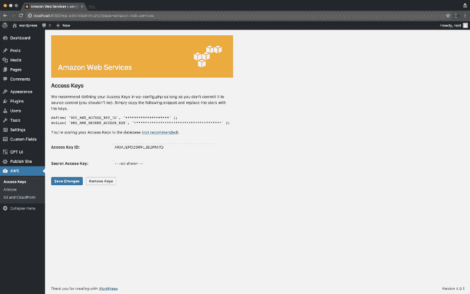
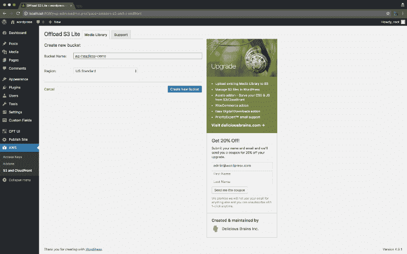
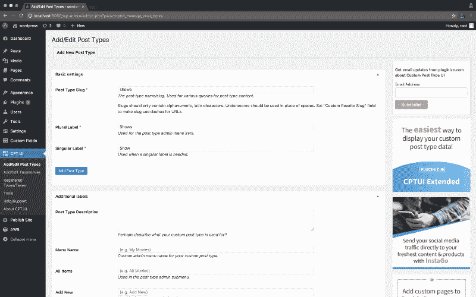
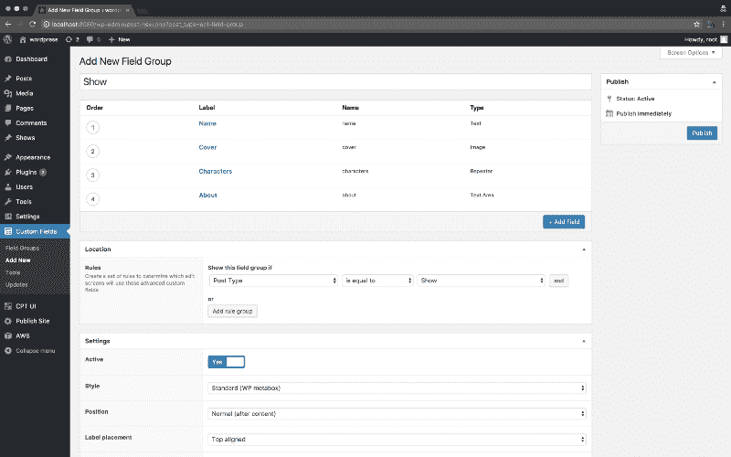
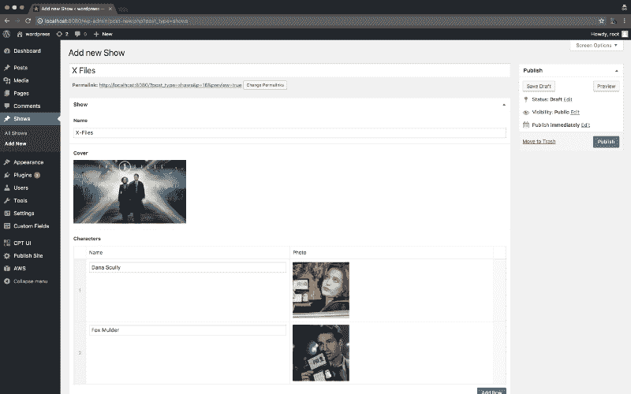
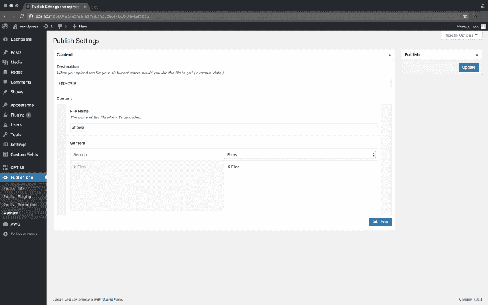
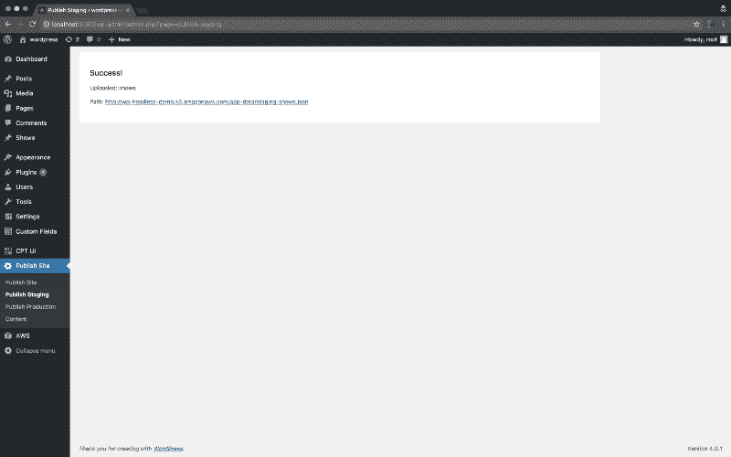

# 砍掉他们的头:如何构建一个无头的 WordPress 来管理内容

> 原文：<https://www.freecodecamp.org/news/off-with-their-heads-building-a-headless-wordpress-to-manage-content-bb04e6b2a792/>

作者德鲁·达尔曼

# 砍掉他们的头:如何构建一个无头的 WordPress 来管理内容

管理内容可能是一件痛苦的事情。然而，提到 WordPress 经常会引起一些开发者的抱怨。2018 年肯定有更好的方式。

好吧，让我们制作一个无头 CMS 并发布可以由无服务器应用程序使用的静态 JSON 或者使用缓存渲染服务器端以获得最高速度！采用这种方法的好处是:我们可以减少安全问题，并在多个地方使用来自 CMS 的数据。我们从来不需要处理服务器负载，因为一切都来自 AWS S3。

是的，WordPress 有一个你可以使用的 API。但是这里的目标是避免在你的应用程序中直接与 WordPress 交互，保持一切静态。

对于这篇文章，我已经创建了一个 repo，它打包了我们将在这里讨论的所有内容，但这篇文章将解释发生了什么，以及如何推出自己版本的上传程序和解析器。

项目回购:[https://github.com/DrewDahlman/headless-wordpress](https://github.com/DrewDahlman/headless-wordpress)
插件:[https://github.com/DrewDahlman/wp-headless](https://github.com/DrewDahlman/wp-headless)

### 介绍

好的——现在让我们谈谈这个项目的目标。

安全:由于我们不会使用传统意义上的 WordPress，我们可以在一些认证中隐藏整个项目，甚至只是将项目与数据库一起保存在 github 上，当需要更改时，你可以在本地旋转项目并发布。

**速度**:由于我们将静态文件发布到 s3，我们唯一一次在数据库上加载是在发布内容和进行更改时，通过这样做，我们的应用程序将只发出一个请求，或者我们可以根据需要拆分并加载，这将始终使应用程序更快。

另一种加快速度的方法是在服务器端渲染并缓存我们的数据文件，这再次提高了我们的交付速度。

酷，让我们做一个无头的 WordPress。

请注意，示例项目附带了一个数据库文件，它会自动为您设置以下所有内容，但是您可以随意摆弄它。但是，您需要提供自己的 AWS 凭据，以便上传工作。

### 设置

我们要做的第一件事是启动我们的 WordPress 实例。为此，我使用回购的例子，但你可以自己这样做。一旦我们开始运行，我们将会安装我们的插件。在这个例子中，我使用了:

[高级自定义字段 Pro](https://www.advancedcustomfields.com/pro/)
[自定义帖子类型](https://wordpress.org/plugins/custom-post-type-ui/)
[亚马逊 Web 服务](https://wordpress.org/plugins/amazon-web-services/)
[亚马逊 s3 和 Cloudfront](https://wordpress.org/plugins/amazon-s3-and-cloudfront/)
[WP 无头](https://github.com/DrewDahlman/wp-headless)

有了这些插件，我们就可以开始了。

我们要做的第一件事是设置 aws 和我们的 s3 存储桶。转到 AWS 设置页面，输入您的凭据。

准备好之后，让我们设置我们的桶。

设置好之后，让我们设置一些文章类型和一些自定义字段。对于这个例子，让我们制作一个自定义 post 类型的电视节目。

酷现在让我们做一些自定义领域:姓名，封面，关于，和一个重复的字符与姓名，照片。

好了——现在我们已经设置好了字段和帖子类型，接下来要做的是输入一些内容。

创建了一个帖子，现在让我们实际发布并看看它是如何工作的。在“发布站点”插件中，有一个内容页面，我们可以在其中配置将要发布的文件以及它们的结构。

在我们之前设置的桶中设置文件应该上传到哪里的内容，然后给我们的数据文件命名，并选择我们想要的帖子、页面和媒体。

之后，只需保存并点击“发布暂存”或“发布生产”即可。

嘣！成功！你应该会看到类似这样的东西。

所以我们来看看数据。

这是一个简单的例子，但是你可以为你的项目提供更多的数据。注意这里发生的一些有趣的事情。我们得到了关于 slug 等的原始 WordPress 数据，但是我们也得到我们所有的 ACF 字段以及图像对象，如果我们想要相关的帖子，或者图库——任何你想要创建的东西！

这是如何工作的？

### 代码

太好了，现在我们可以开始工作了。但是它是如何工作的呢？你怎样才能用你自己的修改创造出类似的东西来出版呢？有时你可能不想要任何原始的 WordPress 数据，也许只是一个 slug 和一个 ID。

让我们看看 wp-headless 插件。我把它作为一个插件，因为它更容易管理生命周期挂钩，同时也符合我们可以让一切都独立存在的想法。也许你想仍然使用传统的主题，但也有这个选项。

[**DrewDahlman/WP-headless**](https://github.com/DrewDahlman/wp-headless/blob/master/wp-headless/wp-headless.php)
[*WP-headless-一个简单的插件，用于从 Wordpress 为无头 CMS 发布静态 JSON 文件。*github.com](https://github.com/DrewDahlman/wp-headless/blob/master/wp-headless/wp-headless.php)

检查代码，一切都很简单。该插件很好，因为它检查依赖关系，并设置初始发布页面，使其更容易。如果你想有其他选择或者更好的选择，你完全可以推出你自己的版本。

这里的一个巧妙之处是设置环境，因此我们可以有一个 staging-FILENAME.json 和 production-FILENAME.json。

有趣的是在第 134 行，我们有一个递归函数来解析一个帖子。

这是由我们的 publish 函数调用的，该函数在我们的 Publish Site settings 页面中的 content 字段上循环。

通过循环遍历每个潜在的内容桶——以及其中的帖子——我们调用 parse post，它循环遍历 WordPress 中的每个字段，然后检查我们可能拥有的 ACF 字段。

就关系领域而言，这有能力深入一个层次。(这主要是因为一个相关的帖子可能引用这个帖子，而这个帖子将永远嵌套和关联下去。)

这里还有一些其他的事情:我们为我们的文件生成一个随机的名字，并在上传之前保存在本地。如果成功了，我们删除随机的目录和文件，网站就发布了。

上传程序也很简单，它使用我们之前设置的 AWS 插件来确定目标桶。请注意，您完全可以通过添加一个参数来检查 WPML，并添加 staging-es-FILENAME.json 之类的东西，来为这些发布添加多语言。

上传者获得文件名、临时文件和最终目的地。这与我们的插件和上传到 S3 检查。

现在所有的设置和工作都完成了，您可以在任何地方使用 s3 文件了！我使用这种设置的方式是在登录前将 WordPress 安装在服务器的一个子域下，并进行认证，如[https://admin.example.com](https://admin.example.com)。这又一次让 WordPress 对外界隐藏起来，并为你的应用程序增加了一层安全性。

你甚至可以在你的服务器上运行另一个应用程序，它从 S3 进行消费，并在服务器端进行渲染。所有这些带来的好处是更好的安全性、更多的内容消费选项以及更低的服务器负载。

你可以采取的另一个选择是在编辑后进行数据库转储，并将其保存在 GitHub repo 中，并允许团队成员对站点进行下拉、旋转、更改和发布。再次强调，确保安全，不用担心任何漏洞。

再次检查 Github 上的插件和示例项目，看看这是如何工作的！

[**DrewDahlman/WP-headless**](https://github.com/DrewDahlman/wp-headless)
[*WP-headless-一个简单的插件，用于从 Wordpress 为无头 CMS 发布静态 JSON 文件。*github.com](https://github.com/DrewDahlman/wp-headless)