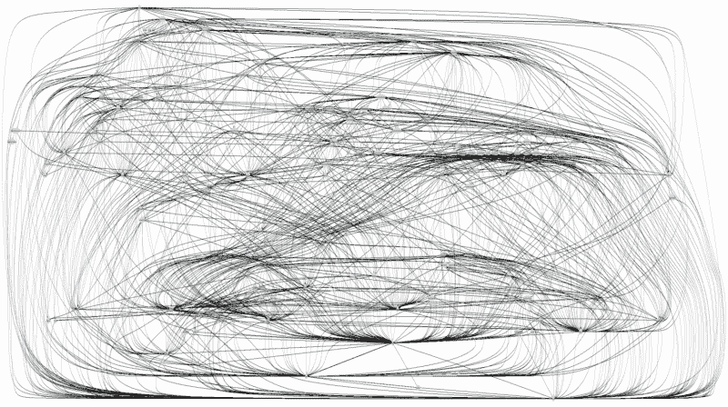

# “JavaScript 很简单！”他们告诉我的？

> 原文：<https://www.freecodecamp.org/news/ok-now-ill-learn-how-to-program-in-javascript-2c7847414830/>

**初级开发者:**好了，现在我来学习如何用 JavaScript 编程！我应该从哪里开始？

**“资深”开发者:**那非常容易，你甚至不需要写很多代码！只要去 npm，安装斑马和考拉[开源](https://hackernoon.com/lets-implement-the-open-source-model-but-which-open-source-a89c82d1b494)模块，就大功告成了！

**初级开发者:**爽！

嗨，小蚱蜢，我能为你做些什么？

**初级开发者:**给我斑马和考拉模块。

当然，他们在这里。

**初级开发者:**全部捆绑。现在我的工作完成了！

*一天后*

**初级开发者:**现在我需要添加这个功能。我应该从哪里开始？

**“资深”开发者:**那非常容易，你甚至不需要写很多代码！只要去 Zebra 的 Github 资源库让他们实现就行了！

初级开发人员:你好，斑马，我需要添加这个新功能，你能帮我吗？

**Zebra:** 当然是创建拉取请求。

**初级开发者:**在这里。

*两天后*

**斑马:**你的拉动要求不好，需要搞定几个东西。

**初级开发者:**在这里。

*两天后*

**斑马:**现在你的拉请求好了，我合并了。

**初级开发者:**谢谢。现在我的工作完成了！

*3 小时后*

**初级开发者:**现在我需要修复这个 bug。我应该从哪里开始？

**“资深”开发者:**那非常容易，你甚至不需要写很多代码！去考拉的 Github 资源库举报就行了！

**初级开发者:**嗨考拉，你的模块有个 bug。

*两天后*

**初级开发者:**嗨考拉，你在吗？

*一周后*

**初级开发者:**有人维护这个模块吗？

*一周后*

**初级开发者:**我来分叉修复。完成了。

*6 个月后*

初级开发人员:现在我需要添加另一个功能。让我们先看看我需要更换哪个模块:

The diagram of the Junior Developer project's dependencies. It's a bunch of scratches forming an unreadable spaghetti.

初级开发人员:呃……我想一定是出了什么问题……JavaScript 太难了，太复杂了！我现在该怎么办？

**真正的开发者:**问题不在 JavaScript。

外部依赖往往过于一般化，因此有很多复杂性，以至于无法考虑您可能没有的边缘情况。

原则上，您需要尽可能减少对外部代码的依赖。随着时间的推移，如果你为了项目的核心目的而依赖依赖关系，那么依赖关系将会产生变更的成本。

批判性地评估他们需求。

只要你设计正确，就有可能为一个通用模块已经可以为你做的事情编写你自己的代码，而不必重新发明轮子。包括(但不限于)[无副作用](https://hackernoon.com/this-is-how-to-get-the-best-out-of-front-end-components-52ee29dfb4ae)、[低耦合](https://medium.com/@fagnerbrack/why-do-you-need-to-know-package-coupling-fundamentals-8e0fa8e33e20)、[高内聚](https://medium.com/@fagnerbrack/why-do-you-need-to-know-package-cohesion-fundamentals-8a3510cba2c1)、[适当的接口](https://codeburst.io/why-do-you-need-to-know-interface-fundamentals-a129ac6ab0c3)、[足够的启示](https://hackernoon.com/affordance-in-software-design-12cc0d9d2721)、[没有废话的测试工具](https://hackernoon.com/a-test-is-as-good-as-its-ability-to-fail-when-it-needs-to-b4b8f212119a)、[可以删除的代码](https://medium.freecodecamp.org/code-that-dont-exist-is-the-code-you-don-t-need-to-debug-88985ed9604)、[没有“过度工程化”](https://hackernoon.com/how-to-accept-over-engineering-for-what-it-really-is-6fca9a919263)、[没有复制/粘贴](https://medium.freecodecamp.org/the-benefits-of-typing-instead-of-copying-54ed734ad849)、[严格的](https://medium.com/@fagnerbrack/the-strictness-principle-9997e483cafb)

如果你没有正确地设计它，你会陷入同样的困境，甚至更糟。

如果你是水管工，水管漏了，你有责任修理它。不是别人的。

这都是关于应用软件原理和技术的。而是学习如何编程。

[不要怪手术刀。](https://hackernoon.com/the-doctor-and-the-scalpel-78656f508c9a)

**初级开发者:**好了，现在我来学习编程。你能帮我吗？

**真实开发者:**是的。

*7 年后*

**新初级开发者:**好了，现在我要学习如何用这种流行的语言编程了！我应该从哪里开始？

**前初级开发者:**我可以教你，但那是**不**容易。

我经历过这些。

坐下吧。

我们谈谈吧。

感谢阅读。如果您有任何反馈，请通过 [Twitter](https://twitter.com/FagnerBrack) 、[脸书](https://www.facebook.com/fagner.brack)或 [Github](http://github.com/FagnerMartinsBrack) 联系我。

想当面聊聊吗？你可以在 [****悉尼软件工匠聚会****](https://www.meetup.com/Software-Crafters-Sydney/) 找到我。