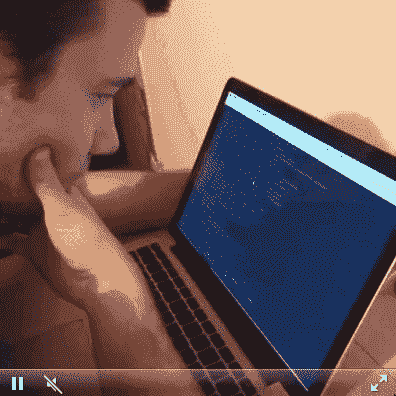

# 人们不仅仅是学习编码

> 原文：<https://www.freecodecamp.org/news/one-does-not-simply-learn-to-code-f25bacdc5b62/>

人们不仅仅是学习编码。因为编码不容易。编码很难。每个人都知道。任何搜索过堆栈跟踪的人——或者 git 分离他们的头——都可以告诉你。

不幸的是，有很多营销人员试图利用“编码很容易”的观念赚钱或者说，如果你使用他们的产品，它将会是。

当有人告诉你编码很容易时，他们是在给你帮倒忙。这实际上只能以三种方式中的一种进行:

#### 场景 1

**人物 1** :“我曾经尝试学习编码。我过得很艰难。生活阻碍了我，我不再试图学习编码。”

**营销人员**:“编码很容易！”

**人 1** :“什么？哦。也许编码终究是容易的。也许我只是个哑巴。”

#### 场景 2

**人物 2** :“我想学编码，但是听起来很难。”

**营销人员**:“编码很容易！”

**人物二**:“真的吗？”

**营销人员**:“是的。购买我的课程/程序/电子书，不到一个月你就会成为一名精英程序员。”

**人物二**:

Shut up and take my money!

**第二个人，一个月后**:“我以为编码应该很简单。也许我只是个哑巴。”

#### 场景 3

人物 3 :我对学习编码一点兴趣都没有。我是一个成功的经理。如果我需要编码的东西，我会付钱给别人帮我编码。

**营销人员**:编码很简单！

**人物 3** :哦，好的。数字。如果是那样的话，我想我不会付给那些代码猴子很多钱，也不会对他们的工作给予很高的评价。

### 脑部手术很容易

说“编码很容易！”就像说“脑外科手术很简单！”或者说“写小说容易！”

> 一位脑外科医生在一次晚宴上对小说家玛格丽特·阿特伍德说:“我一直想写作。当我退休并有时间的时候，我打算成为一名作家。”

> 玛格丽特·阿特伍德回答道:“真巧，因为当我退休时，我会成为一名脑外科医生。”

然而，营销人员继续说:“编码很容易！”，“编码没那么难！”，还是我个人最喜欢的，“编码很简单！难的是那个<something that="" makes="" coding="" hard="">！”</something>

这些营销人员这么说的目的就是让人们觉得自己很蠢——有时在这个过程中拿走了他们的钱。

### 知识的诅咒

不幸的是，不仅仅是营销人员说编码很容易。我经常遇到有经验的开发人员，他们也说“编码很容易！”

为什么一个经历了数千小时才变得擅长编码的人会说编码很容易？因为他们正遭受一种被称为“知识的诅咒”的认知偏见。他们不记得不知道如何编码是什么感觉。即使他们可以，他们可能早就忘记了最初编码对他们来说有多难。

知识的诅咒使得许多有经验的开发人员无法理解初学者。没有什么地方比大家最喜欢的谷歌搜索结果:编码教程更明显缺乏同理心了。

有多少次你真的能够完成你通过谷歌找到的一个随机教程，而没有被一些神秘的错误或歧义所干扰？

这个过程中最糟糕的事情是，当教程作者不自觉地在他们的指导中加入“显然”“容易”这样的词，最讽刺的是:“简单。”

没有什么比进入教程 30 分钟后卡在“只需与 Salesforce 的 API 集成”或“只需部署到 AWS”的步骤上更令人沮丧的了

当这种情况发生时，一千个营销人员的声音在你脑海中回响:“编码很容易！”

你会记得几周前你遇到的那些有经验的开发人员，他们尽力鼓励你说:“编码很容易！”

你甚至会回想起那些糟糕的好莱坞黑客场景，在那里他们让编码看起来如此简单。

在你意识到之前，你会突然听到你自己尖叫的声音，感觉到你的身体站了起来，还有(╯ □ )╯︵ ┻━┻)

但是没关系。深呼吸。编码并不容易。编码很难。每个人都知道。

Coding in real life VS coding in the movies

尽管如此，你还是会向往那些 l33+ h@x0r 的技能。你会觉得有一种被驱使的感觉，除了你的智慧和一些免费的黑屏绿显示器，你什么都不用做就能消灭虫子。

所以让我们去追那条龙。让我们成为好莱坞的精英程序员。哪怕只有一瞬间，让我们感受一下那是什么感觉。

我们开始吧:

第一步:关灯，竖起衣领，戴上飞行员太阳镜

第二步:狂饮一杯能量饮料，压碎罐子，把它甩到你的肩膀上

第三步:[到这里](http://hackertyper.net/)，尽可能快地敲击键盘

权力幻想实现了。

你感觉好点了吗？你在嘲笑我们软件开发的集体结构的荒谬吗？

现在我们已经把这个问题从我们的系统中剔除了，让我们来谈谈英语中最阴险的单词。

### 没有什么是简单的

如果你在教程中遇到一个像“简单”这样的词，很有可能这个教程会假设很多你以前的知识。

也许作者假设您以前编写过类似的代码，并且只是将他们的教程作为参考。也许作者写这个教程的时候把他们自己当成了目标读者。

不管是哪种情况，很有可能这个教程并不是为与你的编码技能水平相当的人设计的。

因此有了“简单规则”:

> 不要在你的教程中使用“简单”这个词，也不要使用使用“简单”这个词的教程。

学会它。知道吧。活下去。

不幸的是，在绝望的谷歌会话开始 20 分钟后，你不太可能记得你应该搜索教程页面，看看它的作者是否假定使用了像“简单”这样的词。

好吧，我们会保护你的。Albert Meija 创建了一个 Chrome 扩展，它可以检测教程中的单词“simply ”,并弹出一个通知，说明该教程不是为初学者设计的。

[**简单来说就是**](https://chrome.google.com/webstore/detail/simply/dbkojggbamijkhapkmbgonfghcicedfm/)
[*这个扩展会分析一个教程，判断它是否是初学者友好的。*chrome.google.com](https://chrome.google.com/webstore/detail/simply/dbkojggbamijkhapkmbgonfghcicedfm/)

这个 Chrome 扩展就像煤矿中众所周知的金丝雀，在你深入学习本教程之前，它会通知你“simply”这个词的存在，以及对你先前知识的假设。

艾伯特在短短几个小时内就完成了这个 chrome 扩展，以回应我在推特上发出的挑战。以下是来自自由代码营营员的一些其他条目，他们的扩展做类似的事情:

[**单纯针对初学者？**](https://chrome.google.com/webstore/detail/simply-for-beginners/opopppnnlnbajijdclnnlmojldgkmpil)
[*简单地突出显示该单词的所有实例，并会发送通知让您知道它不适合初学者。*chrome.google.com](https://chrome.google.com/webstore/detail/simply-for-beginners/opopppnnlnbajijdclnnlmojldgkmpil)[**没那么简单**](https://chrome.google.com/webstore/detail/not-so-simple/ajlkhboagakfehbjcdbaepgbhglkoipn)
[*简单的 Chrome 扩展利用了“简单”规则。如果一个教程包含“简单”这个词，它可能不是为了……*chrome.google.com](https://chrome.google.com/webstore/detail/not-so-simple/ajlkhboagakfehbjcdbaepgbhglkoipn)[**不那么简单**](https://chrome.google.com/webstore/detail/not-so-simply/ljlcdallmfkhhdoflmalffgbgahbefcn/related)
[*如果你所在的页面包含“简单”这个词，它会警告你。用来避免编程教程往往不那么……*chrome.google.com](https://chrome.google.com/webstore/detail/not-so-simply/ljlcdallmfkhhdoflmalffgbgahbefcn/related)

我们当然可以进一步发展这些 chrome 扩展。也许使用自然语言处理来产生一个给定教程的相对难度的更精确的评估，或者它的“假定指数”

但与此同时，这个简单的扩展可能会引导您避开寒冷海洋中那些正在学习编码的沉船“简单”冰山。

直到我们再次相遇——保持坚强，不要相信炒作。学习编码很难。关掉噪音，坚持下去，然后获利。

我只写编程和技术。如果你在推特上关注我，我不会浪费你的时间。？