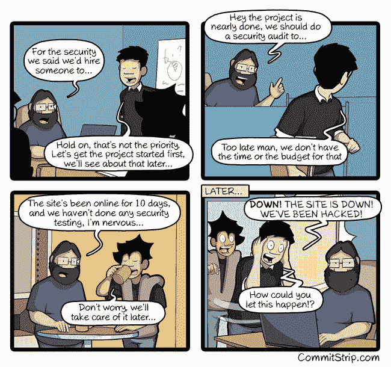

# 一个以太坊交易者由于一个大故障，在几秒钟内就赚了 1142400 美元

> 原文：<https://www.freecodecamp.org/news/one-ethereum-trader-just-made-1-140-000-in-seconds-thanks-to-an-epic-glitch-48af7e0ffe49/>

昨天，一个人们交易类似比特币的加密货币以太坊的市场瞬间崩溃。

以太(以太币)的价值在几秒钟内从大约 300 美元暴跌到 0.10 美元。然后又反弹到 300 美元。

以下是这一极其不可能的事件是如何展开的:

1.  太平洋标准时间下午 12:30 左右，乙醚的价格——在 GDAX 货币交易所的交易价格约为 300 美元——突然跌至 0.10 美元。官方解释是，一名交易员下了数百万美元的订单来出售乙醚。
2.  在混乱中，计算机在自动的、由价格触发的“卖出”指令中抛售乙醚。交易员损失了数百万美元。
3.  但是一个交易者有一个自动的“买入”指令，告诉电脑如果乙醚跌至 0.10 美元，就买入 3809 美元。
4.  几分钟内，乙醚的价格完全恢复到 300 美元左右。这意味着交易者刚刚买入的 3809 乙醚现在价值 1142700 美元。这位交易员在几分钟内获得了 300，000%的回报。

我们以前也经历过类似的“闪电崩盘”(2010 年道琼斯价格突然下跌 9% )。但没有这么大的损失，一项资产在几秒钟内损失了 99.96%。

如果你想知道，不，GDAX 不会退款或撤销这些交易。这是他们对所发生的事情的官方解释。

[*来自 GDAX*](https://blog.gdax.com/eth-usd-trading-update-2-216a3b946ef6) *的更新:“我们将建立一个流程，对由于价格快速波动的直接结果而在 GDAX ETH-USD 订单簿上执行了保证金通知或止损单的客户账户进行贷记。”*

所有这些都留下了一些挥之不去的谜团:

*   为什么乙醚价格暴跌的如此突然，如此彻底？有人故意用数百万美元的卖单操纵市场吗？
*   为什么 GDAX 没有制定对策，在价格开始下跌时停止交易？如果这些对策确实存在，它们没有发挥作用吗？
*   这一极其有利可图的交易背后的人是否创造了 0.10 美元的买单，作为利用极不可能发生的黑天鹅事件的更广泛战略的一部分？还是他们只是开了一个恶作剧，从没想过乙醚的价格会降到那么低？
*   他们是谁？同一个人在知道会导致系统崩溃的情况下，以 0.10 美元的价格同时下了数百万美元的卖单和买单吗？由于以太坊“智能合约”的持有者是匿名的，我们可能永远不会知道。

你可以在这里阅读加密货币交易商对这笔交易的反应[。](https://fcc.im/2tWiDrZ)

如果你想了解更多关于算法交易的内容，我强烈推荐迈克尔·刘易斯的书《闪光男孩:华尔街的反抗》。

### 以下是其他三个值得你花时间去做的链接:

1.  我从苹果拒绝 WWDC 奖学金一事中学到了什么
2.  我把我的第一个创业公司烧成了灰烬。以下是一些惨痛的教训( [9 分钟阅读](https://fcc.im/2tWxl2e))
3.  我们关于敏捷软件开发系列的最新视频:就绪的定义( [3 分钟观看](https://fcc.im/2rYR2K5)

### 想到这一天:

> “crytpocurrency 社区还没有决定他们是想成为无政府主义的反叛者，还是想取代现有机构。”—阿迪·萨莫尔

### 今日趣事:

网络漫画作者 [CommitStrip](https://fcc.im/2tWCB69) 。

### 今日学习小组:

布宜诺斯艾利斯自由代码营

编码快乐！

–昆西·拉森，自由代码营的老师

如果你从这些邮件中获得了价值，请考虑[支持我们的非营利组织](http://bit.ly/donate-to-fcc)。