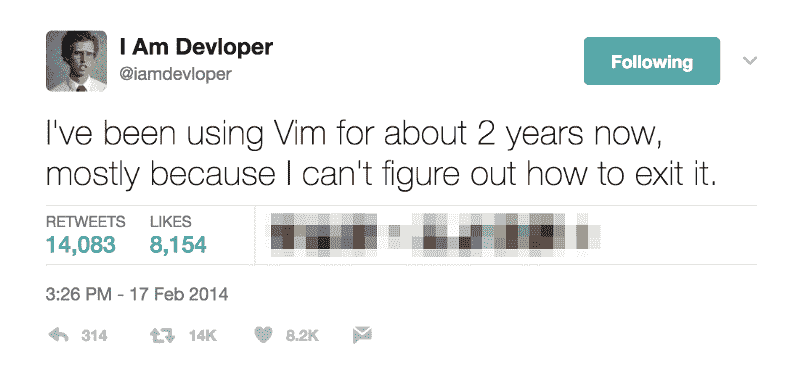
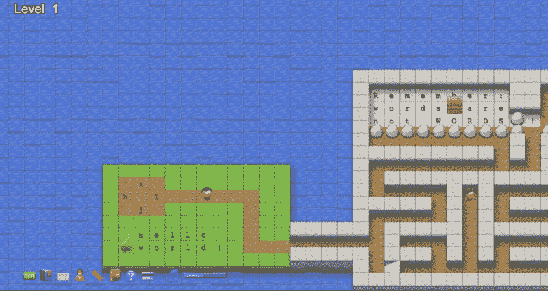

# 如何退出 Vim 并退出 VI 编辑器——最常见的堆栈溢出问题

> 原文：<https://www.freecodecamp.org/news/one-out-of-every-20-000-stack-overflow-visitors-is-just-trying-to-exit-vim-5a6b6175e7b6/>

Vim 是一个流行的纯键盘代码编辑器，最初发布于 1991 年。这是出了名的难学，但许多开发人员坚信这一点。

Vim 几乎安装在每一台基于 Linux 或 Unix 的计算机上，如果你不小心打开它，就很难退出。

Stack Overflow [刚刚宣布](https://fcc.im/2qSxIN5)他们达到了一个新的里程碑:超过 100 万的开发者访问了 Stack Overflow，试图找出如何退出 Vim。

A Vim-related tweet by [I Am Devloper](https://fcc.im/2qdz2XL)

如果您发现自己被困在 Vim 中，通常可以通过以下方式退出:

1.  按 escape 键进入“主”模式
2.  然后输入`:`进入“最后一行”模式
3.  然后键入`q`并按回车键。

这应该退出。如果没有，重复这些步骤，使用`q!`来强制退出。

如果你想保存你对文件所做的任何更改，你可以给这些命令添加一个`w`(w 代表“写”):`wq`或`wq!`

如果你需要在 Linux 服务器上改变一些东西，并且还没有投入几十个小时来精通 Vim，你可以通过键入:`nano [filename]`用一个简单得多的内置编辑器 Nano 打开一个文件

如果你想在 Vim 上做得更好，可以试试 [Vim Adventures](https://fcc.im/2rQka1J) ，这是一款通过 Vim 命令控制的类似塞尔达的游戏。

我只写编程和技术。如果你在推特上关注我，我不会浪费你的时间。？