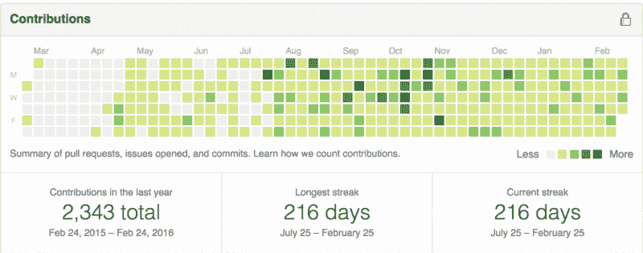
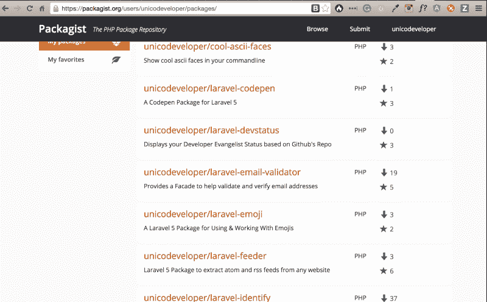
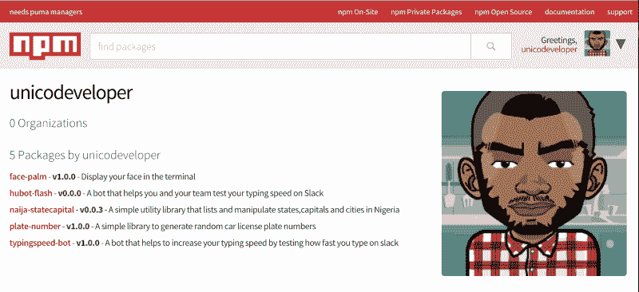
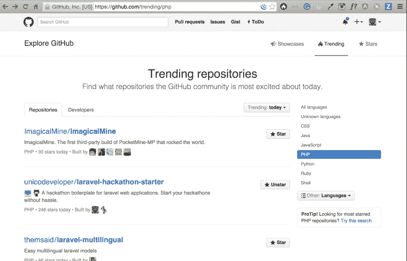
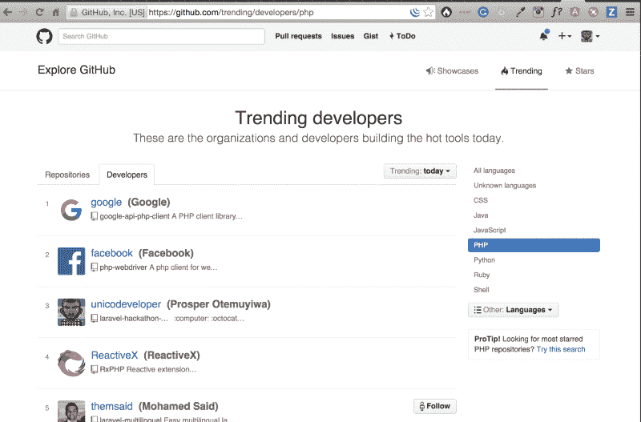
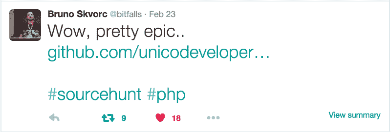
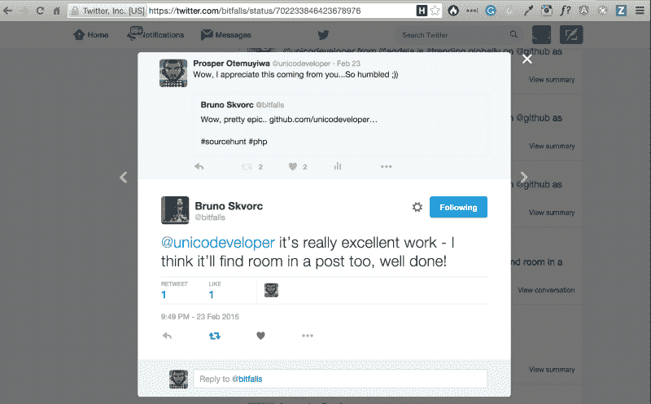

# 通往伟大的一条路:选择你自己

> 原文：<https://www.freecodecamp.org/news/one-way-to-greatness-pick-yourself-31945487731b/>

作者:Prosper Otemuyiwa

# 通往伟大的一条路:选择你自己

我听很多人说过:“我想变得伟大”，但大多数人只是有一些疯狂的想法和对伟大的想象，他们每天的计划和行动都很正常，没有什么不寻常的。

让我来打破你的幻想吧，伟大是太英俊、可爱、完美&超级有魅力了，不会突然降临到任何人身上，你必须引诱它。是的，我说了，你必须引诱它来转移对你的特别关注。

我们认识的一些人，如微软的比尔·盖茨、脸书的马克·扎克伯格、国际营销的塞思·戈丁和 T5，他们不仅仅是从普通大众中脱颖而出成为成功人士的，他们是通过尽早开始并坚持不懈地坚持下去而脱颖而出的。

十多年来，Seth Godin 每天都在他的 T2 网站 T3 上写博客。

**丽贝卡·布莱克**已经[接触到](https://www.google.com/search?q=rebecca+black&ie=utf-8&oe=utf-8&rls=org.mozilla:en-US:official&client=firefox-a&gfe_rd=cr&ei=bqLOVoT0KZLW8AfusJzIAg&gws_rd=ssl#q=rebecca+black&hl=en&client=firefox-a&hs=AQf&rls=org.mozilla:en-US:official&prmd=ivnsuo&source=univ&tbs=vid:1&tbo=u&sa=X&ei=ShOGTe3GCM6-0QGT3sDNCA&ved=0CDsQqwQ&fp=d42518d7ce5b7763)超过 1500 万听众，不管你喜不喜欢，没有唱片公司，仅仅通过制作视频并持续上传到 youtube。

阿曼达·霍金通过在 Kindle 上发布自己的作品，一年赚了 T2 百万美元。没有出版商。

***拒绝被挑选的暴政:挑选自己——塞斯·戈丁***

等待被选中是一种文化本能。许多人在真正开始工作之前，试图从其他人那里获得许可或认可。这很常见，尤其是在找工作的年轻人中，他们向人力资源部门提交简历，然后就等着。他们只是在等待被“选中”。与此同时，他们当时可以做的事情有一千零一件，可能会比他们在简历中申请的工作更优雅、更成功。

> 一旦你拒绝了这种冲动，意识到没有人会选择你——白马王子已经选择了另一所房子——那么你就可以开始工作了——塞思·戈丁

我们这个世界好的一面(理想情况下，我想应该是坏的一面)是，我们总是面临寻求解决方案的问题，而人们只是在等待。一般来说，没有人想解决难题，但我们每天庆祝和称赞的人是解决这些难题或至少试图提供这些解决方案的人，不管这些问题有多棘手。一旦你意识到你拥有解决人们的问题或为他们的生活增加价值所需的所有资源和许可，机会就会比比皆是。

我是一名 23 岁的软件开发人员，为了不成为一个普通人，不仅仅是消耗地球的自然资源，我决定开一个[博客](http://goodheads.io/)，在那里我写技术文章，教人们如何编程。我也决定开始为[开源](https://github.com/unicodeveloper)做贡献来磨练我的技能。我已经向几个开源项目发送了几个拉请求，有些被拒绝，有些被接受。我已经将至少 3 个 pr 合并到 [Laravel 框架](http://laravel.com/)中。我个人也决定开始建库，包&模块。过去 7 个月的每一天，我都在承诺&向 [Github](https://github.com/unicodeveloper) 推送东西。

在此期间，我有机会创建了大约 15 个 PHP/Laravel 包、4 个 npm 模块和 3 个 bower 组件，世界各地的人们已经在不同的地方下载并使用了它们。我目前计划为 iOs、Python 和 Django 构建库和组件。

就在最近，我开发并发布了一个[**Laravel Hackathon Starter Pack**](https://github.com/unicodeveloper/laravel-hackathon-starter)**项目，让开发者可以轻松地开始使用**Hackathon**和**MVP**，令我惊讶的是，它得到了很多关注。在向公众发布的 4 天内，它在 [Github](https://github.com/unicodeveloper/laravel-hackathon-starter) 上聚集了超过 500 颗星，该项目在 [Github](https://github.com/unicodeveloper/laravel-hackathon-starter) 上开始[趋势](https://github.com/trending/php)还在 [Github](https://github.com/unicodeveloper/laravel-hackathon-starter) 上获得了 [me 趋势](https://github.com/trending/developers/php)作为世界顶级#PHP 开发人员。**

**

2nd trending PHP project all over the world** **

Just after Google & Facebook** **

Senior Sitepoint PHP Editor tweeted about it.** ****

**我也从一些受欢迎的网站得到了评论，如[拉勒韦尔日报](http://laraveldaily.com/hackathon-starter-boilerplate-package-for-quick-start/) & [拉勒韦尔新闻](http://laravel-news.com/)**

**它让许多人在 T [witter](https://twitter.com/unicodeveloper) 、 [GitHub](https://github.com/unicodeveloper) 、&、[脸书](https://www.facebook.com/otemuyiwa.prosper)和许多**、*“好样的，干得好”*、**的消息传遍了推特&脸书。现在，这与聪明与否完全无关，因为我认为自己是我工作的地方最不聪明的人之一，也就是 [**安德拉**](http://andela.com/) ( *这个公司里太多聪明的人了*)这可能也没什么意义，但它教会了我 4 个教训:**

1.  **不要坐等事情发生，要让事情发生。**
2.  **坚持不懈地做伟大的工作，不要跑几圈就停下来。**
3.  **你做一些很棒的事情的日子已经一去不复返了&等待人们注意到你，通过各种渠道把你的工作推向公众。社交媒体让每个人都变得非常容易。**
4.  **如果你跌倒了，让它成为舞蹈的一部分。不要气馁。**

**我还没有成功，离我的目标还差得很远，但我知道我的名字最终会在某个时候出现在每个人的嘴边&我会给数百万人的生活增加价值，因为我通过选择自己有了一个好的开始。**

*****没人会挑你。选你自己。—塞斯·戈丁*****