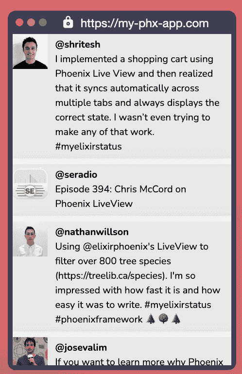

# 我是如何在不写任何代码的情况下为一个大型开源项目做出贡献的

> 原文：<https://www.freecodecamp.org/news/open-source-continuous-integration/>

我最近收到了一个合并到流行的 Phoenix 框架中的 pull 请求，我没有编写任何灵丹妙药代码就完成了它。我也没有写任何文档。我所做的是帮助改进构建过程。

在这篇文章中，我想分享我对他们的构建过程所做的改进。这些改进并不是 Phoenix 框架特有的，它们可能会改变您处理持续集成的方式。

但首先，一些背景。

## 什么是凤凰框架？

Phoenix 是一个 web 框架，具有一些非常有趣的特性。使用 Phoenix，您可以构建丰富的交互式 web 应用程序，而无需编写客户端代码。

您可以使用一个名为 LiveView 的功能来做到这一点，该功能从服务器发送实时更新，以更新客户端浏览器的 HTML。

我们可以创建一个页面，非常容易地实时显示某个主题的最新推文。

这里有一个例子:

```
defmodule TimelineLive do
  use Phoenix.LiveView

  def render(assigns) do
    render("timeline.html", assigns)
  end

  def mount(_, socket) do
    Twitter.subscribe("elixirphoenix")
    {:ok, assign(socket, :tweets, [])}
  end

  def handle_info({:new, tweet}, socket) do
    {:noreply,
     update(socket, :tweets, fn tweets ->
       Enum.take([tweet | tweets], 10)
     end)}
  end
end 
```

Phoenix LiveView Controller for a Twitter Application



Real-Time Twitter Results with No Javascript Written

该框架是用编程语言 Elixir 编写的

它是由何塞·瓦里姆创造的。它看起来很像 Ruby，但是语义非常不同。Elixir 运行在 Erlang VM 上，它支持像 Discord 这样的项目，并在 Heroku 这样的公司中使用。

## 如何重现构件

Phoenix 框架使用 GitHub 动作作为他们的构建管道。像许多伟大的项目一样，他们有一套单元测试，需要在每个用户贡献上运行。

然而，这并不是他们测试努力的终点。他们也有一套集成测试。Phoenix 使用 ORM 与各种数据库对话，集成测试确保没有任何更改会破坏与 3 个受支持数据库的集成。

这是一种常见的模式。拥有大量易于运行的单元测试以及少量较慢但更全面的集成测试是防止将 bug 引入项目的一个好方法。

然而，Phoenix 框架更进一步，因为它们还需要支持 Elixir 语言的几个版本和开放电信平台(OTP)的几个版本。

这开始听起来很复杂。我们必须用以下各项的所有组合来测试每个变化:

*   数据库(Postgres、MySQL MSSQL)
*   酏剂(当前和以前的版本)
*   OTP(当前和以前版本)

在 GitHub Actions 中设置这一点相对容易，但是如何在本地运行这些测试呢？

安装所有这些会有很多要求，所以贡献者倾向于依赖 GitHubActions 来测试这些组合。然而，如果每个人都必须依赖于将东西推送到 GitHub it，看看测试是否通过，那么开发就会变慢。

我们如何解决这个问题？

## 如何统一测试运行

这是我参与的地方。我在 Earthly Technologies 工作，是一名开源开发者倡导者。我们有一个非常酷的开源构建工具，虽然我偶尔会直接参与项目，但我的工作是成为使用该工具的社区和团队之间的联系点。

我听说过凤凰团队面临的再现性问题。我想我可以帮助编写一个构建脚本，既可以用于 GitHub 操作，也可以用于本地开发工作流。所以我开始着手公关工作。

### 在本地运行测试

我最终创造的，稍微简化的，是这样的:

```
setup:
   ARG ELIXIR=1.10.4
   ARG OTP=23.0.3
   # Pull a Docker Image to Run Build Inside Of
   FROM hexpm/elixir:$ELIXIR-erlang-$OTP-alpine-3.12.0
   ...

integration-test:
    FROM +setup
    COPY . .
    # Pull In Dependencies
    RUN mix deps.get 
    # Start Up Service Dependencies
    WITH DOCKER --compose docker-compose.yml 
        # Run Tests
        RUN mix test --include database 
    # Stop Service Dependencies
    END 
```

这是一个地球文件。它由几个目标组成，比如`setup`和`integration-test`。目标之间可以有依赖关系。您可以使用命令行工具`earthly`来运行任何目标，每个目标都在 Docker 容器中运行。容器化将允许我们在任何我们选择的地方运行构建。

这个例子在安装了指定版本的 Elixir 和 OTP 的`hexpm/elixir` Docker 容器中运行`integration-test`。

在使用 `mix test --include database`运行测试之前，我们使用 Docker compose 启动所有需要的依赖项:

```
 WITH DOCKER --compose docker-compose.yml
        RUN mix test --include database
 END 
```

Docker 合成文件如下所示:

```
version: '3'
services:
  postgres:
    image: postgres
    ports:
      - "5432:5432"
    environment:
      POSTGRES_PASSWORD: postgres
  mysql:
    image: mysql
    ports:
      - "3306:3306"
    environment:
      MYSQL_ALLOW_EMPTY_PASSWORD: "yes"
  mssql:
    image: mcr.microsoft.com/mssql/server:2019-latest
    environment:
      ACCEPT_EULA: Y
      SA_PASSWORD: some!Password
    ports:
      - "1433:1433" 
```

这些是我们测试凤凰号所需的数据库。

现在我们可以在命令行运行集成测试，如下所示:

```
>  earthly -P +integration-test 
```

如果我们想测试不同版本的 Elixir，我们可以将版本指定为构建参数:

```
 > earthly -P --build-arg ELIXIR=1.11.0 --build-arg OTP=23.1.1 +integration-test 
```

还有其他方法可以做到这一点。makefile 和 dockerfiles 的组合也可以工作。关键是将构建逻辑从 GHA 特定的格式中取出，放入可以在任何地方运行的东西中。

## 如何在 GitHub 操作中运行它

要在 GitHub Actions 中使用相同的过程，我们唯一需要做的就是调整我们的 GitHub Actions yaml，将 Earthly 用于构建管道，这样我们就都准备好了。

```
 integration-test-elixir:
    runs-on: ubuntu-latest
    env:
      FORCE_COLOR: 1

    strategy:
      fail-fast: false
      matrix:
        include:
          - elixir: 1.11.1
            otp: 21.3.8.18
          - elixir: 1.11.1
            otp: 23.1.1
    steps:
      - uses: actions/checkout@v2
      - name: Download released earth
        run: "sudo /bin/sh -c 'wget https://github.com/earthly/earthly/releases/download/v0.4.1/earthly-linux-amd64 -O /usr/local/bin/earthly && chmod +x /usr/local/bin/earthly'"
      - name: Execute tests
        run: earthly -P --build-arg ELIXIR=${{ matrix.elixir }}  --build-arg OTP=${{ matrix.otp }} +integration-test 
```

好了，我们现在能够在本地运行我们的构建管道，而不需要任何复杂的环境设置。我们也可以在我们的开发机器上运行相同的构建过程，而不需要安装除了 Earthly 之外的任何东西。这使得新的贡献者更容易接近项目。

## 最终结果

最终，在 Phoenix 团队的帮助下，我批准了这个变更，Phoenix 项目现在有了一个简单的方法来测试和迭代他们的本地构建管道。我甚至没有写任何长生不老药的代码！你可以在 [PR](https://github.com/phoenixframework/phoenix/pull/4072) 中找到更多细节。

感谢您阅读这篇文章。如果你想了解更多关于地球的事情，你可以在这里找到很多。如果您需要我帮助您构建开源项目，请告诉我。