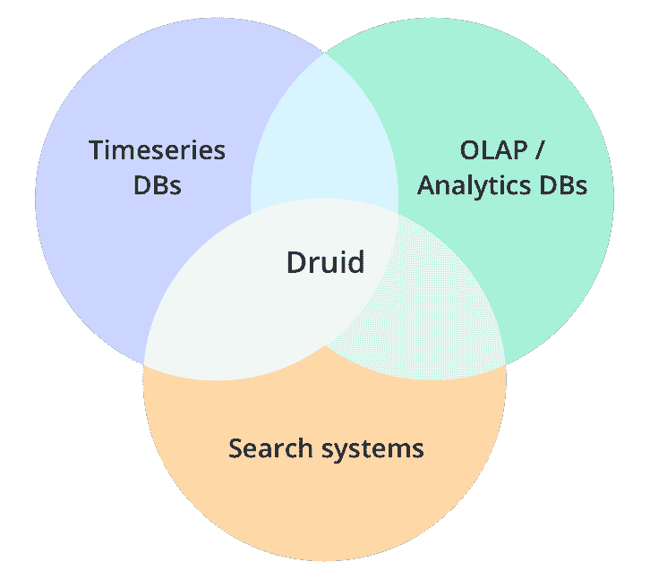
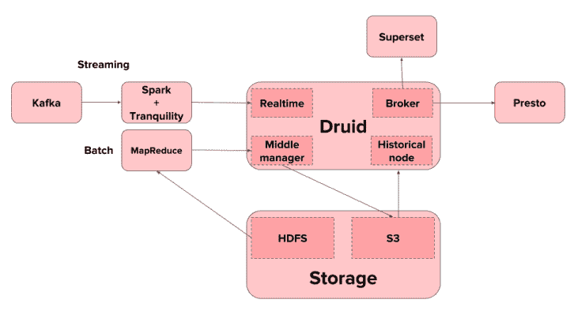

# 使用这些开源工具进行数据仓库存储

> 原文：<https://www.freecodecamp.org/news/open-source-data-warehousing-druid-apache-airflow-superset-f26d149c9b7/>

如今，每个人都在谈论开源软件。然而，这在数据仓库(DWH)领域还不常见。这是为什么呢？

在这篇文章中，我选择了一些开源技术，并用它们为数据仓库系统构建了一个完整的数据架构。

我用 [Apache Druid](http://www.druid.io/) 进行数据存储，用 [Apache 超集](https://superset.incubator.apache.org/)进行查询，用 [Apache Airflow](https://airflow.apache.org/) 作为任务协调器。

### Druid —数据存储

Druid 是用 Java 编写的开源、面向列的分布式数据存储。它旨在快速接收大量事件数据，并在数据基础上提供低延迟查询。

#### 为什么要用德鲁伊？

Druid 有许多关键特性，包括亚秒级 OLAP 查询、实时流摄取、可伸缩性和成本效益。

考虑到现代 OLAP 技术的比较，我选择了德鲁伊而不是点击屋、皮诺和阿帕奇麒麟。最近，[微软宣布他们将在 Azure HDInsight 4.0 中加入德鲁伊](https://azure.microsoft.com/en-us/blog/azure-hdinsight-brings-next-generation-hadoop-3-0-and-enterprise-security-to-the-cloud/)。

#### 为什么不是德鲁伊？

卡特·尚克林写了一篇关于小德在 Horthonwork.com 的局限性的详细文章。主要问题是它对 SQL 连接和高级 SQL 功能的支持。

### 德鲁伊教的建筑

由于其集群架构，Druid 是可伸缩的。您有三种不同的节点类型—中间管理节点、历史节点和代理。

最棒的是，您可以在最适合您的特定区域添加任意多的节点。如果您有许多查询要运行，您可以添加更多的代理。或者，如果需要批量接收大量数据，您可以添加中层管理人员等等。

下面显示了一个简单的架构。你可以在这里阅读更多关于德鲁伊的设计[。](http://druid.io/docs/latest/design/)

### Apache 超集—用户界面

查询 Druid 最简单的方法是通过一个叫做 [Apache 超集](https://superset.incubator.apache.org/)的轻量级开源工具。

它易于使用，拥有所有常见的图表类型，如气泡图、字数统计、热图、箱线图和[等等](https://superset.incubator.apache.org/gallery.html)。

Druid 提供了 Rest-API，在最新版本中还提供了 SQL 查询 API。这使得使用任何工具都很容易，无论是标准 SQL、任何现有的 BI 工具还是自定义应用程序。

### 阿帕奇气流——管弦乐队

正如在 [Orchestrators —调度和监控工作流](https://www.sspaeti.com/blog/olap-whats-coming-next/#Orchestrators)中提到的，这是最关键的决策之一。

在过去，像微软 SQL Server Integration Services(SSIS)和其他 ETL 工具被广泛使用。它们是你进行数据转换、清理和标准化的地方。

在更现代的架构中，这些工具已经不够了。

此外，代码和数据转换逻辑对公司中其他精通数据的人更有价值。

我强烈推荐你阅读 Maxime Beauchemin 关于 T2 功能数据工程的博客文章——批量数据处理的现代范例。这更深入地探讨了现代数据管道应该是什么样的。

此外，考虑阅读[数据工程师](https://medium.com/@maximebeauchemin/the-downfall-of-the-data-engineer-5bfb701e5d6b)的垮台，其中 Max 解释了打破“数据孤岛”和更多内容。

#### 为什么要用气流？

Apache Airflow 是一个非常流行的任务编排工具。气流是用 Python 写的。任务被写成有向无环图([Dag](https://en.wikipedia.org/wiki/Directed_acyclic_graph))。这些也是用 Python 写的。

您不是将关键的转换逻辑封装在工具中的某个地方，而是将它放在 Orchestrator 中属于它的地方。

另一个优势是使用普通 Python。不需要封装其他依赖项或需求，比如从 FTP 获取、从 A 向 B 复制数据、编写批处理文件。你在同一个地方做这个和其他事情。

#### 气流特征

此外，您可以在一个位置获得所有当前任务的完整功能概述。

Airflow 的更多相关特性是，您可以像编写程序一样编写工作流。像 Databricks、Spark 等外部工作。没有问题。

工作测试通过气流本身进行。这包括将参数传递给下游的其他作业，或者验证什么在 Airflow 上运行，并查看实际代码。可以通过 web GUI 访问日志文件和其他元数据。

仅在部分工作流和相关任务上(重新)运行是一项重要功能，当您使用 Airflow 创建工作流时，该功能即会出现。作业/任务在上下文中运行，调度程序会传入必要的详细信息，而且工作会在任务级别而不是 DAG 级别分布到整个集群。

更多功能请访问[完整列表](https://gtoonstra.github.io/etl-with-airflow/great.html)。

#### 使用 Apache Airflow 的 ETL

如果您想将 Apache Airflow 作为新的 ETL 工具，请从与您分享的这个【with Airflow 最佳实践开始。它有简单的[ETL](https://gtoonstra.github.io/etl-with-airflow/etlexample.html)——例子，有普通 SQL，有 [HIVE](https://gtoonstra.github.io/etl-with-airflow/hiveexample.html) ，有 [Data Vault](https://gtoonstra.github.io/etl-with-airflow/datavault.html) ， [Data Vault 2](https://gtoonstra.github.io/etl-with-airflow/datavault2.html) ，有[Data Vault with Big Data processes](https://gtoonstra.github.io/etl-with-airflow/datavault-bigdata.html)。它给了你一个很好的概述什么是可能的，以及你将如何实现它。

同时，你可以使用 Docker 容器，这意味着你甚至不需要设置任何基础设施。你可以把容器从[拉到这里](https://gtoonstra.github.io/etl-with-airflow/etlexample.html#run-airflow-from-docker)。

对于 GitHub-repo，请点击[带气流的 ETL](https://github.com/gtoonstra/etl-with-airflow)上的链接。

### 结论

如果您正在搜索开源数据架构，那么您不能忽略 Druid 的快速 OLAP 响应、Apache Airflow 作为协调器保持您的数据血统和时间表一致，以及 Apache Superset 等易于使用的仪表板工具。

到目前为止，我的经验是，德鲁伊速度非常快，非常适合用传统方式取代 OLAP 魔方，但仍然需要一个更轻松的启动来安装集群、接收数据、查看日志等。如果你需要的话，看看德鲁伊的创始人创造的[小鬼](https://imply.io/)。它创建了所有你需要的关于德鲁伊的服务。不幸的是，它不是开源的。

Apache Airflow 及其作为 orchestrator 的特性在传统的商业智能环境中还没有出现过。我相信当你开始使用开源和更多的新技术时，这种变化会很自然地出现。

Apache Superset 是从 Druid 开始运行和显示数据的一种简单快捷的方式。有更好的工具，如 Tableau 等。，但不是免费的。这就是为什么如果您已经在使用上述开源技术，Superset 非常适合这个生态系统。但作为一家企业公司，你可能会想在这方面花些钱，因为这是用户在一天结束时可以看到的。

相关链接:

*   [了解 Apache Airflow 的关键概念](https://medium.com/@dustinstansbury/understanding-apache-airflows-key-concepts-a96efed52b1a)
*   [德鲁伊如何在 Airbnb 实现分析](https://medium.com/airbnb-engineering/druid-airbnb-data-platform-601c312f2a4c)
*   [谷歌发布 Cloud Composer，这是一款面向开发者的全新工作流程自动化工具](https://techcrunch.com/2018/05/01/google-launches-cloud-composer-a-new-workflow-automation-tool-for-developers/)
*   [基于 Apache Airflow 的全托管工作流程编排服务](https://cloud.google.com/composer/)
*   [集成 Apache Airflow 和 Databricks:用 Apache Spark 构建 ETL 管道](https://databricks.com/blog/2016/12/08/integrating-apache-airflow-databricks-building-etl-pipelines-apache-spark.html)
*   [带阿帕奇气流的 ETL](https://gtoonstra.github.io/etl-with-airflow/)
*   [什么是数据工程和数据仓库的未来](https://hackernoon.com/data-engineering-the-future-of-data-warehousing-81bc953a9b00)
*   [implie—托管德鲁伊平台(闭源)](https://imply.io/)
*   [使用 Apache Hive 和德鲁伊的超快速 OLAP 分析](https://de.hortonworks.com/blog/apache-hive-druid-part-1-3/)

*最初发布于 2018 年 11 月 29 日[www.sspaeti.com](https://www.sspaeti.com/blog/open-source-data-warehousing-druid-airflow-superset/)。*