# Python 运算符–Python 中的逻辑运算符

> 原文：<https://www.freecodecamp.org/news/operators-in-python-how-to-use-logical-operators-in-python/>

任何编程语言中的操作符都是基本的构造块，我们可以使用它们来构造强大、复杂的语句来解决问题。

Python 提供了不同类型的操作符，比如算术操作符、逻辑操作符、关系操作符等等。在这篇文章中，让我们深入 Python 中的逻辑运算符，并学习如何使用它们。

Python 提供了三种逻辑或布尔运算符，“与”、“或”和“非”运算符。这些函数作用于一个或多个操作数，根据它们的值，计算为真或假。然后在此基础上做出决策。

### Python“与”运算符

Python 的“and”运算符是一个二元运算符，这意味着它需要两个操作数。一般语法如下所示:

```
operand1 and operand2
```

当且仅当两个操作数都为真时，输出为真。如果任何操作数为假，则输出为假。让我们看一些例子:

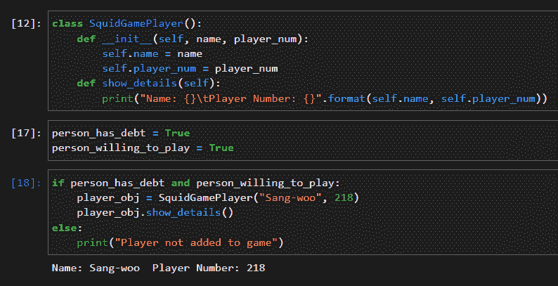

这里我们使用 and 运算符来决定一个人是否可以被认为是 Squid 游戏中的玩家。

“与”的两个操作数是变量`person_has_debt`和`person_willing_to_play`。因为两者的值都为真，所以 and 表达式的输出为真，并且创建了一个新的 player 对象，我们在其中指定了玩家名称和玩家编号。

现在，如果`person_willing_to_play`的值为假呢？

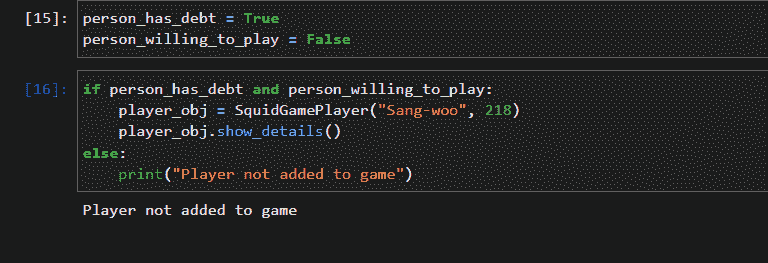

我们知道，只有当两个操作数都为真时,“与”才会输出真。如果其中任何一个为假，则输出为假，并执行 else 子句中的语句。我们可以使用“and”添加任意多的表达式，例如:

```
if person_has_debt and person_willing_to_play and proper_age and total_player_capacity_not_full:
    player_obj = SquidGamePlayer("Sae-byok", 67)
    player_obj.show_details()
else:
    print("Player not added to game")
```

从左到右计算操作数的真值，如果任何一个操作数为假，则输出为假，否则输出为真。

操作数可以是算术或关系表达式(或两者的任意组合)、嵌套逻辑表达式等等。

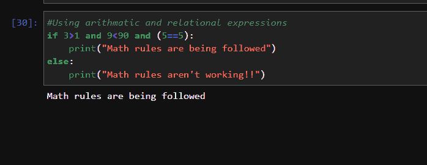

### Python“或”运算符

“or”运算符也是二元运算符，需要两个操作数。如果“或”表达式的任何操作数为真，则其输出为真，否则输出为假。

```
operand1 or operand2
```

让我们看一些简单的例子:

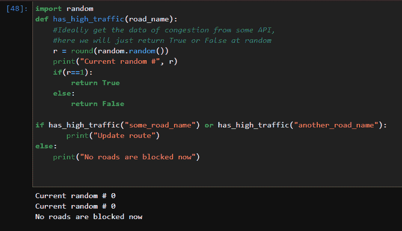

这里“或”的操作数是带有输入`"some_road_name"`和`"another_road_name"`的方法`has_high_traffic`的输出。

为了简单起见，这个方法随机返回 True 或 False。在第一次执行期间，两次方法调用都返回 False，并且“or”的计算结果为 False，因为两个操作数都为 False。

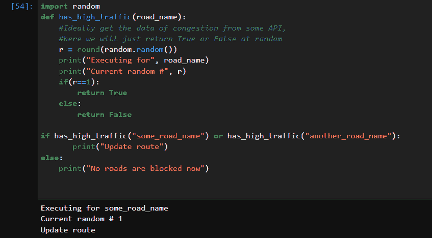

在第二次执行期间，随机数现在是 1，因此方法调用`has_high_traffic("some_road_name")`返回 True。我们知道，如果“或”的任何操作数为真，则最终输出也为真。所以在这种情况下,“or”表达式为真，if 子句中的语句被执行。

你注意到一件事了吗？只执行了第一个方法调用，没有调用`has_high_traffic("another_road_name")`。为什么？这是由于一种叫做**短路**的东西，我们很快就会了解到。

### Python“非”运算符

“not”是一元运算符，这意味着它使用一个操作数，并返回该操作数的反真值。

```
not ( operand )
```

简单地说，如果输入为真，则输出为假，如果输入为假，则输出为真。

当操作数直接为类型`bool`时，这很简单。然而，输入可以是数字类型、对象、列表等等。在这种情况下，输出取决于 Python 如何计算该实体的真值。

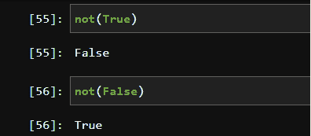

### Python 如何计算真值？

所有的逻辑运算符都使用其操作数的真值，但是真值到底是什么呢？

我们知道 bool 类型`True`代表真，`False`代表假。Python 认为零是假的，而所有其他数字，不管它们是正还是负，都被认为是真的。

看看下面的例子:

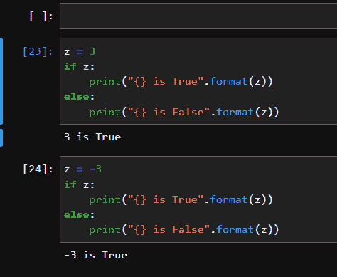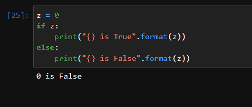

Python 中实体的真值是在一些标准规则的基础上计算出来的，如本文链接[的“真值测试”部分所定义的](https://docs.python.org/3/library/stdtypes.html#truth-value-testing)。

现在，我们知道了 not 运算符在以下示例中是如何工作的:

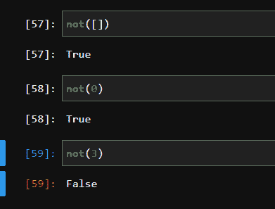

空列表`[]`的长度为零，所以真值为假。零为假，在两种情况下，反相值为真，3 为真，因此`not(3)`等同于为假的`not(True)`。

### 逻辑运算符的短路

Python 中的逻辑“与”和“或”操作符是短路的，这意味着它们只评估获得正确结果所需的最低限度。例如:

```
if expression1 and expression2 and expression3:
	#do something
else:
	#do something else 
```

如果`expression1`为假，我们知道`and`的最终输出为假。那么评价`expression2`和`expression3`有意义吗？不，这没有意义，Python 也不这么做。它从左到右开始计算，只要表达式为假，and 就计算为假，跳过剩余操作数的执行。

“或”运算符也会发生同样的情况:

```
if expression1 or expression2 or expression3:
	#do something
else:
	#do something else 
```

如果`expression1`为真，那么“或”表达式的输出立即变为真，忽略剩余的 2 个操作数。

这样可以避免花费不必要的时间来评估表达式，因为表达式的输出不会影响表达式的最终输出。

### 关于“与”和“或”如何工作的最后一点说明

在这篇文章的开始，我提到当且仅当它的所有操作数为真时,“与”的输出为真，否则输出为假，如下所示:

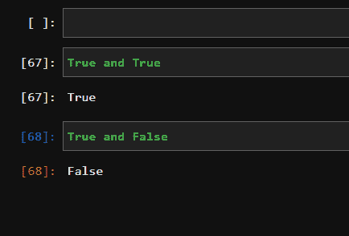

现在让我们来看看引擎盖下发生了什么。`and`实际上不返回 True 或 False 值。相反，它返回它的一个操作数！此处的文档[中提到了这一点，特别是这一部分，引用自文档:](https://docs.python.org/3/library/stdtypes.html#truth-value-testing)

> (重要的例外:布尔运算`or`和`and`总是返回它们的一个操作数。)

```
operand1 and operand2
```

所以如果`operand1`为假，`and`返回`operand1`，否则返回`operand2`。如果操作数是 bool 类型，那么就很容易理解了。如果我们有如下操作数会怎么样:

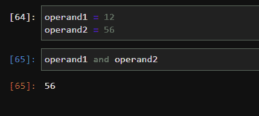

这里发生了什么事？`operand1`是 12 这是真的，`operand2`是 56 这也是真的，所以`and`返回`operand2`这是 56。

好的，但是这在 if-else 这样的条件语句中是如何工作的呢？还记得 56 也有一个真值吗？所以`and`给出输出 56，现在真值 56 用在 if-else 中。56 为真，因此执行 if 子句。

类似地，我们有“or”也返回它的一个操作数:

```
operand1 or operand2
```

如果`operand1`为假，则返回`operand2`，否则返回`operand1`，我们可以在下面的代码片段中清楚地看到:

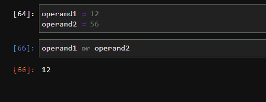

## 包扎

在这篇文章中，我们了解了:

1.  Python 中不同的逻辑操作符以及如何通过例子使用它们
2.  Python 如何计算实体的真值
3.  什么是短路
4.  “与”和“或”运算符是如何工作的

非常感谢您的阅读，我希望您喜欢这篇文章，并了解到一些与 Python 中的逻辑运算符相关的有趣事实。保重，编码愉快！