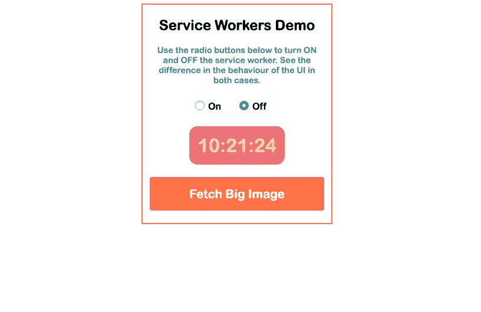

# 如何使用服务人员优化您的 JavaScript 应用程序

> 原文：<https://www.freecodecamp.org/news/optimize-your-javascript-app-by-using-service-workers/>

我们不时会听到一些关于优化的事情。我们可以做不同种类的优化来使我们的应用程序更快更有效，或者节省时间或内存。这篇文章将介绍其中的一种方法——为 T2 的员工提供服务。

### TL；速度三角形定位法(dead reckoning)

本教程用 JavaScript 解释了什么是*服务工作者*以及如何使用它。最后有一个代码示例。如果你想跳过阅读，这里的是 Git 回购，[这里](https://compassionate-brahmagupta-71d9b4.netlify.com/)你可以看到一个现场演示。

### 该理论

让我们先看看这是什么工作？我们可以用它来做什么 T2 服务呢？。

*服务人员*是一个[简单脚本](https://developers.google.com/web/fundamentals/primers/service-workers/)。它是 JavaScript 代码，你的浏览器在后台运行，独立于网页。

对于不需要网页或用户交互的功能，使用服务人员非常方便。最常见的用途之一是拦截和处理网络请求。这包括管理响应缓存。

下面是一个简单的例子，说明如何在您的应用程序中包含一个服务人员。

通常，在应用程序的入口点，添加以下代码:

```
if ('serviceWorker' in navigator) {  
    window.addEventListener('load', function() {
        navigator.serviceWorker.register('/service-worker.js');  
    });
}
```

这种使用服务人员的方式比基本的有一点点改进。基本方法包括在 *if 语句中直接调用*寄存器*()方法。*在这种情况下，我们使用窗口加载事件在页面加载完成后注册服务人员。这样做之后，您需要在 *service-worker.js* 文件中添加您的服务工作者代码。现在，你可能想看看我的服务人员档案。

现在各大浏览器都支持服务人员，你可以马上开始使用。

### 这个例子

理论已经讲得够多了，让我们来构建一个利用服务人员特性的真实示例应用程序。

假设我们正在构建一个需要加载大量数据的应用程序。例如，它可以是我们在首页显示的一个漂亮的大全屏图像。或者它可能是一个大的视频剪辑，我们必须等待加载。这是一个让服务人员大放异彩的理想用例。让我们看看怎么做。？

在我们的具体案例中，我们将使用时钟时间来展示使用服务人员的好处。我的意思是，我们将建立一个简单的应用程序，显示时间。它将有一个漂亮的大按钮，用于获取漂亮的大图像。它将为用户提供选择**使用或不使用**服务人员的选项。

下面是它的屏幕截图:



这个应用程序演示的是，当获取图像时(通过点击按钮，哇！)有了活跃的服务人员，我们就不会遇到 UI(用户界面，即字段、按钮、？).如果您选择不使用服务工作者，您将获得一个冻结的用户界面一段时间。当工作完成并且主线程释放自己时，它将解冻 UI。

如果你不想自己克隆和运行代码，直接跳到[现场演示](https://compassionate-brahmagupta-71d9b4.netlify.com/)。

### 结论

服务人员的演示向我们展示了使用他们的好处。尤其是当您试图构建响应迅速且健壮的 JavaScript 应用程序时。没有用户希望在一段未知的时间内停留在一个冻结的页面上，因为没有开发人员希望他的应用程序的用户出现这种情况。记住上面所说的，服务人员现在是必须的。我们不应该忽视他们。

？感谢阅读！？