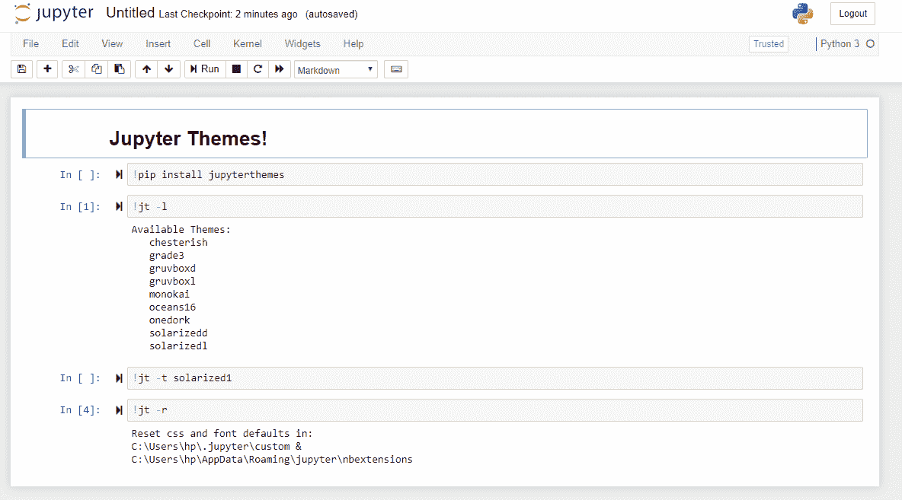
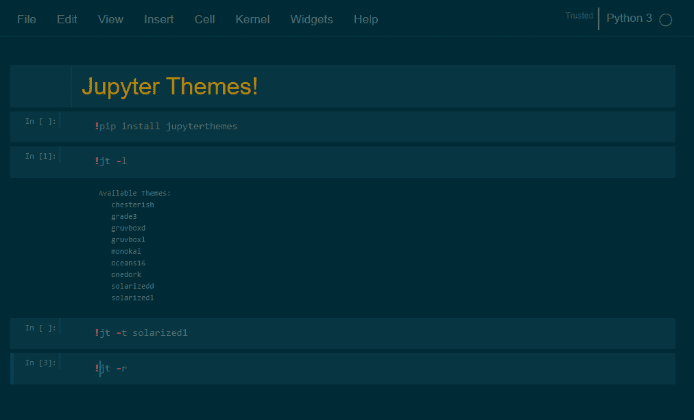
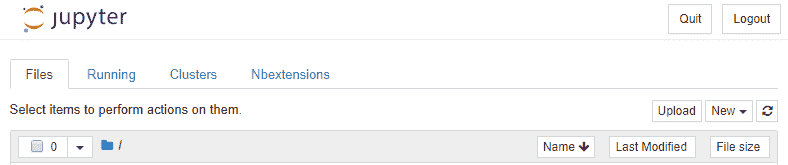
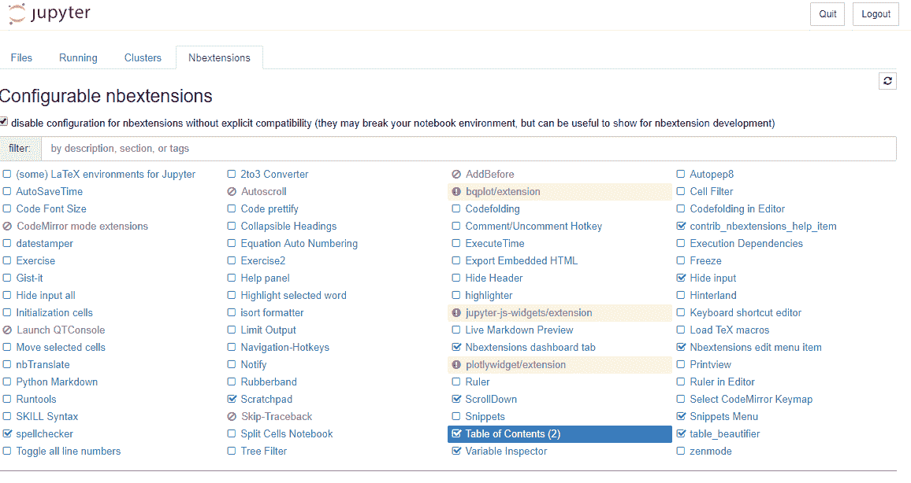
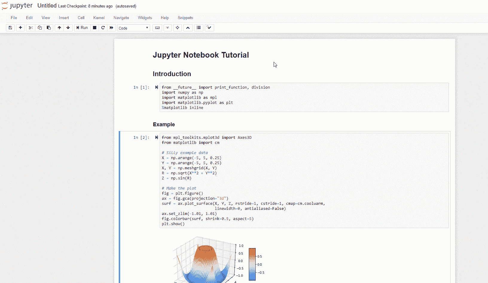
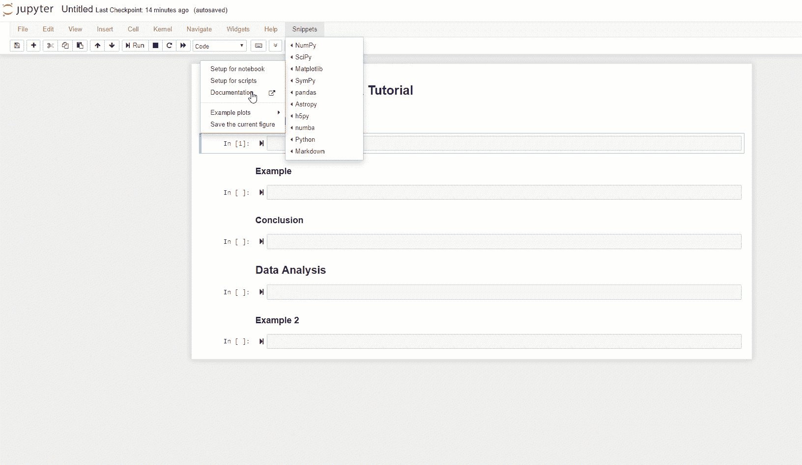
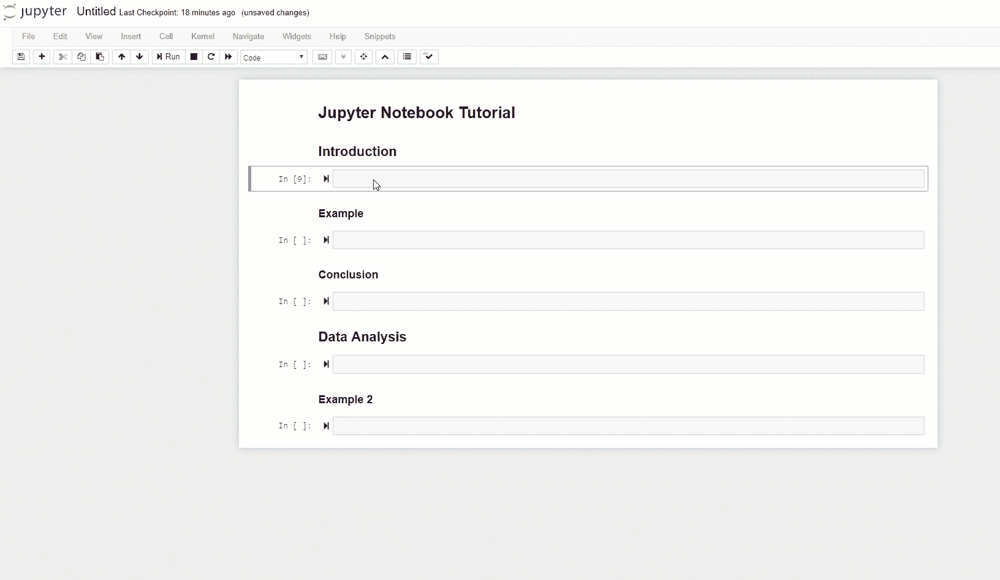
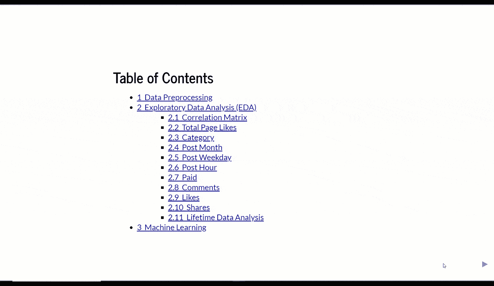

# 如何优化你的 Jupyter 笔记本

> 原文：<https://www.freecodecamp.org/news/optimize-your-jupyter-notebook/>

## 介绍

Jupyter Notebook 现在可能是用 Python 解决机器学习/数据科学任务最常用的环境。

Jupyter Notebook 是一个客户端-服务器应用程序，用于在浏览器中运行笔记本文档。笔记本文档是能够包含代码和富文本元素(如段落、公式等)的文档。

在这篇文章中，我将带你通过一些简单的技巧来改善你的体验。我们将从有用的快捷方式开始，最终添加主题、自动生成的目录等等。

## 快捷指令

快捷方式对于加速编写代码非常有用。现在我将带你浏览一些我发现在 Jupyter 中最有用的快捷方式。

有两种可能方式与 Jupyter 笔记本交互:命令模式和编辑模式。一些快捷方式只在一种模式或另一种模式下有效，而其他快捷方式在两种模式下通用。

这两种模式中常见的一些快捷方式有:

*   **Ctrl + Enter** :运行所有选中的单元格
*   **Shift + Enter** :运行当前单元格，移动下一个单元格
*   **Ctrl + s** :保存笔记本

为了进入 Jupyter 命令模式，我们需要按 Esc 键，然后按以下任何命令:

*   **H** :显示 Jupyter 笔记本中所有可用的快捷方式
*   **Shift +上/下箭头**:同时选择多个笔记本单元格(选择多个单元格后按回车键会使所有单元格运行！)
*   **A** :在上面插入一个新的单元格
*   **B** :在下面插入一个新的单元格
*   **X** :剪切选中的单元格
*   **Z** :取消删除单元格
*   **Y** :将单元格类型改为编码
*   **M** :将单元格类型改为降价
*   **空格**:向下滚动笔记本
*   **Shift +空格键**:向上滚动笔记本

为了进入 Jupyter 编辑模式，我们需要按回车键，并连续执行以下命令:

*   **页签**:代码竞赛建议
*   **Ctrl + ]** :缩进代码
*   **Ctrl + [** :重复代码
*   **Ctrl + z** : undo
*   **Ctrl + y** :重做
*   **Ctrl + a** :全选
*   **Ctrl + Home** :移动光标到单元格开始处
*   **Ctrl + End** :移动光标到单元格的末尾
*   **Ctrl + Left** :将光标左移一个单词
*   **Ctrl + Right** :将光标向右移动一个单词

## Shell 命令和软件包安装

没有多少用户意识到这一点，但是通过在 Jupyter 笔记本单元格的开头添加一个感叹号，可以在单元格中运行 shell 命令。比如用**运行一个单元格！ls** 将返回当前工作目录中的所有条目。和**一起跑牢房！pwd** 将打印出当前的目录文件路径。

同样的技巧也可以应用于在 Jupyter notebook 中安装 Python 包。

```
!pip install numpy
```

## Jupyter Themes

如果你想改变你的 Jupyter 笔记本的外观，可以安装一个不同主题的包。默认的 Jupyter 主题如图 1 所示。在图 2 中，您将看到我们将如何个性化其外观。



Figure 1: Default Jupyter Notebook Theme

我们可以使用我在上一节中展示的技巧将我们的包直接安装到笔记本中:

```
!pip install jupyterthemes
```

我们可以运行以下命令来列出所有可用主题的名称:

```
!jt -l

# Cell output:
# Available Themes: 
#   chesterish
#   grade3
#   gruvboxd
#   gruvboxl
#   monokai
#   oceans16
#   onedork
#   solarizedd
#   solarizedl
```

最后，我们可以使用以下命令选择一个主题(在本例中，我决定使用 solarized1 主题):

```
!jt -t solarizedl
```

一旦我们运行了这个命令并刷新了页面，我们的笔记本应该如图 2 所示。



Figure 2: Solarized1 notebook Theme

如果你想随时回到原来的 Jupyter 笔记本主题，你可以运行下面的命令并刷新你的页面。

```
!jt -r
```

## Jupyter 笔记本扩展

笔记本扩展可用于增强用户体验，并提供多种个性化技术。

在本例中，我将使用 *nbextensions* 库来安装所有必要的小部件(这次我建议您首先通过终端安装软件包，然后打开 Jupyter 笔记本)。这个库利用不同的 Javascript 模型来丰富笔记本前端。

```
! pip install jupyter_contrib_nbextensions
! jupyter contrib nbextension install --system
```

一旦安装了 *nbextensions* ，你会注意到在你的 Jupyter 笔记本主页上有一个额外的标签(图 3)。



Figure 3: Adding *nbextensions* to Jupyter notebook

通过单击 Nbextensions 选项卡，我们将获得可用小部件的列表。在我的例子中，我决定启用如图 4 所示的那些。



Figure 4: *nbextensions widgets options*

我最喜欢的一些扩展是:

1.  **目录**

从 markdown 标题自动生成目录(图 5)。



Figure 5: Table of Contents

2.**片段**

加载公共库并创建示例图的示例代码，您可以将这些示例图用作数据分析的起点(图 6)。



Figure 6: Snippets

3.**腹地**

Jupyter 笔记本的代码自动完成(图 7)。



Figure 7: Code autocompletion

除了这三个之外， *nbextensions* 库还提供了许多其他的扩展，所以我鼓励你试验和测试你感兴趣的任何其他扩展！

## 降价选项

默认情况下，Jupyter 笔记本单元格中的最后一个输出是唯一被打印的输出。相反，如果我们想自动打印所有命令，而不必使用 *print()* ，我们可以在笔记本的开头添加以下代码行。

```
from IPython.core.interactiveshell import InteractiveShell
InteractiveShell.ast_node_interactivity = "all"
```

此外，通过将文本括在美元符号($)之间，可以在 Markdown 单元格中编写 LaTex。

## 笔记本幻灯片

可以通过进入**视图- >单元格工具栏- >幻灯片显示**，然后为笔记本中的每个单元格选择幻灯片配置，来创建 Jupyter 笔记本的幻灯片演示。

最后，在终端上输入以下命令，幻灯片就创建好了。

```
pip install jupyter_contrib_nbextensions

# and successively:

jupyter nbconvert my_notebook_name.ipynb --to slides --post serve
```



## 魔法

魔法是可以用来执行特定命令的命令。一些例子是:内联绘图，打印单元的执行时间，打印运行单元的内存消耗，等等。

以一个 *%* 开头的神奇命令只对单元格中的一行(放置命令的地方)应用它们的功能。以两个 *%%* 开头的魔法命令被应用于整个单元。

使用以下命令可以打印出所有可用的魔法命令:

```
%lsmagic
```

## 联系信息

如果你想了解我最新的文章和项目[，请关注我](https://medium.com/@pierpaoloippolito28?source=post_page---------------------------)并订阅我的[邮件列表](http://eepurl.com/gwO-Dr?source=post_page---------------------------)。以下是我的一些联系方式:

*   [Linkedin](https://uk.linkedin.com/in/pier-paolo-ippolito-202917146?source=post_page---------------------------)
*   [个人博客](https://pierpaolo28.github.io/blog/?source=post_page---------------------------)
*   [个人网站](https://pierpaolo28.github.io/?source=post_page---------------------------)
*   [中等轮廓](https://towardsdatascience.com/@pierpaoloippolito28?source=post_page---------------------------)
*   [GitHub](https://github.com/pierpaolo28?source=post_page---------------------------)
*   [卡格尔](https://www.kaggle.com/pierpaolo28?source=post_page---------------------------)

来自本文的封面照片[。](https://gdcoder.com/how-to-create-and-add-a-conda-environment-as-jupyter-kernel/)