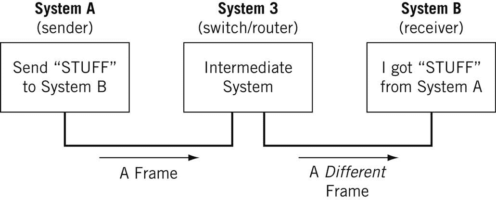
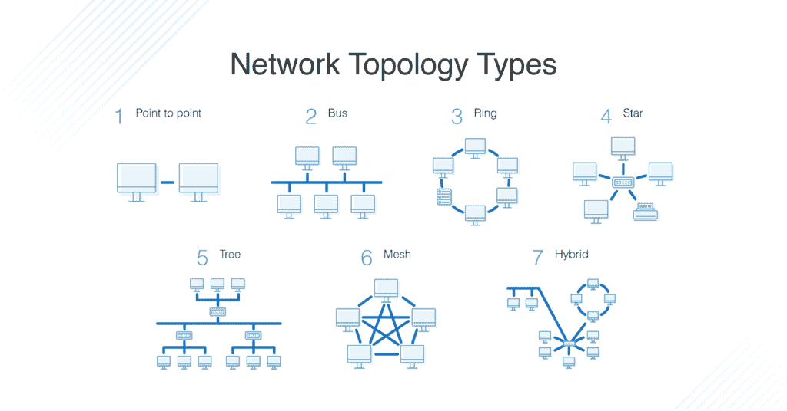
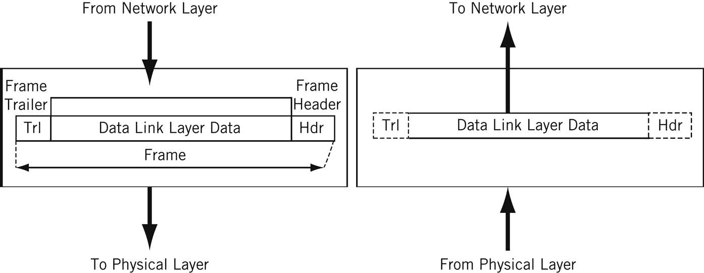

# OSI 模型——用简单的英语解释 7 层网络

> 原文：<https://www.freecodecamp.org/news/osi-model-networking-layers-explained-in-plain-english/>

本文用简单的英语解释了开放系统互连(OSI)模型和 7 层网络。

OSI 模型是一个概念框架，用于描述网络的工作原理。简单地说，OSI 模型有助于标准化计算机系统相互发送信息的方式。

学习网络有点像学习语言——有很多标准，也有一些例外。因此，真正理解 OSI 模型不是一套规则是很重要的。它是理解网络如何运作的工具。

一旦你学会了 OSI 模型，你将能够进一步理解和欣赏我们称之为互联网的这个光荣的实体，并且能够更加流畅和容易地解决网络问题。

互联网万岁！

## 先决条件

您不需要任何编程或网络经验就能理解本文。但是，您将需要:

*   基本熟悉常用网络术语(解释如下)
*   对事物如何运作的好奇:)

## 学习目标

通过本文的学习，您将了解到:

1.  什么是 OSI 模型
2.  7 层中每一层的用途
3.  7 层中的每一层都可能发生的问题
4.  TCP/IP 模型和 OSI 模型的区别

## 常见网络术语

下面是一些常见的网络术语，您应该熟悉这些术语，以便从本文中获得最大收益。我将在接下来讨论 OSI 层时使用这些术语。

### 节点

节点是连接到网络的物理电子设备，例如计算机、打印机、路由器等。如果设置正确，节点能够通过网络发送和/或接收信息。

节点可以被设置为彼此相邻，其中节点 A 可以直接连接到节点 B，或者在节点 A 和节点 B 之间可以设置中间节点，如交换机或路由器

通常，路由器将网络连接到互联网，交换机在网络内运行以促进网络内通信。[了解有关集线器、交换机和路由器的更多信息。](https://www.themillergroup.com/differences-hubs-switches-routers/)

这里有一个例子:

[Source](https://www.oreilly.com/library/view/the-illustrated-network/9780128110287/xhtml/chp001.xhtml)

对于我们这些吹毛求疵的人来说(是的，我看到你了)，**主持人**是你在社交中会遇到的另一个术语。我将主机定义为一种需要 IP 地址的节点。所有主机都是节点，但并非所有节点都是主机。如果你不同意，请生气地发微博给我。

### 链接

链路连接网络上的节点。链接可以是有线的，如以太网，也可以是无线的，如 WiFi。

到的链接可以是点对点的，其中节点 A 连接到节点 B，也可以是多点的，其中节点 A 连接到节点 B 和节点 c。

当我们谈论正在传输的信息时，这也可以被描述为一对一对一对多的关系。

### 草案

协议是一组双方同意的规则，允许网络上的两个节点交换数据。

> 协议定义了管理通信过程的语法(可以传送什么)、语义(如何传送)和同步(何时以及以什么速度传送)的规则。协议可以在硬件、软件或两者的组合上实现。任何人都可以创建协议，但最广泛采用的协议是基于标准的。”-图解网络。

有线和无线链路都可以有协议。

虽然任何人都可以创建协议，但最广泛采用的协议通常基于互联网组织(如互联网工程任务组(IETF))发布的标准。

### 网络

网络是一组计算机、打印机或任何其他想要共享数据的设备的总称。

网络类型包括 LAN、HAN、CAN、MAN、WAN、BAN 或 VPN。以为我只是随便把事情和单词 *can* 押韵？我*不能*说我是——这些都是真实的网络类型。[在此了解更多信息](https://www.c1c.net/blog/network-101/)。

### 拓扑学

拓扑描述了网络配置中节点和链路的组合方式，通常用图表来表示。以下是一些常见的网络拓扑类型:

[Source](https://www.dnsstuff.com/what-is-network-topology) + [learn more about network topologies here](https://www.geeksforgeeks.org/types-of-network-topology/)

网络由节点、节点间的链路以及管理节点间数据传输的协议组成。

无论网络达到何种规模和复杂程度，通过学习 OSI 模型和 7 层网络，您都将了解所有计算机网络中发生的事情。

# 什么是 OSI 模型？

OSI 模型由 7 层网络组成。

首先，什么是层？

[Source](https://pixabay.com/photos/cave-dragon-cave-mountains-1766835/)

呜，老巢。

不，是一层——不是一个*巢穴*。这里没有龙。

层是对网络上的功能和行为进行分类和分组的一种方式。

在 OSI 模型中，各层的组织方式是从最有形、最具物理性到不太有形、不太物理但更接近最终用户。

每一层*抽象出*较低层次的功能，直到到达最高层。所有其他层的所有细节和内部工作对最终用户是隐藏的。

如何记住所有图层的名称？简单。

*   **请** |物理层
*   **做** |数据链路层
*   **不是** |网络层
*   **告诉****【传输层】**
*   ****秘密** |会话层**
*   ****密码**(到)|表示层**
*   ****任何人** |应用层**

**请记住，虽然某些技术(如协议)在逻辑上可能“属于”某一层，但并非所有技术都适合 OSI 模型中的某一层。例如，以太网、802.11 (Wifi)和地址解析协议(ARP)程序运行在> 1 层。**

**OSI 是一种模型和工具，而不是一套规则。**

## **OSI 第 1 层**

**第一层是物理层。第 1 层有很多技术，从物理网络设备、布线到电缆如何连接到设备，无所不包。再加上如果我们不需要线缆，信号类型和传输方式是什么(比如无线宽带)。**

**我没有在第 1 层列出每一种技术，而是为这些技术创建了更广泛的类别。我鼓励读者更多地了解这些类别:**

*   ****节点(设备)和网络硬件组件。**设备包括集线器、中继器、路由器、计算机、打印机等。这些设备内部的硬件组件包括天线、放大器、网络接口卡(NIC)等。**
*   ****设备接口机制。**线缆如何以及在哪里连接到设备(线缆连接器和设备插座)？连接器的尺寸和形状是什么，有多少个引脚？什么决定了引脚何时有效或无效？**
*   ****功能和程序逻辑。**连接器中每个引脚的功能是什么——发送还是接收？什么程序逻辑规定了事件的顺序，以便一个节点可以开始与第 2 层上的另一个节点通信？**
*   ****布线协议和规范。**以太网(CAT)、USB、[【DSL】](https://www.centurylink.com/home/help/internet/what-is-DSL.html)等等。规格包括最大电缆长度、调制技术、无线电规格、线路编码和比特同步(更多内容见下文)。**
*   ****电缆类型。**选项包括屏蔽或非屏蔽双绞线、非双绞线、同轴等。[点击此处了解更多线缆类型](https://www.computernetworkingnotes.com/networking-tutorials/network-cable-types-and-specifications.html)。**
*   ****信号类型。**基带每次都是单个比特流，就像铁路轨道一样——只是单向的。宽带同时由多个比特流组成，就像双向高速公路。**
*   ****信号传输方式(有线或无线均可)。**选项包括电(以太网)、光(光网络、光纤)、无线电波(802.11 WiFi、a/b/g/n/ac/ax 变体或蓝牙)。如果没有电缆，还要考虑频率:2.5 GHz 与 5 GHz。如果是有线的，考虑电压。如果是有线和以太网，也要考虑网络标准，如 100BASE-T 和相关标准。**

**第 1 层的数据单位是比特。**

**比特是可传输数字信息的最小单位。位是二进制的，所以不是 0 就是 1。字节由 8 位组成，用于表示单个字符，如字母、数字或符号。**

**根据支持的数据速率(传输速率，以每秒或毫秒的位数表示)向硬件设备发送和从硬件设备接收比特，并且比特是同步的，因此每单位时间发送和接收的比特数保持一致(这称为比特同步)。比特的传输方式取决于信号传输方法。**

**节点可以发送、接收或发送和接收位。如果它们只能做一个，那么节点使用单工模式。如果两者都能做到，则该节点使用双工模式。如果一个节点可以同时发送和接收，它就是全双工的——如果不能，它只是半双工的。**

**最初的以太网是半双工的。如果有合适的设备，全双工以太网现在是一种选择。**

### **如何排除 OSI 第 1 层故障**

**以下是一些需要注意的第 1 层问题:**

*   **失效的电缆，例如受损的电线或断开的连接器**
*   **硬件网络设备损坏，例如电路损坏**
*   **东西被拔掉(...我们都去过)**

**如果第 1 层出现问题，第 1 层以外的任何层都将无法正常工作。**

### **TL；速度三角形定位法(dead reckoning)**

**第 1 层包含使网络通信成为可能的基础设施。**

**它定义了激活、维护和停用网络设备之间的物理链路的电气、机械、程序和功能规范。——[来源](https://learning.oreilly.com/videos/wireshark-for-packet/9781839212352/9781839212352-video3_11)**

**有趣的事实:深海通信电缆在世界各地传输数据。这张地图会让你大吃一惊:[https://www.submarinecablemap.com/](https://www.submarinecablemap.com/)**

**因为你已经走了这么远，这里有一只树袋熊:**

**

[Source](https://pixabay.com/photos/koala-nature-animals-legs-630117/)** 

## **OSI 第 2 层**

**第二层是数据链路层。第 2 层定义了如何格式化数据以进行传输，节点之间可以传输多少数据，传输多长时间，以及在此流中检测到错误时应该做什么。**

**用更官方的技术术语来说:**

*   ****行纪。**谁应该讲多长时间？节点能够传输信息多长时间？**
*   ****流量控制。**应该传输多少数据？**
*   ****错误控制****——检测和纠正**。所有的数据传输方法都有可能出错，从电尖峰到不干净的连接器。一旦第 2 层技术将第 2 层或第 1 层的问题告知网络管理员，系统管理员就可以在后续层纠正这些错误。第 2 层主要关注错误检测，而不是错误纠正。([来源](https://learning.oreilly.com/videos/wireshark-for-packet/9781839212352/9781839212352-video3_10))**

**第 2 层中有两个不同的子层:**

*   ****媒体访问控制(MAC):**MAC 子层处理硬件标识号的分配，称为 MAC 地址，它唯一地标识网络上的每个设备。任何两台设备都不应有相同的 MAC 地址。MAC 地址是在制造时分配的。它被大多数网络自动识别。MAC 地址存在于网络接口卡(NIC)上。交换机跟踪网络上的所有 MAC 地址。在本文中了解更多关于[电脑杂志](https://www.pcmag.com/encyclopedia/term/mac-address)和[上的 MAC 地址。](https://people.richland.edu/dkirby/141macaddress.htm)[点击](https://www.networkworld.com/article/3584876/what-is-a-network-switch-and-how-does-it-work.html)了解更多关于网络交换机的信息。**
*   ****逻辑链路控制(LLC):**LLC 子层处理帧寻址和流量控制。速度取决于节点之间的链接，例如以太网或 Wifi。**

**层 2 上的数据单元是一个*帧*。**

**每个帧包含帧头、帧体和帧尾:**

*   **报头:通常包括源节点和目的节点的 MAC 地址。**
*   **主体:由正在传输的位组成。**
*   **报尾:包括错误检测信息。当检测到错误时，根据网络或协议的实现或配置，可以丢弃帧，或者将错误报告给更高层，以便进一步纠错。错误检测机制的示例:循环冗余校验(CRC)和帧校验序列(FCS)。[点击](http://www.msc.uky.edu/ken/cs471/notes/chap5.htm)了解更多关于错误检测技术的信息。**

**

[Source](https://learning.oreilly.com/library/view/the-illustrated-network/9780128110287/xhtml/chp001.xhtml)** 

**通常有一个最大帧大小限制，称为最大传输单位 MTU。巨型帧超过标准 MTU，[在此了解更多关于巨型帧的信息](https://kb.netgear.com/25091/Guidance-on-the-use-of-jumbo-frames)。**

### **如何排除 OSI 第 2 层故障**

**下面是一些需要注意的第 2 层问题:**

*   **所有可能发生在第 1 层的问题**
*   **两个节点之间不成功的连接(会话)**
*   **成功建立但偶尔失败的会话**
*   **帧冲突**

### **TL；速度三角形定位法(dead reckoning)**

**数据链路层允许节点在局域网内相互通信。生产线规程、流程控制和错误控制的基础都建立在这一层。**

## **OSI 第 3 层**

**第三层是**网络层**。这就是我们通过使用路由器在网络之间发送信息*的地方。我们现在可以进行网络到网络的通信，而不仅仅是节点到节点的通信。***

**路由器是第三层的主力——没有它们我们就没有第三层。它们在多个网络间传输数据包。**

**它们不仅连接到互联网服务提供商(ISP)以提供对互联网的访问，它们还跟踪其网络上的内容(请记住，交换机跟踪网络上的所有 MAC 地址)、它连接到哪些其他网络，以及在这些网络之间路由数据包的不同路径。**

**路由器将所有这些寻址和路由信息存储在路由表中。**

**下面是一个简单的路由表示例:**

**

[Source + learn more about routing tables here](https://www.geeksforgeeks.org/routing-tables-in-computer-network/)** 

**第三层的数据单元是*数据包*。通常，每个数据包包含一个帧**加上**一个 IP 地址信息包装。换句话说，帧由第 3 层寻址信息封装。**

**数据包中传输的数据有时也称为*有效载荷*。虽然每个数据包都有到达目的地所需的一切，但它是否成功还有另一个故事。**

**第三层传输是无连接的，或者说是尽力而为的，它们不做任何事情，只是将流量发送到它应该去的地方。更多关于第 4 层的数据传输协议。**

**一旦一个节点连接到因特网，它就被分配一个因特网协议(IP)地址，看起来像 172.16。254.1 (IPv4 地址约定)或类似的 2001:0 db 8:85 a3:0000:0000:8a2e:0370:7334(IPv6 地址约定)。路由器在其路由表中使用 IP 地址。**

**IP 地址通过地址解析协议(ARP)与物理节点的 MAC 地址相关联，地址解析协议使用节点对应的 IP 地址解析 MAC 地址。**

**ARP 通常被认为是第 2 层的一部分，但是因为 IP 地址直到第 3 层才存在，所以它也是第 3 层的一部分。**

### **如何排除 OSI 第 3 层故障**

**以下是一些需要注意的第 3 层问题:**

*   **前面几层可能会突然出现的所有问题:)**
*   **故障或不起作用的路由器或其他节点**
*   **IP 地址配置不正确**

**许多第 3 层问题的答案将需要使用命令行工具，如 *ping* 、 *trace* 、 *show ip route* 或 *show ip protocols* 。[点击](https://www.pearsonitcertification.com/articles/article.aspx?p=2873377)了解第 1-3 层故障排除的更多信息。**

### **TL；速度三角形定位法(dead reckoning)**

**网络层允许节点连接到互联网，并通过不同的网络发送信息。**

## **OSI 第 4 层**

**第 4 层是**传输层**。在这里，我们深入到两个节点之间的连接以及信息如何在它们之间传输的本质细节。它建立在第 2 层的功能上，即线规则、流控制和错误控制。**

**这一层还负责数据包分段，或者数据包如何被分解并通过网络发送。**

**与前一层不同，第 4 层还理解整个消息，而不仅仅是每个数据包的内容。有了这种理解，第 4 层就能够通过不一次发送所有数据包来管理网络拥塞。**

**第 4 层的数据单元有几个名字。对于 TCP，数据单元是数据包。对于 UDP，数据包被称为数据报。为了简单起见，我在这里只使用数据包这个术语。**

**传输控制协议(TCP)和用户数据报协议(UDP)是第 4 层中两个最著名的协议。**

**TCP 是一种面向连接的协议，它将数据质量置于速度之上。**

**TCP 显式地建立与目的节点的连接，并在传输数据时要求源节点和目的节点之间的握手。握手确认数据已收到。如果目的节点没有收到所有数据，TCP 将要求重试。**

**TCP 还确保数据包以正确的顺序传送或重组。[点击](https://www.cloudflare.com/learning/ddos/glossary/tcp-ip/)了解更多关于 TCP 的信息。**

**UDP 是一种无连接协议，它将速度置于数据质量之上。UDP 不需要握手，这就是它被称为无连接的原因。**

**因为 UDP 不需要等待确认，所以它可以以更快的速度发送数据，但并不是所有的数据都可以成功传输，我们永远也不会知道。**

**如果信息被分割成多个数据报，除非这些数据报包含序列号，否则 UDP 无法确保数据包按照正确的顺序重新组装。[点击](https://www.cloudflare.com/learning/ddos/glossary/user-datagram-protocol-udp/)了解更多关于 UDP 的信息。**

**TCP 和 UDP 都向网络设备上的特定端口发送数据，网络设备有一个 IP 地址。IP 地址和端口号的组合称为套接字。**

**[在此了解更多关于插座的信息](https://www.dummies.com/programming/networking/cisco/network-basics-tcpudp-socket-and-port-overview/)。**

**[点击](https://www.pearsonitcertification.com/articles/article.aspx?p=2873377)了解这两种协议之间的异同。**

### **如何排除 OSI 第 4 层故障**

**以下是一些需要注意的第 4 层问题:**

*   **前面几层可能会突然出现的所有问题:)**
*   **阻塞的端口-检查您的访问控制列表(ACL)和防火墙**
*   **服务质量(QoS)设置。QoS 是路由器/交换机的一项功能，可以对流量进行优先级排序，它们真的会把事情搞砸。[点击](https://www.pcworld.com/article/2689995/quality-of-service-explained-how-routers-with-strong-qos-make-better-home-networks.html)了解更多关于 QoS 的信息。**

### **TL；速度三角形定位法(dead reckoning)**

**传输层通过将消息分割成多个数据包来提供消息的端到端传输；该层支持面向连接和无连接的通信。**

## **OSI 第 5 层**

**第 5 层是**会话层**。这一层建立、维护和终止会话。**

**会话是在两个网络应用程序之间建立的双方同意的连接。不是两个节点！不，我们从节点开始。他们是第四层。**

**开玩笑，我们仍然有节点，但是第 5 层不需要保留节点的概念，因为它已经被前面的层抽象出来了。**

**因此，会话是在两个特定的最终用户应用程序之间建立的连接。这里有两个重要的概念需要考虑:**

*   **客户机和服务器模型:请求信息的应用程序称为客户机，拥有所请求信息的应用程序称为服务器。**
*   **请求和响应模型:在会话建立期间，会不断地来回请求信息和包含该信息的响应，或者“嘿，我没有你要的东西。”**

**会话可能会打开很短时间，也可能会打开很长时间。他们有时也会失败。**

**根据所讨论的协议，可能会启动各种故障解决流程。根据使用的应用/协议/硬件，会话可能支持单工、半双工或全双工模式。**

**第 5 层协议的示例包括网络基本输入输出系统(NetBIOS)和远程过程调用协议(RPC)以及许多其他协议。**

**从这里开始(第 5 层及以上)，网络的重点是如何连接到最终用户应用程序并向用户显示数据。**

### **如何排除 OSI 第 5 层故障**

**以下是一些需要注意的第 5 层问题:**

*   **服务器不可用**
*   **服务器配置不正确，例如 Apache 或 PHP 配置**
*   **会话失败——断开连接、超时等等。**

### **TL；速度三角形定位法(dead reckoning)**

**会话层启动、维护和终止两个最终用户应用程序之间的连接。它响应来自表示层的请求，并向传输层发出请求。**

## **OSI 第 6 层**

**第 6 层是**表现层**。这一层负责数据格式化，例如字符编码和转换，以及数据加密。**

**承载最终用户应用程序的操作系统通常参与第 6 层流程。该功能并不总是在网络协议中实现。**

**第 6 层确保在第 7 层上运行的最终用户应用程序能够成功地使用数据，当然，最终会显示数据。**

**需要注意三种数据格式化方法:**

*   **美国信息交换标准码(ASCII):这种 7 位编码技术是最广泛使用的字符编码标准。一个超集是 ISO-8859-1，它提供了西欧语言所需的大部分字符。**
*   **扩展二进制编码的十进制交换码(EBDCIC):由 IBM 设计，供大型机使用。这种编码与其他字符编码方法不兼容。**
*   **Unicode:字符编码可以使用 32 位、16 位或 8 位字符，并试图适应每一种已知的书面字母表。**

**在本文、[和这里](https://www.smashingmagazine.com/2012/06/all-about-unicode-utf8-character-sets/)中了解更多关于字符编码方法[的信息。](https://www.smashingmagazine.com/2012/06/all-about-unicode-utf8-character-sets/)**

**加密:SSL 或 TLS 加密协议位于第 6 层。这些加密协议通过为网络上运行的节点提供身份验证和数据加密，有助于确保传输的数据不易受到恶意行为者的攻击。TLS 是 SSL 的后继者。**

### **如何排除 OSI 第 6 层故障**

**以下是一些需要注意的第 6 层问题:**

*   **不存在或损坏的驱动程序**
*   **不正确的操作系统用户访问级别**

### **TL；速度三角形定位法(dead reckoning)**

***表示层格式化并加密数据。***

## **OSI 第 7 层**

**第 7 层是应用层。**

**顾名思义，这是最终负责支持最终用户应用程序所使用的服务的层。应用程序包括安装在操作系统上的软件程序，如互联网浏览器(例如 Firefox)或文字处理程序(例如 Microsoft Word)。**

**应用程序可以在幕后执行专门的网络功能，并需要第 7 层保护伞下的专门服务。**

**例如，电子邮件程序是专门创建来在网络上运行并利用网络功能的，如电子邮件协议，这属于第 7 层。**

**应用程序还将控制最终用户的交互，例如安全检查(例如 MFA)、两个参与者的身份识别、信息交换的启动等等。**

**在这一层上运行的协议包括文件传输协议(FTP)、安全外壳(SSH)、简单邮件传输协议(SMTP)、互联网消息访问协议(IMAP)、域名服务(DNS)和超文本传输协议(HTTP)。**

**虽然这些协议中的每一个都服务于不同的功能并且以不同的方式操作，但是在高层次上，它们都促进了信息的通信。([来源](https://jaimelightfoot.com/blog/osi-model/))**

### **如何排除 OSI 第 7 层故障**

**以下是一些需要注意的第 7 层问题:**

*   **先前图层上的所有问题**
*   **配置不正确的软件应用程序**
*   **用户错误(...我们都去过)**

### **TL；速度三角形定位法(dead reckoning)**

**应用层拥有最终用户应用程序工作所需的服务和功能。它不包括应用程序本身。**

# ****结论****

**我们的第一层树袋熊都长大了。**

****

**学习检查——会给考拉化妆吗？**

**没有考拉？**

**好吧-回答这些问题。这是下一个最好的事情，我保证。**

*   **什么是 OSI 模型？**
*   **每一层是什么？**
*   **我如何使用这些信息来解决网络问题？**

**祝贺你——你在理解我们称之为互联网的光荣实体方面又前进了一步。**

## ****学习资源****

**许多非常聪明的人写了关于 OSI 模型的整本书或者关于特定层的整本书。我鼓励读者查阅任何 O'Reilly 出版的关于这个主题或一般网络工程的书籍。**

**以下是我写这篇文章时使用的一些资源:**

*   **图解网络，第二版**
*   **协议数据单元(PDU):[https://www . geeks forgeeks . org/difference-between-segments-packets-and-frames/](https://www.geeksforgeeks.org/difference-between-segments-packets-and-frames/)**
*   **沿着 OSI 模型故障排除:[https://www . pearsonitcertification . com/articles/article . aspx？p=1730891](https://www.pearsonitcertification.com/articles/article.aspx?p=1730891)**
*   **OSI 模型揭秘:[https://www.youtube.com/watch?v=HEEnLZV2wGI](https://www.youtube.com/watch?v=HEEnLZV2wGI)**
*   **虚拟设备的 OSI 模型:[https://www . Dummies . com/programming/networking/layers-in-the-OSI-Model-of-a-computer-network/](https://www.dummies.com/programming/networking/layers-in-the-osi-model-of-a-computer-network/)**

### **关于我**

**克洛伊·塔克是俄勒冈州波特兰市的一名艺术家和计算机科学爱好者。作为一名前教育工作者，她一直在寻找学习和教学，或者技术和艺术的交集。在 Twitter 上联系她，并在 [chloe.dev](https://chloe.dev/) 查看她的网站。**