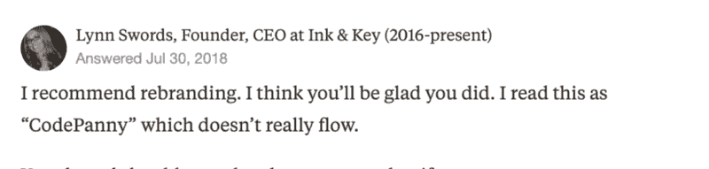
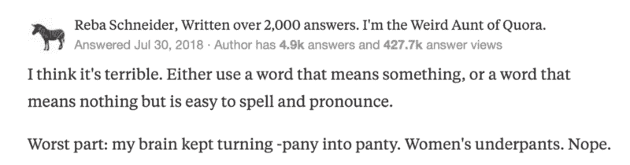
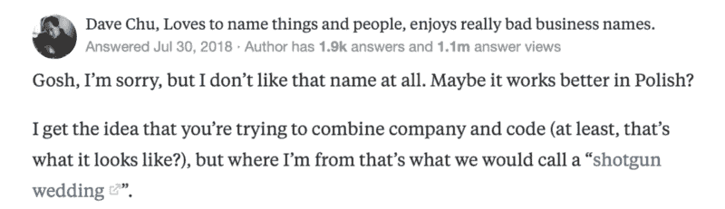
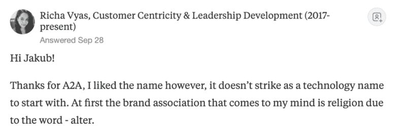
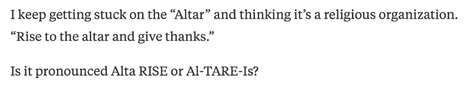

# 我们公司的名字糟透了。以下是如何确保你的不会。

> 原文：<https://www.freecodecamp.org/news/our-company-name-sucked-heres-how-to-make-sure-yours-doesn-t-d5d55645790b/>

by Dawid Cedrych

# 我们公司的名字糟透了。以下是如何确保你的不会。

Copyright Altalogy All rights Reserved

找到一个好的企业名称比人们想象的要难。Y Combinator 的保罗·格拉厄姆在他的一篇著名文章中强调了拥有一个. com 域名作为公司名称的重要性。

我同意他的观点。

然而，购买一个合适的域名不应该阻止你重新思考域名本身，以获得更大的图片。

我不打算讨论为你的企业寻找一个好名字的过程。有大量优秀的材料可供选择。相反，我要做的是向您展示如何验证名称并避免常见的陷阱。

这是一个缺乏初步研究和对我们自己的命名技巧不可动摇的乐观的故事。

### 过早的灵光一现。

我们在 2014 年末成立了我们的软件开发公司。因为我们想面向国际观众，所以有一个英文名是显而易见的。

我们都说英语，但没有一个人的母语是英语。

这个过程花了我们不超过 15 分钟的时间，找到了我们全新的完美名字，看起来就像这样:

我们要开一家公司了！

**我们在编码！**

**编码+公司=编码公司**

那将是我们公司的名字。？

我们检查了域名的可用性。com 是免费的。当我们发现所有流行的社交媒体手柄都可用时，你只能想象我们的幸福。

我们向几个朋友(我记得有三个说波兰语的和一个母语是英语的)寻求反馈。答案很清楚:干得好，伙计们，Codepany 是一个聪明的名字，它很好地传达了你所做的事情。

合作公司-太棒了。

从那天起，我们的正式名称是 Codepany。

#### 你好，代码公司。

几个月后，我们意识到我们忽略了这个名字在波兰语中的发音。我们的客户和朋友都称我们为 Code Pany(作为两个独立的词)。分开说这两个单词比试图模仿英语口音更容易。

不幸的是，波兰语中的“Pany”是“绅士”的俗气说法。

我们忽略了这个不相关的内涵。

有时人们要求我们重复这个名字，因为不同的口音听起来不一样。更不用说，即使是我们这些创始人，大声说出来也会感到不舒服。

在与美国客户交谈时，我们达到了临界点。我们认为理所当然的事情结果令人大失所望。

他们宣布它为 Co-depany 或 Copany。

#### 你在为一分钱编码吗？

我们决定在 Quora 上发帖，向更广泛的受众征求反馈。不出所料，情况远非乐观。

Source: Quora

Source: Quora

我们得到的最有趣的答案是:

> 如果你是为一分钱而编码，那么这是一条路要走。

我们从惨痛的教训中了解到，这个名字基本上很糟糕，需要立即改变。

#### 查找新公司名称的清单

为了避免过去的错误，我们想出了一个寻找新名字的策略。我们的框架包括以下检查潜在缺陷的措施:

1.  检查。com 可用性(当然)
2.  社交媒体处理可用性
3.  在城市词典中查找不明显的意思
4.  检查 TTS(文本到语音)在线工具如何发音
5.  鼓励你以英语为母语的朋友分享对这个名字的想法。
6.  重复第 5 点，但要在网上，面向更广泛的受众

虽然大部分观点是显而易见的，但我认为《都市词典》需要解释。英语中包含了大量的俚语，或者常规词汇的怪异含义。虽然其中很多不太常见或者只为一小部分人所知，但不要小看它。

给你举个例子——一个关于名字的提议没有通过，因为根据城市词典，它的意思是“粪便”。？

#### 几乎击中要害。

遵循这些简单的规则，我们完成了第一批名字，并将它们发布到 Quora 上。

我们还附上了一份调查，让用户投票选出最好的名字。选票的分布相当均匀。因此，它没有提供多少有价值的信息。尽管如此，我们还是得到了每个名字的真实反馈:

Source: Quora

到目前为止，我们在寻找新名字上总共花了大约 50 个小时。这让我们感到不知所措，无能为力，所以我们几乎决定选“Altarise”。尽管如此，我们还是想 100%确定，所以我们又开了一个 Quora 主题来讨论这个名字。

反馈相对较好，但有一点让我们印象深刻——“Altarise”可能听起来像来自名词“祭坛”的动词。这隐含着宗教内涵。此外，人们并不一致肯定正确的发音。

Source: Quora

Source: Quora

我们知道一件事。如果我们不限制可能性的领域，我们将重新开始，可能永远不会结束。

决定很明确——我们想要“Alta”作为前缀。

为什么？它听起来很有力，源自拉丁语“Altus”，代表“高”或“伟大”。

#### 祭坛学

最终，我们最终选择了祭坛学。让我们来分解一下:

**阿尔塔+科技=阿尔塔学**

*   。com 域可用
*   提供社交媒体手柄
*   《都市词典》中没有负面含义
*   发音不含糊
*   “Logy”后缀让它听起来有点像科学学科
*   朋友和家人之间没有负面反馈
*   没有负面的在线反馈

我们为我们的新名字感到骄傲。以前知道我们是 Codepany 的人也很顺利地采用了它。

你可能不同意，认为这比 Codepany 差或者更差。那很好，情人眼里出西施。？

关键是我们做了功课来降低一个不幸决定的可能性。

要了解我们现在的进展，请点击这里的查看我们的内容。

#### 关键要点

我没有提到寻找新名字的一个关键部分——定义你做什么和你擅长什么——来传达正确的意思。我故意跳过了这一部分，因为你们中的一些人更喜欢抽象的名字而不是显式的。

因此，关键要点是:

*   做大量的研究。如果你试图用一种非你母语的语言想出一个名字，做两倍的研究。
*   寻求反馈。明确要求内涵和联想。在网上问朋友、家人、客户、敌人、随便什么人。
*   使用所有可用的工具，如文本到语音的在线应用程序，城市词典，和谷歌。
*   开始时没有限制，然后逐渐引入一些。就像我们对“阿尔塔”做的那样

准备好花 100 个小时来寻找你的完美企业名称。

请记住:如果你决定满足于一个没有进一步研究就突然出现在你脑海中的名字，因为你认为它很棒。com 是免费的——风险自担。