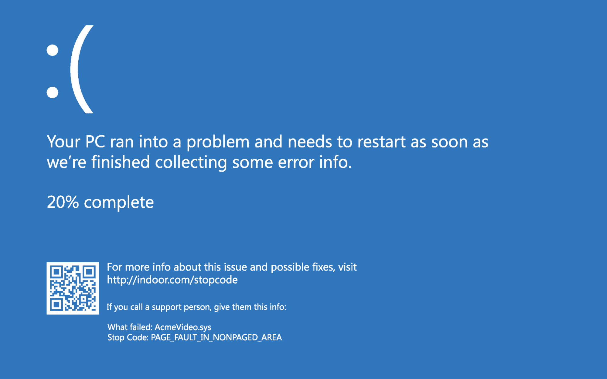
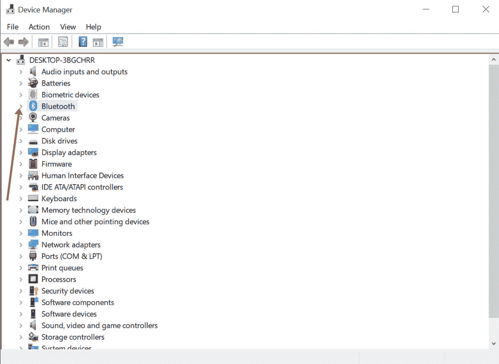
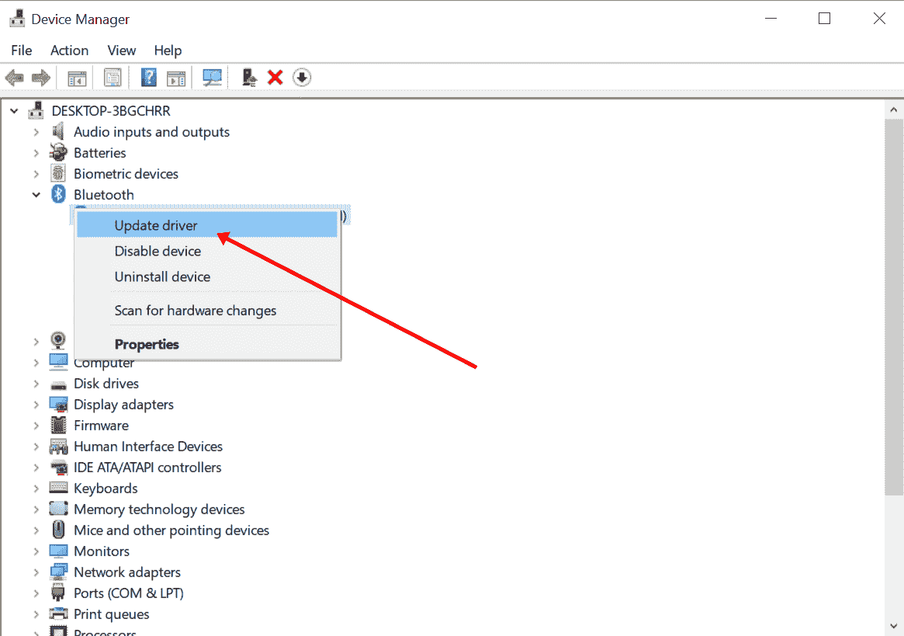
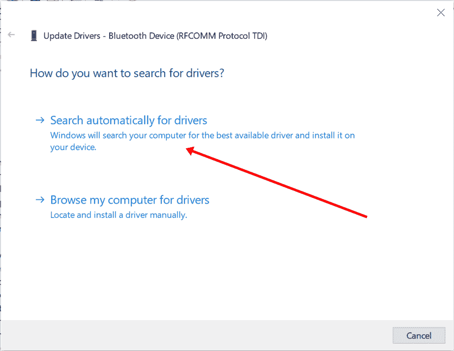
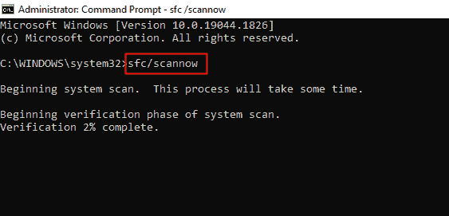
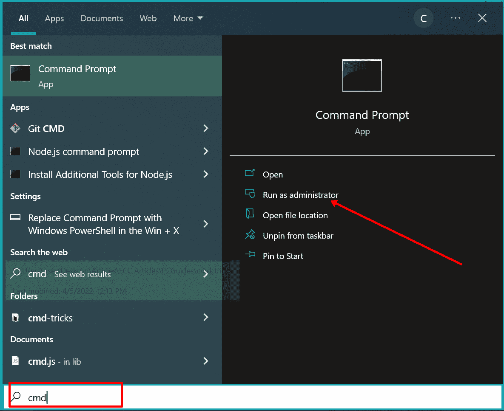
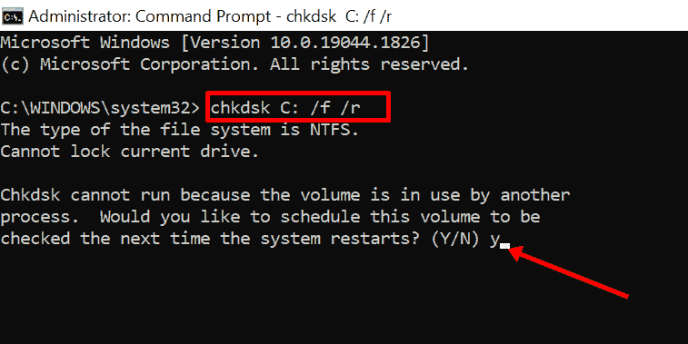

# 非页面区域的页面错误–如何在 Windows 10 电脑上修复错误

> 原文：<https://www.freecodecamp.org/news/page-fault-in-nonpaged-area-how-to-fix-the-error-on-a-windows-10-pc/>

在 Windows 中，非分页区域是内存中包含计算机正常运行所需的关键文件的部分。

那些关键文件存储在非分页区域，所以 RAM 不会在它自己和分页区域之间来回切换它们。

一旦这部分内存出现问题，系统就会运行 PAGE_FAULT_IN_NONPAGED_AREA 错误，并显示 BSOD(蓝屏死机)。该错误的停止代码是`0x00000050`。

[图片来源](https://www.tomshardware.com/how-to/fix-page-fault-error-windows-10)

## 我们将涵盖的内容

*   [什么原因导致非分页区分页错误](#what-causes-the-page-fault-in-nonpaged-area-error)？
*   [如何修复非页面区域错误中的页面错误](#how-to-fix-the-page-fault-in-nonpaged-area-error)
    *   [重启电脑](#restart-your-computer)
    *   [检查电脑的内存](#check-your-computers-ram)
    *   [更新所有过时的驱动程序](#update-all-outdated-drivers)
    *   [执行 SFC 扫描](#perform-an-sfc-scan)
    *   [运行 Windows 磁盘检查器扫描](#run-the-windows-disk-checker-scan)
*   [最终想法](#final-thoughts)

## 非页面区域错误中的页面错误是什么原因造成的？

“非页面区域出现页面错误”错误可能是由以下一个或多个问题引起的:

*   损坏的 RAM
*   有故障的司机
*   Windows 无法找到应该在非分页区域的文件

## 如何修复非页面区域错误中的页面错误

### 重新启动计算机

只需重新启动电脑，就可以解决许多 Windows 问题。这个错误也不例外。

这是因为当你重启电脑时，临时文件会被清除，每一个占用太多内存的任务都会被终止——让你的电脑运行得更快。

### 检查你电脑的内存

由于这个问题主要是由内存和驱动程序问题引起的，我建议你做的第一件事是检查计算机的内存。

如果你不能自己检查，你应该把电脑拿到有资格的工程师那里。

有时，解决这个问题的方法可能是清除 RAM 中的灰尘或重新连接它。

如果检查您的 RAM 未能修复错误，并且您仍然看到 BSOD(蓝屏死机)，[在安全模式下启动您的计算机](https://www.freecodecamp.org/news/scanning-and-repairing-drive-how-to-fix-stuck-windows-10-pc-hard-drive/#howtofixastuckscanningandrepairingdrivewithwindowspowershell)，并继续本文中剩余的修复。

### 更新所有过时的驱动程序

过时或损坏的驱动程序也是非页面区域错误中页面错误的主要原因之一。所以寻找过时的驱动程序并更新它们可以为你解决问题。

要更新你的电脑过时的驱动程序，右击开始，选择“设备管理器”:

一旦您看到驱动程序，任何过期的驱动程序旁边都会出现一个警告符号。

展开驱动程序过期的设备:

右击任何过期的驱动程序，选择“更新驱动程序”:

选择“自动搜索驱动程序”以便 Windows 可以在互联网上检查新的驱动程序:

如果找到新的驱动程序，安装它并重新启动计算机系统。

### 执行 SFC 扫描

在 Windows 中，系统文件检查器(SFC)扫描会检查计算机中损坏的系统文件并将其还原。因此，它可以帮助您消除非页面区域错误中的页面错误。

要执行 SFC 扫描，您需要以管理员身份打开命令行，然后键入 `sfc/scannow`并点击`ENTER` :

### 运行 Windows 磁盘检查器扫描

搜索 CMD，选择右边的“以管理员身份运行:

在命令行中，输入`chkdsk C: /f /r`并按下`ENTER`。

如果您收到一条消息说“无法运行，因为卷正被另一个进程使用”，请键入`y`并按 ENTER 键，以便下次系统重新启动时扫描可以运行。

**N.B.** :此扫描需要很长时间，尤其是当您的磁盘空间已满或在启动时完成时。所以，要有耐心。

## 最后的想法

本文向您展示了什么是非页面区域错误中的页面错误、其原因以及如何修复它。

我希望本文中讨论的解决方案能够帮助您解决这个问题，并为您摆脱 BSOD。

如果所有的修复都无法解决问题，那么最后一个办法就是重置您的电脑。