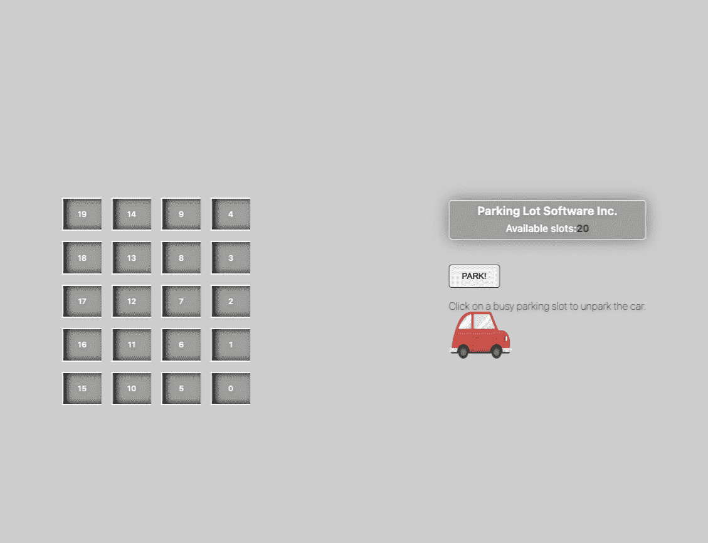
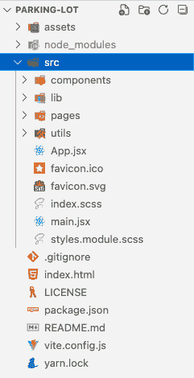
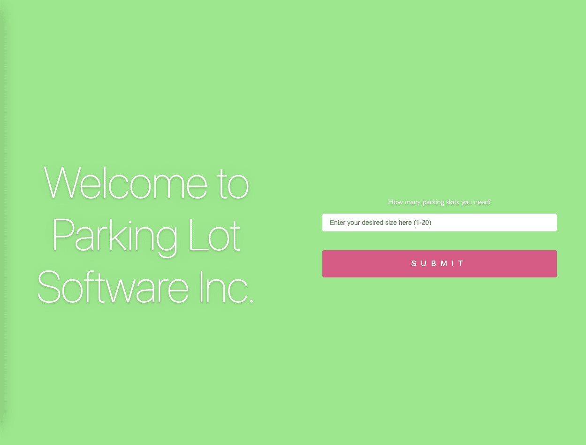
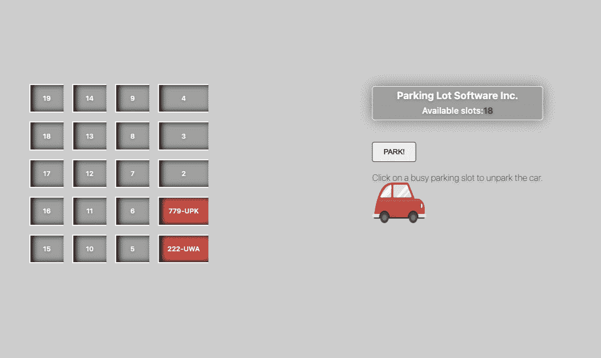

# 如何用 JavaScript 解决停车场挑战

> 原文：<https://www.freecodecamp.org/news/parking-lot-challenge-solved-in-javascript/>

你听说过停车场挑战吗？如果没有，我简单解释一下。

《停车场》是一个挑战，要求你写一个管理虚拟停车场的类。

在本教程中，我们将使用 JavaScript 来完成。为了使它更有趣，我们将创建一个小的 React 应用程序来可视化我们类的工作。

我们开始吧。🎉

# 挑战要求

对于这个挑战，您必须用 JavaScript 实现一个类。这个类应该由模拟停车场如何工作的变量和方法组成。以下是详细情况:

*   我们应该能够创建一个给定大小(停车位数量)的停车场
*   我们不区分不同的车辆，我们认为它们都是一样的
*   我们班提供了在停车场停放新车的方法
*   我们的类提供了一个移除已经停放的汽车的方法，并且
*   我们的类提供了一个方法来获得停车场的大小(槽的总数)

# 停车场挑战解决方案

首先，我们来看看类逻辑本身。

它非常简单，所以对你们大多数人来说可能不会有任何惊讶——尤其是如果你已经有了一些 OOP 和基于类的语言的编程经验。

## **类停车场**

我会先给你代码，然后我会跟进一个关于实现的简短解释。

```
class ParkingLot {
  slots = [];

  constructor(parkingSize) {
    this.slots = new Array(parkingSize).fill(null);
  }

  park(carId) {
    console.log(`Parking car: ${carId}`);
    if (this.slots.every((slot) => slot !== null)) {
      return false;
    }

    for (let i = 0; i <= this.slots.length; i++) {
      const slot = this.slots[i];

      if (slot === null) {
        this.slots[i] = carId;
        return true;
      }
    }
  }

  remove(carId) {
    console.log(`Leaving car: ${carId}`);
    if (this.slots.every((slot) => slot !== carId)) {
      return false;
    }

    for (let i = 0; i <= this.slots.length; i++) {
      const slot = this.slots[i];

      if (slot === carId) {
        this.slots[i] = null;
        return true;
      }
    }
  }

  getSlots() {
    console.log(`Parking slots: ${this.slots}`);
    return this.slots;
  }

  getSize() {
    console.log(`Parking size is: ${this.slots.length}`);
    return this.slots.length;
  }

  getAvailable() {
    const availableSlots = this.slots.filter((s) => s === null).length;
    console.log(`Available parking slots: ${availableSlots}`);
    return availableSlots;
  }

  isFull() {
    return this.getAvailable() === 0;
  }
}

export default ParkingLot;
```

从头开始——我们的类有一个属性，`slots`，它将是一个数组，存储关于停车位的信息(它们是空闲的还是被占用的)。

然后我们有一个`constructor`方法，每次创建这个类的实例时都会执行这个方法。这里我们使用一个名为`parkingSize`的输入数字参数来创建一个长度等于该数字的空数组。

从技术上讲，这个数组不是空的，因为我们用空值来初始化它。这意味着代码在构造函数中执行后，我们将得到一个填充了空值的数组，这取决于我们传入的数字。

例如，如果我们执行以下命令:

```
const parking = new ParkingLot(5);
```

这将导致:

```
[null, null, null, null, null] // lenght = 5

instead of [] // empty array, length 0
```

看完构造函数后，让我们看看类中的其他方法。

这是我们真正停车的地方。该方法遍历`slots`数组，检查是否有空闲点(即仍然等于 null 的槽)，并在那些空闲点添加汽车。

车是`carId`给的。这只是一个标识符，我们用它来表示我们在某个地方有一辆车。请注意，如果没有空闲槽，此方法返回 false，如果驻留成功，则返回 true。

助手方法，返回我们用来存储停车位的数组。

这就是我们从停车场移走汽车的方法。该方法还迭代 slots 数组。

💡到目前为止，您可能已经注意到，几乎在所有情况下，当我们需要操作存储在像 array 这样的数据结构中的数据时，我们都必须迭代这个结构，以便能够访问它的元素。

不同的编程语言提供了不同的数据结构和方法来使用它们，但主要思想总是相同的:当你需要用这些数据做一些事情时，你需要以某种方式迭代它。

为了从停车场移走一辆车，我们使用前面提到的标识符。我们在老虎机数组中寻找这样的项目，如果我们得到一个匹配，我们就有一辆车“不停车”。我们通过再次将该特定插槽设置为空来执行实际的删除。

现在你可以猜到为什么我们决定首先用空值初始化 slots 数组。

该方法还根据是否成功移除返回一个布尔结果。

当构建某种能够对这种变化做出反应的 UI 时，我们应该能够使用这种反馈。停车场加车也是一样的道理(看`park`方法)。

`getSize()`–我们用来检查停车场大小的另一个辅助方法。

这个显示了我们目前有多少可用的插槽。

告诉我们停车场是否已满，也就是说已经没有空位了。

# 如何构建 React 应用程序



Parking Lot app - main screen

有趣的事情开始了。🕺

我们将创建一个交互式应用程序，可视化的任务，我们可以在上面的实现的帮助下执行。

我们的应用程序将提供基本的用户界面控制，允许(假想的)操作员使用停车场软件*。*为了让他们的作品更加赏心悦目，我们将尝试将软件提供的基本功能制作成动画。

让我们看看如何！📺

## 演示

这是为那些不关心细节，只想“品尝”一下的人准备的现场演示:🥪

[](https://parking-lot-chi.vercel.app/)[Parking Lot Software Inc.](https://parking-lot-chi.vercel.app/)

Parking Lot Inc. app

## 源代码

这里是带有应用程序源代码的[回购](https://github.com/mihailgaberov/parking-lot)。

让我给你简单总结一下*什么*和*为什么*。

app 是用 [vite](https://vitejs.dev/) 打造的。原因是我最近一直在玩它，我对它的速度和性能非常满意。

不管它仍然处于相对早期的发展阶段——如果我即将开始一个新项目，并且我有机会选择，我会选择 **vite** 。

这并不是说我反对它的老大哥 CRA。相反，我已经用它开发了多个应用程序，并且还在我的一些项目中使用它。只是 **vite** 要快得多，经常能给我目前需要的一切。

💡请记住，选择给定的技术总是取决于您对特定项目的特定需求。也就是说，没有灵丹妙药。这总是一个需求和优先级的问题。

## React 应用程序的结构



App structure

这款应用的结构很简单。在根级别，我们有两个文件夹——*资产*和 *src* 。第一个包含应用程序中使用的资产(在这种情况下，它只是一个汽车图像)。后者包含所有带有源代码的文件。

让我们仔细看看源文件夹内部。

这里我们有以下文件夹:

*   [组件](https://github.com/mihailgaberov/parking-lot/tree/main/src/components)–包含应用程序中使用的所有 React 组件
*   [lib](https://github.com/mihailgaberov/parking-lot/tree/main/src/lib)–包含停车场类，负责应用程序的主要逻辑
*   [pages](https://github.com/mihailgaberov/parking-lot/tree/main/src/pages)–包含两个子目录，分别用于应用程序中的两个主屏幕——登录和主屏幕
*   [utils](https://github.com/mihailgaberov/parking-lot/tree/main/src/utils)——包含一个助手方法，用于生成虚构的汽车牌照，我们稍后在将一个停车位表示为*繁忙*时会用到这个方法
*   还有几个文件，大部分都和 app 的入口点有关，除了 favicon 的那些——它们的作用你应该很清楚。如果没有，看看你的浏览器标签😉


Browser tab with favicon

## 应用程序页面

如前所述，应用程序中的主页面(也称为屏幕)被称为[登陆](https://github.com/mihailgaberov/parking-lot/tree/main/src/pages/Landing)和[主](https://github.com/mihailgaberov/parking-lot/tree/main/src/pages/Main)。这些是反应组分本身。它们是你在欢迎页面看到的所有东西的框架——你最初登陆的地方，你可以在那里选择你想要在停车场有多少个停车位。



Welcome page

点击粉红色的提交按钮后，你会进入主页面，操作员可以在主屏幕上管理停车场。



Main page

## **应用功能**

该应用程序提供了非常基本的管理虚拟停车场的功能。当用户选择他们想要多少插槽(最大 20)，他们将被转移到主屏幕。在那里，用户将能够看到所有的免费停车位。

当一辆车停在公园的时候！按钮，相关位置将显示为繁忙，并将显示停在那里的汽车的登记号码。操作员可以通过点击一个繁忙的位置来取消停车，也就是在他们想要从停车场“移走”的汽车上。

## 💡移动的红色汽车的简单动画只是为了视觉效果，对停车场的工作方式没有任何实际影响。

我使用了 [CSS 模块](https://github.com/css-modules/css-modules)来设计应用程序。我还试图让这款应用变得有点移动友好，以防你决定在你的移动设备上试用它。

请便，试一试🧪

# 结论

我最初的想法是描述停车场类本身。你知道，只是为了教育的目的。向您展示如何用 JavaScript 编写这样一个类。

但后来我觉得🥱.有点无聊我想创造一些更有趣的东西💃🏻可以说，🕹️变得更加游戏化了。

这就是我如何完成这个迷你游戏般的应用程序🎮。

在建造它的时候，我 5 岁的女儿🧒🏻看到了，想玩玩。实际上她玩得很开心！

是的，是的，当然！我并不是说，如果对一个 5 岁的孩子来说这是一件有趣的事情，那对你来说也是一样😀。

我唯一的目标是通过游戏吸引你的注意力，这样你就可以学到知识📖它会在你身后停留更久。

感谢阅读！🙏