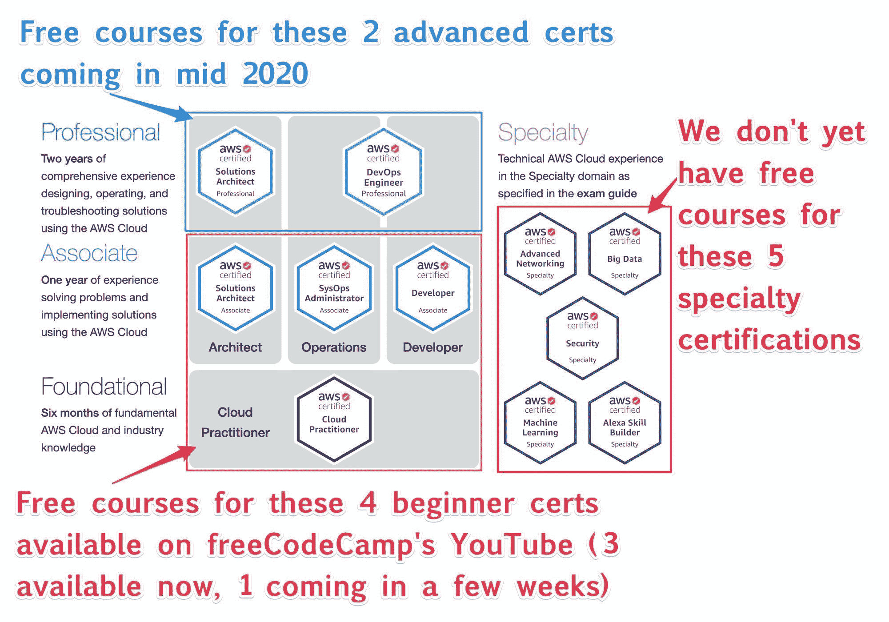

# 通过这个免费的 16 小时课程的 AWS 开发人员助理考试

> 原文：<https://www.freecodecamp.org/news/pass-the-aws-developer-associate-exam-with-this-free-16-hour-course/>

正如承诺的那样，这是第三次免费的 ExamPro AWS 认证课程。本课程将帮助您获得梦寐以求的 AWS 开发人员助理认证。

是的——你全都读对了。这是一个完整的 16 小时视频课程，可以在 freeCodeCamp 的 YouTube 频道上免费获得。

我们现在为 12 项 AWS 认证中的 **3 项提供免费课程:**

1.  ？ [AWS 认证云从业者](https://www.freecodecamp.org/news/aws-certified-cloud-practitioner-training-2019-free-video-course/)
2.  ？ [AWS 解决方案架构师助理](https://www.freecodecamp.org/news/pass-the-aws-certified-solutions-architect-exam-with-this-free-10-hour-course/)
3.  ？AWS Developer Associate(完整的课程链接在本文的底部，但我希望您先阅读本文？)
4.  AWS SysOps 管理员助理(即将推出)
5.  AWS 解决方案架构师专家(即将推出)
6.  AWS DevOps 工程师专业版(即将推出)
7.  AWS 机器学习专业(即将推出)
8.  AWS 安全专业(即将推出)
9.  AWS 高级网络专业(即将推出)
10.  AWS Alexa 技能生成器专业(即将推出)
11.  AWS 数据分析专业(即将推出)
12.  AWS 数据库专业(即将推出)

## 什么是 AWS 开发人员助理认证？

亚马逊网络服务(AWS)有 3 个助理认证:

1.  解决方案架构师(最受欢迎)
2.  系统运行管理员(技术性最强)
3.  开发者(最实用)

A chart of 11 of the AWS certifications, showing which ones we're currently working on courses for.

AWS 开发人员助理被广泛认为是最难的助理认证。这是因为考试问题基于实现、部署和保护 web 应用程序的实践知识。

在此过程中，您将获得 3 种最常见的云架构的实用开发人员知识:

*   传统(虚拟机)
*   容器/微服务(坞站)
*   无服务器(AWS Lambda)

我总是说:如果你不知道参加哪种 AWS 认证，你应该去参加 AWS 解决方案架构师助理。它的范围非常广泛，为您提供了最大数量的云角色。

但如果你想获得工作的最高机会，AWS 开发人员助理是客观上最好的认证。这证明你有实践知识，这有助于让雇主放心你已经准备好在云上工作。

## 谁是 AWS 开发人员助理？

AWS 开发人员助理适合您，如果:

*   你想证明你有 AWS 的实际知识。
*   您已经是一名 Web 开发人员，并且想要展示您拥有云计算知识。
*   您喜欢编写代码和构建应用程序。
*   您希望掌握如何将 web 应用程序部署到生产环境中。
*   你想获得初级开发人员的工作机会最大。

## 什么是云工程师？

云工程师是知道如何使用云的全栈 Web 开发人员。云工程师是 Web 开发者，但不是所有的 Web 开发者都是云工程师。

让我们对比一下这两个角色，看看使用云时职责是如何变化的:

### Web 开发人员

*   设置生产环境需要深入了解 Linux 和配置操作系统包。(一些开发人员通过使用 Heroku 这样的平台即服务来避免完全需要部署知识。)
*   Web 开发人员利用机器学习、云存储、分析或虚拟现实并不容易，因为他们的工具通常直接集成到单台服务器上的应用程序中。
*   随着单个 web 应用程序的复杂性增加，增加更多的 Web 开发人员变得更加困难，因为应用程序变得更加难以学习、配置和维护。

### 云工程师

*   基于他们使用的架构，云工程师有许多可用的部署选项。许多云服务为您管理复杂性。然后，一旦你学会了云工具，你就可以自己直接管理部署。
*   云工程师有多种架构可供选择，如微服务、无服务器或传统架构。
*   云工程师能够更好地使他们的应用程序具有高可用性、持久性和可伸缩性。
*   云工程师可以利用云服务来附加机器学习、云存储、分析、虚拟现实、实时等等。
*   培养一个云工程师团队更容易，因为使用云服务鼓励应用程序的隔离，并保持应用程序小且易于维护。

## 您应该特别关注哪些 AWS 服务

大多数 AWS 认证强调特定的 AWS 服务。对你来说，在学习中给予这些 AWS 服务特别的关注是很重要的。我想向 AWS 开发人员强调 8 大 AWS 服务，并解释为什么它们很重要。

### 1.DynamoDB

DynamoDB 是一个 NoSQL 数据库，允许您扩展到任何规模。你所需要做的就是告诉它每秒有多少读写，你就有了性能的保证。DynamoDB 是无服务器的，这意味着它只是可伸缩的，你可以选择按需付费。

我在日常工作中发现的最直接的用例是当我需要创建一个由数据库支持的小应用程序时。

如果必须使用关系数据库，如 MySQL 或 Postgres，可以使用 RDS。然而，t2.db.micro 的初始成本是每月 15 美元。您可以在 t2.nano 上建立自己的 Postgres 服务器，每月大约 5 美元，但您必须配置、备份和管理该服务器。

也许你认为你可以使用 Aurora Serverless，但是根据我的经验，它没有 DynamoDB 划算，这就是付费和付费的区别。

作为一名云工程师，您希望创建独立的应用程序，而不是在一台服务器上做所有事情的大型应用程序。后者被称为建造一个整体。

应用程序架构的未来正在转向微服务。为了完全分离您的服务，他们需要拥有自己的数据库。使用 DynamoDB，您可以做到这一点。

因此，在免费的 AWS 开发人员助理课程中，我们付出了相当大的努力来确保您从里到外理解 DynamoDB。备忘单长达 7 页！事实上，我们在 freeCodeCamp 上免费发布了它，所以你可以在考试当天打印出来。

### 2.弹性豆茎

弹性 Beanstalk (EB)是将传统架构部署到 AWS 的最快方式。传统架构是指使用为 web 框架配置的虚拟机。如果你正在使用传统的 web 框架，比如 Ruby on Rails、Laravel、ExpressJS、Django 或 Spring，那么你正在使用传统的架构。

当你使用微服务或无服务器架构时，你的代码被分解成更小的块。传统 web 框架的大部分职责都推给了应用集成 AWS 服务。

然而，大多数科技公司使用传统架构，因为这是他们所知道的，并且公司采用微服务和无服务器需要时间。

当您想要部署传统的 web 应用程序时，您必须:

*   通过安装正确的库和应用程序来配置虚拟机映像
*   您需要设置负载平衡器和自动扩展组
*   您需要建立一个关系数据库并配置一个安全的连接
*   您需要配置您的云网络，例如安全组
*   您需要建立一个部署管道。

弹力豆茎会为你设置好以上所有。你所需要做的就是选择你想要的环境，然后上传你的代码。

Elastic Beanstalk 管理基础设施，但不会将其抽象化，因此您可以探索它为您设置的所有服务。最终，当您熟悉所有底层基础设施时，您可以直接管理这些资源。

我喜欢把弹性豆茎想象成部署的训练轮。如果你是开发人员，这是开始使用 AWS 的最佳方式，我们将向你展示如何使用 EB 部署各种不同的方式。

### 3.AWS CLI 和 SDK，4。云的形成

几乎所有的 AWS 服务都可以通过 AWS API 以编程方式访问。这允许您编写代码来自动创建、删除和配置您的帐户中的任何 AWS 服务和资源。

AWS CloudFormation (CFN)也用于自动化基础设施的创建和配置。虽然开发人员了解 CFN 很重要，但 AWS CLI 和 SDK 对开发人员更重要，因为它允许以编程方式对服务进行更好的控制。当您遇到无法使用 CFN 的情况时，您可以确定您可以使用 CLI 或 SDK 来完成。

要访问 AWS API，您可以使用 AWS 命令行界面(AWS CLI)或 AWS 软件开发工具包(SDK)。

AWS CLI 节省了开发人员登录 AWS 控制台和浏览图形用户界面的时间。

AWS SDK 是将 AWS 服务集成到 web 应用程序中的主要方式。SDK 也可以在最常见的编程语言中使用。

在这个免费的 AWS Developer Associate 课程中，我们利用一切机会使用 CLI 和 SDK，并添加了额外的幻灯片，展示各种服务的 CLI 命令。您需要了解 CLI 命令来参加考试，作为云工程师，了解这些命令非常重要。

### 5 / 6.ECS 和 Fargate

弹性容器服务(ECS)和 ECS Fargate 使运行单容器或多容器应用程序变得容易。运行您的 web 应用程序变得越来越流行，因为它允许您将您的服务器配置与您的代码打包，为您提供更大的应用程序可移植性。

### 7.x 射线

借助微服务架构，您可以让许多独立的服务协同工作。很难监控性能或查明故障，因此 X 射线是一种允许您通过各种服务跟踪 HTTPS 请求路径的服务。

### 8.阶跃函数

Lambdas 允许你为每 100 毫秒的计算时间付费——你只需上传你的代码，剩下的由 AWS 负责。挑战在于如何将所有这些 Lambda 函数组织成实际的无服务器应用程序。

Step Functions 是一个状态机，它允许您定义看起来像流程图的东西，这样您就可以构建无服务器应用程序。

### 9.代码提交 10。代码版本 11。CodeDeploy 和 12。代码管道

Elastic Beanstalk (EB)附带了一个简单的部署管道。当你从 EB 毕业时，你必须建立自己的部署管道。因此，我们需要知道如何使用所有 CI/CD AWS 服务。

## 来自解决方案架构师助理的重叠内容

当您在学习多个 AWS 助理认证时，您会注意到重叠的内容。

40%的 AWS 解决方案架构师内容是通过开发人员助理考试所必需的。因此，我们所做的就是将这 40%带入这个免费的开发人员助理考试。

因此，有 6 个小时的内容来自免费的 AWS 解决方案架构师助理，并做了一些小的修改，还有 10 个小时的新内容专门针对开发人员助理。

我们在目录中用……做了标记。以表明这是重复的内容。因此，如果您已经观看了我们免费的 AWS 解决方案架构师助理课程，您可以跳过这些视频。

## #认证挑战

为了最大化你的学习体验，我建议你[参加#AWSCertified Challenge](https://www.freecodecamp.org/news/awscertified-challenge-free-path-aws-cloud-certifications/) ，这样你就不必独自学习了。

感谢 Jose Talancha 缓和了#AWSCertifiedChallenge 的不和，并自愿抽出时间支持其他人学习。

## 推荐的额外免费资源

我想向您推荐一些额外的免费学习资源，因为:

*   我们没有时间让他们参加这个免费课程
*   他们是云工程师的核心，但现在不是考试的一部分
*   他们用另一种方式解释某些困难的概念。

### 什么云？

*   [阿莱杭德娜·格扎利](https://twitter.com/QuetzalliAle)？？？— AWS 开发者倡导者@ AWS
*   [乔纳森迪翁](https://www.freecodecamp.org/news/p/53f649ac-89c9-4851-b2ac-8b78f6fe292a/linkedin.com/in/jotdion)？？？— AWS 开发者倡导者@ AWS

什么云？是 Ale 和 Jon 的个人项目，旨在让任何人都可以访问云知识。他们通过多种方式实现可访问性，例如:

*   将他们的视频翻译成法语和西班牙语
*   他们所有的视频都有隐藏字幕
*   他们花时间用插图彻底解释云的概念

他们的内容面向所有人。例如，在我的免费 AWS 课程中，我介绍了 AWS 全球基础设施，但我从未介绍过存在点(pop ),因为我真的不知道它们是什么。它们被提及，但在 AWS 文档中从未解释过。所以当我看到云的时候。我很惊讶地发现我错过了如此基础的知识。

Ale 和 Jon 不遗余力，我推荐他们的视频来填补你可能不好意思问的知识空白。

[https://www.youtube.com/embed/5MO_TSLyZU4?start=70&feature=oembed](https://www.youtube.com/embed/5MO_TSLyZU4?start=70&feature=oembed)

### AWS 身份和访问管理

*   [巴特城堡](https://twitter.com/cloudbart)？？—云技术培训师@ CBT 掘金

AWS IAM 是所有 AWS 认证的必备知识。看似简单的服务很快变得非常复杂。IAM 所做的一切都不在 AWS 控制台中，理解底层功能对您来说很重要。

我强烈建议观看 Bart 的 IAM 播放列表，这样你就有了替代的解释，以确保彻底了解这个棘手的 AWS 服务。

[https://www.youtube.com/embed/videoseries?list=PL3GN5xkPjwo23bCqxjxh0uXVW9tgIfhOi](https://www.youtube.com/embed/videoseries?list=PL3GN5xkPjwo23bCqxjxh0uXVW9tgIfhOi)

### AWS 放大器

[纳德达比特](https://twitter.com/dabit3)？️?AWS 的高级开发人员支持者

我真的很想把 AWS Amplify 包含在这个免费的 AWS 开发者认证课程中，但是我们没有时间了。AWS Amplify 目前没有出现在考试中，但是你会在以后的考试中看到。

我想让你亲自接触 AWS Amplify 的原因是，它是云工程师需要学习的最强大的服务。

AWS Amplify 是一个现代的无服务器框架，用于构建 web 或移动应用程序。它有各种 AWS 服务的插件，所以你可以快速加入分析，机器学习，AR，VR，分散认证，通知，聊天机器人等等！

通过学习 AWS Amplify，你将获得竞争优势，因为如果你掌握了这个框架，你可以快速开发应用程序，这绝对会给雇主留下深刻印象。

所以我建议你去看看 Nader 的 Youtube 频道，里面有很多 AWS Amplify 教程。

[https://www.youtube.com/embed/videoseries?list=PLSMvK3DkHvw8pV6icyH_WhgZJWAdG6InV](https://www.youtube.com/embed/videoseries?list=PLSMvK3DkHvw8pV6icyH_WhgZJWAdG6InV)

## 亚马逊事件桥

*   詹姆斯·贝斯维克 ☕？AWS 的高级开发人员支持者

我们只在免费的 AWS 开发人员助理课程中简要介绍 EventBridge，因为目前它在考试中出现的不多。EventBridge 是我想让你知道的一项服务，因为它从根本上改变了构建无服务器应用程序的方式。

EventBridge 以前被称为 CloudWatch Events，但 AWS 添加了一些附加功能来创建多个事件总线以及连接第三方服务和多帐户服务的能力。

很难描述，所以我一般对人说像扎皮尔。但这更像是 IFTTT。

为了更好地理解 EventBridge 并跟上现代无服务器架构的发展，我推荐您阅读 James Beswick 的内容:

*   ？[event bridge 简介](https://www.facebook.com/watch/?v=205256927498747)
*   ？[亚马逊事件桥:与 Zendesk 整合](https://www.youtube.com/watch?v=NakNmzsN6LI)
*   ？[设置自定义事件总线](https://twitter.com/awscloud/status/1235246274032611329)
*   ？[亚马逊 EventBridge 如何改变无服务器开发](https://www.youtube.com/watch?v=ZF79T79RYRg)

## 一些临别赠言

这个世界？现在比以往任何时候都更需要云工程师(网络开发人员+云技能)。

2020 年的疫情迫使每个人都接受远程机会，并创造了对云人才的需求。所以这是你进入云和 web 开发行业的最好机会。

我尽了自己的一份力量，为您免费提供了这门课程，接下来的旅程就看您自己了。

## ？你可以[在这里](https://www.youtube.com/watch?v=RrKRN9zRBWs)看球场。

请注意，YouTube 不允许我们将所有 16 个小时作为一个视频上传，所以第一个视频是 12 个小时。课程的最后 4 个小时在第二个视频中，链接自视频描述。

祝你备考好运。