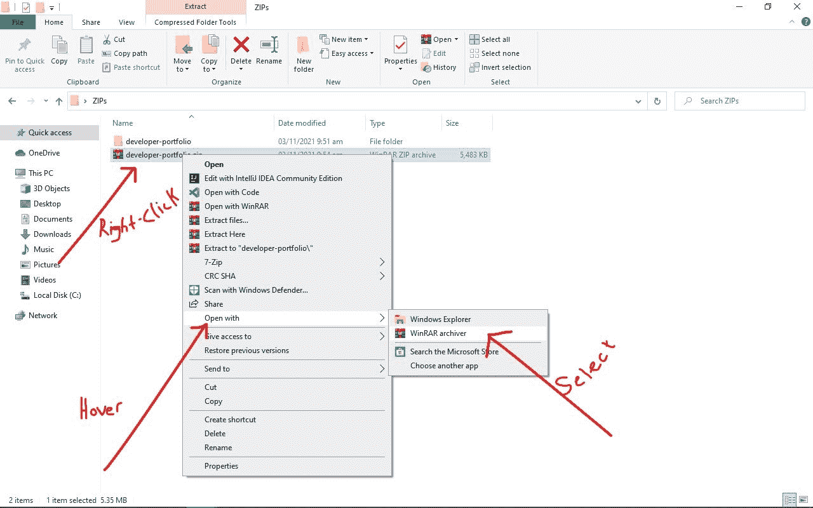
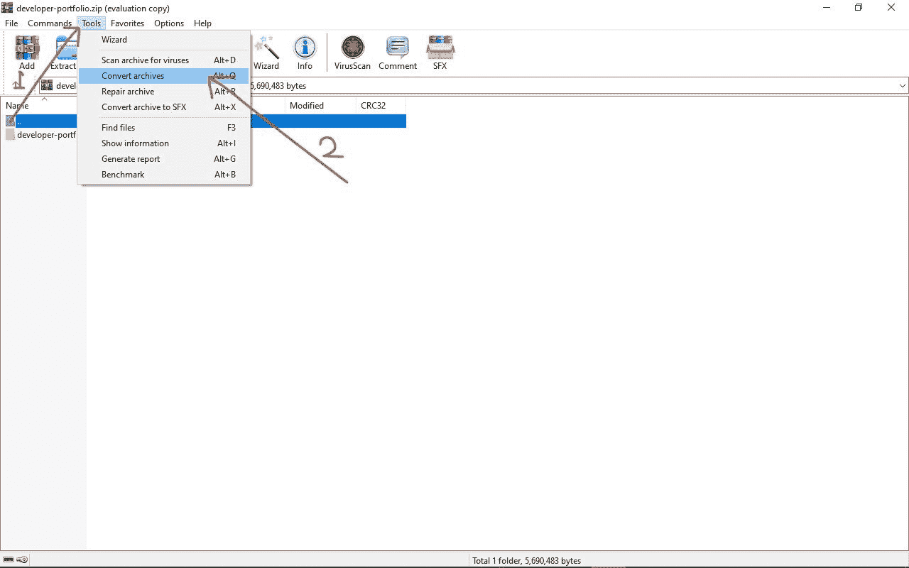
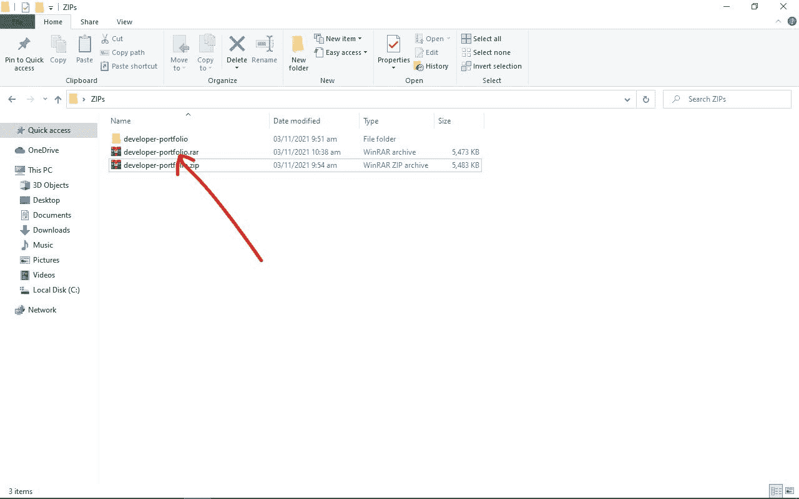

# 如何对 Zip 文件进行密码保护[Windows 10 PC 指南]

> 原文：<https://www.freecodecamp.org/news/password-protect-zip-file-windows10/>

Zip 文件通常包含多个大文件，因此您可能需要对它们进行加密或使用密码进行保护。这样的话，只有特定的人可以访问它。

在本指南中，我将向您展示一个用密码保护 zip 文件的好方法，因此您可以放心，只有那些应该看到它的人才能访问它。

## 首先，什么是 Zip 文件？

zip 文件，也称为 zip 文件夹，可以帮助您将多个文件压缩成一个大文件。这让您可以轻松地将它们保存在一个文件中，或者一次性发送给任何人。Zip 文件有。zip 作为他们的扩展名。

除了能够将多个文件压缩成一个文件之外，您还可以获得减小文件大小和使用密码保护 zip 文件的优势。

## 如何在 Windows 10 上对 Zip 文件进行密码保护

Windows 10 只提供了加密 zip 文件的方法，而不是密码保护。因此，要在 Windows 10 上对 zip 文件进行密码保护，你需要一个在 Windows 上运行的第三方应用程序。WinRAR 就是这种第三方应用的一个例子。

### 如何用 WinRAR 对 Zip 文件进行密码保护

**第一步**:你需要做的第一件事就是从它的官网下载 WinRAR。

当您下载安装程序(通常带有. exe 扩展名)时，打开它并按照安装向导安装 WinRAR。

**第二步**:用 WinRAR
打开 Zip 文件

**第三步**:从菜单项中选择“工具”，选择“转换档案”。你也可以按键盘上的`Alt` + `Q`来快速完成这个操作。

**第四步**:点击“压缩...”出现的弹出窗口中的按钮。

**第五步**:点击“设置密码...”在出现的下一个弹出窗口中。

**第六步**:在“输入密码”栏输入您选择的密码，在“重新输入验证密码”栏确认后点击“确定”。

**第七步**:再次点击“确定”。将出现一个弹出窗口，询问您是否要加密转换后的归档文件。点击是。

**第 8 步**:再次点击“确定”。WinRAR 现在将通过设置密码来保护您的 zip 文件。文件越大，花费的时间越长。

完成后，点击关闭按钮，就这样。

现在，您将拥有一个扩展名为`.rar`的单独的 zip 文件。这是一个受密码保护的文件。

### 如何用 7-Zip 对 Zip 文件进行密码保护

另一个用密码保护你的 zip 文件的第三方应用是 7-Zip。

完成以下步骤，用 7-zip 对您的 Zip 文件进行密码保护。

**第一步**:从他们的网站下载 7-Zip 应用并安装。

**第二步**:右键点击你要压缩的文件夹，将鼠标悬停在 7-Zip 选项上。在悬停时出现的菜单中，选择“添加到归档”。

**步骤 4** :在“加密”部分，在“输入密码”字段中输入您想要的密码，并在“重新输入密码”字段中确认。

**第五步**:点击“Ok”最终创建 zip 文件，并用密码保护。

## 结论

由于您可以将多个文件压缩到一个巨大的 zip 文件夹中，您可能需要用密码来保护它。这可以确保只有有权访问的人才能打开 zip 文件。

我希望这个指南能帮助你用密码保护你的 zip 文件。如果你觉得有帮助，请分享给你的朋友和家人。

感谢您的阅读。