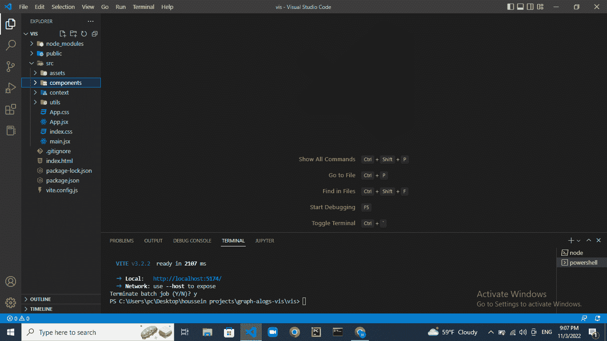
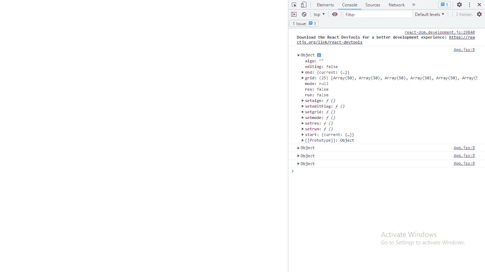
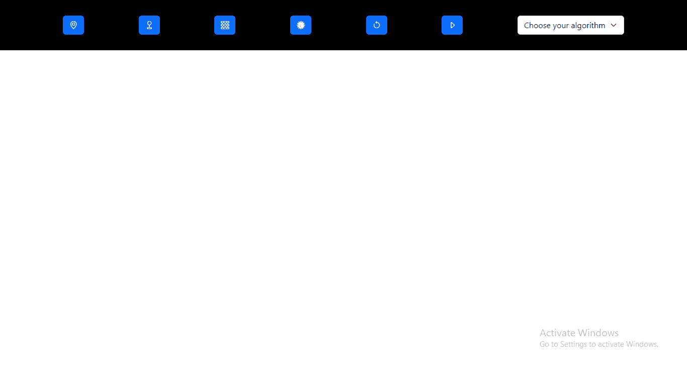
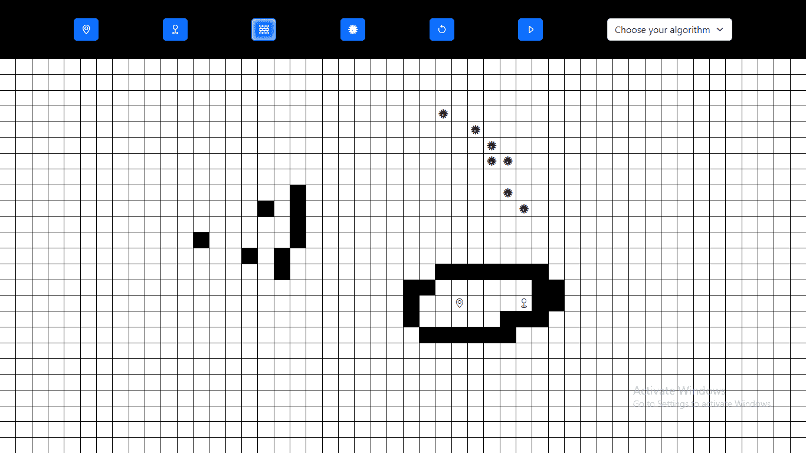
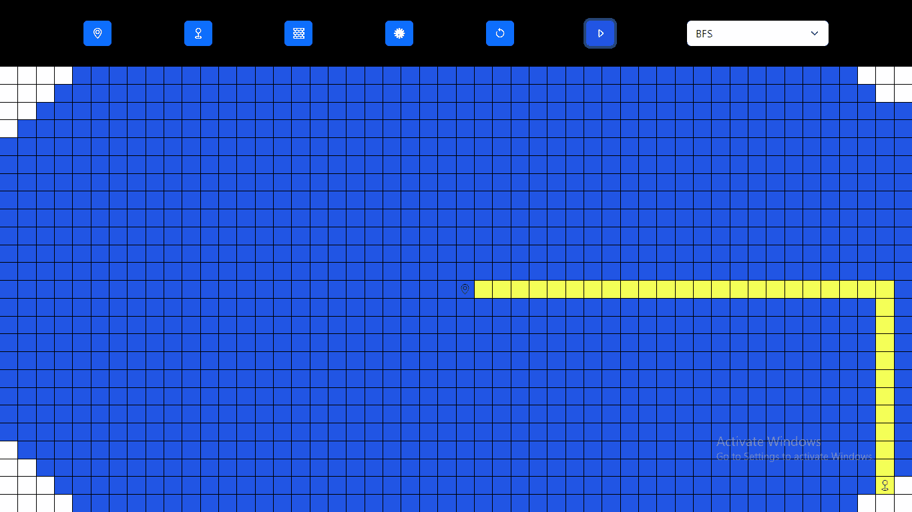

# 如何使用 React 创建路径查找算法可视化工具

> 原文：<https://www.freecodecamp.org/news/path-finding-algorithm-visualizer-tutorial/>

路径查找算法是用于在两个位置之间找到最佳路径的算法。例如，这些算法广泛应用于谷歌地图等地图应用中。

在本教程中，我们将建立一个路径查找算法可视化反应。它将支持广度优先搜索(BFS)，深度优先搜索(DFS)，添加墙，以及像 Dijkstra 的加权图算法的加权节点。这将有助于我们识别您不想走的高流量街道等要素。

要浏览本教程，你应该对 [BFS](https://www.freecodecamp.org/news/breadth-first-search-a-bfs-graph-traversal-guide-with-3-leetcodeexamples/) 和 [DFS](https://www.freecodecamp.org/news/dfs-for-your-next-tech-giant-interview/) 有一个基本的了解。如果你需要复习，我会留下一个解释这两种算法的 YouTube 视频的链接。

您还应该对 React 有一个基本的了解。

这是我们将要构建的的[最终版本，这是我的 GitHub 账户上的](https://houssein-algo-visualizer.netlify.app/)[源代码](https://github.com/HousseinBadra/Algo-visualizer.git)。

在本教程中，我们将使用 Visual Studio 代码(但您可以使用任何您想要的编辑器)，命令行提示符，一些基本的 React，ES6 JavaScript，HTML 和 CSS。

所以让我们开始编码吧！

## 项目设置

在本教程中，我将使用 Vite，这是一个帮助你比 npm create-react-app 更快启动项目的工具。

首先，如果您还没有安装 Vite，请安装它。在计算机上的已知目录中创建一个文件夹。然后使用终端，导航到该目录并运行以下命令:

```
$ npm create vite@latest my-app
$ cd my-app
$ npm install
```

现在，在 src 文件夹中，创建一个 components 文件夹、一个 contexts 文件夹和一个 utils 文件夹，这样就完成了。下面是您的项目应该是什么样子的截图:



Project folder structure

## 如何添加引导程序

现在我们需要为将要添加的按钮和图标在项目中添加 bootstrap，因为我们需要关注 JavaScript 部分。

为此，只需将引导 CDN 添加到 HTML 文件的 head 标签中。添加这些链接后，你应该注意到字体的变化。

```
<link href="https://cdn.jsdelivr.net/npm/bootstrap@5.2.2/dist/css/bootstrap.min.css" rel="stylesheet" integrity="sha384-Zenh87qX5JnK2Jl0vWa8Ck2rdkQ2Bzep5IDxbcnCeuOxjzrPF/et3URy9Bv1WTRi" crossorigin="anonymous">
<link rel="stylesheet" href="https://cdn.jsdelivr.net/npm/bootstrap-icons@1.9.1/font/bootstrap-icons.css">
```

## 如何表示细胞

为了表示网格和单元格，我将构建一个二维对象数组，其中包含表示某个单元格所需的所有属性。

现在在 utils 文件夹中，创建一个 startingGrid.js 文件。在这里，您将编写一个返回网格的函数，该网格是表示单元格的二维对象数组。

每个对象都会有这些属性: **x** 、 **y** 、 **isstarting** 、 **istarget** 、 **iswall** 、 **weight** 。

**x** 和 **y** 代表细胞的坐标。 **isstarting** 是一个布尔值，它只对起始单元格成立。 **istarget** 类似，但是针对目标节点。iswall 是一个布尔值，它只适用于墙。而**权重**是一个整数。

所有正常单元格的权重为 1，加权单元格的权重为 5。该函数应该如下所示:

```
export function getGrid(width,height){
    let grid=[]
    for (let i =0 ; i<height ; i++){
      let local=[]
      for (let j =0 ; j<width ; j++){
          local.push({x:j,y:i,isstart:false,istarget:false,weight:1,
          iswall:false})
          }
      grid.push(local)
      }
    grid[Math.floor(height/2)][Math.floor(width/2)].isstart=true
    grid[height-2][width-2].istarget=true
    return  grid
    }
```

## 如何创建上下文

在 React 中，将道具从父母传递给孩子可能变得不可维护。由于这个原因，最好将我们所有的状态存储在一个地方，在那里所有的元素都可以访问状态。这就是语境。

在 React 中，我们可以用`createContext`创建一个上下文，并使用`useContext`钩子访问它的所有变量。

现在让我们用我们需要的一切创建一个上下文。当我们将鼠标悬停在一个单元格上时，我们将基于一个名为 mode 的变量来控制事件监听器的行为。例如，如果模式是`addwalls`，那么将鼠标悬停在单元格上会使其成为一面墙。

我们将使用相同的逻辑来添加加权单元格，以及设置开始和结束单元格。

我将用于创建上下文的结构非常简单。您可以在所有项目中使用它，它看起来会像这样:

```
import { useContext,createContext } from "react";

const context = createContext()

export const useParams=()=>{
    return useContext(context)
}

export const ParamsProvider = ({children}) => {

      return (<div>
       <context.Provider value={}>
        {children}
       </context.Provider>
      </div>)

}
```

现在我们将为以下各项创建状态:

*   我们所处的**模式**，要么建墙，要么设置起始单元格。
*   我们将要运行的**算法**。
*   默认情况下，**网格**等于我们已经创建的函数返回的网格。
*   确定我们是否正在编辑。
*   为**起点**和**终点**的节点坐标。
*   确定我们想要**运行算法**并且**在使用`useEffect`改变时清除网格**(当我们改变它的值时，我们运行一个具有适当副作用的 useEffect，每个都有一个单独的状态)。

代码将如下所示:

```
import { useContext, useState,createContext, useEffect, useRef } from "react";
import { getGrid } from "../utils/startinggrid";

const context = createContext()

export const useParams=()=>{
    return useContext(context)
}

export const ParamsProvider = ({children}) => {

     const [mode,setmode] = useState(null)
     const [algo,setalgo] = useState('')
     const [run,setrun] = useState(false)
     const [grid,setgrid] = useState(getGrid(50,25))
     const [editing,seteditFlag] = useState(false)
     const [res,setres] = useState(false)
     const start=useRef({x:25,y:12})
     const end=useRef({x:48,y:23})

     useEffect(()=>{    
      restart()
     },[res])

     function restart(){
      setgrid(getGrid(50,25))
     }

      return (<div>
      <context.Provider value={{mode,
        setmode,
        algo,
        setalgo,
        grid,
        setgrid,
        setres,
        editing,
        seteditFlag,
        start,
        end,
        run,
        setrun,
        res}}>
         {children}
       </context.Provider>
       </div>)

     } 
```

最后，我们将像这样用 ParamsProvider 包装 app 组件:

```
import React from 'react'
import ReactDOM from 'react-dom/client'
import App from './App'
import './index.css'
import {ParamsProvider} from './context/context'

ReactDOM.createRoot(document.getElementById('root')).render(
  <React.StrictMode>
      <ParamsProvider>
      <App />
      </ParamsProvider>
  </React.StrictMode>

)
```

现在，为了确保一切正常，将 useParams 自定义钩子导入到 any 组件中。现在使用控制台检查它的返回值。它应该返回一个对象，包含我们添加到存储中的所有变量。

```
import './App.css'
import {useParams} from './context/context'

function App() {

console.log(useParams())

return ( <div></div>)

}

export default App
```



## 如何创建导航栏

现在是使用导航条的时候了，我们将使用它来控制模式。首先创建一个包含两个文件的 Navbar 文件夹:Navbar.jsx 和 Navbar.css，这个结构非常有用，尤其是在使用 Sass 的时候(这样每个组件及其 css 都可以在同一个文件夹中找到)。

导航栏将由六个按钮组成:两个用于设置开始/结束节点编辑的模式，两个用于设置构建块/添加加权单元格的模式，两个用于清除棋盘和运行算法。

代码将如下所示:

```
import React, { useState } from 'react'
import './Navbar.css'
import { useParams } from '../../context/context'

export default function Navbar() {

  // const [algo,setalgo] = useState('')
  const {mode,setmode,algo,setalgo,setres,setrun}=useParams()

  return (
    <div className='navbar'>
      <div className='container'>
       <button type="button" className={['btn' ,'btn-primary', mode=='setstart'? 'selected' : ''].join(' ')} onClick={()=>{
        if(mode == 'setstart') setmode(null)
        else {setmode('setstart')}
       }}>
        <i className="bi bi-geo-alt"></i>
       </button>
       <button type="button" className={['btn' ,'btn-primary', mode=='settarget'? 'selected' : ''].join(' ')} onClick={()=>{
        if(mode == 'settarget') setmode(null)
        else {setmode('settarget')}
       }}>
       <i className="bi bi-geo"></i>
       </button>
       <button type="button" className={['btn' ,'btn-primary', mode=='addbricks'? 'selected' : ''].join(' ')} onClick={()=>{
        if(mode == 'addbricks') setmode(null)
        else {setmode('addbricks')}
       }}>
       <i className="bi bi-bricks"></i>
       </button>
       <button type="button" className={['btn' ,'btn-primary', mode=='addweight'? 'selected' : ''].join(' ')} onClick={()=>{
        if(mode == 'addweight') setmode(null)
        else {setmode('addweight')}
       }}>
       <i className="bi bi-virus"></i>
       </button>
       <button type="button" className="btn btn-primary" onClick={()=>{setres((old)=>{ return !old})}}>
       <i className="bi bi-arrow-counterclockwise"></i> 
       </button>
       <button type="button" className="btn btn-primary" onClick={()=>{setrun((old)=>{return !old})}}>
       <i className="bi bi-caret-right"></i> 
       </button>
       <div>
       <select className="form-select" aria-label="Default select example"  value={algo} onChange={(e)=>{
        setalgo(e.target.value)
       }}>
       <option value=''>Choose your algorithm</option>
       <option value="dijkstra">dijkstra</option>
       <option value="BDS">BDS</option>
       <option value="BFS">BFS</option>
</select>
       </div>
      </div>
    </div>
  )
}
```

每个按钮将模式设置为所需的值，或者如果已经设置为按钮的模式，则设置为 null。

运行和重启按钮改变状态上下文变量`res`和`run`的值。我们将使用这些函数和一个 useEffect 钩子来运行算法或清除棋盘。`select`输入元素是选择算法。

现在，例如，如果选择了 building blocks mode 按钮，我们希望该按钮具有不同于其他按钮的样式。我们将通过使用所选择的类来实现这一点，该类将根据所选择的模式为按钮添加。CSS 将如下所示:

```
.navbar{
    width:100%;  
    height:min(20vh , 100px);
    background:black;
}

.navbar .selected {
    box-shadow: rgb(204, 219, 232) 3px 3px 6px 0px inset, rgba(255, 255, 255,     0.5) -3px -3px 6px 1px inset;
}
```

这就是这个应用程序现在的样子。为了进行测试，您可以在单击按钮时检查上下文变量的变化:



Current state of the app

## 如何创建网格

现在，单元格是包含在 div 中的 div，其中 board 类将包含所有单元格。网格看起来像一个 Excel 表，其中每个单元格都有一个 x 和 y 坐标。

首先，在组件文件夹中创建一个网格文件夹。然后在其中添加两个文件:Grid.jsx 和 Grid.css。

现在让我们创建网格。首先，我们将创建一个函数，它接受网格并为每个单元格返回一个 refs 数组。

当我们运行算法时，如果我们使用常规状态，将会有很多状态变化，应用程序将会崩溃。因此，解决方案是为每个单元格创建一个 ref，当我们渲染单元格时，每个单元格都有其对应的 ref。这让我们无需重新呈现组件就可以操作 div。

然而，这种方法是有代价的，这是意想不到的行为——因为这不是 React 应该工作的方式。但是如果我们不使用这种方法，应用程序会因为重新渲染而崩溃。

我们将创建一个状态来保存 ref 数组。该算法将如下所示:

```
 const {grid,setgrid,editing,seteditFlag,mode,start,end,run,res,algo}  =       useParams()

  const [refarray,mm]=useState(getrefarray(grid))

  function getrefarray(grid){
    let array=[]
    grid.forEach((elem)=>{
     elem.forEach((child)=>{
      array.push(useRef())
    })
   })
   return array
   }
```

首先，我们将使用类`board`呈现一个 div。在电路板内部，对于`refarray`的每个元素，我们将使用 ref 属性(元素本身)呈现一个 div，这样我们就可以访问和修改它，而无需再次呈现组件。

如果网格中每个 div 对应的 cell 对象的`iswall`属性等于 true，那么每个 div 都有 cell 类和 wall 类。此外，我们将根据单元格对象向单元格添加相应的图标。

```
{refarray.map((elem,index)=> {
        let classList=['cell']

        let yindex=Math.floor(index/50)
        let xindex=index % 50
        let cell=grid[yindex][xindex]

        if (cell.iswall) {
          classList.push('wall')
        }

        return <div key={`${index}`} ref={elem}  className={classList.join('         ')} >

          {cell.weight > 1 ? <i className="bi bi-virus"></i> : null}
          {cell.isstart ? <i className="bi bi-geo-alt"></i> : null }
          {cell.istarget ? <i className="bi bi-geo"></i> : null }

        </div> 
})
```

这是网格的外观:


App showing the grid

现在，我们需要为每个单元格添加三个事件侦听器。首先，我们将添加 onMouseDown 和 onMouseUp 事件侦听器——我们使用它们来设置编辑上下文变量。然后，我们将添加一个 onMouseOver，它将根据模式和编辑标志来确定对网格应用了哪些更改。

我们将像往常一样更新网格——在运行算法时，我们将只使用 ref 方法。代码将如下所示:

```
return (
    <div className='board'>
      {refarray.map((elem,index)=> {
        let classList=['cell']
        let yindex=Math.floor(index/50)
        let xindex=index % 50
        let cell=grid[yindex][xindex]

        if (cell.iswall) {
          classList.push('wall')
        }

        return <div key={`${index}`} ref={elem}  className={classList.join(' ')} 
        onMouseDown={()=>{seteditFlag(true)}} 
        onMouseUp={()=> {seteditFlag(false)}}
        onMouseMove={()=>{
          if (!editing) return
          const current= grid[yindex][xindex]
          if (current.isstart || current.istarget ) return
          switch(mode){
            case 'setstart':
              var newgrid=grid.map((elem)=>{
              return elem.map((elem)=>{
                if (!elem.isstart) return elem
                return {...elem,isstart:false}
              }) 
              })
              newgrid[yindex][xindex]={...newgrid[yindex][xindex],isstart:true,istarget:false,weight:1,iswall:false}
             start.current={x:xindex,y:yindex}
             setgrid(newgrid)
             break;

           case 'settarget':
                var newgrid=grid.map((elem)=>{
                return elem.map((elem)=>{
                  if (!elem.istarget) return elem
                  return {...elem,istarget:false}
                }) 
               })
               newgrid[yindex][xindex]={...newgrid[yindex][xindex],isstart:false,istarget:true,weight:1,iswall:false}
               end.current={x:xindex,y:yindex}
               setgrid(newgrid)
               break;

             case 'addbricks':
                var newgrid=grid.slice()
               newgrid[yindex][xindex]={...newgrid[yindex][xindex],weight:1,iswall:true}
               setgrid(newgrid)
               break;

            case 'addweight':
                var newgrid=grid.slice()
               newgrid[yindex][xindex]={...newgrid[yindex][xindex],weight:5,iswall:false}
               setgrid(newgrid)
               break;
           default:
             return 
            }}}>

          {cell.weight > 1 ? <i className="bi bi-virus"></i> : null}
          {cell.isstart ? <i className="bi bi-geo-alt"></i> : null }
          {cell.istarget ? <i className="bi bi-geo"></i> : null }

         </div>
      })}
    </div>
  ) 
```

如果编辑标志为假，我们将返回。如果单元格是起始单元格或目标单元格，情况也是如此——那么我们不想修改它们。否则，如果模式等于`addwalls`，那么我们将修改网格中相应的单元格，并将`iswall`属性设置为 true。

同样，如果模式等于`addweight`，我们将修改网格中相应的单元格，并将权重属性设置为 5 而不是 1。

对于`setstart`,我们将创建一个网格副本，其中所有单元格的`isstart`都设置为 false。然后，我们将把新的起始单元格的对应单元格设置为 true。settarget 模式也是如此。

现在，您应该能够添加墙、权重并更改开始和结束节点的位置:



## 算法

我们可以使用将要实现的算法找到最短路径。每种算法都以独特的方式找到一条路径，并且根据算法的不同，输出会有所不同。

让我们从呼吸优先搜索(或 BFS)算法开始。我们将创建一个接受 5 个参数的函数 **BFS** :

*   **图**
*   起点和终点坐标，**起点**和**目标**
*   **prevmap** ，这是一个散列表，用于在算法运行时跟踪网格中每个单元格的前一个单元格
*   **hashmap** ，这是一个 hashmap，我们将使用它来跟踪访问过的单元格。hashmap 是一个具有键值对的对象，就像 Python 中的字典一样。

对于图中的每个单元格，我们将创建一个唯一的 id x-y。对于**散列表**，我们将它的值设置为 false，对于**预览图**，我们将它的值设置为 null。下面是我们稍后将如何在 useEffect 中实现它们:

```
 let hashmap={}
  let prevmap={}
  for (let j=0;j<25;j++){
   for (let i=0;i<50;i++){
     hashmap[`${i}-${j}`]=false
     prevmap[`${i}-${j}`]=null
   }
 }
```

现在，我们将从一个数组开始，该数组包含一个元素(起始节点的坐标)和一个初始设置为零的计数器。当数组的长度不为零时，我们将弹出数组的最后一个元素，并递增计数器。

现在使用元素的坐标，我们将访问它的 ref 并添加被访问的类，其转换延迟与计数器成比例。

然后，我们将从网格中访问元素的兄弟元素，并从**散列表中检查它们是否被访问过。**如果它们被访问过，我们将忽略它们，但是如果它们没有被访问过，我们将把它们标记为已访问过，并将它们添加到数组的顶部。然后我们将在当前元素的**预映射**中标记它们的值。

当弹出元素时，如果我们找到一个 x 和 y 坐标与目标相等的元素，我们将用当前计数器返回这个对象。

深度优先搜索与此非常相似:通过顺序上的微小变化，我们可以在数组中删除和添加元素。这里是 Alvin 的 YouTube 视频，它以一种有益的方式解释了这个话题。

最后，如果没有从 a 到 b 的路径——例如 a 被墙包围——我们将返回 null。只有当数组在返回值之前变空时，才会发生这种情况。代码将如下所示:

```
 function BFS(graph,hashmap,prevmap,start,target){
    let queue=[start]
    let count=0
    hashmap[`${start.x}-${start.y}`]=true
    while (queue.length > 0){
      count+=1
      let c=queue.pop()
      refarray[c.x+c.y*50].current.style['transition-delay']=`${count * 8}ms`
      refarray[c.x+c.y*50].current.classList.add('visited')
      if (c.x == target.x && c.y == target.y) return [c,count]

      if(c.x+1 < 50 && !hashmap[`${c.x+1}-${c.y}`] && !graph[c.y][c.x+1].iswall){
        queue.unshift({x:c.x +1,y:c.y})
        prevmap[`${c.x+1}-${c.y}`]={...c}
        hashmap[`${c.x+1}-${c.y}`]=true
      }
      if(c.x-1 >=0 && !hashmap[`${c.x-1}-${c.y}`] && !graph[c.y][c.x-1].iswall){
        queue.unshift({x:c.x -1,y:c.y})
        prevmap[`${c.x-1}-${c.y}`]={...c}
        hashmap[`${c.x-1}-${c.y}`]=true
      }
      if(c.y+1 < 25 && !hashmap[`${c.x}-${c.y+1}`] && !graph[c.y+1][c.x].iswall){
        queue.unshift({x:c.x ,y:c.y+1})
        prevmap[`${c.x}-${c.y+1}`]={...c}
        hashmap[`${c.x}-${c.y+1}`]=true
      }
      if(c.y-1 >=0 && !hashmap[`${c.x}-${c.y-1}`] && !graph[c.y-1][c.x].iswall){
        queue.unshift({x:c.x ,y:c.y-1})
        prevmap[`${c.x}-${c.y-1}`]={...c}
        hashmap[`${c.x}-${c.y-1}`]=true
      }
    }
    return null
  }

  function BDS(graph,hashmap,prevmap,start,target){
    let queue=[start]
    let count=0
    hashmap[`${start.x}-${start.y}`]=true
    while (queue.length > 0){
      count+=1
      let c=queue[0]
      queue.shift()
      refarray[c.x+c.y*50].current.style['transition-delay']=`${count * 8}ms`
      refarray[c.x+c.y*50].current.classList.add('visited')
      if (c.x == target.x && c.y == target.y) return [c,count]

      if(c.y+1 < 25 && !hashmap[`${c.x}-${c.y+1}`] && !graph[c.y+1][c.x].iswall){
        queue.unshift({x:c.x ,y:c.y+1})
        prevmap[`${c.x}-${c.y+1}`]={...c}
        hashmap[`${c.x}-${c.y+1}`]=true
      }
      if(c.x-1 >=0 && !hashmap[`${c.x-1}-${c.y}`] && !graph[c.y][c.x-1].iswall){
        queue.unshift({x:c.x -1,y:c.y})
        prevmap[`${c.x-1}-${c.y}`]={...c}
        hashmap[`${c.x-1}-${c.y}`]=true
      }
      if(c.y-1 >=0 && !hashmap[`${c.x}-${c.y-1}`] && !graph[c.y-1][c.x].iswall){
        queue.unshift({x:c.x ,y:c.y-1})
        prevmap[`${c.x}-${c.y-1}`]={...c}
        hashmap[`${c.x}-${c.y-1}`]=true
      }
      if(c.x+1 < 50 && !hashmap[`${c.x+1}-${c.y}`] && !graph[c.y][c.x+1].iswall){
        queue.unshift({x:c.x +1,y:c.y})
        prevmap[`${c.x+1}-${c.y}`]={...c}
        hashmap[`${c.x+1}-${c.y}`]=true
      }
    }
    return null
  }
```

只有在单击导航栏中的 run 按钮时，我们才会运行算法。这将改变 run 的值，因此我们将使用上下文变量 run 在其依赖数组中运行 useEffect。

我们将把返回值保存在一个**结果**变量中。如果结果为空，我们将什么也不做，也不会有路径。否则，我们将使用目标的坐标和 prevmap 来获得从起点到目标的路径。然后，我们将运行一个带有回调的超时，该回调将向每个单元添加路径类和相应的转换延迟。

代码将是这样的:

```
 useEffect(()=>{

if (algo == 'BFS'){
  let hashmap={}
  let prevmap={}
  for (let j=0;j<25;j++){
   for (let i=0;i<50;i++){
     hashmap[`${i}-${j}`]=false
     prevmap[`${i}-${j}`]=null
   }
 }
 let result=BFS(grid,hashmap,prevmap,start.current,end.current)
 let path=[]
 if (result !=null){
  let current=result[0]
  while (prevmap[`${current.x}-${current.y}`] != null){
    path.push(current)
    current=prevmap[`${current.x}-${current.y}`]
  }
  setTimeout(()=>{path.reverse().forEach((elem,index)=>{
    refarray[elem.x+elem.y*50].current.style['transition-delay']=`${( index) * 15}ms`
      refarray[elem.x+elem.y*50].current.classList.add('path')
  })},result[1]*9)

 }

}
if (algo == 'BDS'){
  let hashmap={}
  let prevmap={}
  for (let j=0;j<25;j++){
   for (let i=0;i<50;i++){
     hashmap[`${i}-${j}`]=false
     prevmap[`${i}-${j}`]=null
   }
 }
  let result=BDS(grid,hashmap,prevmap,start.current,end.current)
  let path=[]
  if (result !=null){
   let current=result[0]
   while (prevmap[`${current.x}-${current.y}`] != null){
     path.push(current)
     current=prevmap[`${current.x}-${current.y}`]
   }
   setTimeout(()=>{path.reverse().forEach((elem,index)=>{
     refarray[elem.x+elem.y*50].current.style['transition-delay']=`${( index) * 15}ms`
       refarray[elem.x+elem.y*50].current.classList.add('path')
   })},result[1]*9)

  }

 }
 },[run]) 
```

现在，按下开始按钮后，我们将得到以下输出:



## 怎么清板

运行这些算法的副作用是我们添加的类和转换延迟属性(我们需要在再次运行算法之前清除这些属性)。这就是我们要做的重置网格。

我们需要担心的最后一件事是清理棋盘。当单击导航栏中的 clear 按钮时会发生这种情况，并且会改变 res 上下文变量的值。

因此，最终的 useEffect 将迭代 refarray 的每个 ref，并重置其类和转换延迟。此外，在上下文中还有另一个 useEffect，它将重新生成一个新的网格(您可以查看上下文代码)。它看起来会像这样:

```
 useEffect(()=>{
  refarray.forEach((elem)=>{elem.current.style['transition-delay']='0ms'})
  refarray.forEach((elem)=>{elem.current.classList.remove('visited');elem.current.classList.remove('path')})
 },[res])
```

这是网格的 CSS:

```
.board{
    width:100%;
    height:calc(100vh - min(20vh , 100px));
    background:black;
    display:grid;
    grid-template-rows: repeat(25 , 1fr);
    grid-template-columns: repeat(50 , 1fr);
    gap: 1px;

}

.board .cell{
    display:flex;
    justify-content: center;
    align-items: center;
    background: white;
}

.wall {
    background:black !important
}

.visited{
    background:rgb(33, 85, 228) !important;
    transition:all 8ms cubic-bezier(0.075, 0.82, 0.165, 1);

}

.path{
    background:rgb(244, 255, 87) !important ;
    transition:all 8ms cubic-bezier(0.075, 0.82, 0.165, 1);

} 
```

现在，当你点击重启按钮，电路板将恢复正常。

## 结论

最后，在本教程中，我们学到了很多关于路径寻找算法，反应，上下文，参考，算法思维和更多。

希望你喜欢这篇教程，就像我喜欢写它一样。这是我将为 freeCodeCamp 创建的许多教程之一。

你会在我的 [GitHub](https://github.com/housseinbadra) 上找到这个项目的代码，这是[托管的版本](https://houssein-algo-visualizer.netlify.app/)。如果你想支持我，[在 LinkedIn 上关注我](https://www.linkedin.com/in/houssein-badra-943879214)这对我意义重大。