# 与基于状态图的状态机一起使用的模式

> 原文：<https://www.freecodecamp.org/news/patterns-for-using-react-with-statechart-based-state-machines-33e6ab754605/>

肖恩·麦凯

# 与基于状态图的状态机一起使用的模式

Photo by [Andrew Ridley](https://unsplash.com/photos/jR4Zf-riEjI?utm_source=unsplash&utm_medium=referral&utm_content=creditCopyText) on [Unsplash](https://unsplash.com/search/photos/pattern?utm_source=unsplash&utm_medium=referral&utm_content=creditCopyText)

状态图和状态机为设计和管理应用程序中的复杂状态提供了一条有前途的道路。关于 statecharts 为什么会流行的更多信息，请参见本系列的第一篇文章。

但是，如果状态图是在 Javascript (JS)中管理 UI &状态的一个如此优秀的解决方案，为什么它们背后没有更多的动力呢？

状态图在前端世界中不流行的主要原因之一是最佳实践尚未建立。如何将状态机与流行的基于组件的 UI 库(如 React、Vue 或 Angular)结合使用还不是很清楚。

虽然宣布 JS 中状态图的最佳实践还为时过早，但我们可以探索现有状态机集成库使用的一些模式。

### 状态图机器

状态图既可以用于可视化设计，也可以作为基于图形的状态机的底层代码。

请记住，我们还处于将状态图与 JS 结合使用的早期阶段，可能有必要尝试各种库，甚至开发自己的库。也就是说， [XState](https://github.com/davidkpiano/xstate) 目前是 JS 中 statechart 机器库的领头羊。

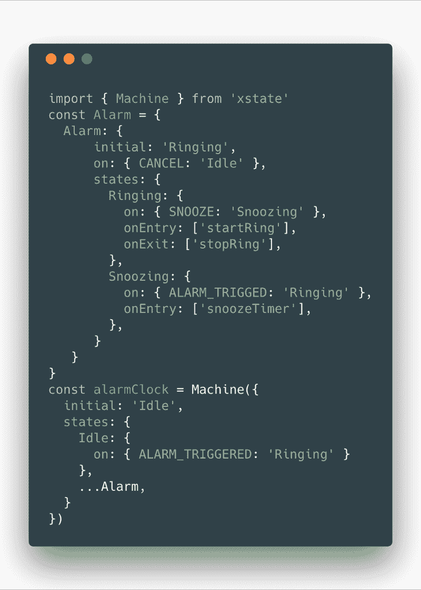

[https://gist.github.com/ShMcK/769a179f89f1d7db1f83363cc2e42399](https://gist.github.com/ShMcK/769a179f89f1d7db1f83363cc2e42399)

当作为 JSON 传递给 [XState Visualizer](https://github.com/davidkpiano/xstate#visualizer) 时，上面的状态机代码可以生成可读性更好的状态图。

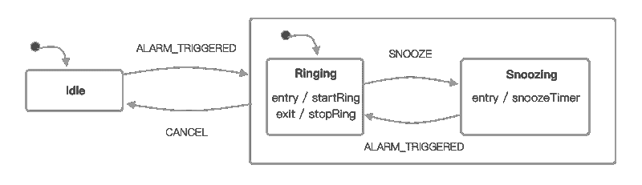

您甚至可以用另一种方式工作，从可视化设计开始，然后使用 [sketch.systems](http://sketch.systems) 导出到 XState 配置。我们还没有把所有的部分都放在一个地方，但是对于一个开源解决方案来说没有严重的技术障碍。

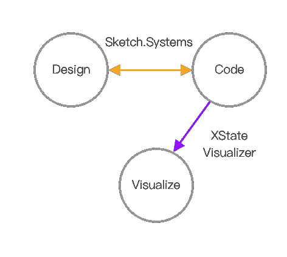

既然我们已经知道了 XState 的功能，让我们来看看它没有的功能。

> XState 标语:“无状态有限状态机和状态图”。

那么对于一个状态机来说**无状态**意味着什么呢？

### 无状态机器

无状态机器为状态管理提供了一个未具体化的**蓝图**——一种“滚动你自己的”解决方案，它不规定状态在你的应用程序中存储在哪里或者如何存储。

与表示组件非常相似，无状态机器由纯函数组成，是不可变的，并且不维护任何状态。它不追踪过去、现在或未来——但它可以用来帮助你计算每一个。

管理您的状态就像将它存储在本地状态变量中一样简单。

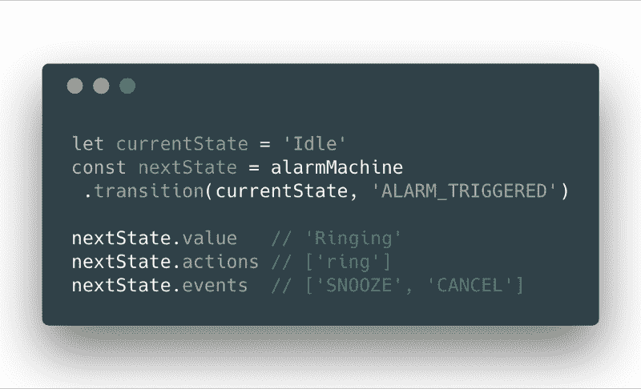

无状态机器不会给你太多现成的东西。要触发转换，我们必须总是传入当前状态节点来查找下一个。XState 可以让您知道在每次状态改变时应该触发哪些动作，但是您必须自己想办法管理这些动作。

如果您对更完整的解决方案感兴趣，可以考虑让您的状态机**有状态。**

### 有状态机器

有状态的机器跟踪状态图上的节点位置，并管理动作的触发。转换时不需要传入当前状态—它跟踪当前状态节点。

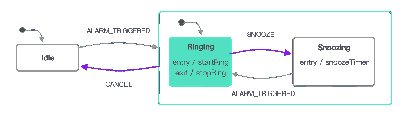

作为总结，上面的有状态机器的实例:

*   确定“振铃”时的绿色状态位置
*   将可能的紫色活动转换事件限制在`CANCEL`或`SNOOZE`
*   在进入时触发`startRing`动作
*   离开状态时触发`stopRing`动作

当然，创建有状态机器的方法不止一种。我们又回到了在哪里管理状态的问题:

*   在现有组件状态内？
*   在连接的状态机中？

让我们用例子探索一些设计模式，从**有状态组件**开始。

### 有状态组件

正如您所想象的，有状态组件管理组件内的状态，或者包装更高级组件内的状态。在 React 中，这将作为`state`。将状态存储在 UI 库中可以确保更改不会被遗漏，并且会触发重新呈现。

这是一个叫做[反应自动机](https://github.com/MicheleBertoli/react-automata)的库的方法，它使用了一个由`withStatechart`发起的高阶组件。

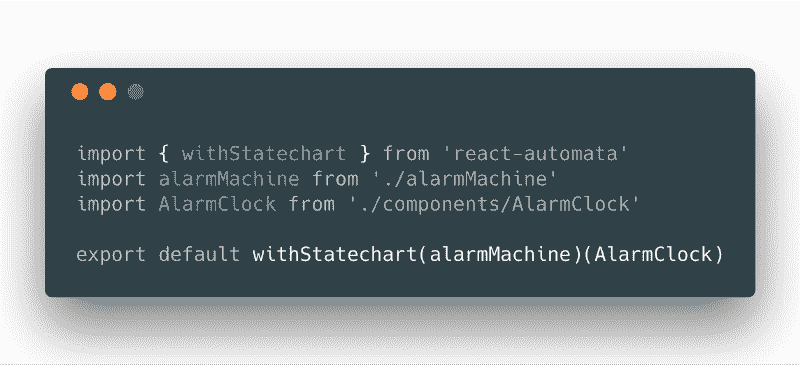

React-Automata 提供了几种使用状态图和组件的模式:

*   道具状态
*   从上下文进行条件渲染
*   行动状态

我们将仔细检查每种模式，并考虑利弊。

#### **道具状态**

将状态直接传递给组件似乎是最明显的解决方案。

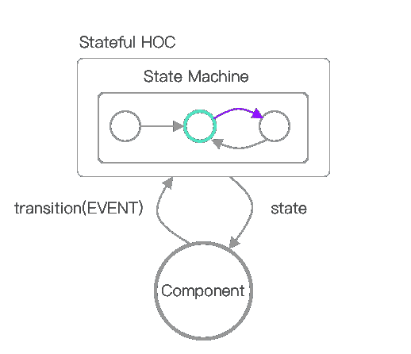

在 React-Automata 中，可以通过在`machineState` prop 上访问状态来传递状态，这是对实际状态机的引用。

但是要小心，**这绝不是最佳实践**。在上面的例子中，集成已经**将状态图**耦合到组件，导致关注点分离不良。

考虑到状态图和组件在解决不同问题时可以清晰划分:

*   statecharts: **例如当**事情发生时，进入状态，动作被触发
*   组件:**如何**和**如何**发生，例如，视图、用户交互

或者，您可以通过使用缺省值 no render 进行有条件的呈现，将组件从状态机中分离出来。

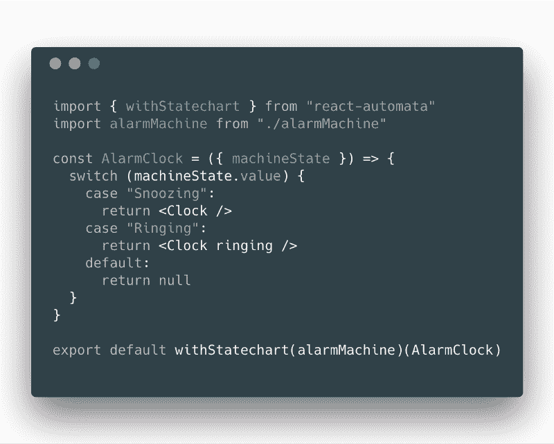

当然，一定有一种更自然的方式来设置条件渲染，而不必将所有的渲染都变成`if/else`和`switch`语句。

### **根据上下文进行条件渲染**

上下文访问的状态不需要直接传递。

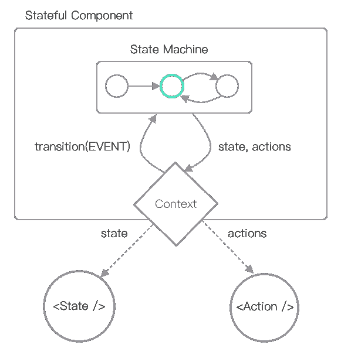

React-Automata 使用 React 的上下文和一个`<Sta` te >组件为子组件的条件呈现提供了一种模式。注意`t the` value 属性可以匹配一个字符串、字符串数组，甚至是基于 glob 的模式。

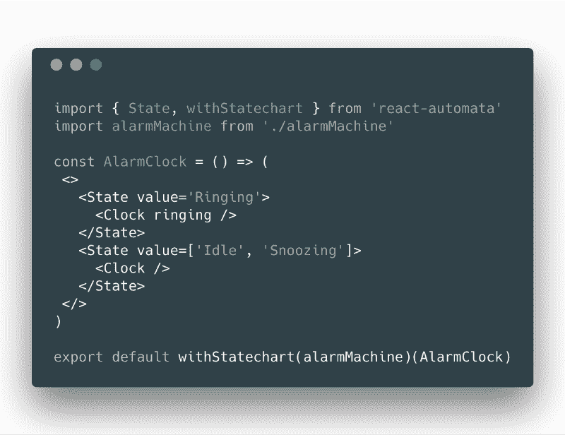

如果状态值与`Ringing`匹配，那么`State`组件中的子组件将被渲染。否则，什么都不是。

来自上下文的状态可以帮助阐明可能的有限状态视图组合的数量。和上面的例子一样，很明显只有两种可能的配置。

如果视图配置开始失控，React-Automata 会提供一个 render prop 模式，根据值传入一个布尔值。

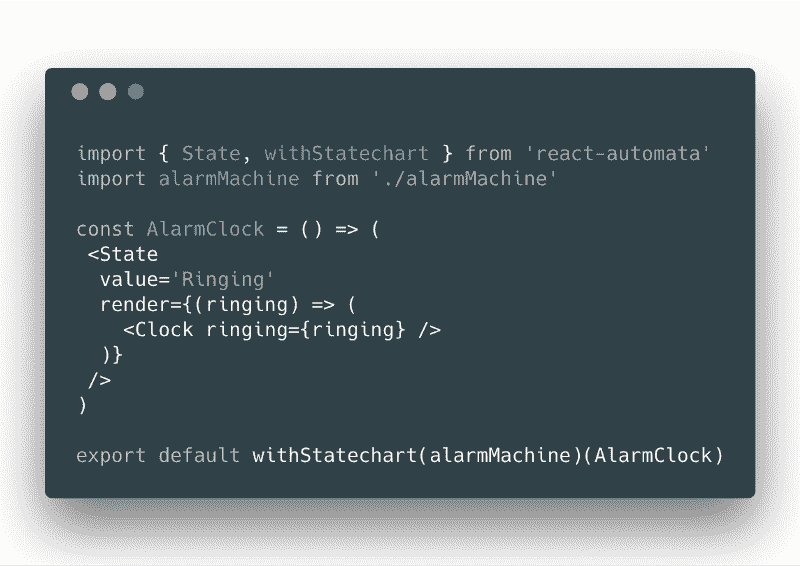

类似地，可以基于上下文动作进行条件渲染。

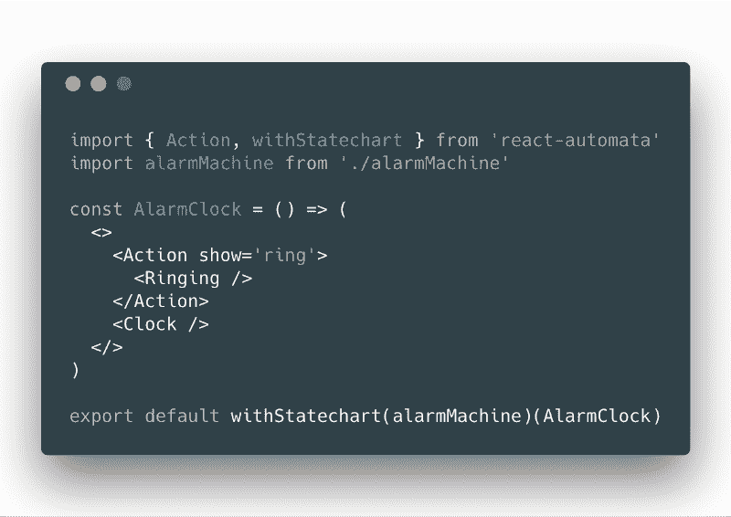

基于状态或动作的有条件呈现保持了状态图和组件之间的耦合，但是不太明确地通过上下文。除了状态图之外，你如何给组件独立的状态？

#### **动作状态**

可以使用状态图来更新链接组件的内部状态，使用动作作为触发器。

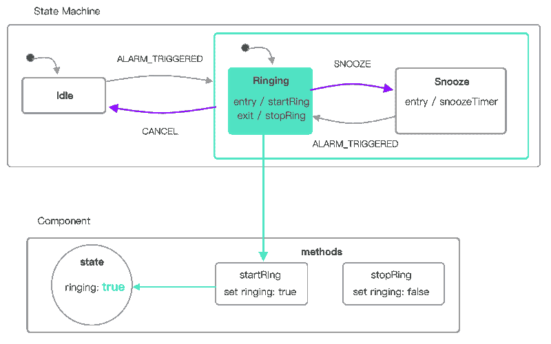

React-automata 检查组件上的方法，如果名称与被触发的动作匹配，就调用函数。

例如，当状态机进入`Ringing`时，onEntry 动作`startRing`被触发，导致`AlarmClock`状态变为`ringing`。在离开`Ringing`状态时，`stopRing`被触发，并且`ringing`被设置为`false`。

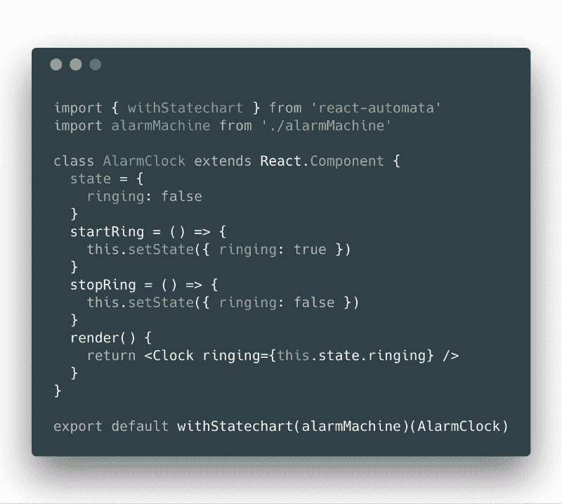

注意，尽管这些方法中有一些是用 params 调用的，但是这些方法已经可以通过 props 从`machineState`访问它们需要的任何内容。

使用通过动作管理的内部组件状态会导致组件与状态图的强烈分离。然而，它也会在组件中造成一定程度的混乱。如果不检查状态图中的动作名称，就不清楚如何或何时调用方法。出于这个原因，我经常把我的动作和方法称为`enterX`或`exitX`，以便清楚地说明它们被触发的原因和位置。

### 外部状态机

另一个值得考虑的选择是在 UI 框架之外存储状态。与 Redux 等其他状态管理库一样，组件可以连接到外部状态机，并使用“状态改变”和“动作”事件进行更新。

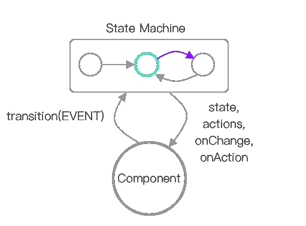

例如， [XStateful](https://github.com/avaragado/xstateful) 是 XState 的包装器，它处理状态、转换、发出事件、触发动作等等。

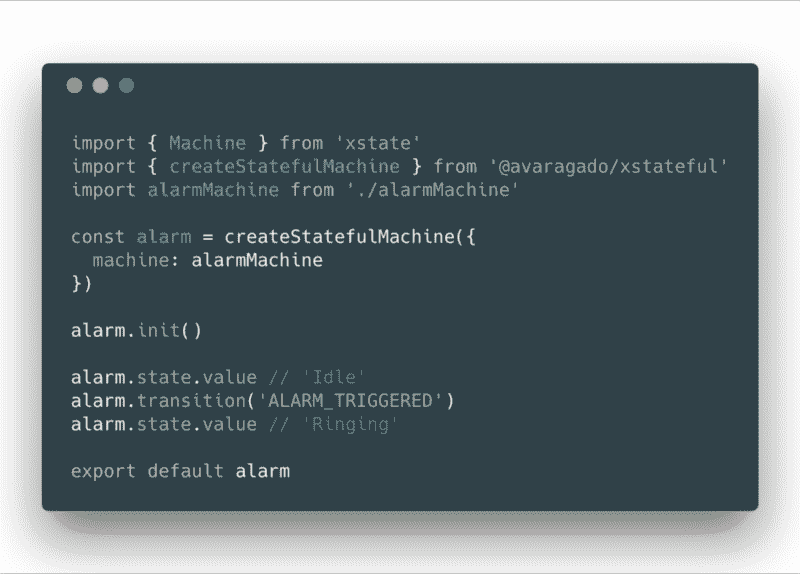

XStateful 与名为 [XStateful-React](https://github.com/avaragado/xstateful-react) 的 React 连接器配合得很好。

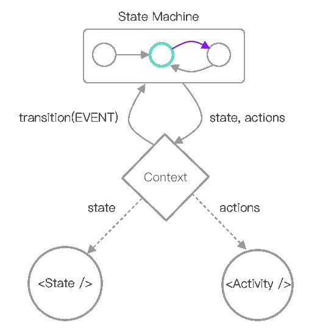

XStateful-React 与 React-Automata 有许多共同之处。但是至少有一个显著的区别——状态机实例不在任何组件中管理。

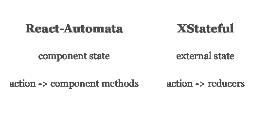

那么来自 reducers 的外部状态在 XStateful 中是如何工作的呢？

### 状态和数据

应用程序通常不仅仅需要状态图中的状态节点，还需要数据。通常，这些数据需要跨组件同步，如果必须从最高级别的共享父级传递，这种方式可能会受到阻碍。

目前有一些流行的数据同步解决方案，比如 Redux，或者 Redux 的 my state management wrapper。不幸的是，由于 React Redux 中传递引用的一个公开问题(参见这个[关于 connect()和 React.forwardRef](https://github.com/reduxjs/react-redux/issues/914) 的公开问题)，这些不能很好地与许多状态包装器(如 React-Automata)一起使用。

一个完整的状态解决方案应该管理状态和数据。

XStateful 提供了这样一个状态和数据解决方案，它使用了一个[状态缩减器模式](https://blog.kentcdodds.com/the-state-reducer-pattern-%EF%B8%8F-b40316cfac57)，类似于 Redux。

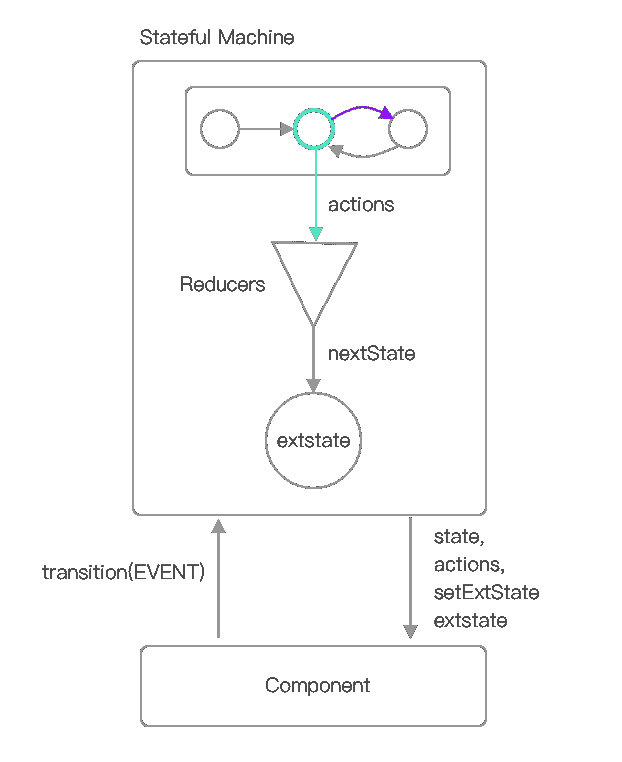

状态机订户监听并基于从状态机发出的动作更新改变。注意，XState 将数据称为**扩展状态**，或`extstate`。

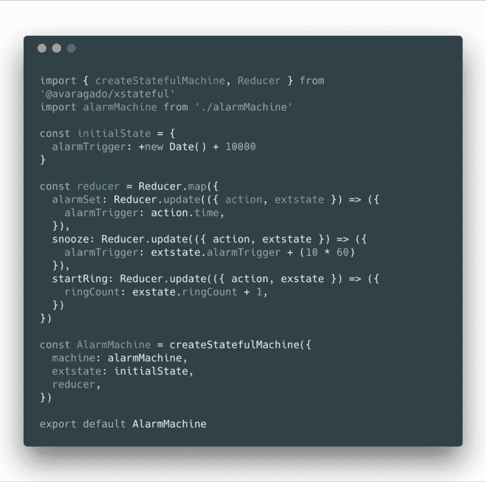

这种特殊的 Reducer 模式可能看起来不熟悉，但是，它在诸如 [ReasonReact](https://reasonml.github.io/reason-react/docs/en/state-actions-reducer.html) 这样的项目中被大量使用。

也可以在属性`cond`的条件呈现中访问数据。

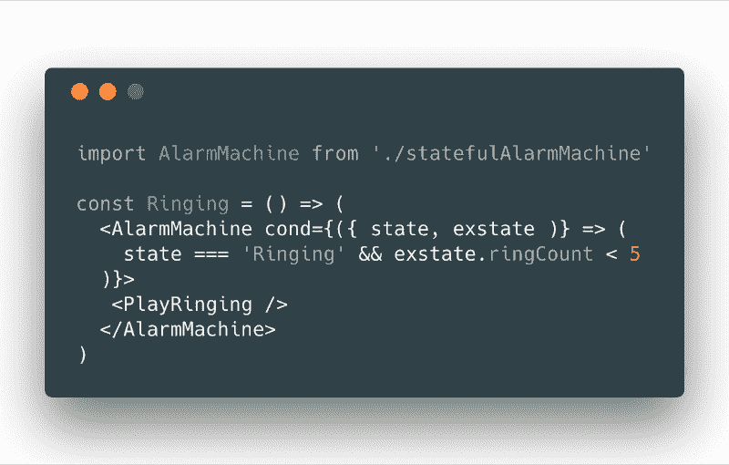

**使用状态来有条件地呈现组件时要小心**，因为它会创建一组不确定的可能状态。您不再受限于状态的数量，而是现在受限于状态和数据组合的数量。您失去了确定性特性，这将在测试部分讨论。

可以使用 render prop 模式将这些数据传递到组件中。

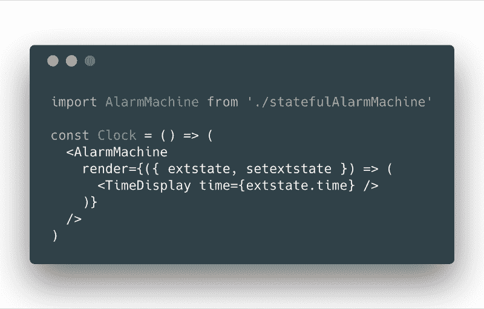

如果数据可以存储在像 XStateful 这样的完整状态机工具中，那么就不需要像 Redux 这样的状态管理工具了。

### 测试

状态机也为前端测试提供了更好的途径。

状态机的确定性创造了简化前端测试的可能性。

在 React-Automata 中，您可以使用`testStatechart`自动生成快照测试，这是一种采用 XState 配置和组件的方法。

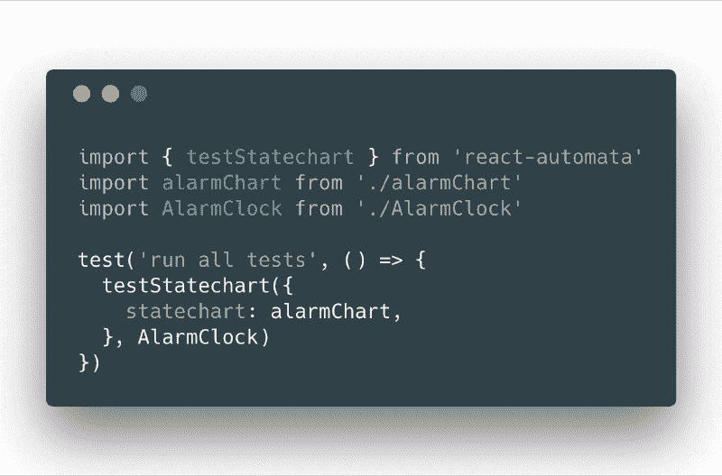

`testStatechart`运行状态图，并为组件的每个可能配置创建一个 [Jest 快照测试](https://jestjs.io/docs/en/snapshot-testing)。它将打开和关闭您的各种`<State` / `>, <`动作/ >组件，从而记录所有可能的条件渲染组合。

### 开发工具

Devtools 在使库对开发人员友好的过程中扮演着积极的角色——调试可能是您工作中最困难或最简单的部分。

在这方面，React-Automata 通过 Redux Devtools 提供了一个有用的集成。每个连接的组件都成为 devtools 中的一个命名实例，每个转换和动作都按时间顺序显示，就像 Redux devtools 中的动作一样。

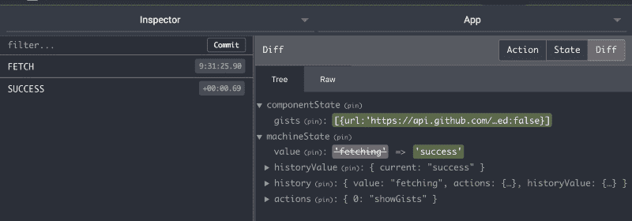

XState 提供了一组全新的变量来跟踪。考虑以下由 Erik Mogensen 编写的关于 XState 调试器可能跟踪的信息种类的[示例。](https://codepen.io/mogsie/pen/YapZjZ)

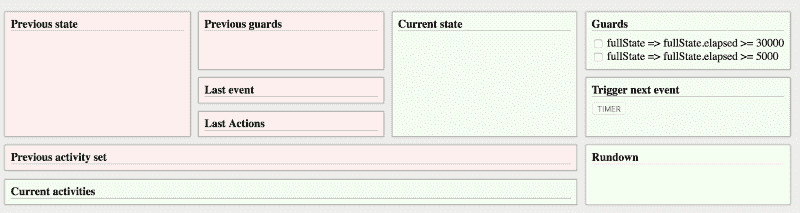

这并不是说状态机 devtools 需要看起来像我们现有的 devtools。状态机开发工具为更直观的调试体验提供了机会。

### 结论

虽然我们仍然处于 JS 中 statecharts 的早期阶段，但是已经有足够多的选项可以在 XState 之上开始开发应用程序。我们可以从这些开发模式中学习，以改进可用的库并创建工具来支持基于视觉的编程的巨大潜力。

在过去的三个月中，我已经开发了带有状态图的应用程序，我个人认为这些新模式是一股新鲜空气。协作变得更加舒适，因为团队成员可以直观地掌握一个重要且不断发展的系统的底层逻辑。

我希望这篇文章能帮助其他人发现基于状态图的开发更容易理解。如果你觉得它有帮助，请鼓掌并传递它:)