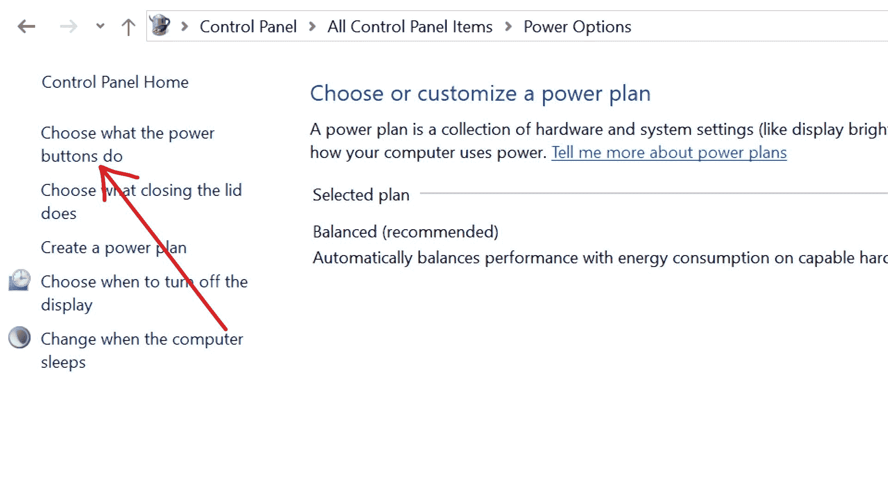
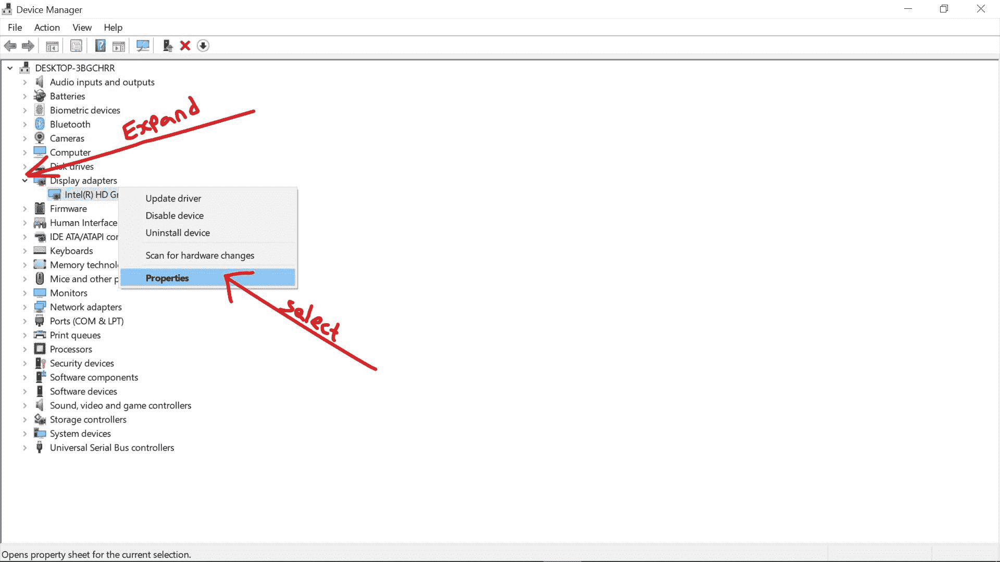
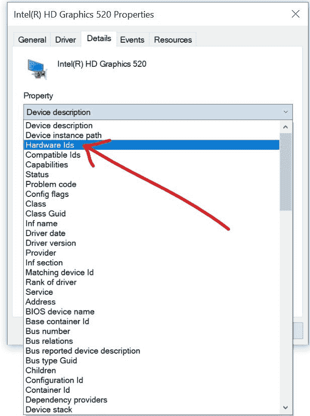
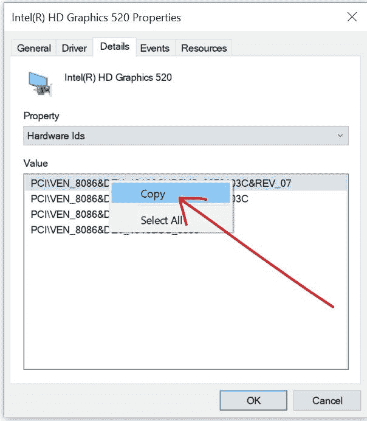
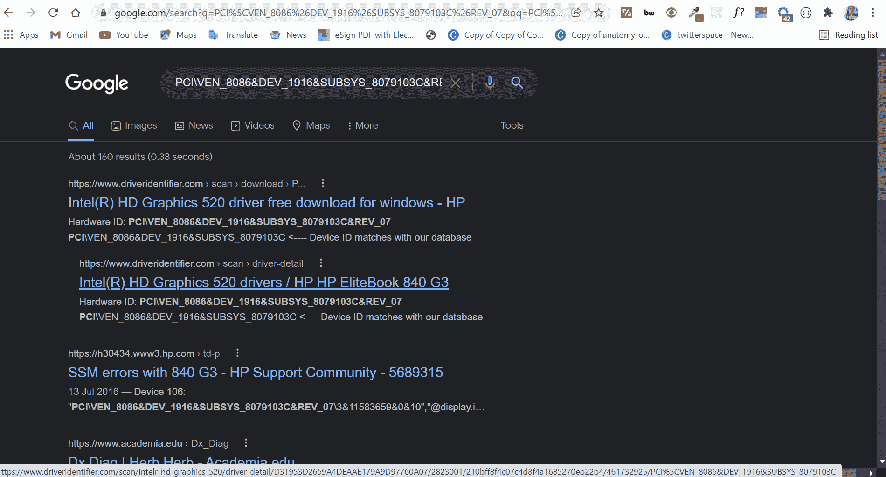
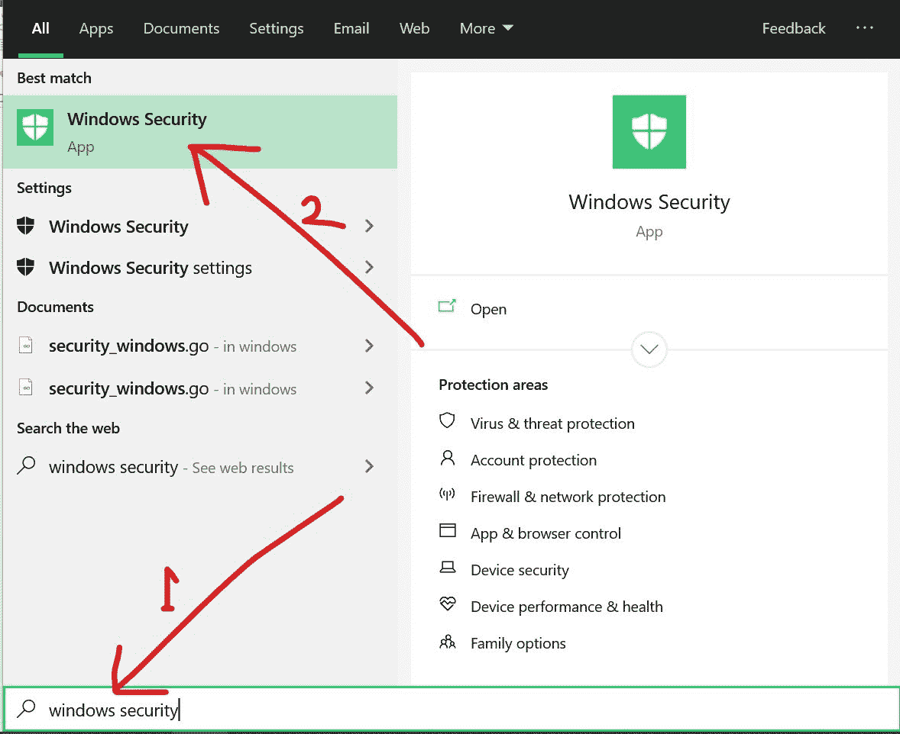
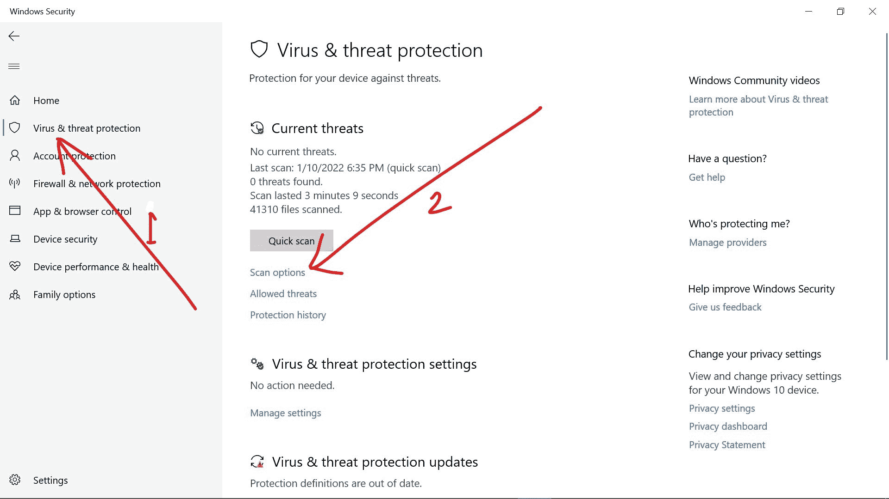
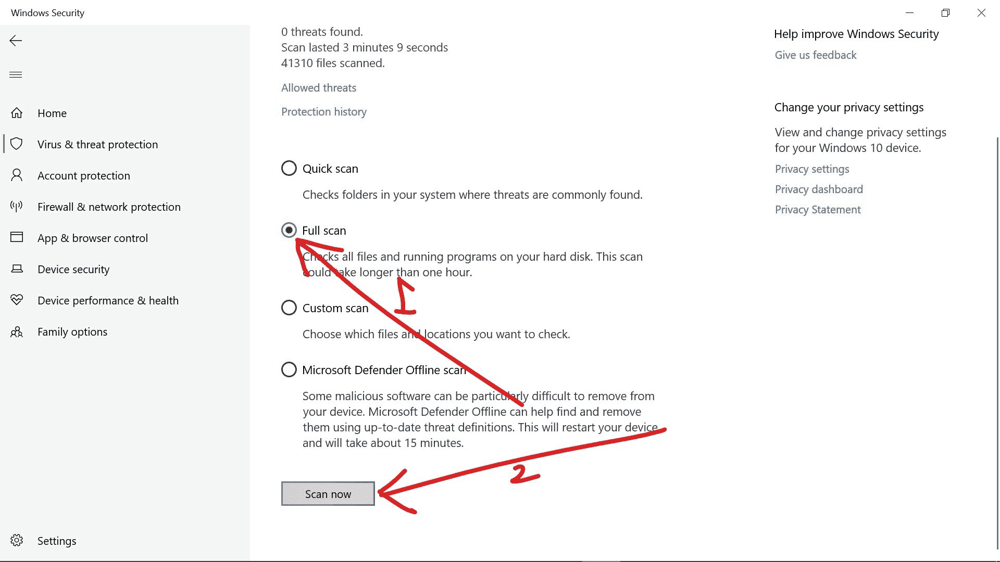

# 电脑随机关机-如何修复 Windows 电脑关机

> 原文：<https://www.freecodecamp.org/news/pc-randomly-turns-off-how-to-fix-windows-computer-shutting-down/>

如果你是 Windows 用户，你可能会随机关闭你的电脑。这可能会令人沮丧，并对你的工作效率产生负面影响，因为它会打断重要的任务和活动。

这种随机关机可能是由软件或硬件问题引起的，在某些情况下也可能是由两者引起的。

我研究了 4 种可以阻止 Windows 10 电脑随机关机的方法，这样你就可以在电脑上做重要事情时不用担心被打扰。

## 目录

*   [检查电脑是否过热](#solution1checkthecomputerforoverheating)
*   [关闭快速启动](#solution2turnofffaststartup)
*   [更新过时的驱动程序和 GPU 驱动程序](#solution3updateoutdateddriversandgpudriver)
*   [扫描电脑病毒](#solution4scanyourcomputerforviruses)
*   [结论](#conclusion)

## 解决方案 1:检查电脑是否过热

如今，电脑被设定在加热到一定温度后就会关机。这是一项安全措施，因为如果机器过热，硬件和软件组件都会损坏。

如果你的 Windows 10 电脑突然关机，我建议你做的第一件事就是检查它是否过热。

过热可能是由于风扇损坏或性能不佳、通风不良、灰尘和电源不足造成的。

我建议你做的是清洁你的电脑，确保你工作的房间通风良好，使用稳定的电源，如果风扇的某些部分在下面，抬高你的笔记本电脑。

## 解决方案 2:关闭快速启动

Windows 10 针对从睡眠、关机和休眠中快速恢复进行了优化。如果不关闭，此功能会影响性能并导致随机关机。

以下步骤向您展示了如何在 Windows 10 上关闭快速启动:

**第一步**:按下键盘上的`WIN`按钮，输入“控制面板”(不带引号)，点击`ENTER`打开第一个搜索结果，启动控制面板。

**第二步**:将控制面板的查看模式改为大图标。

**第三步**:选择“电源选项”。

**步骤 4** :点击“选择电源按钮的功能”链接。

**第五步**:打开“更改当前不可用的设置”链接。

**步骤 6** :取消勾选“开启快速启动(推荐)”，点击保存更改。

## 解决方案 3:更新过时的驱动程序和 GPU 驱动程序

当您的电脑随机关机时，过时的驱动程序可能是罪魁祸首。

要更新任何驱动程序，请通过右键单击“开始”并选择“设备管理器”打开设备管理器。

逐个展开设备，右键单击每个设备，然后选择“更新驱动程序”。

如果你不能应付一个接一个更新驱动程序的麻烦，在线检查让你在你的 PC 上搜索过期的驱动程序并自动更新它们的服务。

就图形处理单元驱动程序而言，您可能不会像更新其他驱动程序那样更新它，从而获得必要的更新。

而不是这样做，你应该检查制造商的网站，并从那里下载更新。

更新 GPU 驱动程序的最佳方式如下所述:

**步骤 1** :右键点击开始，选择设备管理器。

**第二步**:展开显示卡。

第三步:右击你的显示卡，选择属性。

**步骤 4** :切换到详细信息选项卡，点击“设备描述”下拉菜单，然后选择硬件 id。

**第六步**:打开浏览器，粘贴 ID，搜索。前几个搜索结果将显示您的 GPU 的确切名称和制造商。

**步骤 7** :导航到 GPU 厂商网站，下载更新驱动。

**第 8 步**:安装驱动程序，重启电脑

**P.S.** :如果找不到厂商官网，就复制为你的 GPU 显示的名称，加上前缀“驱动程序更新为”。在我的例子中，这将是“英特尔 HD Graphics 520 驱动程序/惠普 HP EliteBook 840 G3 的驱动程序更新”。

## 解决方案 4:扫描计算机中的病毒

一些恶意软件和病毒会导致你的电脑突然关机。

在这种情况下，您应该使用 Windows Security(又名 Windows Defender)或您选择的任何第三方防病毒程序运行全系统扫描。

下面的步骤解释了如何使用 Windows Security 进行全系统扫描:

**第一步**:按键盘上的`WIN`键，搜索“windows 安全”。第一个搜索结果应该是 Windows 安全。点击`ENTER`打开。

**第二步**:切换到左侧的病毒&威胁防护选项卡。

**第三步**:点击“扫描选项”链接。

**第四步**:选择全面扫描，点击立即扫描。

这可能需要几个小时，所以请耐心等待。

## 结论

这篇文章将带你通过 4 种不太复杂的方法来修复随机关机的 Windows 10 电脑。

除了这些方法，还有其他方法可以解决这个问题，如更新 BIOS 和检查硬盘。但是这些方法并不推荐给初学者和那些不从事硬件工作的工程师。

如果本文推荐的 4 种方法都不起作用，你应该寻求专业服务。

感谢您的阅读。