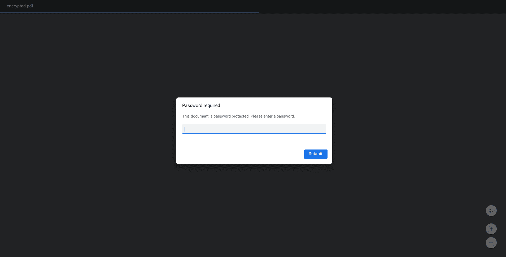
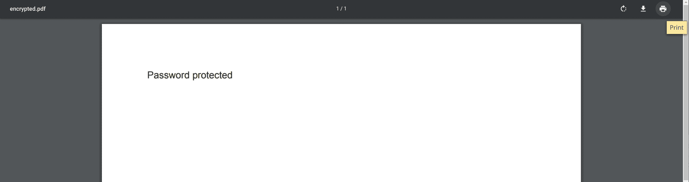
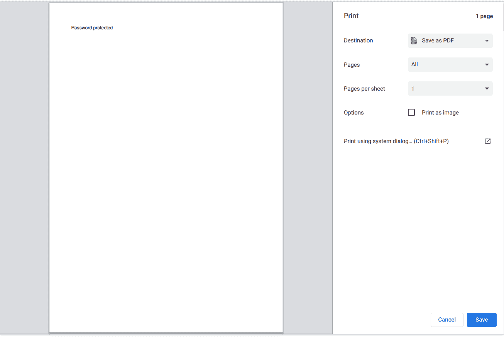
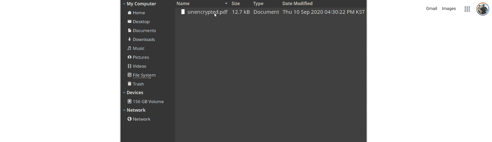

# PDF 密码删除指南:如何删除 PDF 的密码保护

> 原文：<https://www.freecodecamp.org/news/pdf-password-remover-guide-how-to-remove-password-protection-from-a-pdf/>

受密码保护的 pdf 很常见。你可能已经从银行收到一封，或者在工作中与他们打过交道。

密码通常用于保护 PDF 文档中的敏感信息，或防止他人轻易编辑它。这太好了——很高兴知道无论是谁创建了这个文档，他都会加倍努力保护你的隐私。

受密码保护的 PDF 的问题在于，每次您想要打开文档时，都需要输入密码。如果您有多个密码保护的 pdf，安全存储和管理所有这些不同的密码可能是一个真正的麻烦。

如果您曾经想知道如何从 PDF 中删除密码，以便更容易打开和共享，请继续阅读。

**重要提示:**要从 PDF 中删除密码，您必须事先知道密码是什么。这个指南是为了方便，而不是为了破解或暴力破解一个未知的 PDF 密码。

## 打印到另一个 PDF 文件

取消 PDF 密码保护的最便捷方式是打开它，然后将其打印为另一个 PDF 文件。新的 PDF 文件将不受密码保护，您无需输入原始密码就可以打开它。

虽然这可以在大多数免费的 PDF 阅读器中运行，但使用像谷歌 Chrome 这样的浏览器非常容易，并且在所有主要的操作系统中都是一样的。

首先，在 Chrome 中打开受密码保护的 PDF，方法是打开一个新标签，然后将文件拖到浏览器中。你也可以右键点击 PDF 并选择“打开方式”和“谷歌浏览器”，尽管这可能会因你的操作系统而略有不同。

系统会提示您输入密码。输入密码，然后点击“提交”按钮:

文档打开后，点击右上角的打印按钮，调出 Chrome 的打印菜单。或者，对于 Windows 和 Linux，只需按下 **Ctrl + p** ，对于 macOS，只需按下 **Cmd + p** :

打开“打印”菜单，确保“目的位置”设置为“存储为 PDF”。然后点击右下角的“保存”:

如果愿意，重命名文件并保存。

然后，当您打开新文件时，不会提示您输入密码:

最后，将新的 PDF 文件存储在安全的地方。如果它包含任何敏感信息，请小心与谁分享。

## TL；速度三角形定位法(dead reckoning)

以下是上述步骤的 CliffsNotes 版本:

*   在谷歌浏览器中打开受密码保护的 PDF 文件
*   出现提示时输入密码
*   打开打印菜单，选择“另存为 PDF”，点击“保存”按钮
*   如果需要，重命名文件，并将其保存在安全的地方

有了它，您应该能够快速、轻松地取消 Windows、macOS 和 Linux 中任何 PDF 的密码保护。

保持安全和快乐的密码删除:)