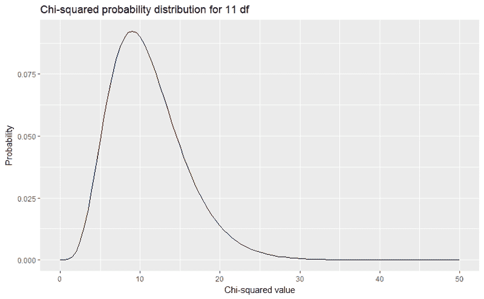
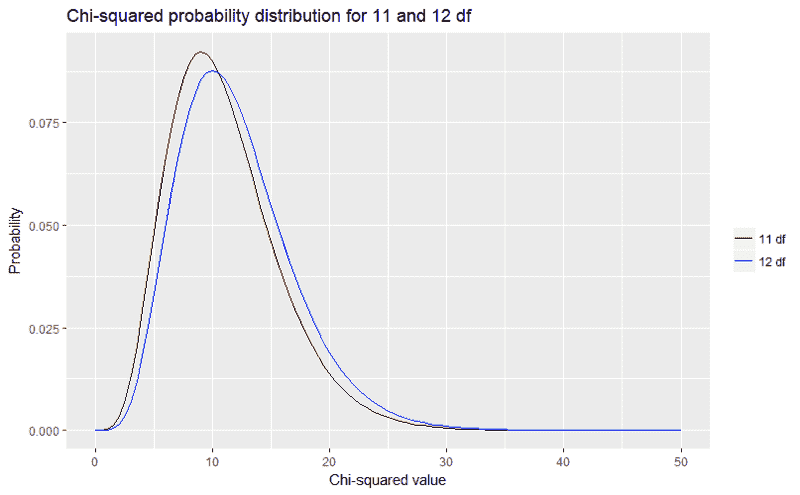
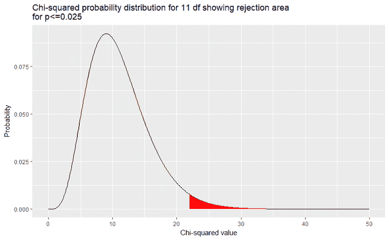
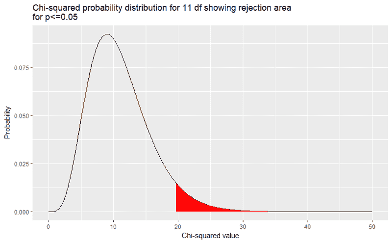

# 皮尔逊、p 值和图

> 原文：<https://www.freecodecamp.org/news/pearson-p-values-and-plots-d5eed2fd6d1a/>

作者:米歇尔·琼斯

# 皮尔逊、p 值和图


[Not this type of p-value.](https://commons.wikimedia.org/wiki/File:Health_knowledge_-_a_thorough_and_concise_knowledge_of_the_prevention,_causes,_and_treatments_of_disease,_simplified_for_home_use_(1920)_(14595091179).jpg)

### 什么是 p 值？

> 如果你的实验需要统计，你应该做一个更好的实验。—欧内斯特·卢瑟福

p 值在研究中的使用非常普遍。同行评议的期刊文章中充斥着这类文章。似乎每个科学家和他们垂涎的狗都在使用它们。

好吧，不用查答案:

> p 值的定义是什么？

老实说，我不会告诉任何人你的答案。我保证。这是我们的秘密。在我接下来的几篇文章中，我们将继续讨论这个问题。

我们从皮尔森开始我们的旅程。

### 卡尔·皮尔逊

1900 年，卡尔·皮尔逊发表了他的论文，讨论了 p 值的概念。论文的大部分都是卡方检验的例子。因此，本文的重点是计数的频率，以及观察到的计数与预期计数的差异程度(用皮尔逊的术语来说，偏差)。用他的统计学术语来说，每个偏差(n)都是一个误差。

他对 P 的定义如下:

> n 个错误的复杂系统发生的频率等于或大于被观察系统的频率的概率(第 158 页)

换句话说，给定预期的计数，我们观察到的计数**和**的差异有多大？

#### 卡方检验的两种主要类型

关于费希尔的卡方检验，有一个关键点需要注意。是的，他的方法决定了观察到的计数是否不同于预期的计数。然而，他根据预先确定的基本分布，直接比较观察到的计数和预期的计数。这是一个拟合优度测试。他问的问题有:

*   这组掷骰子的结果是否遵循二项分布？
*   这组 222 朵毛茛的花瓣数符合特定的偏斜曲线吗？

这与我们通常使用的卡方检验完全不同，在卡方检验中，我们将两组而不是一组与预定义的分布进行比较:

*   病例和对照(例如吸烟者/非吸烟者)在疾病发生率(例如肺癌)上有显著差异吗？
*   男人和女人投票给同一个政治候选人吗？

在我们的正常情况下，预期计数(以及分布)是直接从列联表裕量中得出的。在第二种方法中，我们进行独立性卡方检验。(还有另一种类型的卡方检验，基本上使用与这个相同的分析，但这是一个我们将忽略的技术细节。)

回到卡方拟合优度测试。

### 骰子滚动

让我们用 **R** 来完成 Pearson 的第一个例子。基数 R 足够了。我们将使用 R 为自己计算卡方值(*【χ】***)。最后，我们将理论计数和观察计数相加，以检查这些数字是否与我们在论文表格中所期望的一致。**

#### **实验描述**

**数据来自一个实验，其中 12 个骰子滚动 26，306 次。在每一次掷骰子中，显示 5 或 6 的骰子数被计算出来。(我猜想是某个可怜的研究生抽到了短签。)**

**对于 12 个骰子，每次投掷的可能数字范围是从零(没有骰子显示 5 或 6)到十二(所有骰子都显示 5 或 6)。**

#### **二项分布**

**掷骰子的值遵循二项式分布。我们将这种分布用于计数数据。对于那些对二项分布和卡方检验之间的关系感兴趣的人来说，[这是一个容易理解的解释](http://davidquigley.com/talks/2015/biostatistics/module_07.1.html)。**

**可以使用 r 中的`dbinom`函数计算 0 到 12 范围内每个可能值的期望值。例如，当掷出 12 个骰子时，获得显示 5 或 6 的**零**骰子的概率为**

```
`dbinom(0,12,1/3)[1] 0.007707347`
```

**我们将概率乘以试验总数，得到 26，306 次试验中 5 号和 6 号的预期计数**

```
`dbinom(0,12,1/3)*26306[1] 202.7495`
```

**我们四舍五入到 203。我们可以对值 1 到 12 重复这个过程。然而，当我们达到 12 时，我们会遇到以下问题。**

```
`dbinom(12,12,1/3)[1] 1.881676e-06`
```

```
`dbinom(12,12,1/3)*26306[1] 0.04949938`
```

**我们的概率和相关计数非常接近于 0。以下是更多相关信息。**

#### **创建数据框**

**我们将在读入值的同时构建 data.frame。**

```
`PearsonChiSquare <- data.frame(Face5or6=c(0,1,2,3,4,5,6,7,8,9,10,11,12),                                  Theoretical=c(203,1217,3345,5576,6273,5018,2927,1254,392,87,13,1,0),                                  Observed=c(185,1149,3265,5475,6114,5194,3067,1331,403,105,14,4,0))`
```

**回到我们数据的问题，只有当我们进行卡方检验时才会显示出来。请注意，所有 12 个骰子的理论和预期计数均为 0，显示为 5 或 6。当除以 0 时，卡方检验不会给出结果。**

**我们能做什么？处理这个问题最简单的方法是删除 data.frame 的最后一行。在我们的例子中，这与合并 11 和 12 类别完全相同(当单元格计数非常小时的正常方法)。我们的审判次数还是一样。我们的潜在概率总和几乎为 1。我们会为此做一点修正。**

**我们删除理论值为 0 的行。我可以通过不读取 0 值来解决这个问题。但是，基于值删除 data.frame 行是 r 中的一项常见任务。该代码可以推广到任何需要基于变量的特定值删除一行或多行的情况。**

```
`#as group of 12 has 0 theoretical and 0 observed counts, drop this observationPearsonChiSquare <- PearsonChiSquare[!(PearsonChiSquare$Theoretical==0),]`
```

**现在我们根据剩下的数据来构建我们的理论概率列。记住，有 12 个骰子有 5 或 6 的概率非常小，但不是零。因此，为我们剩余数据的每一行计算的概率将与 Pearson 使用的概率略有不同。**

```
`PearsonChiSquare$probs <- with(PearsonChiSquare, Theoretical/sum(Theoretical))`
```

**为什么我们需要创建一列概率？因为我们在做拟合优度测试。假设是二项式分布，我们将每个观察到的计数与该计数的概率进行比较。**

#### **卡方测验**

**现在我们准备进行卡方检验。输出显示在命令下方。**

```
`chisq.test(x=PearsonChiSquare$Observed, p=PearsonChiSquare$probs)`
```

```
`Chi-squared test for given probabilities`
```

```
`data:  PearsonChiSquare$ObservedX-squared = 43.876, df = 11, p-value = 7.641e-06`
```

**该函数根据我们的数据自动计算自由度(df)的数量。卡方检验中 df 数的计算非常简单。它是(行-1) x(列-1)。**

**我们有 12 个类别(范围从 0 到 11 = 12 个类别)。我们有两列(观察计数、二项式概率)。因此，我们的 df 是(12–1)x(2–1)= 11 x 1 = 11。**

**对于 *χ2* 值，我们做的怎么样？尤其是我们删除了一行数据？**

**皮尔森计算出 *χ2* =43.87241。我们很接近了！他计算出 P=0.000016。他认为他的结果给出了 62，499 比 1，与二项分布的观察值相反。将我们的结果用十进制表示，我们得到 P=0.0000076。**

**我们的 p 值很小。我们拒绝零假设，即我们的观察结果来自二项分布。**

#### **是什么导致了这种差异？**

**原因是正面偏向掷出 5 或 6(除了全是 5 或 6 的极端情况)。我们可以通过计算观察值与理论值的偏差来复制这种偏差，复制更多皮尔逊的工作。**

**下面的代码执行此计算，然后将值写入控制台。**

```
`PearsonChiSquare$Deviation <- with(PearsonChiSquare,Observed-Theoretical)`
```

```
`PearsonChiSquare[, c("Face5or6","Deviation")]`
```

```
 `Face5or6 Deviation1         0       -182         1       -683         2       -804         3      -1015         4      -1596         5       1767         6       1408         7        779         8        1110        9        1811       10         112       11         3`
```

**如您所见，五个或更少骰子显示 5 或 6 的试验的观察计数低于预期(这些都是负值)。相反，六个或更多骰子显示 5 或 6 的试验的观察计数高于预期(这些都是正值)。**

#### **解读 p 值**

**换句话说，Pearson 说 p 值是比遇到的结果**更不可能或更不可能**的结果的概率。我们的 p 值是得到我们的 *χ2* 值**和**任何更大的 *χ2* 值的概率。**

**为什么 p 值不仅仅与我们拟合的计数相关？p 值来自[累积密度函数](https://en.wikipedia.org/wiki/Cumulative_distribution_function)。获得我们的精确结果或任何指定计数的概率非常接近于 0。对于卡方统计，我们正在评估积分，其中**我们的 *χ2* 值是下限**。对于非常感兴趣的人来说，[这里是对数学](http://mathworld.wolfram.com/Chi-SquaredDistribution.html)的描述。**

### **可视化 R 中的卡方 p 值**

#### **我们的卡方分布**

**我们可以看到 r 中的卡方分布，让我们画出有 11 个自由度时卡方分布的概率分布。记住，我们的测试有 11 个自由度。如你所见，我使用了我最喜欢的包。**

```
`library("ggplot2")ggplot(data.frame(x=c(0,50)), aes(x=x))+        stat_function(fun=dchisq, args=list(df=11))+        labs(title="Chi-squared probability distribution for 11 df",             x="Chi-squared value",             y="Probability")`
```

**这将生成下图。**

****

**我们从右到左*读取与 *χ2* 值相关的概率。*从图中可以看出，得到任何大于 40 的 *χ2* 值的概率极小。我们知道它在 0.000 以下，因为这条线在那个点是平的。概率可以变得很小，但不可能为零。**

#### **皮尔逊卡方分布**

**如果我们有皮尔逊最初的 12 个自由度，因为我们没有放弃那个组(假设我们捏造了 0 问题)，会怎么样？让我们将 12 个自由度的概率分布叠加到我们已经绘制的分布上。**

```
`ggplot(data.frame(x=c(0,50)), aes(x=x))+        stat_function(fun=dchisq, args=list(df=11), aes(colour="11 df"))+        stat_function(fun=dchisq, args=list(df=12), aes(colour="12 df"))+        scale_colour_manual(name="", values=c("black","blue"))+        labs(title="Chi-squared probability distribution for 11 and 12 df",             x="Chi-squared value",             y="Probability")`
```

**这产生了图表:**

****

**我们可以看到，我们的 *χ2* 值与皮尔逊的 *χ* 2 值之间的差异可以忽略不计，考虑到相关的 *χ* 2 概率分布。**

**实际上，为了接受零假设， *χ2* 值必须非常小。在这种情况下，零假设是观察到的数据来自二项式分布。**

#### **显示特定 p 值的剔除区域**

**我们可以展示 p 值如何随着 *χ2* 值的降低而变化。这也显示了 *χ2* 如何作为拒绝区域的下限。如果我们想在 P ≤ 0.025 时拒绝，我们可以在图上显示拒绝区域。**

```
`RejectionArea   <- data.frame(x=seq(0,50,0.1))RejectionArea$y <- dchisq(RejectionArea$x,11)`
```

```
`library(ggplot2)ggplot(RejectionArea) +   geom_path(aes(x,y)) + geom_ribbon(data=RejectionArea[RejectionArea$x>qchisq(0.025,11,lower.tail = FALSE),],                 aes(x, ymin=0, ymax=y),fill="red")+  labs(title="Chi-squared probability distribution for 11 df showing rejection area\nfor p<=0.025",       x="Chi-squared value",       y="Probability")`
```

****

**我们可以显示任何我们喜欢的 p 值。这里是当我们设置 p ≤0.05 时的拒绝区域。**

****

**我们如何改变图形中的拒绝区域？我们用了`qchisq(0.05,11,lower.tail=FALSE`而不是`qchisq(0.025,11,lower.tail=FALSE`。所有其他代码保持完全相同。**

### **即将到来！**

**我将分别写关于费希尔和尼曼-皮尔森 p 值方法的文章。这两个都是皮尔森的后期作品。同样，我将使用 R 来演示这些概念，以便您能够理解。**

**一如既往，请随意修改代码。**