# Rasp Pi 上的 Perf 机器学习

> 原文：<https://www.freecodecamp.org/news/perf-machine-learning-on-rasp-pi-51101d03dba2/>

#### 树莓 Pi 上的 3 个机器学习框架

人工智能的革命正在通过新的媒介达到新的高度。我们都在享受边缘的新工具，但它们是什么呢？什么样的产品框架会推动未来的发明？

如果你对机器学习改变我们生活的原因不熟悉，请阅读这里的。

如果你已经对机器学习感到兴奋，并且有兴趣在像 Raspberry Pi 这样的设备上利用它，请尽情享受吧！

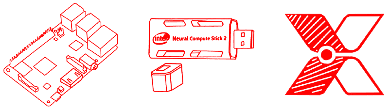

### 树莓皮上的简单目标检测

我在 Pi 相机上实现了三种不同的检测工具。虽然这三者都能发挥作用是一个现代奇迹，但由于#perfmatters，创作者知道“有多好”是很重要的。

我们的三个竞争者如下:

1.  [**香草树莓 Pi 3 B+**](https://www.raspberrypi.org/blog/raspberry-pi-3-model-bplus-sale-now-35/) —没有优化，只是在设备上使用了一个 TensorFlow 框架进行简单的识别。
2.  [**英特尔的神经计算棒 2**](https://software.intel.com/en-us/neural-compute-stick) —英特尔最新的用于神经网络的 USB 接口设备，号称性能是第一棒的 8 倍！大约 80 美元。
3.  [**Xnor.ai**](https://www.xnor.ai) —一个专有的框架，可以重新配置您的模型，以便在更小的硬件上高效运行。Xnor 的二进制逻辑将 32 位浮点运算收缩为 1 位运算，允许您优化简单设备的深度学习模型。

让我们用相机上的简单对象检测来评估这三者！

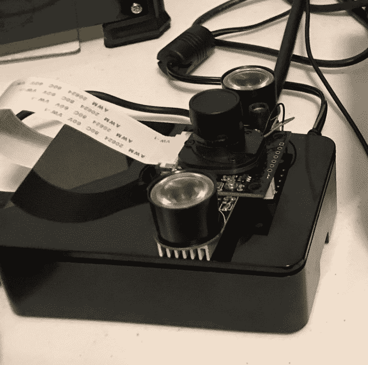

### 香草树莓 Pi 3 B+

一个树莓派就像一个 40 美元的小巧的 Linux 机器。它允许您在 IoT 等设备上轻松运行高级应用和代码。虽然听起来我基本上可以在设备上使用笔记本电脑学习，但有一个很大的问题。RPi 有一个 [ARM 处理器](https://whatis.techtarget.com/definition/ARM-processor)，这意味着我们需要重新编译我们的框架，即 TensorFlow，才能让一切运行起来。

> ⚠️虽然这不难，但这很慢。预计这将需要非常…非常…长的时间。这几乎是在树莓 Pi 上编译的任何东西的命运。

#### 设置

以下是我做的所有步骤，包括设置 Pi 相机进行物体检测。我只是为了子孙后代把这个包括进来。随意略过不看。

安装 pi，然后相机，然后编辑`/boot/config.txt`
添加`disable_camera_led=1`到文件的底部并重新启动。

### 最好禁用屏幕保护模式，因为一些后续命令可能需要几个小时

```
sudo apt-get install xscreensaver
xscreensaver 
```

然后在“显示模式”标签中禁用屏幕保护程序。

### 现在安装 Tensorflow

```
sudo apt-get update
sudo apt-get dist-upgrade
sudo apt-get update
sudo apt-get install libatlas-base-dev
sudo apt-get install libjasper-dev libqtgui4 python3-pyqt5
pip3 install tensorflow
sudo apt-get install libjpeg-dev zlib1g-dev libxml2-dev libxslt1-dev
pip3 install pillow jupyter matplotlib cython
pip3 install lxml # this one takes a long time
pip3 install python-tk 
```

### OpenCV

```
sudo apt-get install libtiff5-dev libjasper-dev libpng12-dev
Sudo apt-get install libavcodec-dev libavformat-dev libswscale-dev libv4l-dev
sudo apt-get install libxvidcore-dev libx264-dev
sudo apt-get install qt4-dev-tools
pip3 install opencv-python 
```

### 安装 Protobuff

```
sudo apt-get install autoconf automake libtool curl 
```

然后拉下 protobuff，解塔。
[https://github.com/protocolbuffers/protobuf/releases](https://github.com/protocolbuffers/protobuf/releases)

然后输入 cd，然后运行以下命令，这可能会导致计算机在接下来的 2 个多小时内不可用。使用 ctrl + alt + F1，仅移动到终端并释放所有 UI RAM。如果需要，用 control + c 关闭 x 进程。然后，您可以运行长期运行的命令。基本用户名“pi”和密码“raspberry”

```
make && make check 
```

然后，您可以简单地安装

```
sudo make install
cd python
export LD_LIBRARY_PATH=../src/.libs
python3 setup.py build --cpp_implementation
python3 setup.py test --cpp_implementation
sudo python3 setup.py install --cpp_implementation
export PROTOCOL_BUFFERS_PYTHON_IMPLEMENTATION=cpp
export PROTOCOL_BUFFERS_PYTHON_IMPLEMENTATION_VERSION=3
sudo ldconfig 
```

一旦完成，你可以用 sudo apt-get autoremove 清理一些安装垃圾，删除 tar.gz 下载，然后最后用 sudo reboot now 重启，这将返回到一个窗口界面

### Setup Tensorflow

```
mkdir tensorflow1 && cd tesorflow1
git clone --recurse-submodules \ https://github.com/tensorflow/models.git
modify ~/.bashrc to contain new env var named PYTHONPATH as such
export PYTHONPATH=$PYTHONPATH:/home/pi/tensorflow1/models/research:/home/pi/tensorflow1/models/research/slim 
```

现在去动物园:[https://github . com/tensor flow/models/blob/master/research/object _ detection/g3doc/detection _ model _ zoo . MD](https://github.com/tensorflow/models/blob/master/research/object_detection/g3doc/detection_model_zoo.md)
我们坐 ssdlite_mobilenet，最快！Wget 文件，然后 tar -xzvf 的 tar.gz 结果，并删除存档一旦 untarred。在本地`tensorflow1`文件夹中的`object_detection`文件夹中执行此操作。现在 cd 到研究目录。然后运行:

```
protoc object_detection/protos/*.proto --python_out=. 
```

这将 proto 文件夹中的对象检测 protos 文件转换为 python

# 安装完成！！

特别感谢 [Edje Electronics](https://www.youtube.com/channel/UCLuS8eZl3_nKKq85gPS62lQ) 分享他们关于设置的智慧，这是我自己的设置和代码不可或缺的资源。

一旦 Tensorflow 开始运行，我就能够在 Mobilenet 上以每秒 1 到 3 帧的速度运行对象识别(使用提供的示例代码)。

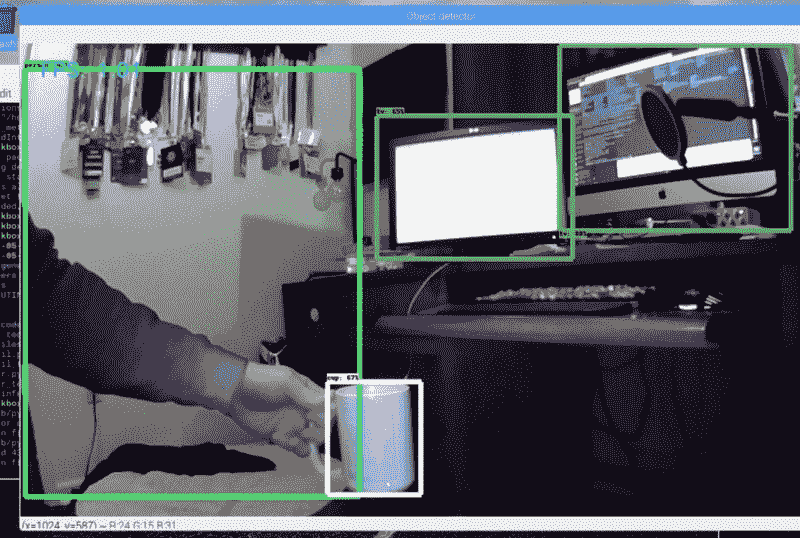

#### 普通 Pi 结果

对于基本的检测，每秒 1 到 3 帧就不错了。移除 GUI 或降低摄像机输入质量会加快检测速度。这意味着该工具对于简单的检测来说可能是一个优秀的检测器。多棒的底线啊！让我们看看能否用现有的工具做得更好。

### 英特尔的神经计算棒 2

这个概念让我兴奋。对于我们这些没有 GPU 的人来说，在边缘而不是云上进行训练，并将这种高强度的速度转移到 Raspberry Pi 上是令人兴奋的。我错过了原来的棍子，“Movidius”，但从这个图表中，看起来我选择了一个伟大的时间购买！

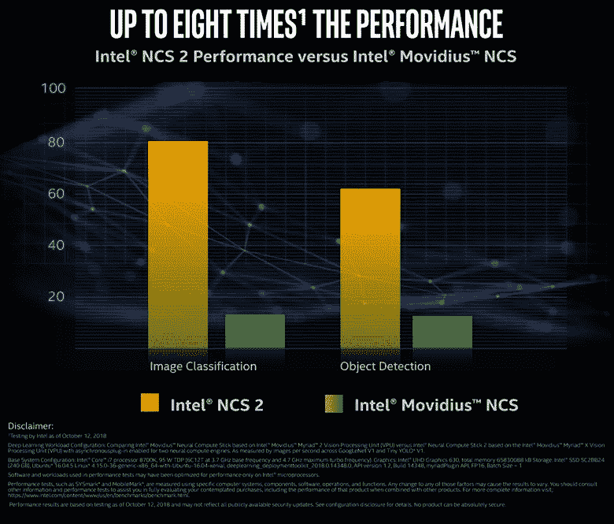

#### 设置

我的英特尔 NCS2 很快就到货了，我喜欢拆开实际硬件的包装来加速我的训练。那可能是我激动的最后一刻。

首先，USB 占用很多空间。你需要一根电缆让它远离底座。

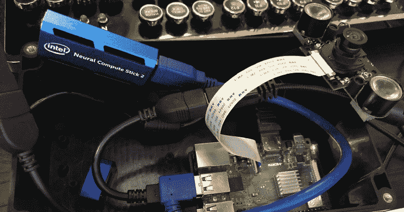

这有点烦人，但没关系。真正恼人的部分是试图让我的 NCS 2 工作。

有很多第三方为 NCS 提供的教程，按照这些教程，我觉得 u 盘可能坏了！

我在 NCS 上找到的东西都不管用(告诉我棒子没插上！)，我在 NCS2 上找到的一切都相当令人困惑。[有段时间，NCS2 连 ARM 处理器都不行！](https://ncsforum.movidius.com/discussion/comment/4202)

> ？？？？？？？？？？？？？？？？？

经过多次尝试，我终于找到并开始编译只理解 USB 摄像头(对不起 PiCam)的 C++例子(对不起 Python)。汇编这些例子是很痛苦的。通常整个 Raspberry Pi 会变得不可用，我不得不重启。

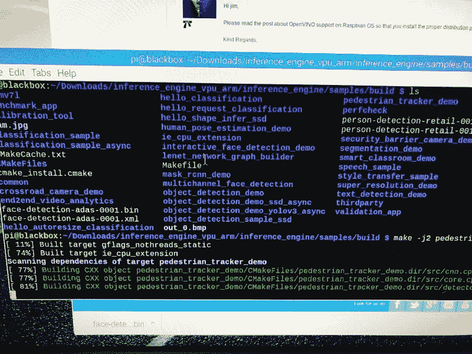

locked up at 81% for 24 hours

整个入职体验比在原始 Pi 上重新编译 Tensorflow 更痛苦。幸运的是，我得到了一切工作！

**结果！？？？？？？？？？？？？？？？？？？？？？？？**

#### **NC2 操纵杆结果**

每秒 6 到 8 帧…你是认真的吗！？经历了这一切？

**肯定是搞错了，让我来跑`perfcheck`项目。**

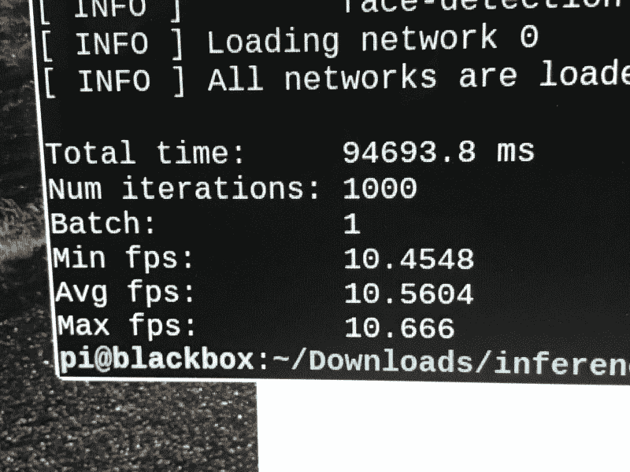

**每秒 10 帧…**

从 python 上的原始 NCS 的视频中，我看到大约 10fps..8 倍提升在哪里？为什么 80 美元的硬件要附在 40 美元的设备上？说我对英特尔的 NCS2 失望是一种轻描淡写。说得轻一点，用户体验和最终结果令人沮丧。

### **Xnor.ai**

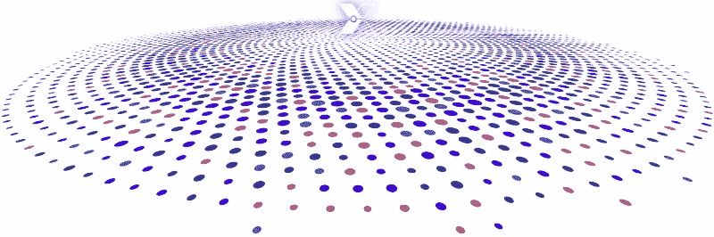

**Xnor.ai 是一个自包含的软件解决方案，用于将快速准确的深度学习模型部署到低成本设备上。许多离散逻辑爱好者可能已经注意到，Xnor 是按位 XOR 运算符的逻辑补码。如果这对你没有任何意义，那也没关系。只需知道，创建 YOLO 算法的人暗指使用逻辑运算符，通过利用这种廉价的运算和跟踪 CPU 堆栈，将复杂的 32 位计算压缩到 1 位。**

理论上，避免 GPU 所需的这种复杂计算应该会加快边缘设备上的执行速度。看看有没有效果！

#### **设置**

设置非常简单。我在 5 分钟内完成了一个对象检测演示。 ***5 分钟！***

Xnor.ai 的诀窍在于，就像 NCS2 Stick 一样，该模型针对底层硬件结构进行了修改和优化。与英特尔的随意设置不同，一切都被包装在友好的 Python(或 C)代码中。

**T2`model = xnornet.Model.load_built_in()`**

很好，也很简单。

但是如果表演不在那里，那就毫无意义。让我们加载他们的对象检测模型。

**同样，没有复杂性，他们有一个没有覆盖，一个有。因为其他的(除了 NCS2 上的 perfcheck)都有覆盖，我们就用它吧。**

#### **Xnor.ai 结果**

令人瞠目结舌的表演。我不仅得到了一个关于推理工作速度的统计数据，还得到了一个总体的 FPS，这个 FPS 把所有其他的东西都击垮了。

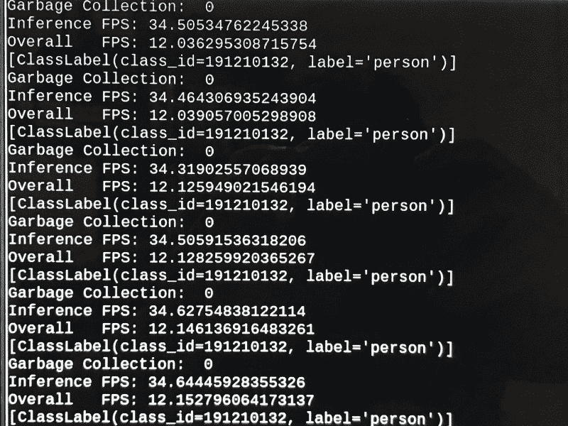

****超过 12FPS，推理速度超过 34FPS！？****

**这一惊人的吞吐量是在无需购买额外硬件的情况下实现的！？在这一点上，我认为 Xnor 是赢家，但这似乎有点太明显了。**

我能够加热我的设备，并在后台打开一个浏览器，使其降至 8+ FPS，但即使如此，这也是一个明显的赢家！

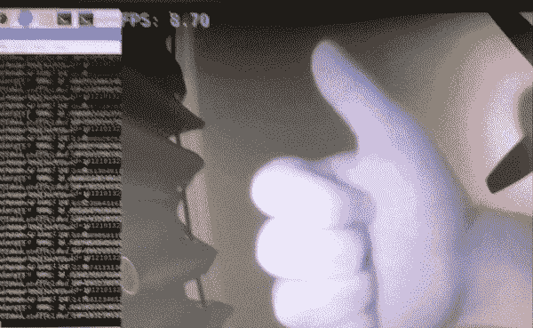

Xnor hype is real

在 Xnor.ai 上，我能给你的唯一负面消息是，我不知道它要花多少钱。评估模型对每个创业公司有 13，500 个推理的限制。

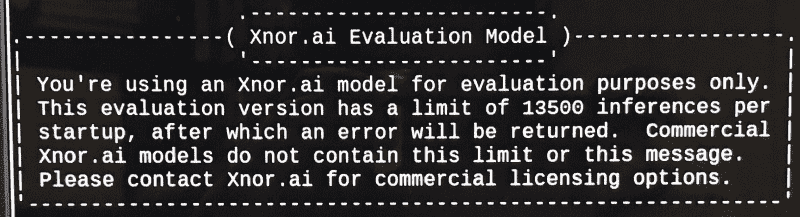

虽然他们通过电子邮件获得定价，但他们刚刚进入非商业用途，所以他们还没有创建一个定价系统。幸运的是，评估模型对大多数爱好者和原型来说都是不错的。

### **总之:**

如果你需要考虑各种型号，从头开始安装 Raspberry Pi 就可以了。这将使它成为测试新模型的绝佳资源，并真正定制您的体验。

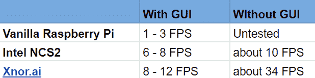

当你准备好发布时，NCS2 和 Xnor.ai 框架无疑都加快了速度。毫无疑问，Xnor.ai 在 onboarding 和性能方面都优于 NCS2。我不确定 Xnor.ai 的定价模型是什么，但这将是显然是一个优越框架的最终因素。

#### **发布发布更新:**

**这是一篇关于建立 NCS2 的精彩博文**

**[**英特尔神经计算棒 2 入门**](https://medium.com/@aallan/getting-started-with-the-intel-neural-compute-stick-2-and-the-raspberry-pi-6904ccfe963)**
**[*英特尔 Movidius 硬件入门*medium.com](https://medium.com/@aallan/getting-started-with-the-intel-neural-compute-stick-2-and-the-raspberry-pi-6904ccfe963)**

**另外，如果你想玩 Xnor.ai，链接是[www.xnor.ai/ai2go](http://www.xnor.ai/ai2go)**


**[甘特·拉博德](https://www.freecodecamp.org/news/perf-machine-learning-on-rasp-pi-51101d03dba2/undefined)是[无限红](http://infinite.red)公司的首席技术策略师，一位出版作家、兼职教授、全球公共演说家和正在接受培训的疯狂科学家。鼓掌/关注/ [发推特](https://twitter.com/GantLaborde)或者在会议上拜访他[。](http://gantlaborde.com/)**

期待更多精彩的 edge 博文即将发布！

#### 有时间吗？阅读更多由甘特

**[**避免噩梦—NSFW JS**](https://shift.infinite.red/avoid-nightmares-nsfw-js-ab7b176978b1)**
**[*客户端不雅内容检查为魂*shift . infinite . red](https://shift.infinite.red/avoid-nightmares-nsfw-js-ab7b176978b1)**