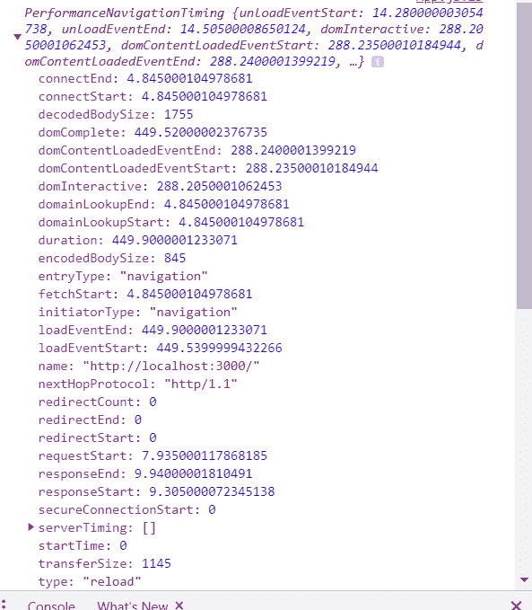
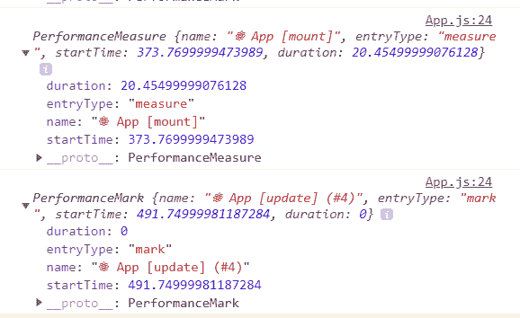
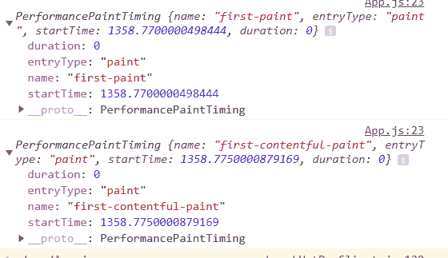
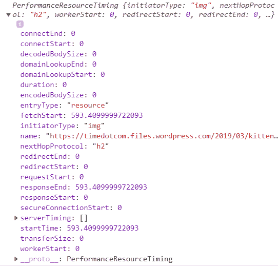
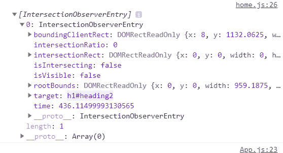

# 如何在 React with Google Analytics 中设置性能和用户跟踪

> 原文：<https://www.freecodecamp.org/news/performance-and-user-tracking-in-react-with-google-analytics/>

跟踪用户和应用程序的性能是现代 web 开发中非常重要的一部分。你可能已经看到一些公司通过简单地将应用程序的加载时间减少几百毫秒来增加收入的报道。

跟踪你的用户行为也很重要。这将允许你根据你的用户喜欢的与你的应用程序交互的方式来修改和构建你的应用程序，从而使用户更加满意，并为你的网站带来更多的流量。

以下是已完成的项目:

[https://github.com/iqbal125/react-hooks-google-analytics](https://github.com/iqbal125/react-hooks-google-analytics)

在本指南中，我将为您提供一个完整的跟踪性能和用户行为的基础指南。在本教程结束时，您将拥有构建复杂的用户和性能跟踪设置所需的一切。

> 在推特上关注我以后会有更多的教程:[https://twitter.com/iqbal125sf](https://twitter.com/iqbal125sf)

## 目录

1.  介绍
2.  谷歌分析
3.  跟踪页面视图
4.  跟踪负载性能
5.  跟踪渲染性能
6.  跟踪点
7.  跟踪卷轴
8.  跟踪事件
9.  快速性能提示和启发

## 介绍

我将向您展示 react 开发版本的性能指标，以保持本教程的简洁。但是在现实世界中，不要测试 dev 版本，因为它包含许多错误处理代码，并且缺乏优化，这会给你带来非常不准确的结果。

因此，最好在构建产品版本上进行测试，以建立一些基线度量。

此外，为了简洁起见，我将只把谷歌分析称为 GA。

GA 也不支持本地主机。为了得到一个你可能发送到 GA 的模拟，而不实际发送它和弄乱你的分析，你可以在你计划放置 GA 的任何地方替换一个 console.log。

`ReactGA`是全局函数，称为命令队列，因为它不立即执行命令，而是将命令添加到队列中，然后异步发送。这不会束缚主线程，也不会导致跟踪代码损害应用程序的性能。

当 GA 追踪器将数据发送到 Google Analytics 时，这是一个成功的例子。

在本教程中，我们将主要关注 React 代码，还有其他更好的教程来学习如何使用 GA。

向 GA 发送点击量时，我们将使用 3 个主要函数。你应该知道还有更多，但为了本教程的目的，我们将只关注这 3 个。

`GAReact.pageview()`:会传入一个包含路线的字符串。

`GAReact.timing()`:将一个对象作为参数。将包含与我们的绩效指标相关的信息，我们将在下面看到。这些字段将是`category`、`variable`、`value`和`label`。注意，只有值属性将来自我们的应用程序，其余的属性是用户定义的。

`GAReact.event()`:将一个对象作为参数。将包含有关应用程序中发生的事件(表单提交，按钮点击等)的数据。)将具有字段`category`、`action`、`label`和`value`。请注意，只有值将来自应用程序，其余的属性是用户定义的。

**综合测试 vs RUM**
您可能会想，如果您可以使用 Lighthouse 或网页速度测试这样的工具，只需输入 url 就可以获得这些指标，那么为什么要设置性能观察器指标呢？

像这样的工具很重要，但它们被称为综合测试，因为测试将在您的设备上进行，并且测试不会实际反映您的用户正在经历的事情。您可以在进行这些测试时限制 CPU 或网络，但它们仍然是模拟的。

将 GA 与性能观察者指标结合使用将为我们提供实际终端用户、设备和网络的真实数字。这被称为 RUM 或真实用户监控。

合成测试工具。只需输入您的应用程序的 URL 来运行合成测试。

*   [https://www.webpagetest.org/](https://www.webpagetest.org/)
*   [https://www.thinkwithgoogle.com/feature/testmysite](https://www.thinkwithgoogle.com/feature/testmysite)
*   [https://developers.google.com/speed/pagespeed/insights/](https://developers.google.com/speed/pagespeed/insights/)
*   [https://www.uptrends.com/tools/website-speed-test](https://www.uptrends.com/tools/website-speed-test)
*   [https://tools.pingdom.com/](https://tools.pingdom.com/)

## 谷歌分析

**设置**
如果你已经在你的应用程序上安装了谷歌分析，请随意跳过这一部分，这里没有什么新东西。

要设置 GA，请转到仪表板，然后单击侧面抽屉上的管理选项卡。然后单击添加属性。填写所需信息。

如果你正在读这篇教程，我会假设你足够聪明，只需要这三行指令就可以设置谷歌分析。如果没有，这里有一个由谷歌提供的便捷指南。

[https://support.google.com/analytics/answer/1042508?hl=en](https://support.google.com/analytics/answer/1042508?hl=en)

完成设置后，您将在顶部获得一个跟踪 id，我们将在 React 应用程序中使用该 id。

react 中的
**设置**
这里我们不必重新发明轮子，我们可以使用 Mozilla Foundation 制作的助手库来帮助我们进行 React 设置。

要安装这个库，只需运行

`npm install react-ga`

然后，只要在需要的地方导入 ReactGA 对象

```
import ReactGA from 'react-ga';
```

您还需要在根组件中使用来自 google analytics 的跟踪 id 对其进行初始化。

```
...
ReactGA.initialize('UA-00000-1');
...
```

**观察者**
`ReactGA`除了向谷歌分析网站发送数据外，不能做任何事情。为了实际获得要发送的性能指标，我们将使用 Performance Observer 浏览器 API。这个 Performance Observer API 与 GA 甚至 React 都没有关系，它是一个在大多数现代浏览器中都可用的浏览器 API

PerformanceObserver 和相关 API 到底是如何工作的是一个相当大的话题，远远超出了本教程的范围。更多信息和教程链接，请参见延伸阅读部分。

它们工作的基本思想是它们“观察”一些东西，然后在浏览器选择的时候异步发送数据。这使得主线程可以执行关键的应用功能和相关任务，因此跟踪事件不会影响应用性能。

在 observers 之前，您必须添加一个事件侦听器，并在每次发生事情时同步触发它，如果同时触发太多事件，这会导致明显的性能问题。所以这是观察家们想要解决的问题。

## 跟踪页面浏览量

在 react 这样的单页面应用中跟踪页面浏览量可能看起来很复杂，但由于 react 路由器和历史库，它相对简单。

```
history.listen((location) => {
    ReactGA.set({ page: location.pathname });
    ReactGA.pageview(location.pathname)
  }
);
```

`history.listen()`允许您在路线变更时触发回调，在我们的例子中，这恰好是 GA hit。该路由包含在`location`的`pathname`属性中。但是有几件事需要注意，例如:

**处理初始加载**
历史监听页面变化，但不会导致初始页面加载命中。

有几种方法可以处理初始负载。我发现了一个简单的方法，我认为它需要最少的代码和复杂性，它只是有一个初始加载变量，并将其保存到全局状态。在主页中，只需使用一个条件来检查它是否为假，然后在点击后将其设置为真。

父组件中的上下文变量

```
... 

const [initialLoad, setInitialLoad] = useState(false)

...
      <Context.Provider
            //Initial Load
            initialLoadProp: initialLoad,
            setInitialLoadProp: () => setInitialLoad(true),
       >
      </Context.Provider>
```

然后是 home 子组件中的`useEffect()`

```
...   
useEffect(() => {
    if(!context.initialLoadProp) {
      ReactGA.pageview(props.location.pathname);  
      context.setInitialLoadProp(true)
    }
  }, [])
... 
```

您可以在这里找到其他实现和讨论:

[https://github . com/React-ga/React-ga/wiki/React-Router-v4-with tracker](https://github.com/react-ga/react-ga/wiki/React-Router-v4-withTracker)

使用用户 id 跟踪页面
你可能想知道的另一件事是有多少用户访问了他们的个人资料页面。仅仅使用页面浏览量会给你一个唯一的网址，但这是行不通的。

假设您有以下带有用户 id 的 URL:

用户/4543456/消息
用户/4543456/账号
用户/3543564/消息
用户/3543564/回复消息
用户/3543564/账号

这些都会给你一个独特的页面点击。一个简单的解决方法是用一个条件检查，然后删除唯一的 id。你也可以使用条件来确保你不会把这些页面发送到谷歌分析。

```
...

 history.listen((location) => {
   if(location.pathname.includes('/user')) {
     let rootURL = location.pathname.split('/')[1]
     let userPage = location.pathname.split('/')[3]

     let pageHit = `/${rootURL}/${userPage}`
     ReactGA.pageview(pageHit)
   } else {
     ReactGA.set({ page: location.pathname });
     ReactGA.pageview(location.pathname)
   }
});

...
```

我们只是简单地解析出用户 id，然后在发送 hit 之前再次连接路由。

对于论坛帖子来说，这可能是不正确的，因为每个帖子有一个唯一的 URL 是正确的，因为你想知道有多少人访问了每个帖子。

## 跟踪负载性能

获得负载性能相对容易。所有负载性能数据都在`navigation`条目下，该条目是[导航定时 API](https://developer.mozilla.org/en-US/docs/Web/API/Navigation_timing_API) 的一部分。

可以在根父组件中这样设置性能观察器。

```
const callback = list => {
    list.getEntries().forEach(entry => {
      ReactGA.timing({
        category: "Load Performace",
        variable: "Some metric",  
	value: "Value of Metric"
      })
  })
}

var observer = new PerformanceObserver(callback);
observer.observe({entryTypes: ['navigation'] })
```

首先，我们为每个条目定义一个要调用的函数。然后我们将这个回调传递到我们的`PerformanceObserver`中，最后我们在我们的观察者上调用`.observe()`方法，并将`navigation`作为 entryType 传入。

这将为您提供以下条目:



这是非常大量的信息，但实际上我们只需要 3 个属性来跟踪主要负载性能:

`requestStart`:当浏览器向服务器发出获取网页的请求时

`responsesStart`:当网站的第一个字节到达时

`responseEnd`:当网站的最后一个字节到达时

在请求开始之前会发生一些事情，比如 DNS 查找和 TLS 握手。使用这些数据，看看是否可以将它与其他属性结合起来，形成新的指标。

利用以上三个属性，我们可以创建三个重要的指标。只需在`variable`和`value`属性中替换相应的指标。

```
const callback = list => {
    list.getEntries().forEach(entry => {
      ReactGA.timing({
        category: "Load Performace",
        variable: 'Server Latency',
        value: entry.responseStart - entry.requestStart 
      })
  })
}
```

服务器延迟:
`entry.responseStart - entry.requestStart`

下载时间:
`entry.responseEnd - entry.responseStart`

app 总加载时间:
`entry.responseEnd - entry.requestStart`

**互动时间**
这个指标本质上是用户能够与你的网站互动所需要的时间。

在通过浏览器 api 获得本地 TTI 指标之前，我们可以暂时使用这个方便的 polyfill npm 模块。这个模块是由谷歌创建的。

`npm install tti-polyfill`

然后我们可以像这样使用聚合填充物。

```
... 

import ttiPolyfill from 'tti-polyfill';

ttiPolyfill.getFirstConsistentlyInteractive().then((tti) => {
  ReactGA.timing({
    category: "Load Performace",
    variable: 'Time to Interactive',
    value: tti 
  })
});

...
```

我们只是在函数内部发送一个带有链式`.then()`语句的 hit，因为我们将异步检索这个指标。

## 跟踪渲染性能

现在我们可以讨论渲染性能，即 React 构建 DOM 节点树需要多长时间。我们可以使用`mark`和`measure`条目来跟踪渲染性能。

`mark`用于“标记”您想要跟踪的时间点。只需传入一个字符串作为您想要标记跟踪的那一行上的标记名称。

```
performance.mark("name of mark")
```

`measure`是两个标志的区别。只需设置度量的名称，并传入开始和结束标记，这将为您提供以毫秒为单位的标记之间的差异。

```
performance.measure.("name of mark", startingMark, EndingMark)
```

令人欣慰的是，React 预捆绑了这些标记和度量，这使我们不必打开 React 源代码，也不必自己编写它们。只需为条目类型传入`mark`和`measure`就可以了。

```
...

var observer = new PerformanceObserver(callback);
observer.observe({entryTypes: ['mark', 'measure'] })

...
```

这将给出根父组件和所有子组件渲染所需的时间，以毫秒为单位。您将看到类似这样的条目:



您还将获得执行生命周期方法所需的时间。这里有丰富的信息，只需选择您想要跟踪的内容，并通过检查条件语句中的名称将其发送给 GA。

```
...
const callback = list => {
    list.getEntries().forEach(entry => {
      if(entry.name.includes('App') ) {
        ReactGA.timing({
          category: "App Render Performace",
          variable: entry.name,
          value: entry.duration
        })
      }
  })
}
...
```

## 跟踪油漆性能

现在我们可以跟踪 paint，即在 DOM 树被渲染后，像素被绘制(或“绘制”)到屏幕上。

跟踪油漆性能包括 3 个指标:第一油漆，第一满意的油漆和第一有意义的油漆。

第一次绘画:第一次出现除了空白页面之外的任何东西。

**First Contentful Paint:** 当第一个 DOM 元素出现时。文本、图像等。

第一次绘画和第一次内容绘画将由 API 自动给出。只需执行以下操作:

```
...

const callback = list => {
    list.getEntries().forEach(entry => {
       ReactGA.timing({
          category: "Paint",
          variable: entry.name,
          value: entry.startTime
     })
  })
}

var observer = new PerformanceObserver(callback);
observer.observe({entryTypes: ['paint'] })
```

条目将如下所示



这两个指标完全有可能完全相同，精确到毫秒。即使它们不相同，它们之间也可能存在不相关的差异。因此，使用了另一种更灵活的指标，称为:

**第一次有意义的绘画**:当一些“有意义”的东西被画到屏幕上。“有意义的”故意保持模糊，允许开发人员自己决定他们想要测试什么。

根据谷歌的说法，第一次绘画和第一次内容丰富的绘画回答了“它正在发生吗”的问题，第一次有意义的绘画回答了“它有用吗”。“是否可用”由 Time to Interactive 回答。

使用第一个有意义的绘制的一个常见方法是测试英雄元素。这是页面上的主要元素。

youtube 的一个例子就是视频播放器。建议的视频和评论都是非英雄的次要元素。在这种情况下，跟踪视频播放器何时完成绘制将是第一个有意义的绘制。

主页上常见的英雄元素是标题附近的背景图片，它给出了网站的价值主张或主题。知道了这一点，我们可以使用资源计时 api 来测量我们的图像何时完成加载，并将其作为我们的第一个有意义的绘制度量。

如果你的 hero 元素是一个图像，那么你可以简单地查看资源计时 API，然后查看`responseEnd`属性，并使用它作为你的 FMP。

```
...
const callback = list => {
    list.getEntries().forEach(entry => {
        ReactGA.timing({
          category: "First Meaningful Paint",
          variable: entry.name,
          value: entry.responseEnd
        })
  })
}

var observer = new PerformanceObserver(callback);
observer.observe({entryTypes: ['resource'] })
...
```

整个资源定时响应。



由于加载的图像在技术上并不意味着它已经被绘制，你也可以尝试手动设置标记。

```
 //jsx 

{performance.mark('start') 

{performance.mark('end')
{performance.measure('diff', 'start', 'end') 
```

同样，这个指标有很大的灵活性，请认真考虑您的用例以及您要测量的内容。

## **轨道滚动**

跟踪用户的滚动位置是分析的一个相当重要的部分。例如，您可以看到有多少用户滚动过某个图像或文本部分。有了这些信息，你就可以调整你的内容，增加你的转化率。

您可能会看到旧的实现使用 **getBoundingClientRect()** ，但是这会占用主线程，因此跟踪滚动实际上会降低性能。您可以使用`IntersectionObserver`异步执行滚动事件。

`IntersectionObserver`与我们在上一节中使用的`PerformanceObserver`不同。

`IntersectionObserver`有两个参数，一个回调和一个选项对象。选项对象将有 3 个属性

`root`:您试图测试交集的元素。在大多数情况下，这将是视口，它将是`null`的值。

`rootMargin`:根元素周围的边距。例如:“10px”

`threshold`:在`isIntersecting`为真之前，元素有多少是可见的。例如:0.5 表示当 50%的元素可见时`isIntersecting`为真。0 表示元素的最顶端，1.0 表示整个元素。

该条目将返回一个对象，如下所示:



`isIntersecting`:主要用于判断元素是否可见，当达到阈值时为真。

现在是代码:

```
//Get the element you want to track with useRef
const intersectTarget = useRef(null)

//Use the observer inside the component you want to track scroll
  useEffect(() => {
    const opts = {
            root: null,
            rootMargin: '0px',
            threshold: 0
    }
    const callback = list => {
      list.forEach(entry => {
        if(entry.isIntersecting) {
            ReactGA.event({
              category: 'Scroll',
              action: 'Scrolled to heading 2',
              value: entry.intersectionRatio
            })
          }
       })
    }
    const observerScroll = new IntersectionObserver(callback, opts)

    observerScroll.observe(intersectTarget.current)
  }, [])

//jsx
  <h1 ref={intersectTarget}
      id="heading2"
		>
     Second Heading
  </h1>
```

这里的主要思想是首先初始化`useRef`钩子。然后，在要跟踪的元素上使用 ref 进行滚动。回调和观察者将在`useEffect`钩子中被调用，元素可以用 ref 的名称和`.current`属性传递给`.observe()`方法。

**注意**:即使元素不可见，交叉点观察器也会在初始页面加载时触发。这是正常的，您会看到`isIntersecting`属性为假。

**还要注意:**在撰写本文时，条目上还有一个`isVisible`属性，但是它并不像其名称所暗示的那样起作用。即使元素可见，它也保持 false。它没有在任何地方被记录，所以我不能评论它的用途，但是我建议使用`isIntersecting`属性。

## 径赛

跟踪事件的基本思想是在附加到事件处理程序的函数调用内部发送 GA 点击。除此之外真的没什么了。

需要注意的一点是，如果您的用户正在提交一个表单，您可以在您的事件点击中指定`transport: beacon`属性，这将让您可靠地发送点击，即使页面被重新加载到另一个页面。在像 React 这样的单页应用中，这并不是什么大问题，但是如果你真的想这么做，只要知道这个选项是可用的就行了。

更多信息见[导航信标](https://developer.mozilla.org/en-US/docs/Web/API/Navigator/sendBeacon)

我将向你展示如何跟踪一个表单提交，但是这个模式基本上适用于任何事件。同样，您只是在附加到事件处理程序的函数中发送点击。

```
 ...
  const handleSubmit = (event) => {
    event.preventDefault();
    ReactGA.event({
     category: 'Form',
     action: 'Form Submit',
     transport: 'beacon'
   });
    apiCall('/apicall', event.target.value)
  };

  ...

  <form onSubmit={handleSubmit}>
  ...
  </form>

  ...
```

**快速表现技巧和启发式**

我认为对许多开发人员来说，最大的改进是从头开始编码，而不是使用库。树抖动减少了一点膨胀，但是与自己编码相比仍然有相当大的膨胀。这将允许您只编写您需要的代码。尽量少用库。不要为了几个函数而使用一个库，试着只看这个库的源代码，试着自己实现那些函数。还要记住，大多数库必须优先考虑易用性和个性化，而不是性能。

其他一些:

*   对于像滚动这样的事件触发，你肯定需要去抖动/节流。对于观察者来说，你不需要这样做。
*   只导入你需要的函数和变量，让树抖动丢弃不用的代码。
*   不要将匿名函数传递给事件。
*   将您的 React 应用程序转变为 PWA，允许用户在他们的设备上本地下载和安装您的 web 应用程序。
*   通过代码分割和延迟加载减少负载。
*   通过使用 gzip 或类似的压缩来减小文件大小
*   提供来自 CDN 的图像
*   通过服务器响应上的 http 头启用缓存。
*   优化图像。关于如何做的完整指南，请参见谷歌基础指南。
*   使用新的 CSS Flexbox 进行布局。避免[布局抖动](https://developers.google.com/web/fundamentals/performance/rendering/avoid-large-complex-layouts-and-layout-thrashing)
*   仅对 css 更改使用变换和不透明度。所以不用改变高度和宽度，而是使用 X 和 scaleY

幸运的是，当您在 React 项目上运行 npm build 命令时，很多这样的优化，比如 minification 和 gzip，都是自动完成的。

## 
结论

感谢阅读！如果你发现了任何其他创造性的衡量标准或聪明的方法来跟踪用户，请在评论中告诉我。

> 在推特上关注我以后会有更多的教程:[https://twitter.com/iqbal125sf](https://twitter.com/iqbal125sf)

**博文:**
[https://www . search engine journal . com/a-technical-SEO-guide-to-light house-performance-metrics/292703/# close](https://www.searchenginejournal.com/a-technical-seo-guide-to-lighthouse-performance-metrics/292703/#close)

[https://ocquisite . org/2017/10/can-you-affordable-it-real-world-web-performance-budgets/](https://infrequently.org/2017/10/can-you-afford-it-real-world-web-performance-budgets/)

[https://speedcurve.com/blog/user-timing-and-custom-metrics/](https://speedcurve.com/blog/user-timing-and-custom-metrics/)

[https://designsystem.digital.gov/performance/](https://designsystem.digital.gov/performance/)

[https://hacker noon . com/react-performance-primer-64fe 623 c 4821](https://hackernoon.com/react-performance-primer-64fe623c4821)

[https://reactjs.org/docs/optimizing-performance.html](https://reactjs.org/docs/optimizing-performance.html)

**观察者:**
[https://css-tricks.com/paint-timing-api/](https://css-tricks.com/paint-timing-api/)

[https://css-tricks.com/breaking-performance-api/](https://css-tricks.com/breaking-performance-api/)

[https://hacker noon . com/tracking-element-visibility-with-react-and-the-intersection-observer-API-7 DFA F3 a 47218](https://hackernoon.com/tracking-element-visibility-with-react-and-the-intersection-observer-api-7dfaf3a47218)

[https://www . smashingmagazine . com/2018/01/deferring-lazy-loading-intersection-observer-API/](https://www.smashingmagazine.com/2018/01/deferring-lazy-loading-intersection-observer-api/)

[https://www . site pen . com/blog/improving-performance-with-the-paint-timing-API/](https://www.sitepen.com/blog/improving-performance-with-the-paint-timing-api/)

**基于谷歌:**
[https://developers . Google . com/web/fundamentals/performance/user-centric-performance-metrics](https://developers.google.com/web/fundamentals/performance/user-centric-performance-metrics)

[https://developers . Google . com/web/fundamentals/performance/navigation-and-resource-timing/](https://developers.google.com/web/fundamentals/performance/navigation-and-resource-timing/)

[https://developers . Google . com/web/tools/chrome-dev tools/speed/get-started](https://developers.google.com/web/tools/chrome-devtools/speed/get-started)

[https://marketingplatform.google.com/about/optimize/](https://marketingplatform.google.com/about/optimize/)

[https://developers . Google . com/analytics/dev guides/collection/analytics js/user-timings](https://developers.google.com/analytics/devguides/collection/analyticsjs/user-timings)

[https://support.google.com/analytics/answer/1033068#Anatomy](https://support.google.com/analytics/answer/1033068#Anatomy)

[https://developers . Google . com/analytics/dev guides/collection/analytic sjs/single-page-applications](https://developers.google.com/analytics/devguides/collection/analyticsjs/single-page-applications)

[https://support.google.com/analytics/answer/1033068](https://support.google.com/analytics/answer/1033068)

[https://docs . Google . com/document/d/1 ggii 9-7 key 3 tpqs 3 yt 271 upu vimo-xil5mwwordud 4c/preview #](https://docs.google.com/document/d/1GGiI9-7KeY3TPqS3YT271upUVimo-XiL5mwWorDUD4c/preview#)

[https://www . doubleclickbygoogle . com/articles/mobile-speed-matters/](https://www.doubleclickbygoogle.com/articles/mobile-speed-matters/)