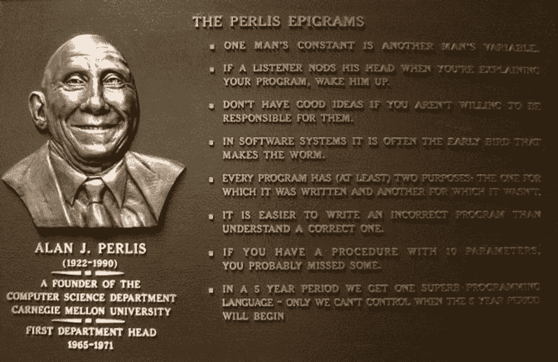

# 佩尔利斯论编码快乐(+ 10 首史诗警句)

> 原文：<https://www.freecodecamp.org/news/perlis-on-tech-evangelism-10-epigrams-5ea6dcf3faf5/>

作者丹·麦克亨利

# 佩尔利斯论编码快乐(+ 10 首史诗警句)

Credit: Yan Bin Jia ([http://web.cs.iastate.edu/~jia/album/2007/album-cmu.html](http://web.cs.iastate.edu/~jia/album/2007/album-cmu.html))

艾伦·J·佩利是图灵奖的第一个获得者。今天，他最令人难忘的可能是他关于编程 的 [*警句，三十多年过去了，这些警句依然精彩且有指导意义。*](http://www.cs.yale.edu/homes/perlis-alan/quotes.html)

我最喜欢的一句话不是来自于*警句*,是关于继续投身于学习、实践以及最重要的——享受计算机编程的实际工作中。

> 我希望计算机科学领域永远不会失去它的乐趣。最重要的是，我希望我们不要成为传教士。不要觉得自己是圣经推销员。这个世界已经有太多这样的人了。你所知道的关于计算的知识其他人也会学到。不要觉得成功计算的钥匙只在你手中。我认为，也希望，你手中的是智慧:比你第一次面对机器时更能看到机器的能力，你能让它变得更好。

—艾伦·杰伊·珀利斯

以下是他的一些警句，可以吊起你的胃口:

> 7.写一个不正确的程序比理解一个正确的程序更容易。

> 12.递归是计算的根源，因为它用描述换取时间。

> 26.在我们的程序中，总会有一些我们想说的东西，用所有已知的语言都只能说得很糟糕。

> 32.衡量程序员的标准不是他们的独创性和逻辑性，而是他们案例分析的完整性。

> 54.小心图灵陷阱，在这个陷阱中，一切皆有可能，但没有一件有趣的事是容易的。

> 58.傻瓜忽视复杂性。实用主义者深受其害。有些可以避免。天才移除它。

> 61.在编程中，就像在其他任何事情中一样，犯错意味着重生。

> 93.当有人说“我想要一种编程语言，在这种语言中我只需要说我希望做的事情”，给他一根棒棒糖。

> 95.如果你不愿意为好主意负责，就不要有好主意。

> 101.应对失败很容易:努力改进。成功也很容易处理:你解决了错误的问题。努力提高。

如果你碰巧使用 WordPress 并且想在你的仪表盘上阅读更多的 Perlis，看看我的插件 [*Hello Perlis*](https://github.com/denmch/hello-perlis) ，改编自马特·莫楞威格的 *Hello Dolly* 插件。