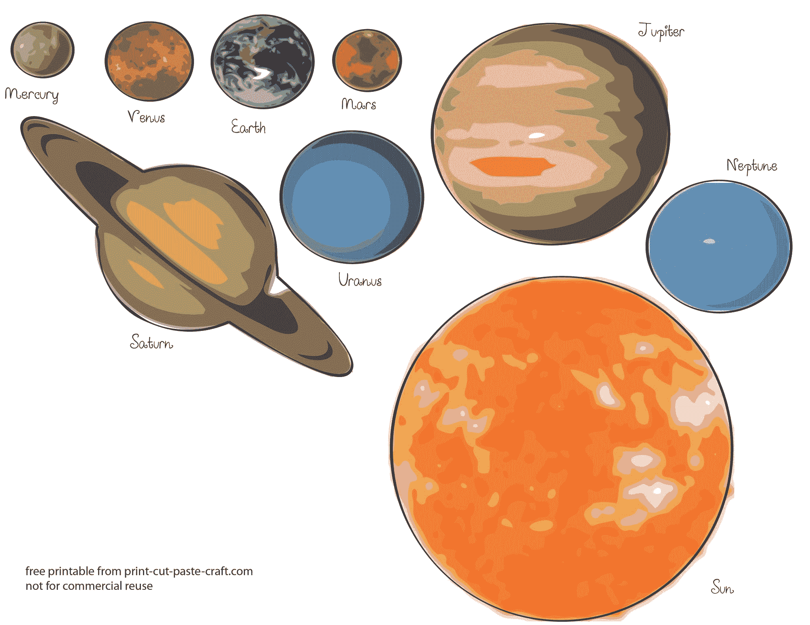
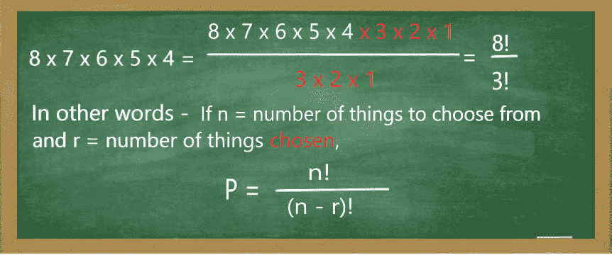
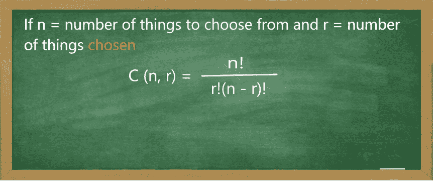
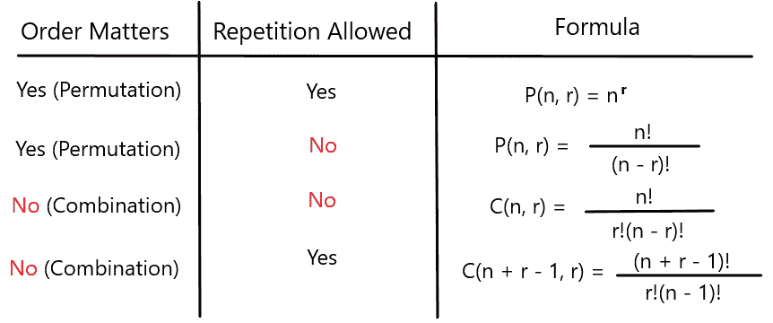

# 排列组合:用公式举例说明区别

> 原文：<https://www.freecodecamp.org/news/permutation-and-combination-the-difference-explained-with-formula-examples/>

排列和组合在很多应用中都非常有用——从计算机编程到概率论到遗传学。

我将向您并排介绍这两个概念，这样您就可以看到它们有多有用。

这两个概念之间的关键区别在于顺序。有了**排列**，您可以关注**列表**元素，它们的顺序很重要。

比如我出生于 **1977 年**。那就是号码 **1** 后面跟着号码 **9** ，后面跟着号码 **7** ，再后面跟着号码 **7** 。按照特定的顺序。

如果我将订单改为 **7917** ，那将是完全不同的一年。因此，订单**关系到**。

另一方面，对于**组合**，焦点是元素的**组**，其中顺序**不重要**。

像我这杯咖啡就是由**咖啡**、**糖**和**水**组合而成。我加入这些原料的顺序并不重要。也可能有**水**、**糖**和**咖啡**，还是那杯咖啡。因此，顺序**与**无关。

现在让我们仔细看看这些概念。

## 第 1 部分:排列

### 允许重复的排列

想象你有一部新手机。当你开始使用这款新手机时，你会被要求设置密码。

Image of a smartphone screen

密码必须由 4 位数字组成。任何 4 位数。并且它们可以被重复。

总共有 **10 个**数字开始。那些是:0，1，2，3，4，5，6，7，8，9。所以对于你密码的第一个数字，你有 **10** 个选择。

由于您可能会再次使用相同的数字，我们的密码第二位数字的选择数量将再次为 **10** ！因此，选择目前为止的两个密码数字，排列是 **10 乘以 10、**或**10×10 = 100**或**10²。**

同样的想法也适用于密码的第三个数字。你可以再次从同样的 10 个选项中选择。这次你会有 **10 乘以 10 乘以 10** ，或者**10×10×10 = 1000**或者 **10 ³** 的排列组合。

最后，对于密码的第四位数字和同样可供选择的 10 位数字，我们最终得到了 **10 乘以 10 乘以 10 乘以 10** ，或者**10×10×10×10 = 10000**或者**10⁴的排列。**

您可能已经注意到，您有 4 个选择，您将 10 个**乘以 4 个**(10 x 10 x 10 x 10)得出排列总数(10，000)。如果你必须选择 **3** 个数字作为你的密码，你会将 10 **乘以 3**。如果 **7** ，你会做**7**次，以此类推。

但是生活不仅仅是有数字可供选择的密码。如果你举办生日聚会，需要从 **20** 种不同颜色的气球中挑选 **5** 种颜色的气球，该怎么办？

image of colored balloons

因为你有 20 种不同的颜色可供选择，并且可以再次选择相同的颜色，所以每个气球都有 20 种选择。第一个气球是 **20** ，第二个气球是 **20 乘以 20** ，或者 **20 x 20 = 400** 等等。对于第五个气球，你得到 **20 x 20 x 20 x 20 x 20 = 3，200，000** 或 **20 ⁵** 个排列。

让我们总结一下一般规则:当顺序很重要并且允许重复时，如果 **n** 是可供选择的东西的数量(气球、数字等)，你选择其中的**r**(5 个气球代表聚会，4 个数字代表密码，等等。)，排列的数目将等于**P = n^r。**

### 不允许重复的排列

接下来，我们来考虑**不允许**重复的情况。作为一个例子，我们将看看我们太阳系的行星。

image of solar system planets

这些 **8** 行星可以有多少种不同的排列方式？这些行星是:**水星**，**金星**，**地球**，**火星**，**木星**，**土星**，**天王星**和**海王星**。选了之后，比如说水星你就不能再选了。因此，每次选择行星时，你必须减少可选择的数量。

第一个选择将有 **8** 种可能性。第二个选择将有 **8 减 1 等于 7** 的可能性，然后是 **6** ，接着是 **5** ，接着是 **4、**，直到我们在列表中剩下 **1** 颗行星。

按照前面场景的逻辑，排列总数为: **P = 8 x 7 x 6 x 5 x 4 x 3 x 2 x 1 = 40，320** 。

换句话说，这是整数 8 和它下面所有正整数的乘积。这个乘积叫做**阶乘**，用一个感叹号表示，像这样: **8！**

排列数等于 **P = 8！**或者更一般的 **P = n！**

如果你只需要在这些 **8** 颗行星中安排 **5** 颗，而不是所有的行星，那会怎么样？那么在我们的方法中，你只需采取前 5 个步骤中的**。也就是说，**P = 8×7×6×5×4 = 6720**将会是你可以从 **8** 中排列出 **5** 颗行星的多少种方式。**

但是为什么要在这里停下来呢？为什么不应用我们的逻辑想出一个更通用的公式呢？为了使上面的符号易于记忆任何数量的对象，我们将使用一个技巧。在一个分数中，分子和分母都乘以同一个数(零除外)，不会影响该分数。因此:

P(n, r) = n! / (n - r)!

从**颗行星中选择 n = 8** ，你选择其中的 **r = 5** 。将这些数字代入上述公式，我们得到 **P = 8！/ (8 - 5)!= 8!/ 3!**。同**8 x 7 x 6 x 5 x 4 = 6720**。

从这里，可以推导出前面例子的结果。在那里，你安排了 **8** 个可用行星中的所有 **8** 。使用新的公式， **P = 8！/ (8 - 8)!= 8!/ 0!**。既然，**零**的阶乘约定为**等于 1** ， **P = 8！/ 1 = 8!。**或者更一般地说:

**P = n！/ (n - n)！= n！/ 0!= n！**。

经常使用的一个简单方便的符号是: **P(n，r) = n！/ (n - r)！**

记住公式很重要。但是对于解决现实生活中的问题来说，更重要的是知道在每种情况下使用哪些公式。练习有帮助。

突击测验:

### 锦标赛开始了，有六个队在比赛。第一名获得金牌，第二名获得银牌。有多少种不同的方式可以给这些队伍颁发奖牌？

选择 1 个答案

* * *

* * *

* * *

* * *

* * *

说明:你有 **6** 支队伍可以选择。因此 **n = 6** 。金银一起给你 **2** 枚奖牌奖励。于是 **r = 2** 。将这些数字代入你的公式，我们得到 **P(6，2) = 6！/ (6 - 2)!= 6!/ 4!= 6 x 5 = 30** 。

## 第二部分。组合

### 没有重复的组合

为了使比较更加生动，让我们再来看一下我们的行星选择例子。如果你想知道选择了哪些行星，而不是它们出现的顺序呢？

8 颗行星中有 5 颗有 6720 种不同的排列方式。但是由于现在出场顺序并不重要，很多出场方式都是多余的。他们对我们来说是一样的。

金星、地球、火星、木星、土星的**组**与火星、木星、金星、地球、土星的**组**和土星、火星、地球、木星、金星的**组**相同。这只是相同的 5 颗行星的不同序列。

你有多少组是相同的？如果你每组选择 **r** 颗行星，你得到 **r！**群体。对于 **r = 5** ，你得到 **r！= 5!= 120 个**组。

因此，为了消除不必要的相同组，您将原始的**6720**排列数除以 **5！**。结果是 6720/120 =**56**。

概括地说，为了得出**个组合**的数量，你需要算出所有的**排列**并除以所有的**冗余**。

使用简短方便的记法: **C(n，r) = P(n，r) / r！= n！/ (r！(n - r)！)**

C(n, r) = n! / (r!(n - r)!)

这是假设顺序**不**重要，并且**没有**重复(也就是说，只有一个木星可供选择)。

让我们重新看看锦标赛的例子:

### 锦标赛开始了，有六个队在比赛。第一名获得金牌，第二名获得银牌。奖牌获得者可能有多少组？队伍的顺序并不重要

选择 1 个答案

* * *

* * *

* * *

* * *

* * *

和以前一样，你有 6 个团队。由此， **n = 6** 。颁发的奖牌有两块，所以 **r = 2** 。然而，这一次**谁赢金牌谁赢银牌并不重要。金队和银队与银队和金队是一样的。将这些数字代入你的公式，我们得到 **C(6，2) = 6！/ (2!(6 - 2)!) = 6!/ 2!4!= 15** 。**

### 重复组合

为了完成这篇文章，有一个案例需要特别注意。到目前为止，在我们的组合中，我们假设没有重复。没有两件东西是一样的。

如果我们**可以**有重复呢？如果像前面的例子一样，我们可以选择不止一个相同颜色的气球呢？如果可供选择的气球数量是 **n** ，我们选择其中的 **r** ，而**允许**有相同的颜色，并且**不考虑**的排列顺序，我们将得到 **(n + r - 1)！/ (r！(n - 1)！)组合**。

总结一下，这里有一个表格，你可以用它来引用这些概念和它们的公式。

Table of formulas for Permutations and Combinations

希望这篇文章已经帮助你更好地理解了这两个重要的数学概念。感谢阅读。