# 排列 vs 组合:排列公式和组合公式有什么区别？

> 原文：<https://www.freecodecamp.org/news/permutation-vs-combination-what-is-the-difference-between-the-permutation-formula-and-the-combination-formula/>

下面是简短的版本。

让我们以教堂敲钟为例。

排列是钟的顺序。你在想给他们打电话的最佳顺序。

一个组合是铃铛的选择。你在选择要敲响的钟声。如果你有太多的铃铛，你会先选择它们，然后再考虑订购它们。

这就产生了熟悉的身份:`(n P r) = (n C r) * r!`

从`n`中订购`r`物品的方法是先从`n`中选择`r`物品，然后再订购`r`物品(`r!`)

这意味着`(n P r) = n! / (n-r)!`和`(n C r) = n! / ( (n-r)! * r! )`

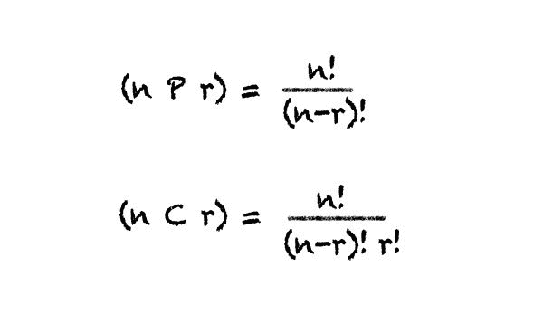

但是你想知道如何永远记住这些吗？

我是[第一原理思维](https://neilkakkar.com/A-framework-for-First-Principles-Thinking.html)的忠实粉丝。要理解一个问题，就要抓住它的核心，并从那里进行推理。

不这样做通常是混乱的来源:如果我不理解事物是如何工作的，我不知道把概念挂在哪里。我的思维框架并不完整，所以我决定记住它。

你可以想象，这并不理想。因此，我时不时地让自己沉浸在从源头推导事物的练习中，并为事物如何运作建立直觉。

这一次，我们正在为排列和组合建立直觉。

例如，你知道为什么一个组合的公式是(n C r)吗？这是哪里来的？为什么这里使用阶乘？

让我们从源头开始。阶乘、排列和组合是数学家们一起游戏的产物，就像史蒂夫·乔布斯和史蒂夫·沃兹尼亚克在他们的车库里一起游戏时发现了苹果。

就像苹果如何成为一家成熟的盈利公司一样，简单的阶乘`!`成为了整个数学领域的原子:[组合学](https://en.wikipedia.org/wiki/Combinatorics)。

忘掉一切，让我们从底层开始思考。

第一个已知的有趣用例来自 17 世纪的教堂。

你想知道教堂的钟声是如何敲响的吗？有一台机器把它们按顺序“圈”起来。我们改用机器，因为钟太大了。此外，还有成吨的钟。

人们是如何计算出最佳的圈住顺序的呢？如果他们想改变现状呢？他们如何找到最好的声音？每个钟楼有多达 16 个钟！

你不能改变你打铃的速度——机器每秒只打铃一次。你唯一能做的就是[改变](https://en.wikipedia.org/wiki/Change_ringing)钟声的顺序。所以，这个挑战是关于找出最佳顺序。

我们能在路上找到所有可能的订单吗？我们想知道所有可能的订单，以确定是否值得尝试所有订单。

敲钟人费边·斯特德曼接受了这个挑战。

他从两个铃开始。他敲响这些钟的不同顺序是什么？[1]

1 和 2。
或
2 和 1。

这是有道理的。没有别的办法。

三个铃铛怎么样？

1、2 和 3。
1、3、2。

然后从第二声铃响开始，

2、1 和 3。2、3 和 1。

然后从第三声铃响开始，

3、1 和 2。
3、2、1。

总计，6。

然后他意识到这和两个铃铛非常相似！

如果他固定了第一个铃铛，那么剩下的两个铃铛的排序方式是*总是*两个。

他有多少种方法可以修好第一口钟？三个铃铛中的任何一个都可能是你要的！

好吧，他接着说。然后他按了 5 下铃。

这时，他意识到用手做事情是笨拙的。你一天只有这么多时间，你必须敲钟，你不能被困在画出所有可能的钟。有没有办法快速解决这个问题？


他回到了他的洞察力。

如果他有 5 个铃，他修好了第一个铃，他所要做的就是想出如何订购 4 个铃。

为了 4 个铃铛？好吧，如果他有 4 个铃，他修好了第一个铃，他所要做的就是弄清楚如何订购 3 个铃。

他知道怎么做！

所以，订购 5 个铃铛= 5 *订购 4 个铃铛。

订购 4 个铃= 4 *订购 3 个铃

订购 3 个铃= 3 *订购 2 个铃。

..你看到模式了，不是吗？

> 有趣的事实:这是一种叫做[递归](https://en.wikipedia.org/wiki/Recursion)的编程技术的关键。

他也是。虽然，他花了更长的时间，因为他附近没有人已经发现了这一点。[2]

于是，他想出了 5 个铃铛的顺序。

这个排序公式在 1808 年被称为阶乘。

我们认为阶乘记法是基础，但是这个想法在它有名字之前很久就存在了。只是当法国数学家克里斯蒂安·克兰普注意到它在少数地方被使用时，他才把它命名为阶乘。

钟的这种排列叫做排列。

> 排列是对项目的排序。

当学习一些东西时，我认为它有助于从每个不同的角度看待事物，巩固理解。

如果我们尝试直接推导上面的公式，而不尝试将问题简化为更少的铃数，会怎么样？

我们有 5 个空格，对吧？

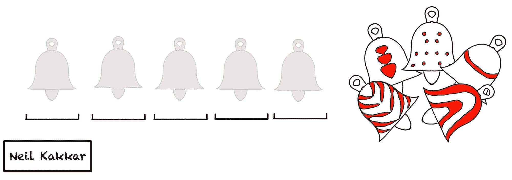

有多少种方法可以选择第一个铃声？因为那是我们的钟的数量。

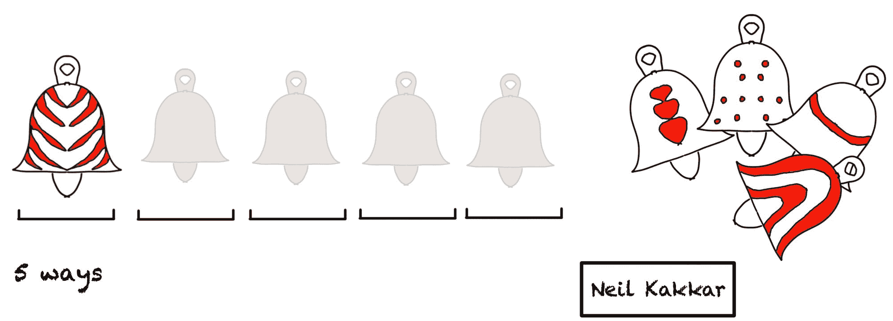

第二声钟声？当我们把它放在第一个位置的时候，我们用掉了一个铃，所以我们还剩 4 个铃。

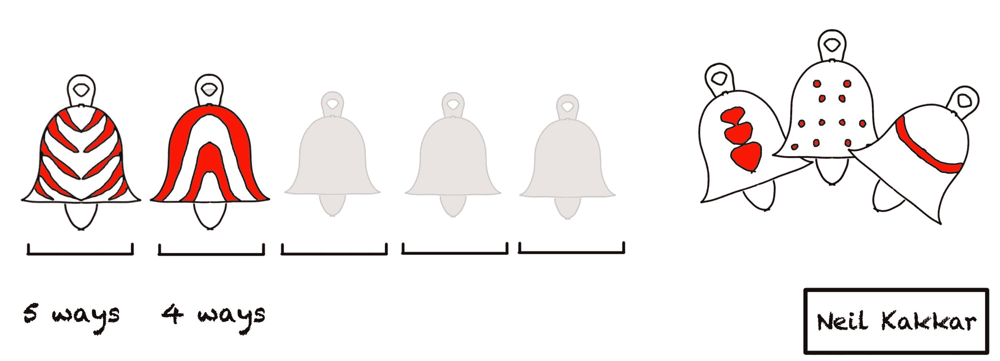

第三声钟声？嗯，我们已经选择了前两个，所以只剩下 3 个铃铛可供选择。

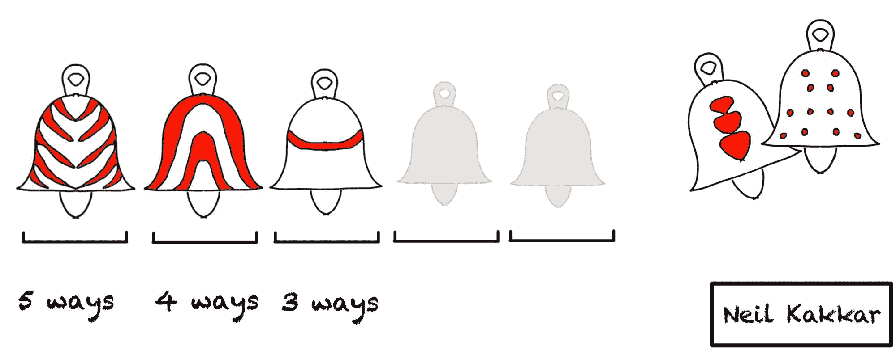

第四声钟声？只剩两个铃铛了，所以有两个选择。
第五声钟声？只剩一个了，所以只有一个选择。

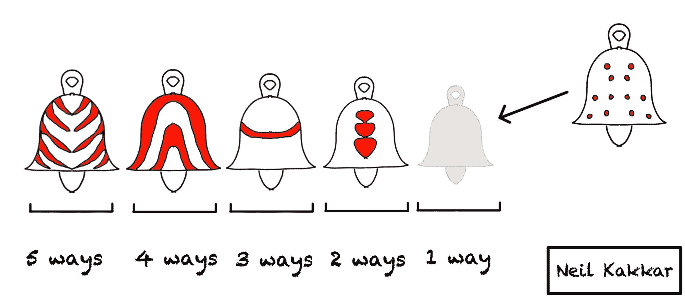

我们知道了，订单总数是`5 * 4 * 3 * 2 * 1`

因此，我们有了第一个通式。

> 订购`N`项的方式数为`N!`

# 排列

现在，我们面临一个不同的问题。国王下令为每个教堂制作新的钟。有些很好听，有些还行，有些会让你变聋。但是每个都是独一无二的。每个都发出自己的声音。一声震耳欲聋的钟声，被好听的钟声环绕，听起来才能威严。

但是，我们的钟楼仍然有 5 个钟，所以我们需要找出 8 个钟的最佳顺序，由熟练的制钟者制作。

使用上述逻辑，我们可以继续。

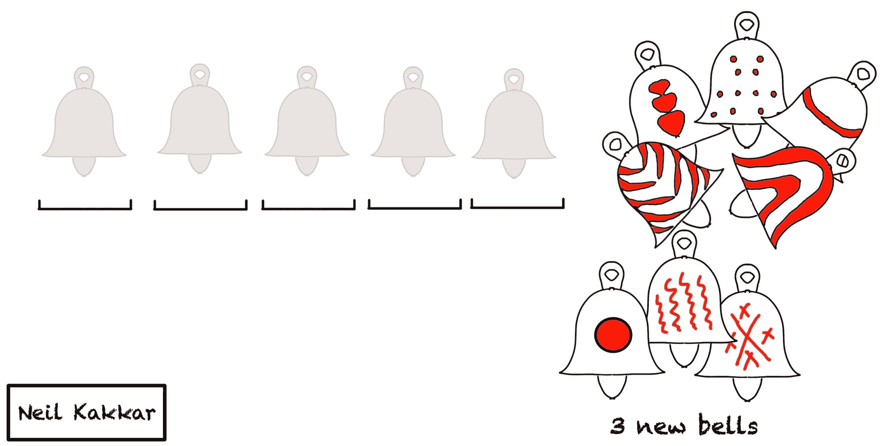

对于第一个铃声，我们可以选择 8 个铃声中的任何一个。

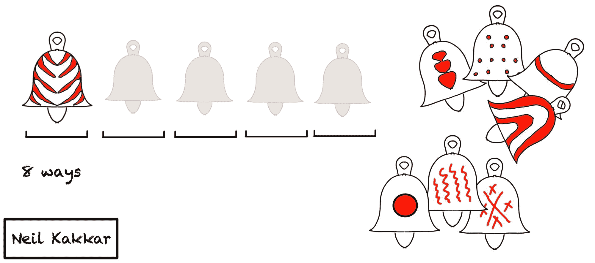

对于第二个铃声，我们可以选择剩下的 7 个铃声中的任何一个...诸如此类。

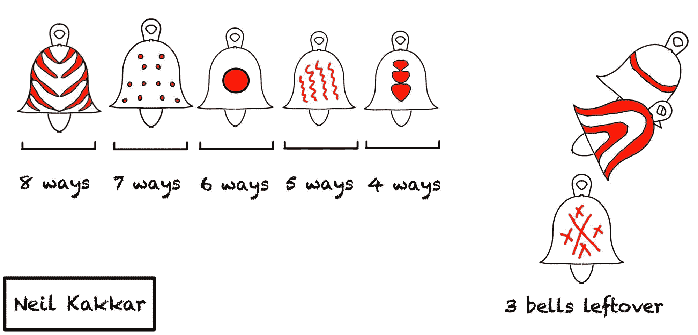

最后，我们得到了`8 * 7 * 6 * 5 * 4`个钟在 5 个空间中的可能排序。

如果你熟悉(n P r)的公式版本，也就是`n! / (n-r)!`，不要担心，我们很快也会推导出来！

一个不好的推导方法是将分子和分母都乘以 3！在我们上面的例子中-

我们得到`8 * 7 * 6 * 5 * 4 * 3 * 2 * 1 / 3 * 2 * 1` = `8! / 3!`。

但这并不能帮助我们理解这个公式为什么会起作用。在我们到达那里之前，让我们看一看选择事物，或者组合。

# 组合

既然我们知道了如何订购物品，我们就可以知道如何选择物品了！

让我们考虑同样的问题。有一个钟楼有 5 个钟，而你有 8 个钟。然而，现在，你不想弄清楚钟的顺序(记住这就是排列)。

相反，你想选择 5 个最好的铃声，让其他音乐品味更好的人来决定顺序。实际上，我们把问题分解成几个部分:首先，我们决定选择哪一个铃铛。接下来，我们弄清楚如何对选择的铃铛进行排序。

你如何选择铃铛？这就是排列组合而成的“组合”。

组合是一种选择。你是有选择性的。你要从工匠们制作的 8 个铃铛中选择 5 个。

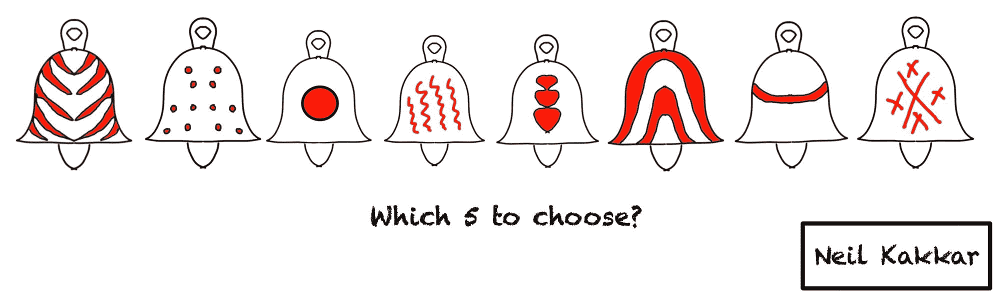

既然我们知道如何订购铃铛，我们将利用这些信息来决定如何选择铃铛。听起来不可能？等着看其中包含的美丽数学吧。

让我们想象所有的钟排成一行。

在找到所有选择铃铛的方法之前，我们先来关注一种选择铃铛的方法。

一种方法是随机选择任意 5 个。这对我们解决问题帮助不大，我们换个方法试试。

我们把铃铛排成一行，选择前 5 个。这是选择铃铛的一种方式。

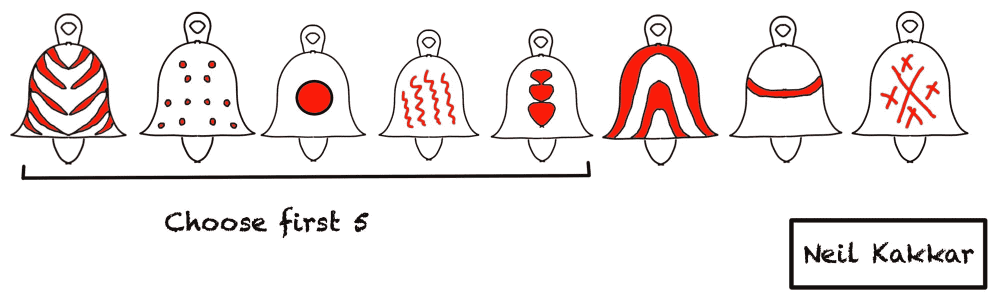

请注意，即使我们交换前 5 个铃的位置，选择也不会改变。它们仍然是选择 5 个独特铃铛的同一种方法。

这也适用于后三个钟声。

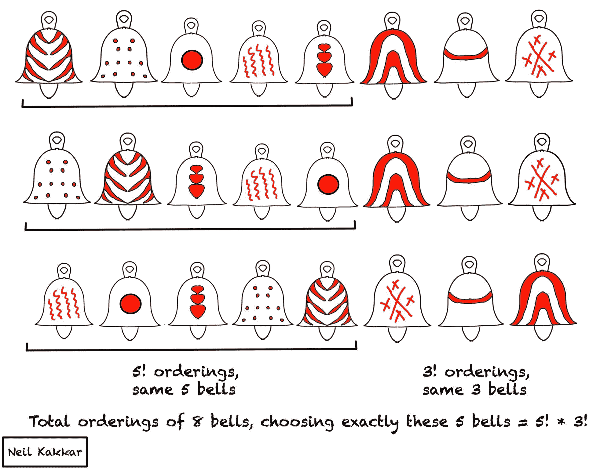

现在，美丽的数学技巧——对于这种选择 5 个铃的方法，当我们选择这 5 个铃时，8 个铃的顺序是什么？从上图来看，是 5 个铃铛(`5!`)的全部排序和剩下 3 个铃铛(`3!`)的全部排序。

因此，对于每一种选择 5 个铃的方法，我们有(`5! * 3!`)个 8 个铃的排序。

8 个铃铛总共可能的顺序是什么？`8!`。

记住，对于前 5 个铃的每一个选择，我们有(`5! * 3!`)个铃的顺序，它们给出相同的选择。

然后，如果我们将选择前 5 个铃的方法的数量乘以一个选择的所有可能排序，我们应该得到排序的总数。

```
Ways to choose 5 bells * orderings of one choice = Total orderings 
```

所以，

```
Ways to choose 5 bells = the total possible orderings / total orderings of one choice. 
```

在数学中，这变成了:

```
(8 C 5) = 8! / ( 5! * 3!) 
```

瞧，我们已经找到了如何从 8 样东西中选择 5 样的直观解释。

现在，我们可以概括这一点。如果我们有 N 个东西，我们想选择其中的 R 个，这意味着我们在 R 处画一条线。

这意味着剩余的项目将是`N-R`。因此，对于`R`商品的一种选择，我们有`R! * (N-R)!`订单，它们给出相同的`R`商品。

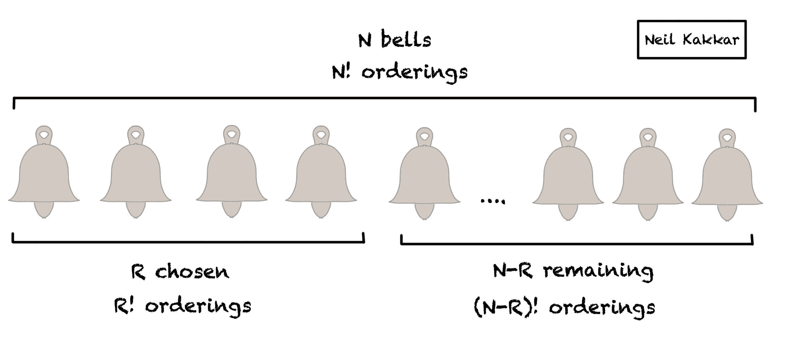

对于选择`R`项的所有方式，我们有`N! / (R! * (N-R)!)`种可能性。

> 从`n`中选择`r`项的方式数为`(n C r) = n! / (r! * (n-r)!)`

在口语中，(n C r)也读作`n choose r`，这有助于巩固组合是用来选择项目的想法。

# 重新审视排列

组合完成后，让我们回到工作的第 2 部分。我们亲爱的朋友通过计算出 5 个铃铛的所有可能组合，选出了最好的 5 个铃铛。

我们现在的工作是通过计算订单的数量来找到完美的旋律。

但是，这是容易的一步。我们已经知道如何订购 5 个项目。已经`5!`了，我们完事了。

因此，要置换(排序)8 个项目中的 5 个项目，我们首先选择 5 个项目，然后排序这 5 个项目。

换句话说，

```
(8 P 5) = (8 C 5) * 5! 
```

如果我们扩展公式，`(8 P 5) = (8! / ( 5! * 3!)) * 5!`

`(8 P 5) = 8! / 3!`。

我们又回到了最初的公式，经过适当的推导。

> 从`n`中订购`r`项的方式数为`(n P r) = n! / (n-r)!`

# 排列和组合的区别

我希望这能让排列和组合之间的区别变得非常清楚。

排列是排序，组合是选择。

为了对 N 个元素排序，我们找到了两种直观的方法来计算答案。两者引出答案，`N!`。

为了置换 8 个元素中的 5 个，首先需要选择 5 个元素，然后对它们进行排序。您使用`(8 C 5)`选择，然后使用`5!`订购 5。

而从`N`中选择`R`的直觉是算出所有的排序(`N!`)并除以第一个`R`和最后一个`N-R`保持不变的排序(`R!`和`(N-R)!`)。

这就是排列和组合的全部内容。

每一个高级排列组合都以此为基础。结合替换？同样的想法。相同项目的排列？同样的想法，只是订单的数量发生了变化，因为有些项目是相同的。

如果您感兴趣，我们可以在另一个示例中深入研究复杂的情况。在推特上让我知道[。](https://twitter.com/neilkakkar)

> 在[我的博客](https://neilkakkar.com/)上查看更多帖子，并加入[每周邮件列表](https://neilkakkar.com/subscribe/)。

## 尾注

1.  我想这是他解决问题的方式。不要把它当成历史的教训。
2.  在 12 世纪，印第安人比他早了 400 年。