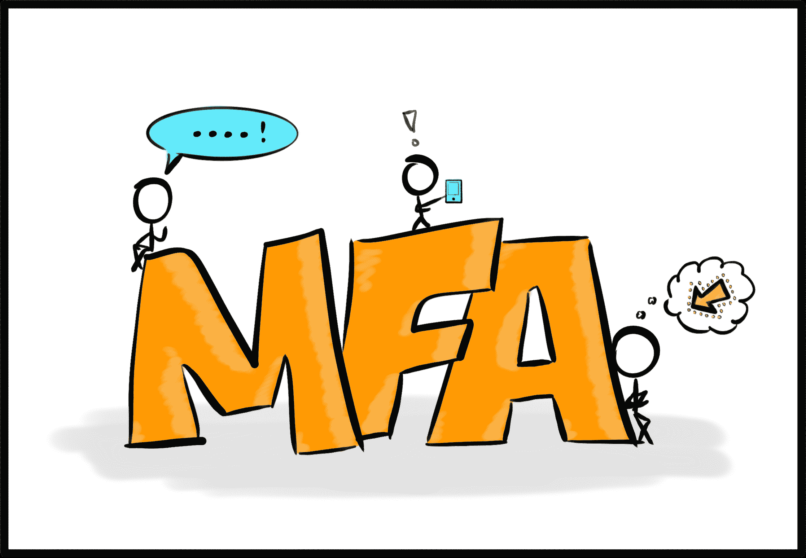
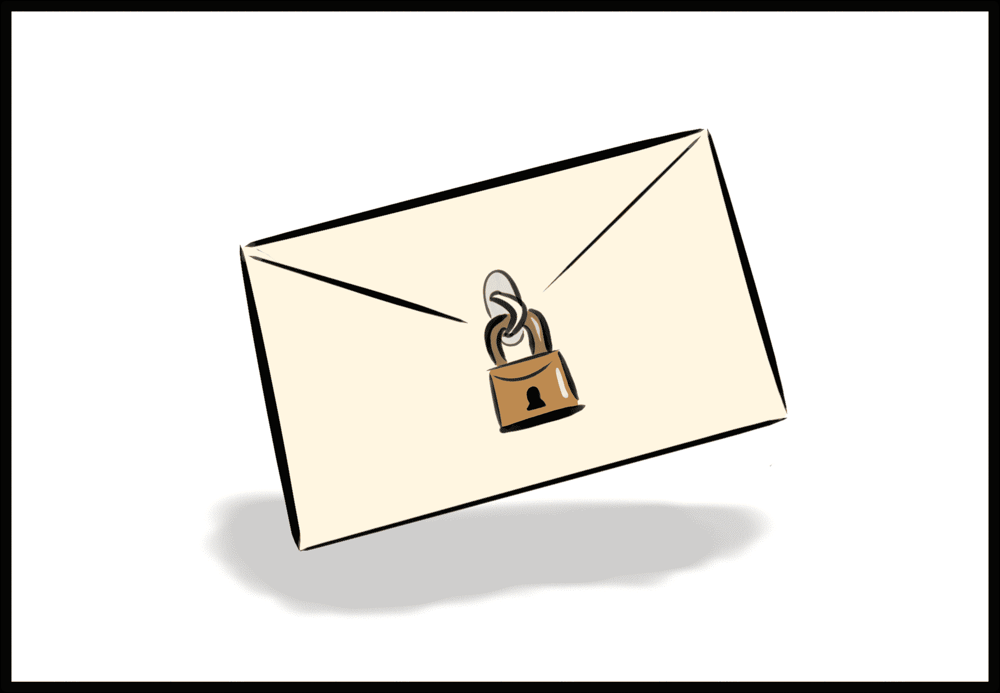
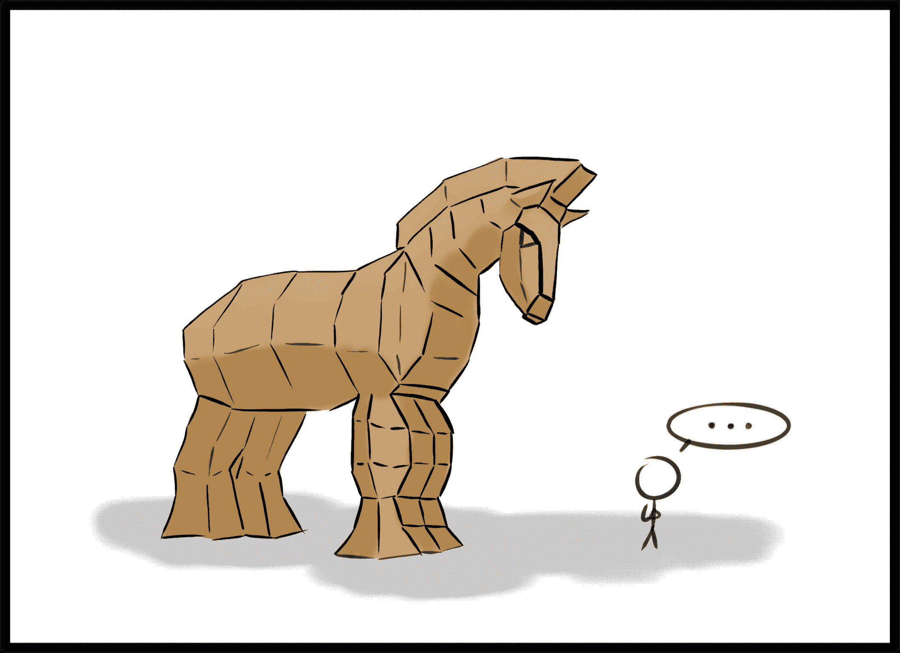

# 当你只是一个人时，如何加强你的个人网络安全姿态，你知道吗？

> 原文：<https://www.freecodecamp.org/news/personal-cybersecurity-posture/>

> 赞福德就是这样一个人，你知道吗

> –half runt，道格拉斯·亚当斯的《银河系漫游指南》。是书，不是电影。绝对不是电影。

有些人(？？‍)真的对网络安全、端到端加密很感兴趣，当他们第一次知道“谜 T1”是如何工作的时候，完全被吓呆了。这些人可能天生就对构建一个不那么可笑的个人网络安全姿态感兴趣。

不幸的是，大多数人认为网络安全是可有可无的。大多数人会说这样的话:

“没有人针对我。
*“我没什么好隐瞒的，反正。*
*“我太忙了，学不了这些东西。为什么有人不能给我一个简单的最佳实践总结，让我在大约七分钟内浏览一遍？”*

对那些人，我说，你好，假设的无形读者！这里有一个最佳实践的简单总结，您可以在大约七分钟内浏览一下。

#### 等等，我为什么在乎

当你只是一个普通人时，你可能很难理解为什么网络安全如此重要。当然，你不希望你的设备被黑客攻击或你的个人数据被窃取，但具体来说，这并不像任何人都在跟踪你，对吗？

嘿，亚历克斯，我要 400 美元。不太可能有人试图偷你的特殊物品，尽管我必须承认你的波斯地毯会让房间看起来更协调。相反，如果你从唾手可得的果实的角度来考虑网络安全，它会有助于理解网络安全。

你有一些水果，我有一些水果。住在这个街区的乔有一个 1.21 千兆瓦的通量电容供电的水果抓取机器人。乔不知道我们两个的存在，但他的机器人(非常快地)挨家挨户，绕着街区一路寻找水果。如果我的前门是锁着的，而你的是开着的，乔的机器人要抢谁的水果？

如果这听起来像是无聊、陈旧、常规的安全措施，那么你是对的！网络安全不是要找到某种魔咒，让你的水果最大限度地安全。而是让你的水果比旁边的水果更有安全感。你可以通过运用一些深思熟虑的习惯来做到这一点，就像你学会锁好前门以防机器人抢水果一样。

安全漏洞和事件每天都在发生。大多数这类事件的发生是因为自动扫描仪撒下了一张大网，发现了一个安全措施松懈的个人或公司，然后黑客就可以利用这个漏洞。别做那种人。

#### 等等，什么是安全姿势

以下是美国国家标准与技术研究所对安全态势的定义:

> *基于信息保障资源(如人员、硬件、软件、策略)和能力的企业网络、信息和系统的安全状态，以管理企业的防御并在情况变化时做出反应。* ( [NIST 特刊 800–30，B-11](https://csrc.nist.gov/publications/detail/sp/800-30/rev-1/final#pubs-topics) )

上面重要的一点是，*“管理企业防御的能力。”*在个人安全方面，您就是企业。恭喜你。愿你勇敢地去前人未曾去过的地方。

在你探索陌生的新世界之前(毕竟这是互联网)，你可以采取一些措施来管理你的防御。“能力”这个词是恰当的，因为拥有某些东西会给你带来网络安全的超能力。以下是我认为最重要和最有益的三个步骤:

1.  使用多因素身份验证
2.  使用 VPN
3.  培养健康的怀疑精神

有了这三把钥匙，你的网络安全态势就从机器人午餐变成了战争游戏——在战争游戏中，攻击者的制胜一招就是不参与。

#### 1.使用多因素身份验证

密码已经失效了。从计算上来说，这是一个已经解决的问题，破解密码只是时间问题。不幸的是，许多人仍然通过为多个账户使用同一个[泄露的密码](https://haveibeenpwned.com/Passwords)来加速这个过程，为了不可思议的利益而将自己置于风险之中。[密码短语](https://pages.nist.gov/800-63-3/sp800-63b.html#a2-length)更长更复杂，破解起来需要更多时间。我强烈推荐他们；即便如此，[你的密码最终并不重要](https://techcommunity.microsoft.com/t5/Azure-Active-Directory-Identity/Your-Pa-word-doesn-t-matter/ba-p/731984)。

至少现在，答案是[多因素认证](https://en.wikipedia.org/wiki/Multi-factor_authentication) (MFA)。MFA 由三种身份认证因素组成:

1.  你知道的东西，比如通行短语；
2.  你有的东西，比如芯片卡或手机；和
3.  你是什么，就像你的脸或指纹。

这些因素中的两个或两个以上比单独一个密码要好得多，尤其是当[你的密码在这个列表](https://en.wikipedia.org/wiki/List_of_the_most_common_passwords)中的时候。

账户提供商和社交媒体网站现在广泛支持多种身份认证因素。如果可以选择，请避免使用短信作为接收验证码的方式。短信认证让你容易受到 [SIM 卡交换攻击](https://en.wikipedia.org/wiki/SIM_swap_scam)——请将进一步的问题转给[杰克·多西](https://www.nytimes.com/2019/09/05/technology/sim-swap-jack-dorsey-hack.html)。取而代之的是，使用像[谷歌认证器](https://google-authenticator.com/)这样的认证器应用在你的设备上生成代码。这确保了只有您使用该特定设备时，才会拥有正确的身份验证代码。没有任何力量可以阻止你。

Google Authenticator 应用程序与您设置它的特定设备一起工作，因此当您获得新设备时，您需要[将 Google Authenticator 移动到您的新手机](https://support.google.com/accounts/troubleshooter/4430955?hl=en#ts=4430956)。像 [YubiKey](https://www.yubico.com/) 这样的硬件认证密钥在切换设备时可能不会那么麻烦，但还没有像认证应用那样得到广泛支持。

#### 2.使用 VPN

使用 VPN 和不使用 VPN 的区别就像《黑暗骑士崛起》真的很好，而《蝙蝠侠大战超人》真的非常非常糟糕。同样的特许经营权，完全不同的标准。

比方说，你发了很多邮件，但从来不把信放进信封，甚至不把它们对折。任何想看的人都会知道你并不是真正的可怕的海盗罗伯茨。当你使用虚拟专用网时，特别是如果你经常连接到公共 WiFi，这就像把你的信放进加密密封的信封，通过一种特殊的隐形快递服务发送。除了预定的收件人，没有人能看到你的信，除了你和快递员，没有人知道信是寄给谁的。

VPN 阻止其他人阅读你的通信，比如扫描开放 WiFi 的机会主义攻击者，甚至你自己的互联网服务提供商(ISP)，他们可能会出售你的使用数据以获得广告费。

选择一个值得信赖的 VPN 提供商需要一些研究，这本身就足以构成一篇独立的文章。作为一个起点，寻找对伐木有严格政策的供应商，并期望每月支付 5-10 美元的服务费。避免带有模糊隐私政策的免费 VPN 应用和服务；它们通常会让你付出超乎想象的代价。

#### 3.培养健康的怀疑精神

最终，你的网络安全防御中最薄弱的一环是你自己。如果一个骗局或恶意软件机器人可以欺骗你打开前门，互联网上所有的 MFA 和 VPN 都不会保护你。是的，我知道这是一匹非常好看的木马。也免费。你点了吗？没有吗？那它可以呆在外面。

Always look a Trojan gift horse in the mouth.

养成对送到你虚拟家门口的东西进行事后批评的习惯。电子邮件、电话和信息诈骗的复杂程度不一，从摇摇晃晃的机器人组装猎枪爆炸到精心设计的社会工程攻击，这些攻击非常有效地利用了认知偏见。不要认为你比他们聪明；人类是很容易预测的生物。毕竟，没有人期望西班牙宗教裁判所。

而是提问。仔细检查要求您点击链接或访问网站的邮件，即使它们来自您认识的人或您使用的公司。如果基于之前的面对面交流，你不确定这封邮件是你的朋友、银行或母亲发的，拿起电话打给他们。即使你认为你是确定的，拿起电话检查一下。反正你给你妈打电话也不够。

哦，如果电话里的人是你当地的税务局或国税局或 CRA 的，他们会冻结你的账户，因为一个错误的身份导致你因没有偿还马里布 600 英尺长游艇上的贷款而受到刑事指控，那就挂断电话。你知道得更清楚。税务机构没有电话。

#### 您的个人网络安全入门包

现在，您有三把钥匙来打开三扇通往强大的个人网络安全态势的大门。如果这些钥匙也开启了你的好奇心，还有更多的兔子洞可以去。我强烈推荐二进制博客作者伟大建议的五个播客中的[安全性，它启发了这篇文章的大部分内容。](https://securityinfive.com/)[监视自我防御](https://ssd.eff.org/)提供电子前沿基金会关于保护在线通信的提示。特洛伊·亨特在 YouTube 上还有一个名为[互联网安全基础知识](https://www.troyhunt.com/get-to-grips-with-internet-security-basics-courtesy-of-varonis/)的系列节目，更深入地讲述了如何在网上保护自己。

现在，我希望你能善用你新获得的网络安全力量。记住你所学的。它能救你。